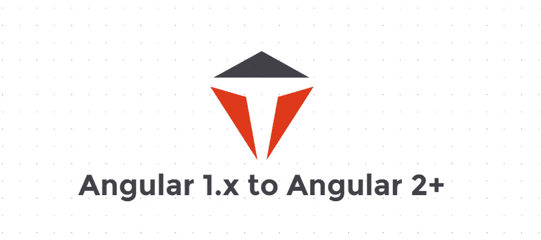

# 从 1.x 到 2+的角度迁移—前进之路

> 原文：<https://medium.com/globant/angular-1-x-to-2-migration-way-to-move-ahead-ca0cd0bd5976?source=collection_archive---------1----------------------->

# 介绍

这篇博客涵盖了避开障碍进行迁移并无缝实现从 Angular 1.x 版本到 Angular 2+版本的重写的技术。这涵盖了最初的思考过程和步骤，开始使用限制差距和避免未知发现的方法。

# 史前古器物

> 理解和了解要迁移的应用程序是先决条件。要使用或推迟的现有库。探索现有图书馆升级的可能性，或引入新的职位，与同类职位进行比较。
> 
> 最大的决策和思考过程在于架构，有基于组件的方法，混合或重写。这取决于技能组合和时间表的可用性。
> 
> 设计组件的基础架构结构、路由和探索需要研究的功能。此外，迁移需要 UX 的努力，这需要是一个主要的考虑因素。

# 常见问题和解决方案

> 必须对要迁移的应用程序有功能上的理解。即了解回归测试中发现的未知领域。
> 
> 外部库的识别和替换。即 d3.js 换成 SVG 方式。
> 
> 需要 R&D 识别和解决的未知区域。也就是说，已经决定替换 d3.js，但是影响分析和了解需要如何进行更改可以成为研发的一部分。
> 
> 了解现有应用程序的架构，并设计要迁移的部分的基于组件的架构。即参考原子设计方法来构建应用程序。
> 
> UI 代码覆盖可以帮助您更恰当地覆盖这些场景。即使用单元测试代码覆盖了大部分场景，这有助于依赖代码和测试覆盖。
> 
> 使用自动化将 JavaScript 代码转换成 typescript 可以加快这个过程。还使用工具来寻找前进的方法，这有助于您理解现有应用程序的复杂性和先决条件。

# 移民的好处

> 基于组件的架构尽可能地帮助代码重用。
> 
> 差异加载有助于保持跨浏览器兼容性。
> 
> 为 lightning 性能引入了多个特性，例如更好的变化检测、快速处理的事件处理程序、每秒帧数、DOM 操作等。提供干净、免维护的代码和架构。
> 
> TypeScript 的灵活性和使用提供了代码优化并减少了运行时错误。
> 
> 材料设计有助于创建响应性和多平台应用程序。

# 结束语

以上步骤帮助您开始并遵循最佳实践，同时完成应用程序从 AngularJS 1.x 到 Angular 2+版本的迁移。为受益者提供常见问题和解决方案。