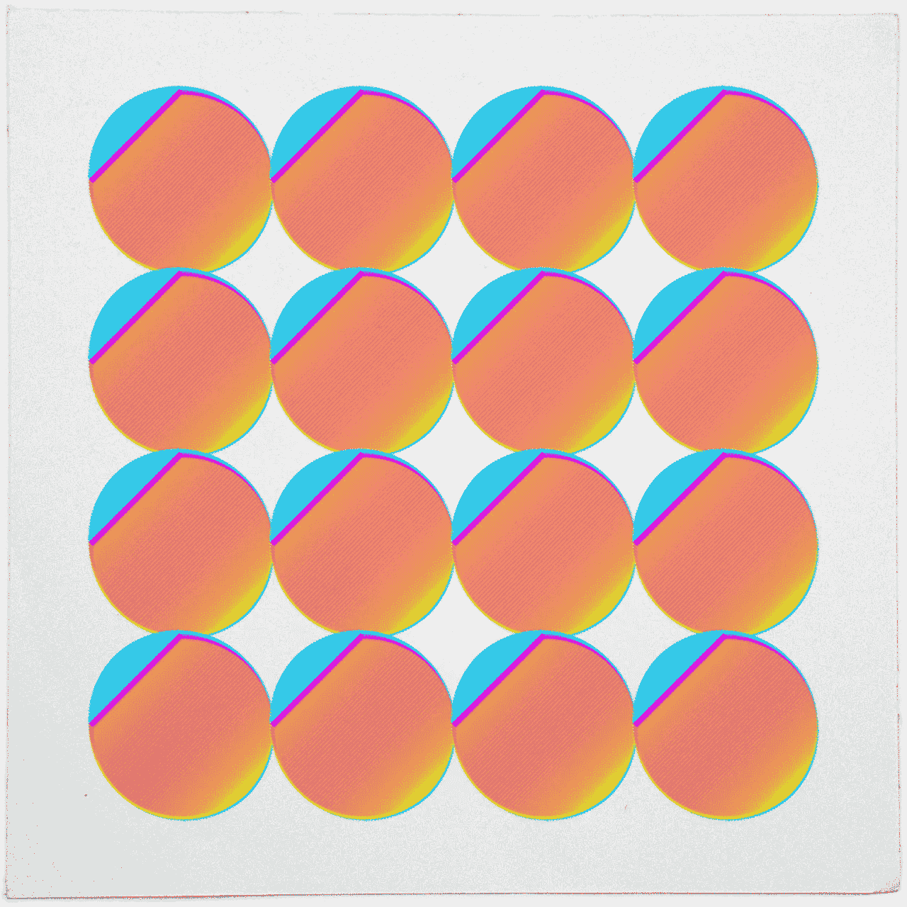
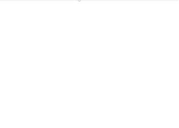
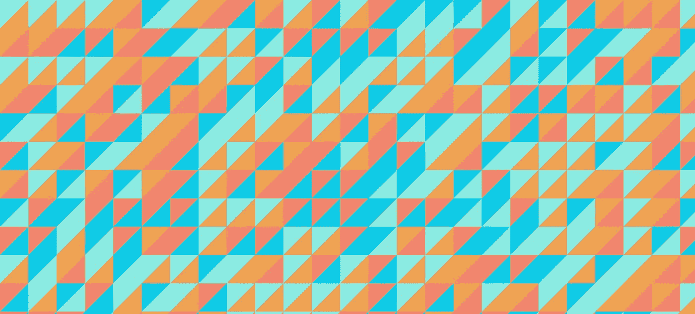

# 角度—制作路由器过渡的动画(v4+)

> 原文：<https://medium.com/google-developer-experts/angular-2-animate-router-transitions-6de179e00204?source=collection_archive---------1----------------------->

如何在角度上制作路由器转换动画



[thedotisblack](https://twitter.com/DavidMrugala)

**更新:**在 **Angular v4.3** 之后，我用一些以前没有的新功能写了一篇新博文。看看这里

[](/@gerard.sans/angular-supercharge-your-router-transitions-using-new-animation-features-v4-3-3eb341ede6c8) [## 角度-使用新的动画功能(4.3 版以上)增强路由器过渡

### 如何使用 Angular 中的新动画功能制作应用路由器过渡动画

medium.com](/@gerard.sans/angular-supercharge-your-router-transitions-using-new-animation-features-v4-3-3eb341ede6c8) 

在这篇文章中，我想分享一个很酷的技巧，你可以使用**角度**来制作路由器过渡动画。目前这是由[**Matias niemel**](https://github.com/matsko)**，**角度动画的主要贡献者提出的官方解决方案。

使用下面的链接查看它的应用:

[演示](https://embed.plnkr.co/PcRpcGK2duGw0HdaGaF5/?show=preview) | [来源](https://plnkr.co/edit/PcRpcGK2duGw0HdaGaF5?p=preview) | [变化](https://plnkr.co/edit/j7risCyKU26GCanDZIm4?p=preview)

> 💣注意，t 他的解决方案是实验性的，仅用于学习目的。

在 [@gerardsans](https://twitter.com/intent/user?screen_name=gerardsans) 找到我的最新观点。

# 演示应用程序

我们将创建一个包含两个部分的简单应用程序: **Home** 和 **About** 。所以我们可以制作它们之间的过渡动画。请看下面的最终结果。



See the Router transitions sliding to the left.

该应用程序将由顶部导航和主要内容组成。顶部导航将在所有部分之间共享(第 4-7 行)。参见下面的**根组件**的布局。我们使用了 **router-outlet** 元素作为占位符，告诉路由器当与路由匹配时，我们希望在哪里呈现组件(第 9 行)。

对于顶部导航，我们使用了传递静态路由的 **routerLink** 指令来创建不同的导航 URL(第 5–6 行)。

对于动态路由，您可以使用以下替代语法:

```
<a [**routerLink]="['users', 42]"**>John</a>   // in the template<a **href="#/users/42"**>John</a>              // rendered
```

我们使用了 **routerLinkActive** 指令来设置 **active** 类来样式化当前部分。所以当我们导航到**主页**时，它会呈现:

```
<a href="#/home" **class="active"**>Home</a>
```

# 设置路线

在 Angular 中，路由器尝试按照设置期间使用的相同顺序将路由定义与当前 url 匹配。

当导航匹配它们各自的路径时，主要的两条路由告诉路由器实例化关于组件的**家**和**(第 3-4 行)。**

对于常见行为，我们还使用了两条特殊路线。具有**空路径**的路线(第 2 行)覆盖了**默认路线**，该路线将为空，除非我们导航到特定的 url。在这种情况下，我们指示使用归途进行重定向。**否则路由**(第 5 行)将捕捉任何打字错误或未定义的路由，显示用户友好的 404 页面。

对于这个演示，由于 Plunker，我们使用了**散列位置策略**(第 9 行)。如果我们可以访问后端，我们也可以使用**路径定位策略**。这需要将未定义的路由重定向到**index.html**以避免来自服务器的 404 错误。

# 路由组件

让我们看看下面的**主页** **组件**所需的更改。

首先我们导入了 **routerTransition** 工厂函数(第 2 行)。我们在**动画**属性中使用它。这将创建一个具有相同名称的**动画触发器**，并将相应的样式应用于组件。最后，我们使用**空字符串**将 **routerTransition** 动画触发器绑定到**主机元素**。这将允许我们在导航到另一个组件时保留动画上下文。

```
<router-outlet> 
  <home **[@routerTransition]=""**></home> // <-- host binding
</router-outlet>
```

该解决方案的主要思想是链接导航，添加新组件并移除先前组件，以触发**:进入**和**:离开**转换。让我们看看实现细节，看看它是如何做到的。

# 角度动画

Angular 基于 [Web Animations API](https://w3c.github.io/web-animations/) ，我们使用**动画触发器**来定义一系列**状态**和状态之间的**转换**。我们也使用**样式**来帮助我们使用 **CSS 属性**合成想要的效果。

> 对于[原生不支持网页动画 API](http://caniuse.com/#feat=web-animation) 的浏览器:IE/Edge、Safari 等；你必须包括一个[多孔填充物](https://github.com/web-animations/web-animations-js)。

将触发动画的事件:

*   将一个元素附加到视图或从视图中分离(对应于**星号**和**无效**状态)
*   为触发器设置**状态**。例如:[@ router transition]= "**void**"。

我们的实现使用了两者的组合。

# 动画实现

让我们看看如何使用**角度动画**来达到想要的效果。首先，我们使用了 **routerTransition** 工厂函数来调用 **slideToLeft** (第 3–5 行)。在这个函数中，我们创建了由两个状态和两个转换组成的**动画触发器**(第 8-19 行)。

我们定义了两种状态: **void** 和**星号**；并设置它们的样式来达到想要的滑动效果(第 9–10 行)。通过使用 **{position: fixed}** ，组件将根据视窗放置并在页面中滑动。

对于**:输入**转换，我们设置一个初始样式，将组件定位在最右边。然后我们设置一个动画到最后的位置，设置一个缓动函数和持续时间。对于**:离开**转换，我们使用类似的方法将组件移动到最左边。

> 我们使用**变换**而不是**上**、**下**、**左**、**右**以获得更好的性能。

# 导航示例

让我们看看当我们从**家**导航到关于的**时会发生什么。这两个序列将同时发生:**

*   路由器会将 **Home** **组件**从视图中分离。应用与**无效**状态相关的样式。这将触发**:离开**转换。与**:离开**过渡相关的样式将逐渐应用。家庭部分将被摧毁。
*   关于组件的**将被路由器附加到视图上。About 组件将被实例化。应用与**无效**状态相关的样式。' @ **routerTransition'** 主机绑定将触发 **:enter** 转换。与**:输入**过渡相关的样式将逐渐应用。最后，将应用与**星号**相关的样式。**

> 请注意，来自已定义状态或转换的所有样式都是同时聚合的。

# 特别提及

本文展示的实现主要是使用了 [**马蒂亚斯·涅梅尔**](https://github.com/matsko) 为 **ngEurope** 制作的演示中[这段代码](https://github.com/matsko/ng2eu-2016-code/blob/master/route_animations.ts)的一个略微修改的版本。

仅此而已！觉得我错过了什么吗？通过 [@gerardsans](https://twitter.com/intent/user?screen_name=gerardsans) 或 gerard.sans_at_gmail.com 联系我，感谢阅读！

[](http://www.meetup.com/AngularZone/) [## 安古拉宗社区

### 欢迎来到我们的社区。我们的激情是有棱角的。加入我们吧！🚀](http://www.meetup.com/AngularZone/) [](https://twitter.com/intent/user?screen_name=gerardsans)