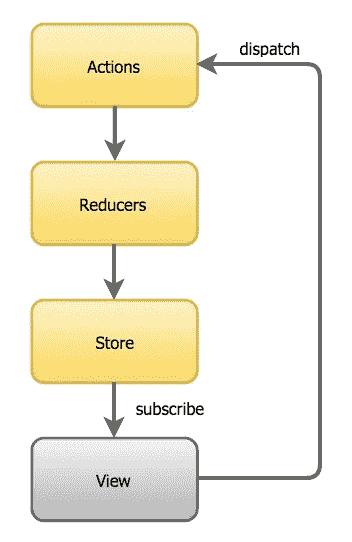
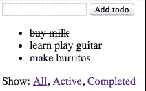

# angular—Redux 简介

> 原文：<https://medium.com/google-developer-experts/angular-2-introduction-to-redux-1cf18af27e6e?source=collection_archive---------0----------------------->

如何在角度应用中使用 Redux

FluidScapes by Reza Ali

Redux ，现在是第三版，问世不到一年，但事实证明它非常成功。受 [Flux](https://facebook.github.io/flux/) 和 [Elm](http://elm-lang.org) 的启发，用于处理应用程序状态，并以一种非常有效的方式将其绑定到用户界面。Redux 还可以轻松实现像*热重装或时间旅行*这样的酷功能*。Redux 通常与 React 一起使用，但也可以单独使用。*

> Redux 建立在通量概念之上，尽管以前的经验不是强制性的。

在本文中，我们将探讨一个从 React 移植来的**待办事项列表示例**，它来自于 [Dan Abramov](https://medium.com/u/a3a8af6addc1?source=post_page-----1cf18af27e6e--------------------------------) 最近的 Redux 视频课程。使用以下链接破解最终解决方案:

[演示](https://embed.plnkr.co/6UJUYh7nbyU3TMS2Xd6l/) | [来源](https://plnkr.co/edit/6UJUYh7nbyU3TMS2Xd6l?p=preview)

在 [@gerardsans](https://twitter.com/intent/user?screen_name=gerardsans) 找到我的最新观点。

# Redux 简介

Redux 遵循三个基本原则:

*   单一不可变状态树
*   单向数据流
*   使用纯函数(减速器)进行更改

通过遵循这些原则，我们可以实现可预测和可再现的应用程序行为。

让我们回顾一下下图中每个组件的职责。

Redux unidirectional flow

## 行动

这些是我们应用程序中的**T21 动作**。它们可以由用户或服务器端发起。他们是 ***商店*** 的唯一信息来源。动作是普通的 JavaScript 对象，描述一个变更，并使用一个 ***类型*** 属性作为标识符。请参见下面的示例:

***动作创建者*** 是包含帮助器方法的组件，这些帮助器方法创建具体的 ***动作*** ，由 ***还原者*** 调度运行。

## 还原剂

***减速器*** 指定状态如何变化以响应 ***动作*** 。所有*减速器*必须是 [***纯功能***](https://en.wikipedia.org/wiki/Pure_function)*含义:*

*   *给定相同的输入，它们产生相同的输出*
*   *它们不会产生 ***副作用*** (例如:变异状态，调用后端)*

> *还原剂总是创造一种新的状态来避免副作用；更高级的选择是使用像 [immutable.js](https://facebook.github.io/immutable-js/) 这样的库。*

**减速器*也可根据需要与其他减速器 [***组合成减速器***](https://github.com/rackt/redux/blob/ec0b1a36e958584b7a11a5977734f04d05955c22/docs/api/combineReducers.md) 。见下面一个基本的 ***rootReducer*** 。*

*通常的做法是将 ***initialState*** 定义为默认参数(第 1 行)并用[开关](https://developer.mozilla.org/en/docs/Web/JavaScript/Reference/Statements/switch)语句处理每个动作。*

## *应用商店*

*Redux 使用包含应用程序状态*的单一存储作为普通的 JavaScript 对象。**

****应用商店*** 是 Redux 的核心，它提供一个 API 来:*

*   *调度动作由[***app store . dispatch***](https://github.com/rackt/redux/blob/ec0b1a36e958584b7a11a5977734f04d05955c22/docs/api/Store.md#dispatch)***(动作)****
*   *注册变更通知监听器:[***app store . subscribe***](https://github.com/rackt/redux/blob/ec0b1a36e958584b7a11a5977734f04d05955c22/docs/api/Store.md#subscribe)***(回调)****
*   *读取应用状态:[***app store . getstate***](https://github.com/rackt/redux/blob/ec0b1a36e958584b7a11a5977734f04d05955c22/docs/api/Store.md#getState)***()****

# *待办事项列表示例*

*我们将探索一个 **Todo List** 应用程序，以了解如何将 Redux 与 Angular 集成在一起。这是一个基本的实现，我们可以添加新的待办事项，将它们标记为已完成并过滤它们。*

**

# *应用设计*

*在 Angular 中，我们使用一个 ***组件树*** 开始设计我们的应用程序，并从 ***根*** 组件开始。在下面找到一个包含所有 UI 组件的示意性伪 HTML:add-todo，todo-list(子组件:todo)，filters(子组件:filter-link)。*

## *自举设置*

*请参见下面的代码来设置 Redux:*

*角度应用在 ***应用模块*** 中自举传递。 ***应用模块*** 声明所有需要的组件、指令和管道。这包括根组件 ***App*** ，其余全部归入***App _ DECLARATIONS***。全局依赖在 ***提供者*** 中定义，因此它们对我们的 *Redux 组件可用。参见****app store***和 ***TodoActions*** (第 15–16 行)。 **TodoActions** (类)将充当一个*动作创建者*，为每个动作提供一个公共方法。我们导入了所有的依赖项(第 2–5 行)，然后使用[***createStore***](https://github.com/rackt/redux/blob/ec0b1a36e958584b7a11a5977734f04d05955c22/docs/api/createStore.md)*和实例化*(第 7 行)传递 ***rootReducer*** (函数)。最后我们使用 ***bootstrap*** 和我们的根模块 ***AppModule*** (第 21 行)。***

> **你可以在[角度模块](https://angular.io/docs/ts/latest/guide/ngmodule.html) (angular.io)阅读更多关于**ng 模块**如何工作的信息**
> 
> **请注意，当使用字符串令牌时，我们必须在组件前面加上 *@Inject('AppStore')* 。**

## **应用状态**

***应用商店*(***app Store)***将保存应用状态。这是:todos 数组和当前过滤器。我们将初始状态定义如下:**

**在下一节中，我们将定义 todo 项的结构。这个核心结构将在应用程序的生命周期中保持不变。**

# **添加新的待办事项**

**让我们来看一个简化版的 ***AddTodo*** 组件，它将允许我们添加一个新的 Todo 并处理用户输入。**

**在模板中(第 4–8 行)，我们使用了一个[本地模板变量](https://angular.io/docs/ts/latest/guide/template-syntax.html#!#local-vars)***【todo***(输入 HTML 元素，第 6 行)，并在按钮点击事件(第 7 行)上传递它的引用。在构造函数上，我们将 ***appStore*** 和 ***todoActions*** 作为私有属性注入到组件中(第 11–17 行)。当用户输入一个描述并点击' ***添加待办事项*【T21]时，将会调度一个如下所示的动作(第 20 行)并清除输入内容。****

**为了避免在组件中手动创建动作对象，我们创建了 ***TodoActions*** 类作为 *ActionCreator* 。**

**我们将 *ADD_TODO* 标记作为动作标识符公开(第 2 行)。请注意我们是如何扩展 action 对象来包含我们需要的信息，以识别 todos 并将其标记为完成或未完成(第 12–15 行)。**

**在分派动作之后，rootReducer 将被 store 调用，传递*current state*(*initial state*如果未定义)和用户动作。**

**为了创建新的状态，我们使用 ***concat*** (创建一个新的数组)并保持当前的过滤器，最初它显示所有的待办事项。**

# **切换待办事项**

**对于每个待办事项，用户可以点击其描述将其切换为已完成。下面您可以看到一个活动待办事项的简化标记:**

**类似于我们对 add todo 所做的，每个点击事件将向下传递 todo ***id*** (输入属性，第 6 行)并分派相应的动作(第 17 行)。**

> **TypeScript 提示:在构造函数参数中使用私有或公共修饰符是声明私有或公共属性的捷径(第 12–13 行)。参见[私有/公共修改器](http://www.typescriptlang.org/Handbook#classes-privatepublic-modifiers)。**

**切换初始示例 todo 将产生以下操作:**

**和以前一样，分派动作将执行 reducer 并创建一个新状态。**

**助手函数 ***toggleTodo*** 创建一个新数组，切换 Todo 匹配被调度的 ***action.id*** 并保持其余的。**

# **过滤待办事项**

*****过滤器*** 组件允许用户过滤:全部、仅活动或仅完成待办事项。我们使用 ***FilterLink*** 组件封装每个过滤器，通过属性 ***filter*** 传递一个标识符。**

**在 ***FilterLink*** 内，每个点击事件向下传递 ***过滤器*** (输入属性，第 6 行)并分派相应的过滤器动作。**

**通过**过滤*完成后*过滤**会生成以下动作**

**和以前一样，分派动作将执行 reducer 并创建一个新状态。在这种情况下，我们保持相同的 todos，并使用调度的过滤器(第 5 行)更改当前过滤器。**

# **显示待办事项列表**

**我们将使用子组件 ***todo*** 来封装单个 todo，将一些属性作为属性(id，completed)传递，将描述(文本)作为内容传递。这种模式被称为 [***容器组件***](/@learnreact/container-components-c0e67432e005) 。**

**我们使用*******[***ngFor***](https://angular.io/docs/ts/latest/api/common/NgFor-directive.html)来迭代 ***todos*** 数组(第 3 行)。对于每个待办事项，我们使用一个[本地模板变量](https://angular.io/docs/ts/latest/guide/template-syntax.html#!#local-vars) ***待办事项*** 传递待办事项信息。**

**以下参见 ***TodoList*** 组件的摘录。**

**上面，我们使用[***app store . subscribe***](https://github.com/rackt/redux/blob/ec0b1a36e958584b7a11a5977734f04d05955c22/docs/api/Store.md#subscribe)*(第 7 行) ***注册了一个监听器。*** 一旦在我们的监听器内，我们可以很容易地使用[***appstore . getstate***](https://github.com/rackt/redux/blob/ec0b1a36e958584b7a11a5977734f04d05955c22/docs/api/Store.md#getState)*(第 8 行)读取当前状态。Subscribe 返回一个函数，我们可以用它来取消订阅。在 Angular 中，我们使用[***on destroy***](https://angular.io/docs/ts/latest/api/core/OnDestroy-interface.html)事件处理程序进行清理(第 2 行，第 13–16 行)。****

> **请注意，我们是如何将所有组件属性和助手方法保持为私有的。我们不希望其他组件访问它们。**

# **Redux 生命周期审查**

**让我们回顾一下 Redux 应用程序在不同阶段的行为。**

*   ****在应用引导**:我们通过 ***rootReducer*** 初始化 ***appStore*** 。这将触发 ***appStore*** 内部初始化。通常这设置了 ***初始状态*** 。**
*   ****关于组件创建**:我们根据需要在构造器上注入 ***appStore*** 和***to actions***。显示数据的组件订阅 ***appStore*** 并通过调用[***app store . getstate***](https://github.com/rackt/redux/blob/ec0b1a36e958584b7a11a5977734f04d05955c22/docs/api/Store.md#getState)***()***读取。改变状态的组件为相应的动作准备调度代码，传递任何所需的数据。**
*   ****关于组件销毁**:组件显示数据 ***退订*** 到 ***appStore*** 清理资源。**
*   ****关于用户交互**:每个用户交互都会触发一个底层调度动作。这将执行 ***rootReducer*** 产生一个新的状态。然后， ***appStore*** 将通知所有订阅的侦听器，这些侦听器将相应地更新。**
*   ****在服务器端发起的动作上**:一些应用程序可以调度动作来响应服务器端发起的事件。例如:网络套接字。这些动作一旦正确设置，就会遵循与用户交互相同的流程。**

**我们介绍了如何使用 Redux 构建一个基本的 Angular 应用程序。希望你现在对 Redux 很好奇，也许会在你的下一个项目中用到它。感谢阅读！**

** [## 安古拉宗社区

### 欢迎来到我们的社区。我们的激情是有棱角的。加入我们吧！🚀](http://www.meetup.com/AngularZone/) 

# 特别提及

特别感谢[Robin bhm](https://twitter.com/robinboehm)将本文翻译成德语并出版成 [AngularJS。德](https://angularjs.de)博客。下面来看看吧！🇩🇪💖

 [## 一个角坐标和一个角坐标。特拉华州

### 在公共安全领域，国家可以解决一个问题。Autonome und wiederverwendbare…

安古拉吉斯德](https://angularjs.de/artikel/angular-redux-einfuehrung/) 

# 进一步阅读

*   观看 Dan Abramov @Dan_Abramov 制作的[Redux](https://egghead.io/series/getting-started-with-redux)视频课程入门
*   [智能和非智能组件](/@dan_abramov/smart-and-dumb-components-7ca2f9a7c7d0)，作者丹·阿布拉莫夫
*   [用 Redux 和 Immutable.js](http://blog.jhades.org/angular-2-application-architecture-building-flux-like-apps-using-redux-and-immutable-js-js/) 构建 Flux 应用，作者 [@JhadesDev](https://twitter.com/JhadesDev)
*   [React 开发者调查结果](https://angularclass.com/react-developer-survey-results)，作者 PatrickJS， [@AngularClass](https://twitter.com/AngularClass)

**