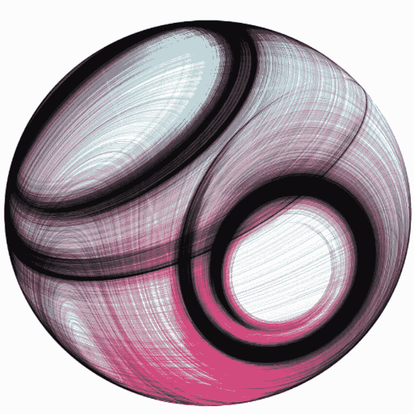

# 角度—单元测试配方(v2+)

> 原文：<https://medium.com/google-developer-experts/angular-2-unit-testing-with-jasmine-defe20421584?source=collection_archive---------0----------------------->

使用 Jasmine 进行角度单元测试的方法



Reza Ali (colorised)

# 角度—测试指南(v4+)

最新版本的**角度单元测试配方**。阅读它以了解最新的**Angular**API。

[](/google-developer-experts/angular-2-testing-guide-a485b6cb1ef0) [## 角度测试指南

### 使用 TestBed、fixtures、async 和 fakeAsync/tick 的九个易于理解的示例。

medium.com](/google-developer-experts/angular-2-testing-guide-a485b6cb1ef0) 

请继续阅读，查看测试 API 的旧版本。Jasmine 部分和自定义匹配器仍然有效。

Angular 的前身设计时就考虑到了**的可测试性**，它提供了多种选项来支持**单元测试**。在本文中，我们将向您展示如何设置 Jasmine 并为您的角度应用编写一些常见的单元测试。我们将涵盖:

*   Jasmine 简介:[主要概念](#e924)，[特点](#4250)，[设置和拆卸](#4880)，[默认匹配器](#14c4)和[自定义匹配器](#b334)。
*   角度测试:[设置](#479b)和[依赖注入](#05b4)。
*   Angular 的单元测试配方:[组件](#8d61)，[服务](#58b7)， [Http](#45ef) 和 [MockBackend](#5ac2) ，[指令](#2e84)，[管道](#a937)，[路由](#0bc9)，[可观察对象](#59a4)和[事件发射器](#3882)。

你可以使用上面的链接导航到每个食谱，或者如果你已经熟悉 Jasmine，跳到[第二部分](#e264)。

包含所有规格的完整工作示例可以在[这里](http://plnkr.co/edit/N3Acjuk7g9sPs35Rchjg?p=preview)找到。在 [@gerardsans](https://twitter.com/intent/user?screen_name=gerardsans) 找到我的最新观点。

# 茉莉简介

Jasmine 是来自 [Pivotal Labs](http://pivotal.io/labs) 的开源测试框架，它使用行为驱动的符号，从而带来流畅和改进的测试体验。

## 主要概念

*   Suites — ***describe(字符串，函数)*** functions，取一个标题和一个包含一个或多个规格的函数。
*   Specs — ***it(string，function)*** functions，取一个标题和一个包含一个或多个期望的函数。
*   期望—是评估为*真*或*假*的断言。基本语法为 ***expect(实际)。***
*   匹配器—是通用断言的预定义助手。例如: ***toBe(预期)******to equal(预期)*** 。点击查看完整列表[。](https://github.com/JamieMason/Jasmine-Matchers)

> 注意**。toEqual()** 做深度比较而**。toBe()** 只是一个引用等式。

## 茉莉花特征

自 2.0 版本重大升级(2013 年 12 月)以来，几乎没有发布。Jasmine 2.4.1 于去年 12 月发布。请参阅以下自 2.0 以来的主要新增内容:

*   ***jasmine . string matching(string | regExp)***matcher—字符串的部分匹配。它也接受正则表达式作为参数。
*   ***jasmine . array containing(array)***matcher—当期望值只要求数组中的某些值存在时的部分匹配
*   ***jasmine . any()***matcher—匹配任何非空或未定义的值。
*   ***【pending(string)***函数—我们现在可以传入一个原因，作为报告者要显示的文本。
*   ***fail(string | Error)***function—*fail*function 会导致 spec 失败，以消息或错误对象作为参数。
*   **聚焦规格/套件** —通过使用 *fit* 和*fdescripe*您可以决定运行哪些规格或套件。
*   **一次性安装和拆卸**——这可以通过调用*之前的*和*之后的*来使用。**
*   ***禁用的规格/套件*** *—您可以使用 xit 和 xdescript**有选择地禁用规格或套件(显示为待定)。*

点击查看所有发布详情[。](https://github.com/jasmine/jasmine/releases)

## 安装和拆卸

在我们的规范中避免代码重复的一个好方法是包含设置代码。

> 使用 beforeEach 和 afterEach 在每个规范之前和之后进行更改

Jasmine 提供了四个处理程序来添加我们的设置和拆卸代码:每个 之前的**， ***之后的每个*** 以及每个套件执行一次的 ***之前的所有*** ， ***之后的所有*** 。**

## 默认匹配器

这些是 Jasmine 的默认匹配器。

> 查看 [Jasmine-Matchers](https://github.com/JamieMason/Jasmine-Matchers) 获得数组、布尔值、浏览器、数字、异常、字符串、对象和日期的其他匹配器。

## 自定义匹配器

有时你可以使用定制的匹配器库来改进你的规格或者错误信息。如果你觉得你在测试中做了很多样板文件，这可能会对你有所帮助。

让我们看看如何创建一个 *myCustomMatchers* 库，其中只包含一个简化的匹配器:***toBeAllowedToDrive***。匹配器必须在包含*比较*函数的工厂对象中。它的签名是 *compare(actual，expected)* 返回一个类似 *{ pass: boolean，message: string }的对象。*这个实现对 *expect(age)都有效。toBeAllowedToDrive()* 和*(年龄). not.toBeAllowedToDrive()。*

我们可以在下面的代码中看到我们是如何提高规范可读性的。消息还将改善未来的维护和调试体验。

# 角度测试

## 设置

[设置您的环境](https://angular.io/docs/ts/latest/testing/first-app-tests.html)有几个选项。你可以使用 Jasmine 的*SpecRunner.html*从[独立发行版](https://github.com/pivotal/jasmine/releases)开始或者创建你自己的。你也可以把它和类似 [Karma](https://karma-runner.github.io) 的测试跑步者整合在一起。我们不会涵盖所有的组合，因为我们对实际测试更感兴趣。

> 此设置仅供参考，仅适用于 Plunker。

我们加载 Jasmine 依赖项，后面是 Angular 依赖项。我们正在使用一个 **System.js** 和 **TypeScript** 设置。我们使用 *Promise.all()* 一次性加载我们的规范，一旦所有规范都可用，就触发 Jasmine 测试程序。别忘了包括 *testing.dev.js* 。

> 检查这个 [url](https://github.com/angular/angular/blob/d116861c8e884d911f15b8caabeefc6f049c775d/modules/angular2/docs/bundles/overview.md#es5-and-ngupgrade-users) 以找出您的设置需要哪些模块、桶和包。

## 依赖注入

为了在测试中使用角度组件，我们需要像在应用程序中使用 bootstrap 一样包含我们的依赖关系。然后，依赖注入引擎将使用该信息来解析所有引用。为此我们将使用:[*before each providers*](https://angular.io/docs/ts/latest/api/testing/beforeEachProviders-function.html)*[*inject*](https://angular.io/docs/ts/latest/api/testing/inject-function.html)*和*[*inject async*](https://angular.io/docs/ts/latest/api/testing/injectAsync-function.html)*。*全部从*进口【角度 2/测试】。****

**让我们看看如何在*languageservice*组件中使用它们:**

**首先，在每个提供者 之前，我们用 [*加载测试所需的依赖关系。这将在每次测试之前设置一个全新的*](https://angular.io/docs/ts/latest/api/testing/beforeEachProviders-function.html) *[*注入器*](https://angular.io/docs/ts/latest/api/core/Injector-class.html) 实例，使用数组*所需的依赖项。然后根据我们的规范，我们使用 [*注入*](https://angular.io/docs/ts/latest/api/testing/inject-function.html) 来自动实例化每个依赖项。对于简单的测试，我们也可以使用下面的替代方法，但是一般来说，使用 [*注入*](https://angular.io/docs/ts/latest/api/testing/inject-function.html) 来充分发挥 DI 的潜力。****

[*注射*](https://angular.io/docs/ts/latest/api/testing/inject-function.html) 的两种常见用法是:

Different notations for inject.

最后，当依赖关系涉及异步处理时，我们可以使用 [*异步*](https://angular.io/docs/ts/latest/api/testing/async-function.html) 。这将在内部创建一个区域，并处理任何异步处理。

让我们看看如何测试应用程序的不同构件。为了简洁起见，我们将跳过本帖中所有必需的 ***导入*** 。我们在必要时添加了注释。他们可以在这里找到。

# 角度(v2+)的单元测试方法

## 测试组件

让我们看一个简单的组件，它使用一个 [@ *Input()*](https://angular.io/docs/ts/latest/api/core/Input-var.html) 属性呈现一个*问候*消息。

为了帮助测试这个组件，我们将使用一个通用的设置，使用*beforeachproviders*。

> 使用 beforeEachProviders()加载相应的依赖项，以便它们在测试期间可用

通常的做法是在每个之前使用*来重构我们的测试。通过这样做，我们避免了为每个测试*重复一些代码，如*注入*。这也将简化我们的规格。**

我们使用来自[*TestComponentBuilder*](https://github.com/angular/angular/blob/a7e9bc97f6a19a2b47b962bd021cb91346a44baa/modules/angular2/src/testing/test_component_builder.ts#L95)的 *createAsync()* 来创建我们的 *Greeter* 组件的一个实例，返回一个 *Promise* 。然后组件将在测试[夹具](https://github.com/angular/angular/blob/a7e9bc97f6a19a2b47b962bd021cb91346a44baa/modules/angular2/src/testing/test_component_builder.ts#L31)中创建。这是它的主要 API:

```
abstract class [ComponentFixture](https://github.com/angular/angular/blob/a7e9bc97f6a19a2b47b962bd021cb91346a44baa/modules/angular2/src/testing/test_component_builder.ts#L31) {
  debugElement;       // test helper 
  componentInstance;  // access properties and methods
  nativeElement;      // access DOM
  detectChanges();    // trigger component change detection
}
```

我们使用 *name* 属性来设置一个值，触发变更检测并检查预期的结果。

> 我们使用 Jasmine 的异步测试支持，使用 Jasmine 2 中引入的 *done* 。如果你不熟悉它，请阅读[这个](http://jasmine.github.io/2.4/introduction.html#section-Asynchronous_Support)。我们要用几次。

## 测试服务

*LanguagesService，*只有一个方法返回应用程序可用语言的数组。

类似于我们之前的例子，我们使用 *beforeEach 实例化服务。*正如我们所说，这是一个好的实践，即使我们只有一个规范。在这种情况下，我们正在检查每种语言和总计数。

## 使用 Http 进行测试

我们通常不希望在测试期间进行 http 调用，但是我们将展示它以供参考。我们已经将最初的服务 *LanguageService* 替换为 *LanguageServiceHttp。*

在这种情况下，它使用 *http.get()* 来读取一个 json 文件。然后我们使用[*observable . map()*](https://github.com/ReactiveX/RxJS/blob/master/src/operator/map.ts)*使用 *json()将响应转换成最终结果。**

*我们的测试看起来与前一个非常相似。主要的区别是由于订阅，我们使用了异步测试，就像我们对组件所做的那样。*

**http.get()* 返回我们可以订阅的可观察值。我们将在后面更详细地讨论可观察到的现象。*

## *使用模拟后端进行测试*

*一个更真实的用例是用一个 *MockBackend* 代替 http 调用。为了做到这一点，我们可以使用 *provide* 来创建一个新的实例，每次我们使用 *useFactory* 实例化 *Http* 并提供必要的管道(第 9–11 行)*。*这个将允许我们模拟我们的响应，避免触及真正的后端来推进我们的测试。*

*在我们的测试中，我们构建了模拟响应(第 22–24 行),因此当我们最终调用我们的服务时，它会得到预期的结果。*

## *测试指令*

*Angular 中的指令是一种特殊类型的组件，通常没有附带视图。我们将使用一个[属性指令](https://angular.io/docs/ts/latest/guide/attribute-directives.html)、 *logClicks、*来记录我们在**、*主机元素*、**上点击了多少次，这样您就可以理解了。*

*为了测试这个指令，我们决定创建一个*容器*组件。我们将对它进行设置，使它充当我们的主机，再现由我们的指令发出的事件。*

*我们在每个之前使用*来将创建组件的逻辑从测试中分离出来。该器件现在可用于所有规格。**

*我们使用***inject async****作为异步创建的夹具。 *injectAsync* 要求我们返回一个*承诺*。在这个实例中，我们正在返回由 *createAsync* 返回的*承诺*。只有在它被解决后，它才会开始运行规范。**

> **我们也可以使用 injectAsync 返回一个承诺来处理异步测试**

## **测试管道**

**管道是将输入数据转换成用户可读格式的函数。我们将使用标准的[*string . toupper case*](https://developer.mozilla.org/en-US/docs/Web/JavaScript/Reference/Global_Objects/String/toUpperCase)*()*编写一个自定义的大写管道，*大写，*。这只是为了简单起见，因为 angular 有自己的[*upper case pice*](https://angular.io/docs/ts/latest/api/common/UpperCasePipe-class.html)*实现。***

***管道只是可以注入的普通类，所以我们可以使用*注入*非常容易地设置我们的规范。***

**为了测试我们的管道，我们检查了常见的情况:不使用字符串时抛出，应该使用空字符串，最后应该大写。请注意，我们必须使用箭头函数来捕获 *expect* 中的异常。**

## **测试路线**

**路线有时会被遗漏，但这通常被视为复式簿记的良好做法。在我们的例子中，我们将使用一个简单的路由配置，只有几个路由和一个指向 home 的默认路由。**

**我们的测试将使用上面的这些路线来检验我们的期望。最后一个捕获所有剩余的路由，并将它们重定向到 home。**

**为了测试路由，我们需要包含一些内部依赖项(第 6–9 行)。注意我们是如何定义根组件的(第 9 行)。这些可能很快会被重构，但是你现在可以使用它们。在每个之前，我们在*内实例化了*路由器*和*位置*，使我们的测试更具可读性。***

*我们用***navigate(params)****和****navigateByUrl(URL)****都返回一个*的承诺*。我们检查当我们导航到' */home'* 时，我们的位置会相应地改变。最后，我们检查是否有任何其他路线将您引回家。我们像以前一样使用 Jasmine 的异步测试。****

## **测试可观测量**

**Angular 中使用可观测量来处理异步任务。它们可以在一些地方看到，比如 *Http* ，表单控件，验证或者在 *EventEmitter* 后面。我们将使用下面的*可观察的*来展示我们如何测试它们的行为。**

**我们创建了一个*可观察的*，它发出 1，2，3 并完成。为了测试它，我们设置了 next，error 并在 subscribe 上完成回调。由于下一次回调将被调用几次，我们必须动态地设置我们的期望。请注意我们如何在*完成*的情况下再次使用 Jasmines 异步测试。**

## **测试事件发射器**

**EventEmitters 在 Angular 中用于在组件之间传递事件。我们创建了一个计数器组件， *Counter* ，，它允许我们递增或递减初始值 0。每次我们这样做的时候，新的值将会被使用一个*事件发射器*推送，当*改变*时被暴露。**

**设置将非常类似于 Observables。**

**在这种情况下，我们检查是否可以在 *EventEmitter* 上使用 subscribe 来递增或递减，因为它公开了一个*可观察对象*。我们通过调用 change 方法触发不同的值，并在下一次回调中检查我们的期望。**

**这就是我现在所知道的！感谢阅读！有什么问题吗？在 [@gerardsans](https://twitter.com/intent/user?screen_name=gerardsans) 给我发短信**

## **想要更多吗？**

**如果您需要更多示例，请随时通过*Gerard _ dot _ sans _ at _ Gmail _ dot _ com*联系我，或者前往 GitHub 中的[角度单元测试](https://github.com/angular/angular/tree/e748adda2e7a1f6e302628d0d76b5c3d1e3fc196/modules/angular2/test)！**

**[](http://www.meetup.com/AngularZone/) [## 安古拉宗社区

### 欢迎来到我们的社区。我们的激情是有棱角的。加入我们吧！🚀](http://www.meetup.com/AngularZone/) 

# 进一步阅读

*   幻灯片:[带角度的测试策略](https://docs.google.com/presentation/d/1UkuJgBaOAjDMYiMBLT38LEWMzh6sW_iliTPF1PHnmzY)或[视频](https://www.youtube.com/watch?v=C0F2E-PRm44)朱莉·拉夫， [@SomeJulie](https://twitter.com/SomeJulie)
*   [Angular Connect Media](http://angularconnect.com/sessions) 所有会议的幻灯片和视频

[](https://twitter.com/intent/user?screen_name=gerardsans)**