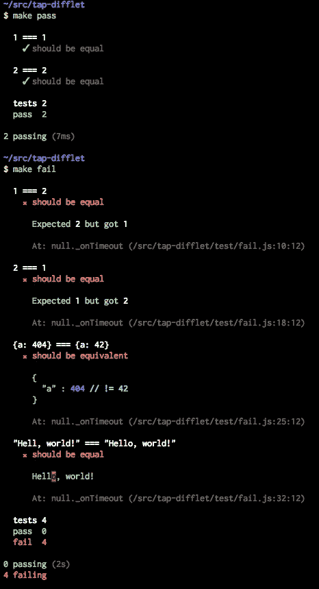

# Angular 2 vs React:终极舞蹈

> 原文：<https://medium.com/javascript-scene/angular-2-vs-react-the-ultimate-dance-off-60e7dfbc379c?source=collection_archive---------0----------------------->


Sunset Breaks — Alí Marín (CC BY-NC-ND 2.0)

大多数跟踪我的人都知道我个人倾向于 React，但是我当然希望我的决定是有根据的，而不是基于无知的偏见。最近，我一直在深入探索 Angular 2。以下是我认为的反应对比。

> 注意:我有时会将 Angular 2 缩写为“ng2”，这是社区中的常见做法。

# 让我们跳舞吧

我想专注于开发体验，所以让我们分别看看开发人员对使用 ng2 和 React 的感受。关于 Angular 2 和 React，我问我的追随者“你会再次使用它吗？”：

**只有 17%** 表示会再次使用 Angular 2。

**56%** 表示他们会再次使用 React。

就是这样。游戏结束。对吗？不完全是。大多数受访者还没有使用 Angular 2，因此为了公平起见，我们真的需要将该群体从投票中删除。

当我们去掉还没有使用它们的那一组时，分数看起来都更好:

**反应:84%**

**角度 2: 38%**

React 显然赢得了客户满意度调查。但这不科学。这只是我的追随者和转发民意调查的人的追随者，我主要谈论 React——但因为这些是分享他们实际体验的实际用户，我认为可以肯定地说，虽然这些数字在一般用户群中不会完全相同，但它们给了我们一个很好的预期。

让我们仔细看看这些差异，以及为什么人们会有这样的感觉。

# 表演

很多人认为技术选择应该完全取决于性能。React vs Angular 1 文章倾向于以性能为中心(由于 Angular 1 脏检查和摘要循环，React 很容易获胜)。但是 Angular 2 已经清理了它的行为。它很快。在我对 React 和 Angular 2 的测试中，性能都不是大问题。它们各有各的注意事项，但我不会深入探讨。

与所有其他 CS 性能问题一样:如果你不得不多次重复昂贵的操作，它会降低你的应用程序的速度。对于 React 和 ng2 来说，这意味着您应该尽可能避免 DOM 更新，尽可能避免深度状态迭代，避免过多地创建/拆除对象和组件，等等。出于本文的目的，我们将假设我们正在比较一对超级跑车，它们都是速度恶魔。您的里程可能会有所不同。

也就是说，我认为团队的表现和应用程序的表现一样重要。这种比较将集中在开发人员体验和开发人员团队绩效问题上。最终，你的团队需要能够快速行动并做出快速改变。我们将探讨这些工具在这些方面的比较。

# Angular 1 如何改变前端

Angular 1 结合了 Backbone、Knockout 和新兴 Web 组件规范的思想，并通过 ng1 定制指令将定制组件带给大众。它还带来了 OOP 的一个通用模式:依赖注入容器。

现在应该很明显了，但是在我看来，Angular 1 普及的最具变革性的东西是定制组件。今天，所有流行的前端框架都支持定制组件。

# React 如何改变前端

React 发布的时候， [MV*和双向数据绑定](/javascript-scene/the-best-way-to-learn-to-code-is-to-code-learn-app-architecture-by-building-apps-7ec029db6e00)正在风靡前端。骨干和击倒是重量级人物。Angular 1 是这个街区的新成员。

React 没有任何内置的模型概念，团队建议您将它与 Flux 架构一起使用。Flux 是一种 UI 架构，它规定了单向数据流和事务状态。我已经在[“更好的 Redux 架构的 10 个技巧”](/javascript-scene/10-tips-for-better-redux-architecture-69250425af44)中详细介绍了这两者的许多好处。如果您不熟悉 React、Flux 和 Redux，我强烈建议您在继续阅读本文之前阅读这些内容。

React 是革命性的，因为它单枪匹马地让 MVC 看起来像过时的技术&释放了大众的单向流动。

在我看来，这是自 HTML & JavaScript 以来前端架构最重大的变革。

幸运的是，它是如此具有变革性，它不再是唯一的反应。你也可以在 ng2 中实现它。

# **在《角斗士 2》里你找不到的东西**

当然，两种框架都支持构建定制组件。Angular 2 有一些额外的东西，但本质上，它们都是为了在应用程序栈的前端构建 ui 而存在的。Angular 2 只是有更多的处方和“包括电池”的理念。

让我们来看看 Angular 2 的一些处方。

## 以打字打的文件

我对 TypeScript 又爱又恨。我最讨厌的一个观点是，TypeScript 会让你的应用免受各种错误的影响。我有个坏消息要告诉你:**不会的。**

阅读[《关于静态类型令人震惊的秘密》](/javascript-scene/the-shocking-secret-about-static-types-514d39bf30a3)。减少 Bug 不是静态类型擅长的。

> 类型正确性并不能保证程序的正确性。

*   有很多静态类型不会发现的错误。
*   客观上有更好的方法来捕捉 bug(TDD，代码审查)，这些方法可以捕捉大多数类型错误。

结果？诚然，静态类型可以消除一类错误，但代价是增加了代码的复杂性，而且总体上对项目减少错误的影响很小。

**静态类型很棒**主要用于开发工具。在编码时获得关于函数调用签名等内容的内联文档是非常好的。但是，您并不总是需要到处都有内联注释来实现这一点。

为了清晰、开发人员文档和增强的开发人员工具，我喜欢在需要时指定类型注释的想法，但在大多数情况下，我更喜欢类型推断。内联类型声明有弄乱代码的趋势，使代码更难阅读。

好消息是，TypeScript 非常擅长类型推断，如果您愿意，它会让您在大多数情况下依赖于推断。它的推理能力似乎比 [Tern](http://ternjs.net/) 更好，Atom 和微软代码的开发工具比同类 Tern 插件好得多。事实上，我甚至可以说 TypeScript 提供了当今 JavaScript 世界中最好的智能感知开发人员体验。你可能会爱上它。

> TypeScript 提供了当今 JavaScript 世界中最佳的 intellisense 开发人员体验。

***如果我能严格使用 TypeScript 的类型推断功能，并跳过对未声明的模块和不明确的参数产生错误，我会一直在常规的 JavaScript 文件中使用它。简单的选择。***

***如果仅仅*** 类型注释*总是*存在于单独的文件中(就像明确类型化的 *`d.ts`* 文件)按照惯例与 *zero config* 一致，我也会使用更多的注释，而且我更喜欢 TypeScript。您可以更容易地将 TypeScript 与任何工作流集成，因为它实际上“只是 JavaScript”。你可以用任何支持标准 JavaScript 的编译器来编译。

**实际上**，TypeScript 给大型项目增加了大量的开销，包括配置开销(跟踪所有库类型以防止模块导入错误)、语法开销(类型通常被内联声明)、大量的 *`any`* 转义等等…

澄清一下， *`any`* escape hatches，TypeScript 使用类型构造器风格的语法支持泛型，但是使用函数式编程风格的构造、可观察性、切换高阶函数等并不总是清晰或容易的

开发人员通常求助于使用 *`any`* ，而不是找出正确的方式来输入东西。本质上，这与放弃类型检查并说“任何类型都可以在这里工作”是一样的，即使严格来说这不是真的。

所有的头顶和逃生舱口增加了虫子藏身的面积。在 TypeScript 项目中，团队经常会忽略存在的 TypeScript 错误。有时会有成百上千个错误。

> 正如 HTML 所证明的那样，如果你在有错误的时候做了一些有用的东西，错误就会激增。

任何时候有错误被忽略，错误就不再有用，只会变成噪音。TypeScript 的支持者可能已经在评论中告诉我这些团队是如何做错的，他们真的需要修复这些错误，他们是对的。

T2 如何快速修复错误并不总是显而易见的，与此同时，项目经理正在催促开发人员开发他们的功能。由于 TypeScript 即使在有错误的情况下也可以编译工作版本，所以无论开发人员是否喜欢或同意，大型项目都有可能会遇到这种情况。如果你问那个项目的 ***个人贡献者*** 如果由他们决定，他们是否会让项目进入那种状态，可能 ***百分之百会说“不”。***

但是大型团队的大型项目不是这样工作的。

> “我们知道这很糟糕，但我们稍后会解决它。”—曾经存在过的每个真正的开发团队。

有可能 TSLint 和更好的文档可以解决这个问题。这还有待观察。

那么，我会在我的下一个项目中使用 TypeScript 吗？虽然我 ***喜欢*** 开发工具，但我发现开销比它的价值更麻烦。

> 我越是使用 TypeScript，就越觉得它降低了我的速度，而不是提高了我的速度。如果它不能提高我的速度，也不能降低 bug 密度，那我为什么还要使用它呢？

话虽如此，**你可能还是会爱上打字稿**。

这可能会让你慢下来，(记住，我没有证据证明这一点——只是一种挥之不去的感觉)但你可能会觉得这会让你更有效率。有时候感情和喜欢的东西很重要。

开发者快乐很重要。您可能会发现，当您不处理 TypeScript 的限制时:

> 使用 TypeScript 只会让你开心。

构建一个类型化的函数接口，并且知道下一个开发人员将知道如何在不阅读文档或查看源代码的情况下调用该函数，这是一件令人满意的事情。

只要知道它会给你的项目增加很多开销，并且知道它不会帮助你减少太多的 bug，就去做吧。

它要做什么？开发工具魔术。


> 我知道我刚刚惹恼了一大群打字爱好者。我不是说“TypeScript 很烂，不要用它。”我是说，“TypeScript 很酷，它有很棒的开发工具，但它也有很大的权衡，开发人员需要知道，它可能不会提供所有预期的好处。”

## 依赖注入

首先，我喜欢依赖注入。我一直在用它。但是 Angular 2 用依赖注射打败了你。阅读文档和单元测试方法，你会发现各种各样的关于提供者和模仿依赖的东西，以及用*` beforeachproviders()`*进行单元测试，这需要一些时间来理解。在 ng2 injectables 的引擎盖下有很多魔法，对于它如何工作以及应该如何使用提供者的误解对于初学者来说是一个真正的症结。

有更简单的方法。不要导入你的依赖项并依靠一个框架来自动地将它们填充到你的类构造函数签名中，只需写一个接受你的依赖项的函数。这真的很简单&它是这样工作的:

依赖注入(DI)的支持者会说我过于简单化了(我同意)，我没有解决实例化问题(我同意)。我是说没关系。

实际上，在 Angular 2 中，你最终得到的不是嘲笑一小部分真正需要嘲笑的东西(网络访问、磁盘访问、定时器)，而是嘲笑一大堆应该是黑盒实现细节的东西。

我以前已经说过很多次了，但我会一直说下去，直到它成为常识:

> 嘲讽是一种代码气味。

当然，嘲讽有时是*需要的，但是如果你的应用充斥着 *`*.mock.ts`* 文件，你就做错了。你的应用程序太紧耦合了(讽刺的是，DI 的想法是让你的应用程序不那么耦合)，或者你试图嘲笑一大堆不需要嘲笑的东西。*

不需要给全世界注射和嘲讽。

## 茉莉

阅读[“为什么我用胶带代替摩卡，你也应该这样”](/javascript-scene/why-i-use-tape-instead-of-mocha-so-should-you-6aa105d8eaf4)。大部分适用于茉莉。

Jasmine 提供了一个 API，它试图像英语句子一样阅读，并提供了一堆断言铃声和哨声。结果是有数百万种方法来编写测试和断言，这意味着你可能最终需要仔细阅读每一种方法来理解它在做什么。

你最好把自己限制在少数几个核心断言上。主要是平等检查。在一个大团队里？祝你好运。

Jasmine 还鼓励对 *`beforeEach()`* 和 *`afterEach()`，*的大量依赖，这可能会意外地鼓励共享状态:这是单元测试中一个非常常见的问题，可能会导致随机测试失败(Jasmine 测试正确地以随机顺序执行，以阻止使用共享状态和对测试顺序的依赖)。

除了那些批评，Jasmine 还有一个让我 3@+ $#|+抓狂的缺陷。当您比较两个对象是否相等时，它将两个对象序列化并打印在一大行上。换句话说，默认的报告器输出基本上是#$%!@#$不值钱。

> 【**编者按:**我们不得不删减掉大约 8 个段落，这简直是！@#$从文章的这一部分哔哔声。我们会分享完整的文字记录，但这可能会让孩子们哭，让小狗躲在沙发下。]

柴印得不错。磁带打印这个:

```
not ok 1 should be the same---operator: equalexpected: |-{ x: 1, y: { z: 3 } }actual: |-{ x: 1, y: { z: 2 } }...
```

对于小物体，我可以很容易地看出它们的区别。有一些插件式的记者让它变得更好:



当测试失败时，开发人员需要清晰、明显的差异报告，而 Jasmine 在这方面完全失败了。如果你知道如何找到一个好的浏览器内记者来解决这个问题，请评论。

如果你在等待它被固定在核心，[不要屏住呼吸](https://github.com/jasmine/jasmine/issues/675)。自 2014 年以来，这个问题一直悬而未决。

## 其他事情

还有一堆有棱角的东西。表单和验证器，等等…当然，如果用户想使用它们，所有这些东西都是可用的。最大的区别是 React 用户不会总是在显而易见的地方找到最佳解决方案(比如 React 文档)。相反，React 用户更依赖社区最佳实践、博客文章和其他学习资源来确定最佳选择。

所有额外的“其他东西”使 Angular 2 包膨胀。Angular 2 + RxJS 相当庞大。差不多缩小了 80 万。这大约是 React + Redux 的 4 倍，如果你希望你的应用程序快速加载和渲染，它不会给你的应用程序代码留下太多的喘息空间。

这是我认为唯一重要的、显著的性能差异，而且非常重要。缩短加载时间将从根本上改善你的应用的 KPI。减少 ***毫秒*** 的加载时间可以在重要的业务指标上移动指针。

大 4 倍(将近一兆！)真的是一件大事。不需要就不要装。

> 编辑:正如一些评论者指出的，ng2 有提前编译(AOT)和树抖动的能力。通过正确配置的生产版本，您可以仅使用应用程序中实际使用的功能来显著减小包的大小，从而使最终的包占用空间更小。我强烈建议您正确配置您的产品包。这将对跳出率、转换率、客户满意度和流失率产生潜在的巨大影响。

# React 里的东西你在 Angular 2 里找不到

Angular 2 与 Angular 1 非常相似，都依赖于 HTML 模板。

ng2 模板的好处是它们基本上是标准 HTML 的增强形式。

**ng2 模板**的缺点是你必须学习一点有角度的 DSL。像 *`*ngIf`* 和 *`*ngFor`* 这样的东西。

ng2 模板的丑陋之处在于当你犯了一个错误时，它们会在运行时失败。有时候默默的。调试 Angular 2 模板可能会很痛苦。

> **编辑:**我被告知，当你使用 AOT 时，这个问题已经在 Angular 2 的最新版本中得到解决。模板错误将在编译时被报告。我还没有机会测试修复。

React 没有模板。相反，它有 JSX，在编译时编译成 JavaScript。

JSX 的伟大之处在于，当你犯了一个错误，它很可能在设计时被 linter 或者编译时发现，而不是等待运行时。Babel、ESLint 和许多编辑器工具都内置了对 JSX 的支持。

关于 JSX 的另一个伟大的事情是你可以用它瞄准不仅仅是 HTML。您可以针对自定义标记，可以针对画布，甚至可以针对本机移动用户界面。

**JSX 的不好之处在于它并不完全与 HTML 标签一一对应。它是 JavaScript APIs 和标记的混合体。这意味着你必须学习它的怪癖，比如使用 *`className`* 而不是*` class `*——但是因为你可以非常自由地将普通的旧 JavaScript 与 JSX 混合用于循环、条件等……我认为它在可学性方面胜过 ng2。**

# 州呢？

Angular 2 和 React 都可以使用您喜欢的任何数据管理层。如果您不介意退出双向数据绑定(这在 IMO 看来是件坏事)，您可以将自己的状态管理引入 ng2。我推荐 [ngrx/store](https://github.com/ngrx/store) ，基本就是 [Redux](http://redux.js.org/) + [可观物](http://reactivex.io/)。

对于 React，尝试一下 [Redux](http://redux.js.org/) (对于大多数大型应用)或者 [MobX](https://github.com/mobxjs/mobx) (对于不需要事务状态的不太复杂的应用)。

关于 JavaScript 应用的现代状态管理的更多细节，请查看[“更好 Redux 架构的 10 个技巧”](/javascript-scene/10-tips-for-better-redux-architecture-69250425af44)。

# 你应该选择什么？

在大量使用两者一段时间后(当然，反应时间要长得多)，对我来说，Angular 2 显然需要更多的技术支持和更多的应用程序样本。

如果你喜欢技术选择，并且可以忍受额外的样板开销，那么选择 Angular 2。

如果你对一些棱角分明的技术选择不满意，并且你想要更薄、更少规定性的东西，那么选择 React。

当然，还有其他选择(其中一些非常好)，但是在大型生态系统和开发人员社区中是有价值的，React & Angular 主导使用。连接近的三分之一都没有。唯一比这两个更受欢迎的库是 jQuery(是的，仍然如此)。

继续跳舞。

[](https://ericelliottjs.com/premium-content/lesson-pure-functions)

[Start your free lesson on EricElliottJS.com](https://ericelliottjs.com/premium-content/lesson-pure-functions)

***埃里克·埃利奥特*** *是一位科技产品和平台顾问，著有* [*【作曲软件】*](https://leanpub.com/composingsoftware) *，*[*EricElliottJS.com*](https://ericelliottjs.com)*[*devanywhere . io*](https://devanywhere.io)*和 dev 团队导师。他为 Adobe Systems、* ***、Zumba Fitness、*** ***【华尔街日报、*******【ESPN、*******BBC、*** *以及包括***【Usher、【Metallica】**在内的***

**他和世界上最美丽的女人享受着与世隔绝的生活方式。**