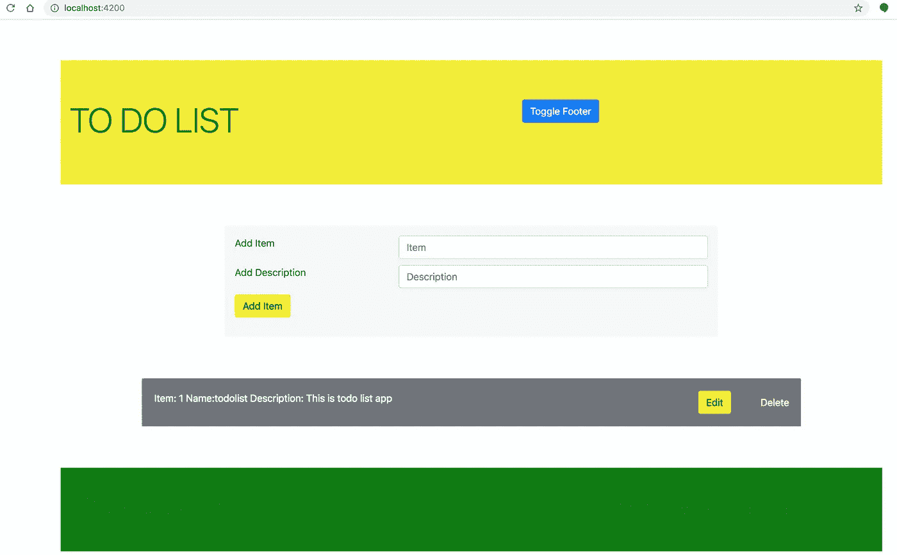

# Angular——设计和实现 Angular 应用程序的初学者指南

> 原文：<https://medium.com/bb-tutorials-and-thoughts/angular-a-beginners-guide-to-design-and-implementation-of-an-angular-app-b0c5118a2f61?source=collection_archive---------2----------------------->

## 包含示例项目的逐步指南

如果你是 Angular 的初学者，不知道如何开始，这篇文章是给你的，我们只关注一页的基本 Angular 应用程序。一旦完成，我们的应用程序看起来像下面，我们可以添加项目，编辑，删除项目。

**Home screen of the completed project**