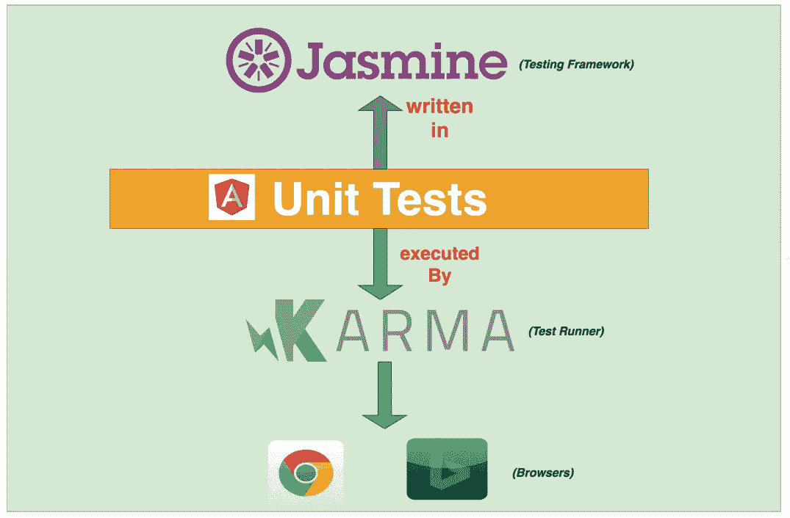

# Angular——一个全面的单元测试指南，包含 Angular 和最佳实践

> 原文：<https://medium.com/bb-tutorials-and-thoughts/angular-a-comprehensive-guide-to-unit-testing-with-angular-and-best-practices-e1f9ef752e4e?source=collection_archive---------1----------------------->

## 一步一步的指导一个单元测试角度的项目和一些例子

**Unit Testing ecosystem**

如今，单元测试和开发一个项目一样重要，它已经成为开发中不可或缺的一部分。它实际上提高了代码的质量和开发人员的信心。单元测试是用…