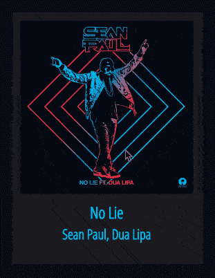
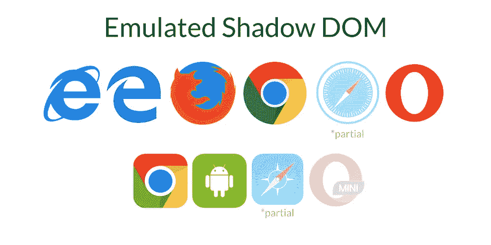
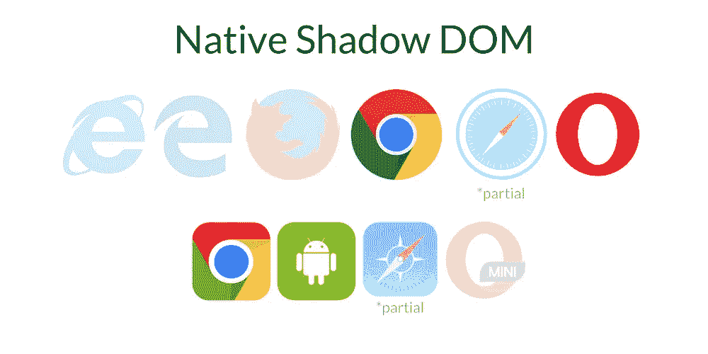

# 角度—高级样式指南(v4+)

> 原文：<https://medium.com/google-developer-experts/angular-advanced-styling-guide-v4-f0765616e635?source=collection_archive---------0----------------------->

了解如何像专业人士一样使用阴影 DOM 选择器、光线 DOM、@HostBinding、ElementRef、Renderer、Sanitizer 等等


[Geometric Shapes](http://sasj.tumblr.com/post/144104787865/geometric-shapes-160509) by Sasj

在本指南中，我们希望涵盖在设计角度组件和指令时可用的不同选项。我们将涵盖:

*   **角度封装模式** : [仿真](#64dd)，[原生](#aaa3)禁用。
*   [**浏览器支持**](#4264) 、 [**阴影 DOM** vs **光线 DOM**](#f981) 。
*   **@组件样式** **元数据** : [内联](#2ecd)，[模板内联](#7476)和[外部样式](#29c5)。
*   [使用 **ngClass** 和 **ngStyle** 指令](#9b4f)。
*   [**阴影 DOM 选择器**](#98ad)::. host()，:host-context()，:host /deep/ selector，:host > > >选择器
*   使用[**@ component . host**](#9f89)**和**[**@ host binding**](#49c6)**。** [**不安全款式**](#ae9d) **。******
*   ****使用 [**ElementRef**](#8d15) 和[**native element**](#8d15)API(Web)。****
*   ****使用 [**渲染器**](#2e5f) 和[**setElementClass**/](#2e5f)[**setElementStyle**](#2e5f)API(Web、Server、WebWorker)。****
*   ****[CSS 样式特异性和执行顺序](#0cd4)。****

****您可以使用这个 [Plunker](https://plnkr.co/edit/WUjoC897CXuybWvL9qt1?p=preview) 来探索最终的代码。****

****在 [@gerardsans](https://twitter.com/intent/user?screen_name=gerardsans) 找到我订阅的最新 Angular 内容。****

# ****介绍****

****造型角度应用从未如此灵活。角度组件架构提供了一种新的样式模型，通过使用 [**Shadow DOM**](https://www.w3.org/TR/shadow-dom/) (仿真或本地)技术将组件样式与 [**Web 组件**](https://www.w3.org/standards/techs/components#w3c_all) 规范隔离开来。样式是为每个组件定义的，所以它们不会影响用户界面的其他区域。****

****在这篇文章中，我们将使用一个组件来渲染**歌曲曲目**，展示一些不同的样式选项。该组件将呈现歌曲的封面、标题和艺术家。****

```
**[@Component](http://twitter.com/Component)({
  selector: 'song-track',   // <song-track></song-track>
})
export class SongTrack { }**
```

****见下文的最终结果。****

********

# ****角度封装模式****

****在进一步探索不同的样式方法之前，让我们快速查看所有可用的封装模式。****

## ****模拟(默认)****

****在使用该模式时，Angular 将使用两个唯一的属性来识别每个组件: **_nghost-*** 和 **_ngcontent-*** 。任何组件样式都将使用这些属性添加到头部，以隔离样式，如下例所示。****

```
**<head>
  <style>
    .container**[_ngcontent-ikt-1]** { ... } 
  </style>
</head><body>
  <my-app>
    <song-track **_nghost-ikt-1**>
      <div **_ngcontent-ikt-1** class="container"></div>
    </song-track>
  </my-app>
</body>**
```

****请注意以粗体字添加到我们组件的**根**和**内容**中的属性。您可以使用下面的代码显式激活此模式****

```
**[@Component](http://twitter.com/Component)({
  selector: 'song-track',
  **encapsulation: ViewEncapsulation.Emulated** })**
```

> ****仿真封装实现了跨浏览器的最佳支持。****

## ****本机封装****

****该封装将设置 Angular，以对特定组件使用**原生阴影 DOM** 。根据浏览器的不同，这将是规格的[v1](https://developers.google.com/web/fundamentals/getting-started/primers/shadowdom)(Chrome)。****

```
**[@Component](http://twitter.com/Component)({
  selector: 'song-track',
  **encapsulation: ViewEncapsulation.Native** })**
```

****这将呈现以下内容。****

```
**<body>
  <my-app>
    <song-track>    
      **▾ #shadow-root (open)**    
        <style>.container { ... }</style>   
        <div class="container"></div>
    </song-track>
  </my-app>
</body>**
```

****注意样式现在是如何封装在**#阴影根**下的。我们将在稍后介绍具体的造型选择。****

> ****某些浏览器不支持本机封装。在此检查电流支持[。](http://caniuse.com/#feat=shadowdomv1)****

## ****禁用封装****

****我们也可以完全禁用特定组件的封装。****

```
**[@Component](http://twitter.com/Component)({
  selector: 'song-track',
  **encapsulation: ViewEncapsulation.None** })**
```

****通过使用此模式，Angular 将向头部添加任何已定义的样式，以便使用此封装在组件之间共享样式。****

# ****本机阴影 DOM 浏览器支持****

****目前，原生影子 DOM 仍未得到广泛支持。参见下面的仿真和本地**浏览器支持对比**。****

****************

> ****查看当前支持检查[can use](http://caniuse.com/#feat=shadowdomv1)。****

> ****在激活本机封装之前，请考虑浏览器支持。****

# ****阴影世界 vs 光明世界****

****当设计我们的组件时，它可以帮助区分**阴影区域**和**光线区域**。****

*   ******Shadow DOM** :组件创建或管理的任何本地 DOM 元素。这也包括任何子组件。****

```
****<song-track title="No Lie" artist="Sean Paul..."></song-track>**[@Component](http://twitter.com/Component)({
  selector: 'song-track',
  template: `        
     <track-title>{{track}}</track-title>
     <track-artist>{{artist}}</track-artist>`
})
export class SongTrack { }**
```

*   ******Light DOM** :组件的任何子 DOM 元素。也称为投影内容(ng-content)。****

```
**<song-track>
 **<track-title>No Lie</track-title>
  <track-artist>Sean Paul, Dua Lipa</track-artist>**
</song-track>[@Component](http://twitter.com/Component)({
  selector: 'song-track',
  template: `<ng-content></ng-content>`
})
export class SongTrack { }**
```

# ****@组件样式元数据****

****为了设计我们的组件，我们可以使用组件元数据。****

> ****Angular 将按照下面使用的相同顺序在页眉中添加样式。****

## ****使用内嵌样式****

****这是我们将样式添加到组件所在的文件中的时候。按照数组顺序添加到标题的第一个位置。****

```
**[@Component](http://twitter.com/Component)({
  selector: 'song-track',
  **styles: [`.container { color: white; }`]**
})
export class SongTrack { }**
```

## ****使用模板内嵌样式****

****我们也可以使用这个特性将我们的样式嵌入到模板中。添加在页眉的第二个位置。****

```
**@Component({
 template: `
   **<style>
   .container { color: deepskyblue; }
   </style>**   
   <div class="container">...</div>
 `
})
export class SongTrack { }**
```

## ****使用外部文件****

****当我们的组件需要更复杂的样式时，我们可以使用外部文件。按照数组顺序添加到标题的第三个位置。****

```
**//song-track.component.css
.container { ... }//song-track.component.ts
@Component({
  **styleUrls**: ['./song-track.component.css'],
})
export class SongTrack { }**
```

****作为 CSS 规范的一部分，我们也可以使用 **@import** 从其他样式表中导入样式。这些必须在样式表中的任何样式规则之前。参见[@导入](https://developer.mozilla.org/en/docs/Web/CSS/@import)。导入将被添加到样式表之后的标题中。****

```
****@import 'common.css';**
.container { ... }**
```

# ****使用 ngClass 和 ngStyle 指令****

****我们可以使用 **ngClass** 和 **ngStyle** 指令来动态设计我们的组件。让我们来看看一些常见的用法****

```
**<song-track ngClass="selected" class="disabled"></song-track>
<song-track [ngClass]="'selected'"></song-track>   
<song-track [ngClass]="['selected']"></song-track> 
<song-track [ngClass]="{'selected': true}"></song-track>**
```

****注意 **ngClass** 可以与现有的类属性组合，而不需要使用任何绑定。为了定位多个类，我们可以使用一些有趣的变化的扩展语法****

```
**<song-track ngClass="selected disabled">             
<song-track [ngClass]="'selected disabled'">      
<song-track [ngClass]="['selected', 'disabled']">   
<song-track [ngClass]="{'selected': true, 'disabled': true}">
<song-track [ngClass]="{'selected disabled': true}">**
```

****对于 ngStyle，我们可以做同样的事情，但是因为我们需要成对的属性和值，所以选项较少****

```
**<song-track [ngStyle]="{'color': 'white'}" style="margin: 5px;"><song-track [ngStyle]="{'**font-size.px**': '12'}">
<song-track [ngStyle]="{'font-size': '12px'}"><song-track [ngStyle]="{'color': 'white', 'font-size': '12px'}">**
```

****注意扩展单位语法匹配现有的 [CSS 测量单位](https://www.w3.org/Style/Examples/007/units.en.html)。要应用多种样式，您可以添加更多属性。****

# ****使用阴影 DOM 选择器****

****当使用模拟或本地封装时，我们可以访问一些有趣的 CSS 选择器，这些选择器只有影子 DOM 才有。****

## ****设计我们的容器(又名主机)****

****如果我们需要访问我们的容器或者与其他选择器一起使用，我们可以使用 **:host** 伪类选择器****

```
**:host { color: black; }          // <song-track>
:host(.selected) { color: red; } // <song-track class="selected">**
```

****第一个例子将匹配**歌曲音轨**元素，并为其样式添加颜色。第二个例子将使用**选择的**类匹配**歌曲音轨**元素。****

## ****依赖祖先的风格****

****我们还可以根据祖先到文档根的匹配来添加样式。****

```
**:host-context(.theme) { color: red; }   
:host-context(#player1) { color: red; }**
```

****只有当**主题**类应用于我们组件的任何祖先时，上面的例子才会改变**颜色**。第二个例子将使用 **id="player1"** 匹配一个祖先。****

## ****设置宿主和后代的样式(跨越边界)****

****此选项将覆盖任何封装设置，包括主机子级。该选择器将同时适用于**阴影**和**光域**。****

> ****我们可以使用/deep/覆盖影子 DOM 边界****

```
**:host  /deep/ .selected { color: red; }
:host   >>>   .selected { color: red; }**
```

> ****注意:在 Angular-CLI 中使用/deep/而不是> > >。****

# ****使用@Component.host****

****通过使用这个属性，我们可以绑定 **DOM 属性**、 **DOM 属性**和**事件**。请参见下面不同选项的概述。****

```
**@Component({
 host: {
  'value': 'default',                    //'DOM-prop': 'value'  
  '[value]': "'default'",                //'[DOM-prop]': 'expr'   

  'class': 'selected',                   //'DOM-attr': 'value'
  '[class]': "'selected'",               //'[DOM-attr]': 'expr'

  '(change)': 'onChange($event)',        // (event) : ...   
  '(window:resize)': 'onResize($event)', // (target:event) : ...
 } 
})**
```

****让我们看一些使用**类**和**样式** DOM 属性的例子。****

```
**@Component({
  host: {
    //setting multiple values
    'class': 'selected disabled',
    'style': 'color: purple; margin: 5px;',

    //setting single values (using binding)
    '[class.selected]': 'true',    
    '[class.selected]': '!!selected', //add class if selected = true
    '[style.color]': '"purple"'   //expression must be a string
  } 
})
export class SongTrack { }**
```

****请注意方括号在创建绑定时的用法。这就是为什么**‘真’**变成了**布尔真**。对于 CSS 属性**颜色**我们需要传递一个字符串。****

## ****绑定不安全的表达式****

****为了避免滥用，Angular 可能会将一些样式表达式标记为不安全。****

```
**@Component({
  host: {
    '[style]': '_hostStyle' //unsafe
  } 
})
export class SongTrack { }**
```

****如果你面临这个特殊的问题，你可以通过使用**杀毒软件**上的**bypassSecurityTrustStyle**API 来将表达式标记为安全。这将避免任何滥用或安全漏洞。****

```
**export class SongTrack {
  constructor(**private sanitizer: Sanitizer**){
    this._hostStyle = this.sanitizer
      .bypassSecurityTrustStyle('color: black;');
  }
}**
```

# ****使用@HostBinding****

****我们也可以使用 **@HostBinding** 装饰器来设置我们的样式。请看下面的一些例子。****

```
**export class SongTrack {   
  //<host class="selected"></host>   
  **@HostBinding('class.selected')** selected = true; //<host style="color: red;"></host>     
  **@HostBinding('style.color')** color = 'red';
}**
```

> ******@ host binding**decorator 被翻译成 **@Component.host** 元数据。****

# ****使用 ElementRef 和 nativeElement APIs(浏览器)****

****有时我们可能想要访问底层 DOM 元素来操作它的样式。为此，我们需要注入 **ElementRef** 并访问 **nativeElement** 属性。这将使我们能够访问 DOM APIs。****

```
**export class SongTrack {
  constructor(**private element: ElementRef**){
    let elem = **this.element.nativeElement**;
    elem.style.color = "blue";
    elem.style.cssText = "color: blue; ..."; // multiple styles
    elem.setAttribute("style", "color: blue;"); 
  }
}**
```

> ****请注意，此选项适用于浏览器平台，但不适用于桌面或移动设备。****

# ****使用渲染器和 setElementClass/setElementStyle API(Web、服务器、WebWorker)****

****一个更安全的替代 ElementRef 来设置我们的样式的方法是使用**渲染器**和 **setElementClass** 和 **setElementStyle** 。它们的实现将抽象出正在使用的底层平台，克服 ElementRef 的兼容性限制。****

```
**export class SongTrack {
  constructor(
     **private element: ElementRef,
**     **private renderer: Renderer** ){
    let elem = **this.element.nativeElement**;
    renderer.setElementStyle(elem, "color", "blue");
    renderer.setElementClass(elem, "selected", true);
  }
}**
```

# ****CSS 样式特异性和执行顺序****

****所有样式都遵循以下特性和顺序规则。****

*   ****样式规则越具体，优先级越高****
*   ****同样，最后应用的样式规则优先于任何先前的样式规则****

****这是样式的应用顺序及其自下而上的优先级。****

```
**Component implementation
- Styles defined at @Component.styles (following array order)
- Template Inline Styles
- External styles @Component.styleUrls (following array order)Container
- Inline style. Eg: <... style="">
- ngClass and ngStyle**
```

****因此，如果我们使用 **ngStyle** ，这将覆盖元素上定义的任何内联样式和任何以前的样式。****

> ****样式是作为角度渲染执行和组件生命周期的一部分静态和动态应用的。****

****注意，根据执行的顺序，我们可能会得到一个被另一个覆盖的样式。比如先应用 **@Component.host** ，再应用 **@Hostbinding** 。****

****那都是乡亲们！有什么问题吗？感谢阅读！在 [@gerardsans](https://twitter.com/intent/user?screen_name=gerardsans) 给我发短信****

## ****想要更多吗？****

****如果您需要更多示例，请随时通过*Gerard _ dot _ sans _ at _ Gmail _ dot _ com*联系我！****

****[](http://www.meetup.com/AngularZone/) [## 安古拉宗社区

### 欢迎来到我们的社区。我们的激情是有棱角的。加入我们吧！🚀](http://www.meetup.com/AngularZone/) 

# 进一步阅读

*   [阴影 DOM 规范](https://www.w3.org/TR/shadow-dom)
*   [阴影 DOM 选择器](https://www.w3.org/TR/css-scoping-1)
*   埃里克·比德尔曼的《T21》

[](https://twitter.com/intent/user?screen_name=gerardsans)****