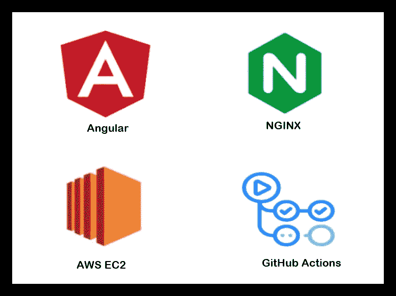
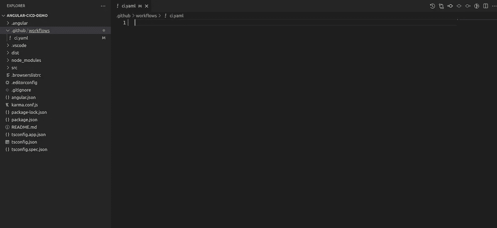
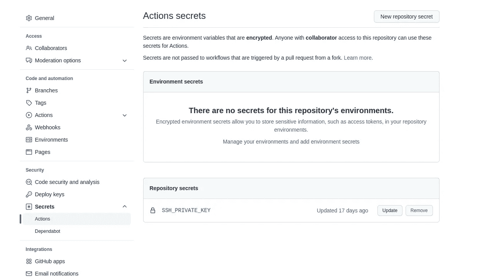
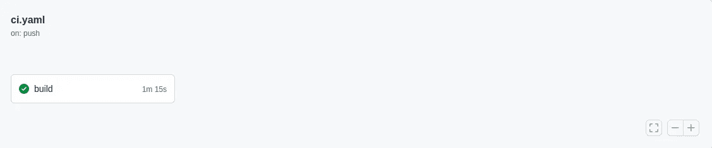
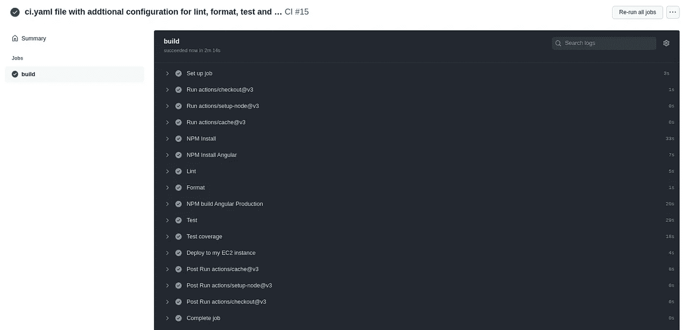
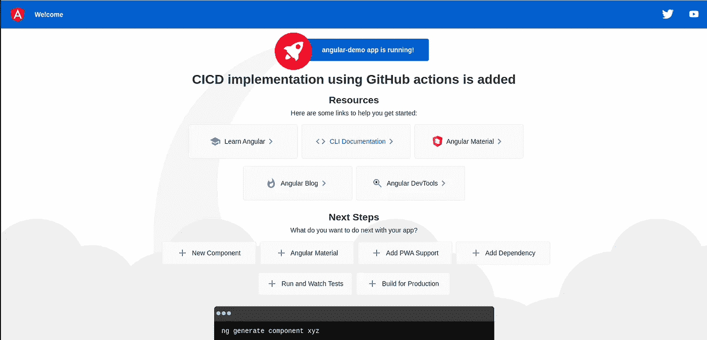

# 使用 GitHub 操作将 Angular app 部署到 AWS EC2 实例

> 原文：<https://medium.com/globant/angular-app-deployment-to-aws-ec2-instance-with-github-actions-48880931520f?source=collection_archive---------2----------------------->



在之前的[博客](/globant/manual-deployment-of-angular-app-to-aws-ec2-b5cb5466bbfc)中，我们成功地在 EC2 实例上部署了 angular 应用程序，并用 NGINX web 服务器对其进行了配置。但这更多的是一种手动方式，现在在这一节中，我们将使用 GitHub 操作来自动完成整个过程。我们将使用 GitHub 动作来构建 angular 应用程序并将其部署到 EC2 实例中。假设您有一个 Ubuntu OS 的 EC2 实例，带有 NGINX web 服务器配置，并且可以访问该实例的 PEM 密钥。

**创建工作流文件:**

GitHub 为许多最流行的平台提供了预定义的工作流。但是对于这一点，我们将使用工作流命令手动创建 YAML 文件。

在项目的根目录下创建一个文件夹，**。github** 和在其中创建一个子文件夹 **workflows** 。这是我们的工作流 YAML 文件将驻留的地方。

一个项目可以有多个工作流，如构建、发布等。为了简单起见，我们将把工作流保存在一个文件中。我们正在 workflows 文件夹中创建一个名为 ***ci.yaml*** 的文件。



GitHub folder, workflow file added

一旦文件被创建，我们将添加 CICD 步骤到文件中。

```
name: CIon:
  push:
      branches: [main]
  pull_request:
      branches: [main]
```

使用 **name** 标签，我们为工作流提供名称，之后，我们定义何时触发工作流，当代码被推送到主分支或者任何拉取请求与**主分支**合并时，我们的工作流将被触发。

```
jobs:
  build:
    runs-on: ubuntu-latest
    defaults:
      run:
        working-directory: ./
```

之后，我们定义构建 angular 作业，它运行在 **ubuntu-latest** 上。每个作业都在虚拟环境的新实例中运行。作业中可能包含一个或多个定义的步骤。

```
steps:
      - uses: actions/checkout@v3
      - uses: actions/setup-node@v3
        with:
          node-version: "14.x"
      - uses: actions/cache@v3
        with:
          path: ~/.npm
          key: ${{ runner.os }}-node-${{ hashFiles('**/package-lock.json') }}
          restore-keys: |
            ${{ runner.os }}-node-
```

通过**步骤**，我们定义了应该执行的步骤。工作流程的第一步是使用 **checkout** 命令从存储库中提取代码。在下面，我们正在设置节点环境，我们还定义了应该使用的节点版本。步骤**缓存**是用来提高我们工作流的性能。它被定义为重用**节点**包。这个过程有助于加速构建过程。要了解缓存命令的详细信息，请点击[此处](https://github.com/actions/cache)。

```
- name: NPM Install
  run: npm install- name: NPM Install Angular
  run: npm install -g [@angular/cli](http://twitter.com/angular/cli) > /dev/null- name: NPM build Angular Production
  run: npm run build:prod
```

在上述步骤中，我们将安装项目所需的 npm 包，然后安装最新的 angular CLI 并创建 angular 生产版本。

```
- name: Deploy to my EC2 instance
        uses: easingthemes/ssh-deploy@v2.1.5
        with:
          SSH_PRIVATE_KEY: ${{ secrets.SSH_PRIVATE_KEY}}
          SOURCE: "dist/angular-demo/"
          REMOTE_HOST: "ec2-remote-host"
          REMOTE_USER: "ubuntu"
          TARGET: "/var/www/html/angular-demo/"
```

一旦角度构建创建完成，剩下的部分就是将它部署到 EC2 实例。我们使用***easing themes/ssh-deploy @ v 2 . 1 . 5***来部署这段代码。此步骤需要 EC2 实例配置。我们需要提供的第一件事是 **SSH_PRIVATE_KEY** ，它只是 EC2 实例的一个 **PEM** 文件，我们需要将它添加到 GitHub 的 secrets 部分，以便在配置中使用。请参考下图，以便更好地理解。



GitHub repository secrets

对于**源**可以定义我们可以从中获取代码库的位置，对于 **REMOTE_HOST** 我们需要添加远程主机路径，我们可以从 AWS 控制台获取，在转到实例详细信息后，我们可以查找**公共 IPv4 DNS，同样的**路径路径应该添加在那里。远程用户是 EC2 实例的用户，在我们的例子中是 ubuntu。**目标**是角度构建应复制的定义路径。应该记住，我们为目标定义的路径应该与我们为 NGINX 服务器配置的路径相同。

在上面的配置中，我们可以选择在 format 命令中添加额外的**步骤**来美化代码，在 lint 命令中添加额外的**步骤来保持代码的质量。上述命令的配置应在 angular 应用程序中添加，命令应在 ***package.json*** 文件中配置。**

要添加 lint 命令，我们只需在项目根终端键入 ***ng lint*** ，然后在询问安装配置时选择 yes。在 ***package.json*** 文件的脚本部分，会自动添加 lint 命令。然后我们可以将 lint 命令添加到 ***ci.yaml*** 文件中。

```
- name: Lint
  run: npm run lint
```

对于格式化程序，有不同的格式化程序可用，我使用了更漂亮的格式化程序，要使用更漂亮的，我们需要从 NPM 安装其依赖关系，并使用以下命令安装格式化程序。

```
npm install --save-dev --save-exact prettier
```

安装完漂亮器之后，我们可以把它添加到 ***package.json*** 文件的脚本部分。在命令中，我们定义了应该修改什么类型的文件，我们可以根据需要修改它们。

```
"format": "npx prettier 'src/**/*.{js,jsx,ts,tsx,html}' --write"
```

一旦 format 命令可用，我们就可以将其添加到 ***ci.yaml*** 文件中。

```
- name: Format
  run: npm run format
```

我们还可以添加一个步骤来检查所有的测试是否正确执行。
在 ***package.json*** 文件中，我们需要添加测试命令。它将如下所示。

```
"test:ci": "ng test --no-watch --browsers ChromeHeadless
```

我们还需要在 ***ci.yaml*** 文件的步骤中添加相同的命令。

```
- name: Test
  run: npm run test:ci
```

我们还可以添加检查测试用例覆盖率的步骤，因为我们可以简单地在 angular 根文件夹中运行下面的命令，我们的覆盖率报告就会生成。由于不需要 chrome 浏览器，所以添加了 ChromeHeadless 部分。

```
ng test --no-watch --code-coverage --browsers ChromeHeadless
```

我们将在 ***package.json*** 文件的脚本部分添加测试覆盖命令。

```
"test:ci:cov": "ng test --no-watch --code-coverage --browsers ChromeHeadless"
```

有关代码覆盖率的其他信息，请参考以下 URL。

[https://angular.io/guide/testing-code-coverage](https://angular.io/guide/testing-code-coverage)

***package.json*** 文件的脚本部分如下所示

```
"scripts": {
    "ng": "ng",
    "start": "ng serve",
    "build": "ng build",
    "build:prod": "ng build --configuration production",
    "watch": "ng build --watch --configuration development",
    "test": "ng test",
    "test:ci": "ng test --no-watch --browsers ChromeHeadless"
    "lint": "ng lint",
    "format": "npx prettier 'src/**/*.{js,jsx,ts,tsx,html}' --write",
    "test:ci:cov": "ng test --no-watch --code-coverage --browsers ChromeHeadless"
}
```

在 ***YAML*** 文件中添加了上述配置后，将如下所示，我想再次重申，lint、格式、测试和测试覆盖都是可选的，不是强制实现 CICD，但这是一个很好的实践。

```
name: CIon:
  push:
    branches: [main]
  pull_request:
    branches: [main]jobs:
  build:
    # using Ubuntu
    runs-on: ubuntu-latest
    defaults:
      run:
        working-directory: ./
    steps:
      - uses: actions/checkout@v3
      - uses: actions/setup-node@v3
        with:
          node-version: "14.x"
      - uses: actions/cache@v3 # this allows for re-using node_modules caching, making builds a bit faster.
        with:
          path: ~/.npm
          key: ${{ runner.os }}-node-${{ hashFiles('**/package-lock.json') }}
          restore-keys: |
            ${{ runner.os }}-node-- name: NPM Install
  run: npm install- name: NPM Install Angular
  run: npm install -g [@angular/cli](http://twitter.com/angular/cli) > /dev/null- name: Lint
  run: npm run lint- name: Format
  run: npm run format- name: NPM build Angular Production
  run: npm run build:prod- name: Test
  run: npm run test:ci- name: Test coverage
  run: npm run test:ci:cov- name: Deploy to my EC2 instance
  uses: easingthemes/ssh-deploy@v2.1.5
  with:
    SSH_PRIVATE_KEY: ${{ secrets.SSH_PRIVATE_KEY}}
    SOURCE: "dist/angular-demo/"
    REMOTE_HOST: "ec2-remote-host"
    REMOTE_USER: "ubuntu"
    TARGET: "/var/www/html/angular-demo/"
```

现在我们可以在角度代码中执行任何修改，出于测试目的，我们将修改角度代码并观察变化。现在使用下面的命令检查主分支。

```
git checkout main
```

在主分支上，在**app.component.html**文件中添加下面一行。

```
<h3>CICD implementation using GitHub actions is added</h3>
```

现在，我们可以使用以下命令提交代码并将代码推送到主分支。

```
git add .
git commit -m "CICD implementation added"
git push origin main
```

我们可以通过进入 git 存储库的 GitHub actions 部分来检查工作流的状态。



GitHub workflow status



GitHub Actions result

成功完成 Github 操作后，我们只需转到 URL[**http://public-IP-address**](http://public-ip-address)来观察添加的修改。

我们可以在下图中看到，我们所做的修改得到了正确的反映。



Angular page after update

**结论**:

通过遵循上面记录的过程，我们已经成功地将静态角度应用程序部署过程转换为具有 GitHub 动作的 CICD 过程。

如果你对此有任何意见或疑问，请在下面的评论区提出。