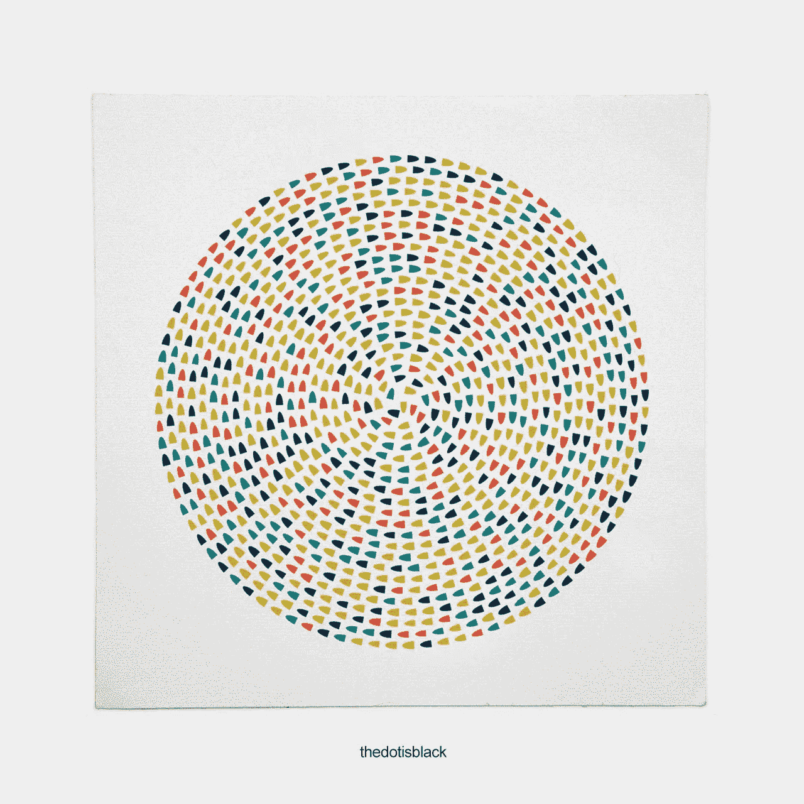
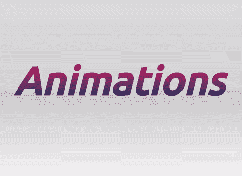
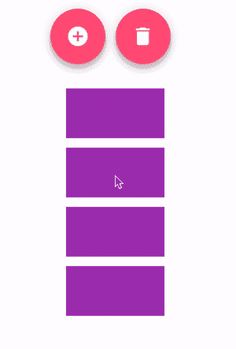
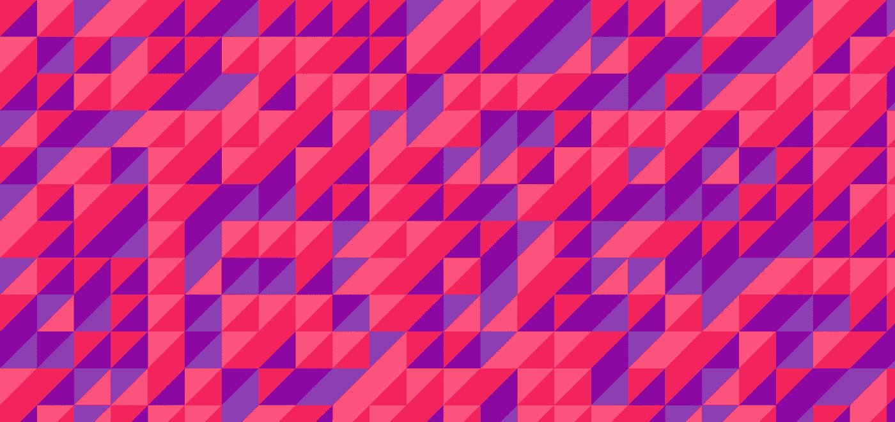

# 角度—将运动原理应用于列表

> 原文：<https://medium.com/google-developer-experts/angular-applying-motion-principles-to-a-list-d5cdd35c899e?source=collection_archive---------0----------------------->

如何使用角度动画应用运动原理



Image by thedotisblack. [Credits](https://twitter.com/DavidMrugala)

在这篇文章中，我将描述如何将运动原理应用到不同的交互中，并以一系列项目为基础。我们将涵盖:

*   [依赖项设置](#e845)和最终[解决方案](#e2fe)
*   [设计材质按钮](#8347)并引入[角度动画](#85e0)
*   施加动作:[添加](#fe4c)、[移除](#bb36)和[初始显示](#e813)。

您可以使用以下代码来浏览源代码:

[初赛](https://stackblitz.com/edit/angular-motion-initial) | [决赛](https://stackblitz.com/edit/angular-motion)

在 [@gerardsans](https://twitter.com/intent/user?screen_name=gerardsans) 找到我的最新观点。

> 这个例子是一个演示的一部分，以支持在 [**伦敦**](https://www.meetup.com/Women-Who-Code-London/events/242089054/) 进行的一次演讲。在这次演讲中，我介绍了我将在这里使用的相同原理。请随意查看幻灯片中的介绍。

[](http://slides.com/gerardsans/wwc-motion-angular) [## Gerard Sans 以角度(4.3+版)实现运动

### 在这次演讲中，我们将通过一些实例来讲述 UX 动议背后的 12 项原则。我们将专注于…

slides.com](http://slides.com/gerardsans/wwc-motion-angular) 

# 相关性设置

首先，我们需要做一些准备，确保所有的依赖项都到位。使用**角度动画**，我们需要:`@angular/animations`和`@angular/platform-browser/animations`。对于**角料** : `@angular/material`和`@angular/cdk`。除此之外，我们还将导入**靛粉色主题**和**材质图标**(用于按钮)。见下文。

```
// style.css [@import](http://twitter.com/import) '[https://unpkg.com/@angular/material/prebuilt-themes/indigo-pink.css](https://unpkg.com/@angular/material/prebuilt-themes/indigo-pink.css)';
[@import](http://twitter.com/import) '[https://fonts.googleapis.com/icon?family=Material+Icons'](https://fonts.googleapis.com/icon?family=Material+Icons');
```

在我们的根模块上，我们将像这样添加上面的模块:

```
import { **BrowserAnimationsModule** } from '[@angular/platform-browser](http://twitter.com/angular/platform-browser)/animations';
import { **MaterialModule**, **MdButtonModule** } from '[@angular/material](http://twitter.com/angular/material)';[@NgModule](http://twitter.com/NgModule)({
  imports: [ BrowserModule, **BrowserAnimationsModule**, **MaterialModule**, **MdButtonModule** ],
  declarations: [ App ],
  bootstrap: [ App ]
})
export class AppModule { }
```

更多关于如何设置 [**角度材质**](https://material.angular.io/) 的信息，请查看 Loiane Groner [@loiane](https://twitter.com/loiane) 的[教程](https://loiane.com/2017/07/getting-started-with-angular-material-2/)。

# 解决办法

下图交替显示了没有动画的版本和最终版本。这里需要注意的是列表最初是如何显示预先存在的项目的，以及添加和删除项目的效果。


Initial version followed by final version.

我们将使用一个基本的列表设置，使用 **ngFor** 来应用我们的动画。

```
[@Component](http://twitter.com/Component)({
  selector: 'my-app',
  template: `
    <div class="buttons-container">...</div>
    <div class="list-container">
      <div class="box" ***ngFor="let item of list"**></div>
    </div>`
})
export class App {
  list = [1,2,3,4];
}
```

这将呈现一个包含 4 个元素的列表。对于我们正在使用的布局:**按钮-容器**，**列表-容器**和**框**。

```
.buttons-container, .list-container {
  display: flex;
  align-items: center;
  justify-content: center;  
}

.buttons-container {
  flex-direction: row;  
}

.list-container {
  flex-direction: column;
}

.box {
  width: 100px;
  height: 50px;
  background-color: #9c27b0;
  margin: 5px;
}
```

我们使用 flex 来设计我们的容器。按钮分别使用`row`(从左到右)和`column`(从上到下)`flex-direction`。为了样式化这些项目，我们使用了**盒子**类。

# **造型材料按钮**

为了样式化我们的**添加**和**移除**按钮，我们使用了下面的代码。

```
<button **md-fab**>
  **<i class="material-icons">&#xE147;</i>**
</button>
<button **md-fab** [disabled]="list.length===0">
  **<i class="material-icons">&#xE872;</i>**
</button>
```

我们选择的 **md-fab** 是带仰角的圆形按钮。对于图标，我们搜索了[图标库](https://material.io/icons/#ic_add_circle)，并使用该版本来最大化浏览器与 IE9 或更低版本的兼容性。注意当列表中没有更多项目时，禁用**移除**按钮的代码。

# 角度动画

下面简单介绍一下角度动画。Angular 基于 [Web Animations API](https://w3c.github.io/web-animations/) ，我们可以使用**触发器**来定义一系列的**状态**和状态之间的**转换**。我们使用**样式**来帮助我们使用 **CSS 属性**构建想要的效果。

动画背后的**主要原理**是，一旦我们使用样式设置了**初始状态**和**最终状态**，浏览器就会为我们计算中间状态。



Who else better to explain animations than the party parrot!? 😃

我们可以用秒或毫秒来设置动画的持续时间。例如:1 秒，1.2 秒，200 毫秒。有时我们可能还想控制**计时功能**，它设置计算中间步长**补间**的速度。默认定时为`ease`；其他常见的值有`linear`或`ease-in-out`。

由于 **Angular v4.2+** 我们也可以使用**序列**和**组**一个接一个或并行运行动画；并且**查询**来访问子元素，**交错**来创建良好链接的编排。

# 为新项目制作动画

让我们研究一下添加新项目所涉及的代码:

```
[@Component](http://twitter.com/Component)({
  template: `
    <div class="top-buttons">
      <button md-fab **(click)="add()"**></button>
    </div>
    <div class="list-container">...</div>`
})
export class App {
  **counter = 5;**
  list = [1,2,3,4];

  add(){
    **this.list.push(this.counter++);**
  }
}
```

我们使用绑定到第一个按钮的事件来调用`click`上的`add`方法。这将使用`counter`从我们离开的地方开始添加一个新号码。

到目前为止，这将立即显示新的项目，这可能感觉有点粗糙。为了改善用户体验，我们将应用以下原则:预期、夸张和合成。

## 预期原则

这一原则增加了真实性，并在行动发生之前让观众做好准备。在我们的例子中，我们不希望这些项目凭空出现。我们将使用不透明的淡入效果来帮助预期。

## 夸张原则

夸张原则就是让动作感觉更极端。这样会增加吸引力，增强行动力。为了实现这一点，我们将尝试添加项目的大小。我们能做的是使用一个**三次贝塞尔**计时函数将它放大和缩小到正常大小。这通常需要一些修改，但是我们可以使用 Lea Verou 的在线工具。

## 构图原理

这也被称为[二次或分层动画](https://twitter.com/jrcanest/status/788441769864073216)。这是将单独的动画合并成一个动画的结果。在我们的例子中，我们将把前面的两个动画合成一个，这样它们可以同时发生。

让我们把这些动画添加到我们的列表中吧！

```
<div class="list-container">
  <div **@items** class="box" *ngFor="let item of list"></div>
</div>
```

首先我们将添加触发器`@items`来告诉 Angular 我们想要处理影响列表中每个 **div** 项目的动画。之后，我们将触发器定义添加到`animations`组件元数据中。这两个需要使用匹配的名称。

```
[@Component](http://twitter.com/Component)({
  **animations:** [
    trigger('**items**', [
      transition('**:enter**', [
        style(**{ transform: 'scale(0.5)', opacity: 0 }**),  // initial
        animate('1s cubic-bezier(.8, -0.6, 0.2, 1.5)', 
          style(**{ transform: 'scale(1)', opacity: 1 }**))  // final
      ])
    ])
  ]
})
```

对于我们的触发器，我们使用`:enter`定义了一个转换来捕获添加到视图中的新 DOM 元素。在我们的代码中，我们使用了一个自定义的计时函数。这就是我们的**贝塞尔曲线** [看起来](http://cubic-bezier.com/#.8,-0.6,.2,1.5)的样子。当使用超出 0–1 区间的三次贝塞尔值时，我们允许 CSS 样式超出我们用于初始和结束状态的值。对于我们的触发器来说，这意味着我们将得到比`scale(0.5)`小一点和比`scale(1)`大一点的值，产生一个微小的反弹效果。

# 动画移除项目

让我们看看从列表中删除项目的代码。

```
[@Component](http://twitter.com/Component)({
  template: `
    <div class="top-buttons">
      <button md-fab **(click)="remove(0)"**></button>
    </div>
    <div class="list-container">
      <div [@items](http://twitter.com/items) class="box" **(click)="remove(i)"**
        *ngFor="let item of list; **let i=index;**">
      </div>
    </div>`
})
export class App {
  remove(index) {
    if(!this.list.length) return;
    **this.list.splice(index, 1);**
  }
}
```

与之前类似，我们使用事件绑定来调用索引为`0`的 remove 方法。每次点击时，我们将使用**拼接**并传递索引`0`来移除列表的第一个元素。我们还可以使用这种新方法来删除单个项目。为了获得列表中的当前索引，我们可以使用一个模板变量`i`，并将其作为参数传递给`remove`。对于第一个 div，结果代码将是`(click)="remove(0)"`等等。

这将立即删除项目。正如我们之前所做的，我们将应用以下原则:预期、夸张和构图。我们将使用与之前相同的状态，但顺序相反。

```
transition('**:leave**', [
  style({ transform: 'scale(1)', opacity: 1, **height: '*'** }),
  animate('1s cubic-bezier(.8, -0.6, 0.2, 1.5)', 
   style({ 
     transform: 'scale(0.5)', opacity: 0, 
     **height: '0px', margin: '0px'** 
   })) 
])
```

对于这个转换，我们使用了`:leave`来捕捉从视图中移除的 DOM 元素。这一次，除了`height`和`margin`，其他所有东西看起来都很熟悉。这是为了解决动画在元素所在的位置留下一个间隙，然后下降以弥合与其余项目的间隙的问题。见下文:



Animations without handling “height” and “margin”.

height 中的星号告诉 Angular 使用 DOM 元素的当前值作为这个属性的值。

> 我们可以使用 **50px** 而不是 ***** ，但是后者将允许我们更改 CSS 值，而不必担心动画中的值。

# 为列表的初始显示制作动画

我们差不多完成了。还有最后一件事要做。当列表第一次显示时，所有预先存在的项目会同时显示。那不太好，是吗？让我们解决这个问题！

```
<div [**@list**](http://twitter.com/list) class="list-container">
  <div [@items](http://twitter.com/items) class="box" *ngFor="let item of list"></div>
</div>
```

这次我们希望能够控制一个列表而不是一个 DOM 元素。我们可以通过将**触发器**添加到父对象中，并使用**查询**来分别动态地制作每个项目的动画。

```
trigger('**list**', [
  transition('**:enter**', [
    query('[@items](http://twitter.com/items)', **stagger(300, animateChild())**)
  ]),
])
```

正如我们之前看到的，当 div 第一次被添加到视图中时，我们使用了`:enter`来捕捉。注意，这个触发器适用于带有**列表容器**类的 div。**查询**命令使用一个选择器，在本例中是一个触发器选择器，它将使用`@items`触发器匹配子节点。该查询连同 **stagger** 和 **animateChild** 将产生预先存在的 4 个 div 项目的列表，以 300 毫秒的延迟运行它们各自的动画。你可以在下面看到最终的动画。


仅此而已！觉得我错过了什么吗？通过 [@gerardsans](https://twitter.com/intent/user?screen_name=gerardsans) 或 gerard.sans_at_gmail.com 联系我，感谢阅读！

# 进一步阅读

*   [**用运动创造可用性:UX 运动宣言**](/ux-in-motion/creating-usability-with-motion-the-ux-in-motion-manifesto-a87a4584ddc) 作者伊萨拉·威伦斯科莫[**@**UX _ 运动](https://twitter.com/UX_in_Motion)
*   [**Loiane Groner**](https://loiane.com/2017/07/getting-started-with-angular-material-2/)**[@ Loiane](https://twitter.com/loiane)角度素材入门 2** 。

[](http://www.meetup.com/AngularZone/) [## 安古拉宗社区

### 欢迎来到我们的社区。我们的激情是有棱角的。加入我们吧！🚀](http://www.meetup.com/AngularZone/) [](https://twitter.com/intent/user?screen_name=gerardsans)