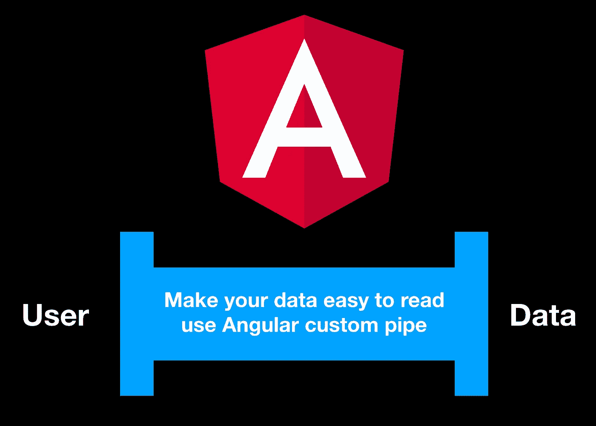
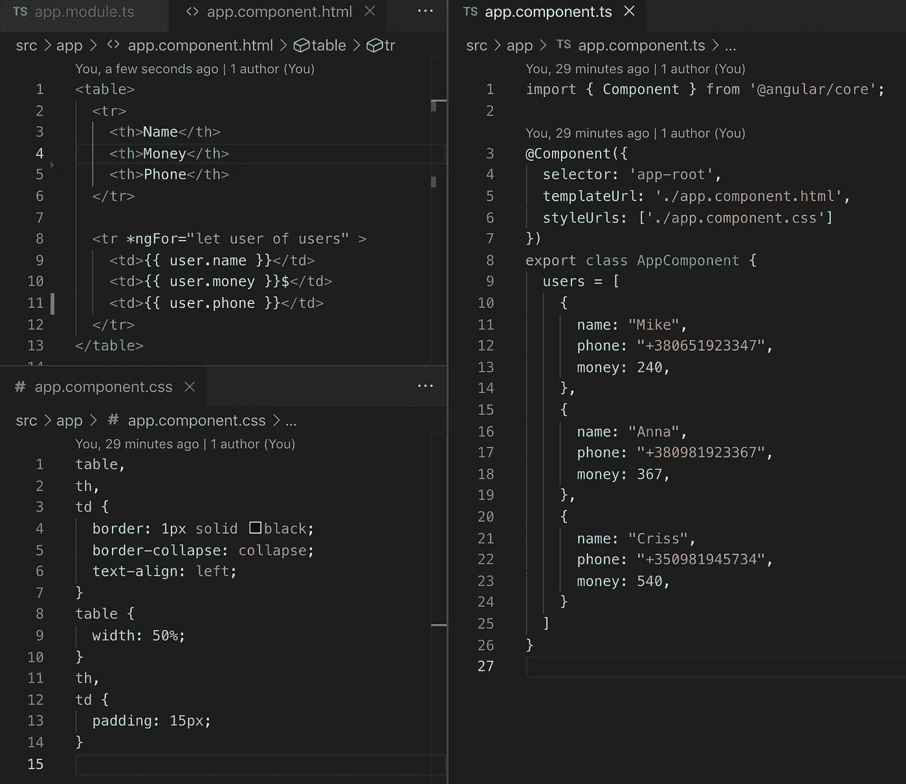
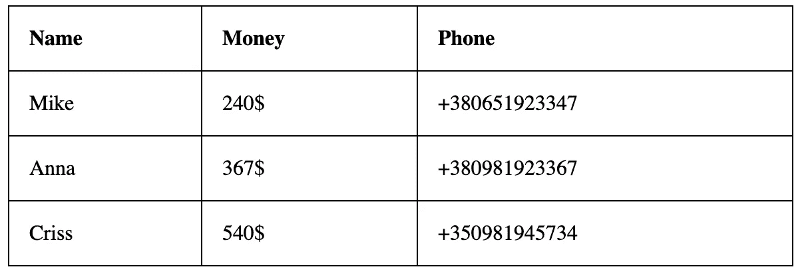
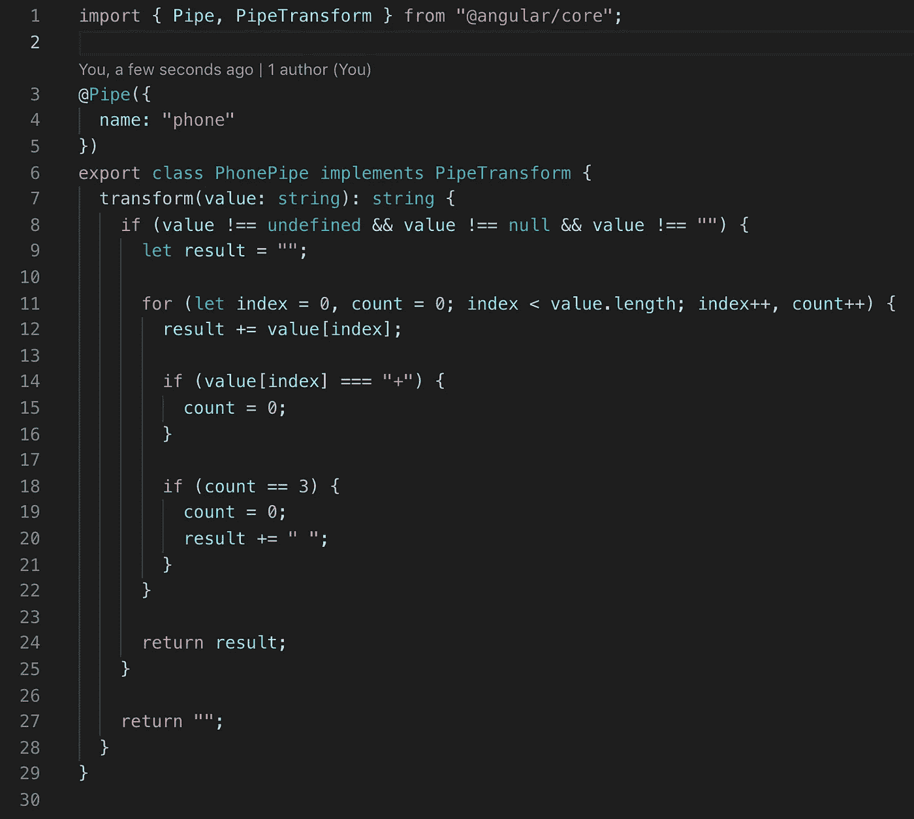
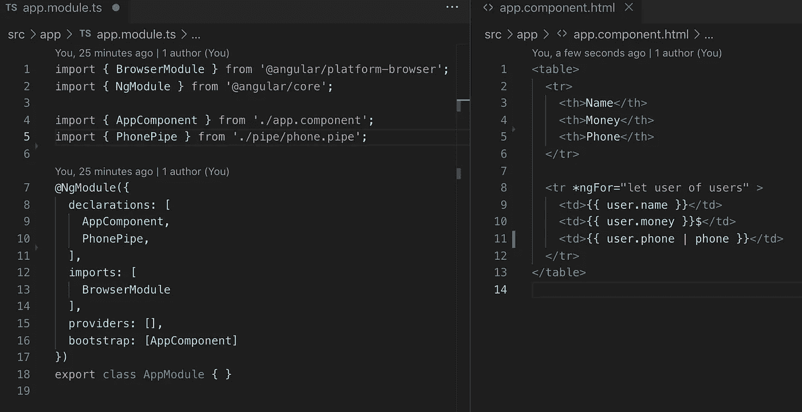
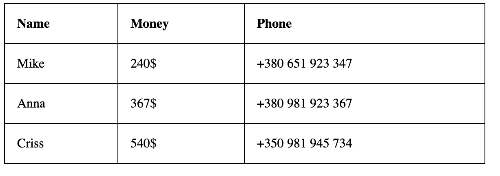
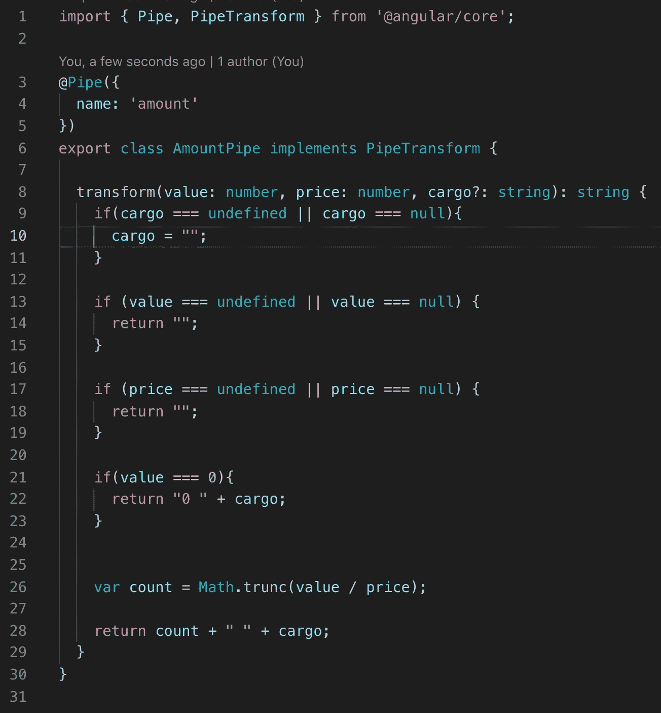
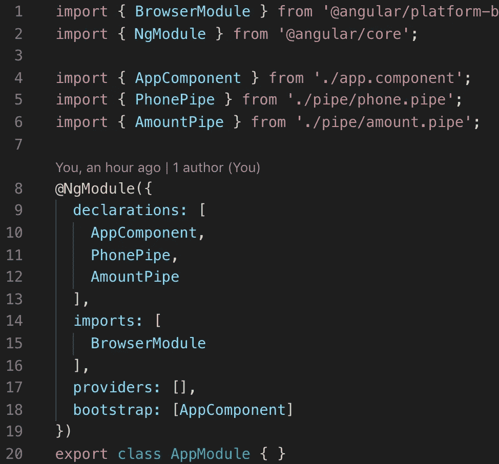
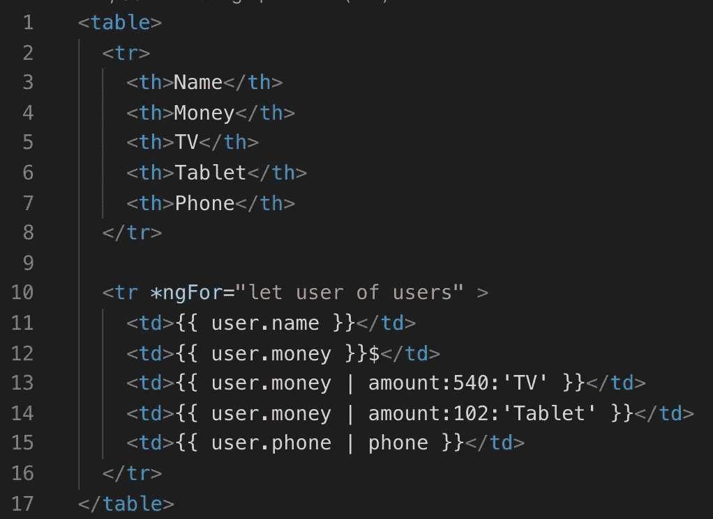
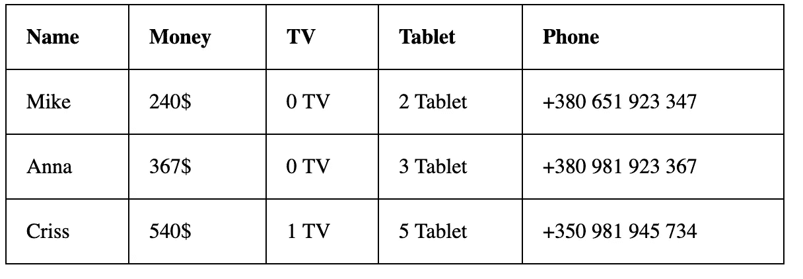

# 使用角度自定义管道使您的数据易于阅读

> 原文：<https://medium.com/quick-code/angular-custom-pipe-will-give-your-data-any-look-919d46696639?source=collection_archive---------9----------------------->

## 角度指南

## 定制弯管

标准的角形管非常方便，但如果我们自己制作管道，效果会更好。

让我们创建一个小项目。

app.component.ts

每个用户都有一个很难辨认的电话号码。

Table

我们可以通过定制电话管道来解决这个问题。为此，我们需要做几件事:

*   使用一个管道装饰器，在那里我们必须放置一个管道的名字，这个名字我们将在 html 文件中使用。
*   实现 PipeTransform 接口，该接口定义了转换方法

我们的转换方法的实现很简单，我们只需给电话号码添加一个空格。

phone.pipe.ts

管道准备好了。现在，我们需要在模块的“声明”部分添加我们想要使用的管道，在我们的例子中，我们需要将它放在“AppModule”中。之后，在 HTML 文件中，我们可以使用我们的管道。

Result of phone.pipe.ts

每个用户的账户上都有一笔钱。让我们开一个小店，向用户展示他可以在我们店里买到的东西。为此，我们需要创建另一个带参数的管道。在这种情况下，我们的 transform 方法的实现将采用多个参数。

amount.pipe.ts

我们还需要将这个管道放在“AppModule”中。

AmountPipe in AppModule

目前，我们的商店正在销售电视和平板电脑。

AmountPipe in app.component.html

Result

角自定义管道是非常有益的，因为我们可以给我们的数据任何外观。

如果你需要仔细查看项目[，这里有](https://github.com/8Tesla8/tree-view-angular)[链接](https://github.com/8Tesla8/angular-custom-pipe)。

*原载于 2019 年 8 月 26 日*[*http://tomorrowmeannever.wordpress.com*](https://tomorrowmeannever.wordpress.com/2019/08/26/angular-custom-pipe-will-give-your-data-any-look/)*。*