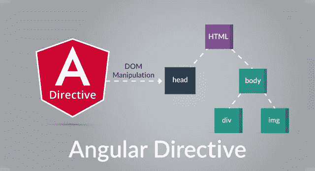
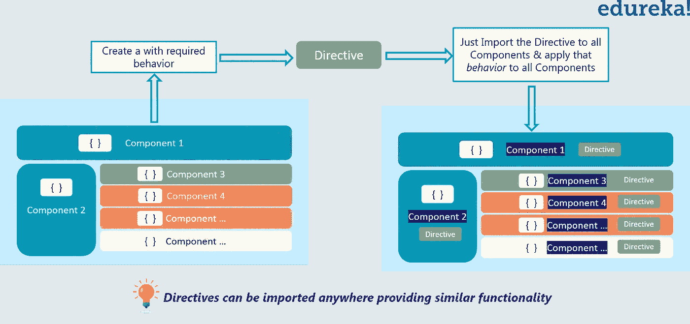

# 创建和使用自定义角度指令

> 原文：<https://medium.com/edureka/angular-directive-tutorial-3b203de7948a?source=collection_archive---------1----------------------->



Angular Directive — Edureka

在本文中，我们将通过示例代码来理解什么是角度方向，以便更好地理解。稍后继续，我们将了解*属性* & *结构*指令。我们还将着重于用 Angular 编写自定义指令。以下是我们讨论所有主题的顺序:

*   角度指令
*   属性指令
*   结构指令

现在，让我们继续这篇文章，首先了解什么是角度方向？

# 角度方向

你可能想知道为什么我们需要角度方向。现在看看下面的图片，如果你想在所有组件中得到相似的功能，比如淡入淡出功能，你可以采取两种方法。常见的方法是，您可以为所需的行为在所有组件中显式地编写代码，但这将是乏味和复杂的。或者，就像编程语言中的函数一样，您可以编写代码，以后您可以随时调用它，只要您想要该函数的行为。同样，您可以创建一个指令，并在其中编写行为。然后，只要需要该行为，就可以导入该指令。



*Angular* *Directive* 基本上就是一个带有 *@Directive* decorator 的类。你可能想知道什么是装修工？***decorator****是修改 JavaScript 类的函数。Decorators 用于将元数据附加到类上，它知道这些类的配置以及它们应该如何工作。*

*您可能会惊讶地发现，组件也是一个带有模板的指令。一个*@组件装饰器*实际上是一个用面向模板的特性扩展的*@指令装饰器*。每当 Angular 呈现一个指令时，它都会根据该指令给出的指令更改 DOM。指令出现在类似于属性的元素标记中。*

*角度指令可以分为两种: ***结构*** 和 ***属性*** 指令。*

**结构指令*通过添加、删除和替换 DOM 中的元素来改变布局。*

*让我们简要了解两个主要使用的内置结构指令:*

```
*<li *ngFor="let movie of movies"></li> 
<movie-detail *ngIf="selectedMovie"></movie-detail>*
```

*   **ngFor 是一个循环变量，它告诉 Angular 从电影列表中为每部电影取一个*
*   *。*
*   **ngIf 只有在选择了电影时才会包含 MovieDetail 组件，否则会将其从 DOM 中删除。*

*属性指令改变现有元素的外观或行为。当您在模板中包含属性指令时，它们看起来就像常规的 HTML 属性。实现双向数据绑定的 *ngModel* 指令是属性指令的一个例子。 *ngModel* 通过设置现有元素的显示属性并响应变化的事件来修改现有元素的行为。*

```
*<input [(ngModel)]="movie.name">*
```

*Angular 还有一些指令，它们或者改变布局结构(例如，ngSwitch ),或者修改 DOM 元素和组件的某些方面(例如，ngStyle 和 ngClass ),我将会谈到这些。您也可以编写自己的指令，即自定义角度指令。*

*现在继续，我们将首先讨论属性指令，然后讨论结构指令，以清楚地了解它们如何工作以及如何实现它们。*

# *角度指令:属性指令*

*属性指令主要用于修改或改变元素的外观和行为。*

*选择器是标识属性的特性。它被用作一个 HTML 标记来定位&在找到该标记的地方插入一个指令类的实例。directive 类实现所需的指令行为。*

*现在我们将创建一个 *myHighlight* 属性指令来设置当您将鼠标悬停在某个元素上时该元素的背景颜色。*

*使用下面的代码，它可以应用于任何地方:*

```
*Highlight me!*
```

*创建突出显示指令类型脚本文件，即 src/app/highlight.directive.ts，并嵌入以下代码:*

```
*import { Directive, ElementRef, HostListener, Input } from '[@angular/core](http://twitter.com/angular/core)';

[@Directive](http://twitter.com/Directive)({
selector: '[myHighlight]'
})

export class HighlightDirective {

constructor(private el: ElementRef) { }
[@Input](http://twitter.com/Input)() defaultColor: string;
[@Input](http://twitter.com/Input)('myHighlight') highlightColor: string;

[@HostListener](http://twitter.com/HostListener)('mouseenter') onMouseEnter() {
  this.highlight(this.highlightColor || this.defaultColor || 'red');
}

[@HostListener](http://twitter.com/HostListener)('mouseleave') onMouseLeave() {
  this.highlight(null);
}

private highlight(color: string) {
  this.el.nativeElement.style.backgroundColor = color;
}

}*
```

**导入*语句指定了角形核心所使用的必要依赖关系:*

*   **指令*提供了@指令装饰器的功能。*
*   **ElementRef* 注入到指令的构造函数中，这样代码就可以访问 DOM 元素。*
*   **输入*允许数据从绑定表达式流入指令。*

*接下来， *@Directive* decorator 函数包含配置对象中的指令元数据作为参数。*

**@指令*需要一个选择器来标识模板中的 HTML 与指令相关联。这里，指令的选择器是[myHighlight]。Angular 定位模板中的所有元素，该模板具有名为 *myHighlight* 的属性。*

*在@Directive 元数据之后，上面代码中的下一部分是指令的类，称为 HighlightDirective，它包含指令的逻辑。导出 HighlightDirective 使其他组件可以访问它。*

*Angular 为每个匹配的元素创建指令的类的新实例，将 Angular ElementRef 注入到构造函数中。ElementRef 是一种服务，它通过 DOM 元素的 nativeElement 属性授予对 DOM 元素的直接访问权限。使用新的 myHighlight，在模板内将指令作为属性应用于段落(*

*)元素。*

*元素是属性主机。*

*将模板放在应用程序组件文件中，或者您也可以创建一个新的 HTML 文件，并在 templateURL 中提供其路径:*

```
*import { Component } from '[@angular/core](http://twitter.com/angular/core)';
[@Component](http://twitter.com/Component)({
selector: 'my-app',
template: `

<h1>My First Attribute Directive</h1>

<h4>Pick a highlight color</h4>

<div>
  <input type="radio" name="colors" (click)="color='lightgreen'">Green
  <input type="radio" name="colors" (click)="color='yellow'">Yellow
  <input type="radio" name="colors" (click)="color='cyan'">Cyan
</div>

 Highlight me! 

 Highlight me too! 

` 
}) 

export class AppComponent { }*
```

*接下来，添加一个 import 语句来获取 Highlight 指令，并将该类添加到声明 NgModule 元数据中。这样 Angular 在遇到模板中的 myHighlight 时就能识别指令。在下面的代码中，您可以看到如何在主模块中导入指令。*

```
*import { NgModule } from '[@angular/core](http://twitter.com/angular/core)';
import { BrowserModule } from '[@angular/platform-browser](http://twitter.com/angular/platform-browser)';
import { HighlightDirective } from './highlight.directive';
import { AppComponent } from './app.component';

[@NgModule](http://twitter.com/NgModule)({
imports: [ BrowserModule ],
declarations: [ AppComponent, HighlightDirective ],
bootstrap: [ AppComponent ]
})

export class AppModule { }*
```

*现在，当应用程序运行时， *myHighlight* 指令高亮显示段落文本，angular 检测到您试图绑定到某个东西，并在模块的声明数组中找到该指令。在声明数组中指定了 *HighlightDirective* 之后，Angular 知道它可以将该指令应用于在该模块中声明的组件。*

*总而言之，Angular 在< p >元素上找到了 *myHighlight* 属性。它创建了一个 *HighlightDirective* 类的实例，并将对< p >元素的引用注入到该指令的构造函数中，该构造函数设置了< p >元素的背景样式。*

*再一次，回头看看指令代码，我们添加了两个事件处理程序，当鼠标进入或离开时它们会做出响应，每个事件处理程序都由 *HostListener* decorator 修饰。*

```
*import { Directive, ElementRef, HostListener, Input } from '[@angular/core](http://twitter.com/angular/core)';
[@Directive](http://twitter.com/Directive)({selector: '[myHighlight]' })

export class HighlightDirective {

constructor(private el: ElementRef) { }
[@Input](http://twitter.com/Input)() defaultColor: string;
[@Input](http://twitter.com/Input)('myHighlight') highlightColor: string;

[@HostListener](http://twitter.com/HostListener)('mouseenter') onMouseEnter() {
  this.highlight(this.highlightColor || this.defaultColor || 'red');
}
[@HostListener](http://twitter.com/HostListener)('mouseleave') onMouseLeave() {
  this.highlight(null);
}
private highlight(color: string) {
  this.el.nativeElement.style.backgroundColor = color;
}
}*
```

**@ host listener*decorator 允许您订阅托管属性指令的 DOM 元素的事件。*

*处理程序委托给一个 helper 方法，该方法设置 DOM 元素的颜色， *el* ，您在构造函数中声明并初始化该元素。*

*注意 *@Input* decorator。它将元数据添加到类中，使指令的 highlightColor 属性可用于绑定。它被称为*输入*属性，因为数据从绑定表达式流入指令。如果没有输入元数据，Angular 将拒绝绑定。*

**【my highlight】*属性绑定将高亮指示应用于< p >元素，并使用属性绑定设置指示的高亮颜色。我们将重用该指令的属性选择器([myHighlight])来完成这两项工作。*

```
*@Input('myHighlight') highlightColor: string;*
```

*在指令中，该属性称为 highlightColor。在指令之外，您绑定到它的地方，它被称为 myHighlight。*

```
*<h1>My First Attribute Directive</h1>

<h4>Pick a highlight color</h4>

<div>
<input type="radio" name="colors" (click)="color='lightgreen'">Green
<input type="radio" name="colors" (click)="color='yellow'">Yellow
<input type="radio" name="colors" (click)="color='cyan'">Cyan
</div>

 Highlight me! 

 Highlight me too!*
```

*在上面的代码部分中，您将把 *AppComponent* 变成一个线束，让您用单选按钮选择高亮颜色，并将您的颜色选择绑定到指令。Angular 知道 defaultColor 绑定属于 HighlightDirective，因为您用@ *Input* decorator 公开了它。*

```
*@Input('myHighlight') highlightColor: string;*
```

*不管怎样， *@Input* decorator 告诉 Angular 这个属性是公共的，可以被父组件绑定。没有 *@Input* ，Angular 拒绝绑定属性。*

*组件和它的模板相互隐式信任。因此，无论有没有 *@Input* 装饰器，组件自己的模板都可以绑定到该组件的任何属性。但是一个组件或指令不应该盲目地信任其他组件和指令。默认情况下，组件或指令的属性对绑定是隐藏的。从角度绑定的角度来看，它们是私有的。当用 *@Input* 装饰器装饰时，从角度绑定的角度来看，属性变成了公共的。只有这样，它才能被其他组件或指令绑定。*

*当一个属性出现在模板表达式中等号(=)的右边时，它属于模板的组件，不需要 *@Input* 装饰器。当它出现在等号(=)左边的方括号([ ])中时，该属性属于某个其他组件或指令；该属性必须用 *@Input* 装饰器来装饰。*

```
*<span style="color: #ff0000;"></pre>

</span>

 Highlight me!*
```

*现在看看上面的代码，你可以很容易地推断出:*

*右边表达式中的 color 属性属于模板的组件。模板及其组件相互信任。颜色属性不需要*@输入**

*左边的 *myHighlight* 属性引用了 HighlightDirective 的别名属性，而不是模板组件的属性。还有信任问题。因此，directive 属性必须携带 *@Input* decorator。*

*在讨论了本文中的属性指令之后，我们应该继续讨论结构指令。*

# *角度方向:结构方向*

*结构指令负责塑造或重新塑造 DOM 的*结构*，通常是通过添加、删除或操作元素。与其他指令类似，您将一个结构化指令应用于一个*主机元素*。然后，该指令会对该宿主元素执行任何它设计的操作。结构指令很容易识别。星号(*)位于指令属性名之前。它不像属性指令那样需要括号或圆括号。*

*三种常见的内置结构指令是 NgIf、NgFor 和 NgSwitch。让我们看看它们在模板中的样子:*

```
*div *ngIf="movie" >{{movie.name}}</div>

<ul>    

<li *ngFor="let movie of movies">{{movie.name}}</li>

</ul>

<div [ngSwitch]="movie?.genre">  
  <action-movie *ngSwitchCase="'action'" [movie]=" movie "></action-movie>  
  <horror-movie *ngSwitchCase="'horror'" [movie]=" movie "></horror-movie>  
  <thriller-movie *ngSwitchCase="'thriller'" [movie]=" movie "></thriller-movie>  
  <unknown-movie *ngSwitchDefault [movie]=" movie "></unknown-movie>
</div>*
```

*指令可以用大写*和小写*两种字体*写*。这是因为 NgIf 引用指令*类*NgIf 引用指令的*属性名*。当我们谈论它的属性和指令做什么时，我们将参考指令*类*。而在描述如何将指令应用到 HTML 模板中的元素时，我们将引用属性名。*

## *NgIf*

*NgIf 是最简单的结构化指令，也是最容易理解的。它采用一个布尔表达式，使整个 DOM 块出现或消失。您可以假设它类似于编程语言中的 if 语句*

```
*Expression is true and ngIf is true. 
  This paragraph will be included in the DOM.     

  Expression is false and ngIf is false. 
  This paragraph will not be included in the DOM.*
```

*ngIf 指令不隐藏元素。它从 DOM 中物理地添加和删除它们。您可以通过使用浏览器开发工具检查 DOM 来确认这一点。当条件为假时，NgIf 从 DOM 中删除其主体元素，将组件从角度变化检测中分离出来，并销毁它。*

*不要混淆*移除*和*隐藏。对于一个简单的段落来说，隐藏和删除的区别并不重要。但是，当宿主元素附加到资源密集型组件时，这就很重要了。该组件仍然附加在它的 DOM 元素上。它一直在监听事件。Angular 不断检查可能影响数据绑定的更改。**

*虽然元素是不可见的，但是组件监听 DOM。性能和内存负担可能非常大，响应能力可能会下降，用户什么也看不到。从积极的一面来看，再次显示元素很快。组件的先前状态被保留并准备好显示。组件不会重新初始化—这是一个代价很高的操作。所以隐藏和展示有时是正确的做法。*

*但是，如果你想删除用户看不到的 DOM 元素，并恢复未使用的资源，在这种情况下，你可以使用 NgIf 这样的结构指令。*

## *为什么我们使用星号(*)？*

*您一定注意到了指令名前面的星号(*)，并想知道它为什么重要？这里*ngIf 显示英雄的名字，如果英雄存在的话。*

```
*<div *ngIf="movie">{{movie.name}}</div>*
```

*在内部，角度分两个阶段对其进行解耦。首先，它将*ngIf="…"翻译成一个模板属性，template = "ngIf …"，然后它变成:*

```
*<div template="ngIf movie">{{movie.name}}</div>*
```

*然后，它将模板*属性*转换成一个< ng-template > *元素*，包装在主机元素周围，如下所示。*

```
*<ng-template [ngIf]="movie">

<div>
    {{movie.name}} 
</div>

</ng-template>*
```

*   **ngIf 指令移到了<ng-template>元素，在那里它变成了一个属性绑定[ngIf]。</ng-template>*
*   *的其余部分，包括它的 class 属性，被移到了<ng-template>中</ng-template>*

*这些表单实际上都没有呈现。只有完成的产品才会进入 DOM。*

*NgFor 和 NgSwitch 指令遵循相同的模式。*

## **ngFor*

*Angular 以类似的方式将*ngFor 从星号(*)语法通过模板*属性*转换为<ng-模板> *元素*。*

*看起来是这样的:*

```
*<div *ngFor="let movie of movies">{{movie.name}}</div>

<div template="ngFor let movie of movies">{{movie.name}}</div>

<ng-template ngFor let-movie [ngForOf]="movies">{{movie.name}}
</ng-template>*
```

*ngFor 需要一个循环变量(let movie)和一个列表(movies)。ngFor 字符串在之外的一切*随着它在< ng-template >之内移动而与主机元素(< div >)保持在一起。**

*Angular microsyntax 允许您以紧凑、友好的字符串形式配置指令。microsyntax 解析器将该字符串翻译成<ng-template>上的属性:</ng-template>*

*   **let* 关键字声明了一个您在模板中引用的模板输入变量。本例中的输入变量是电影。解析器将 let movie 翻译成名为 let-movie 的变量。*
*   *当 theNgFor 指令遍历列表时，它设置和重置自己的*上下文*的属性*

## *模板输入变量*

*一个*模板输入变量*是一个变量，它的值可以在模板的单个实例中引用*。所有的前面都有关键字 *let* 。**

*使用 let 关键字(let hero)声明一个模板*输入*变量。该变量的范围限于重复模板的一个*单实例*。您可以在其他结构化指令的定义中再次使用相同的变量名。*

*每个主体元素只能应用一个结构指令。举个例子，如果你想重复一个 HTML 块，但是只有在特定的条件为真的时候。您将*尝试*将一个*ngFor 和一个*ngIf 放在同一个主机元素上。棱角不会放过你的。一个元素只能应用一个*结构*指令。*

*原因就是简单。结构指令可以对宿主元素做复杂的事情。当两个指令声明同一个主机元素时，哪一个优先？NgIf 和 NgFor 哪个应该先走？*

*很难回答这些问题。这个用例有一个简单的解决方案:将*ngIf 放在一个容器元素上，该容器元素包装了*ngFor 元素。一个或两个元素可以是一个 *ng 容器*。所以如果你不必引入额外的 HTML 级别，你可以在这样的条件下使用 NgSwitch。*

## *NgSwitch 指令*

*角度 *NgSwitch* 实际上是一组配合指令: *NgSwitch* 、 *NgSwitchCase* 和 *NgSwitchDefault* 。*

*这里有一个例子。*

```
*<div [ngSwitch]="movie?.genre">  
  <action-movie *ngSwitchCase="'action'" [movie]=" movie "></action-movie>  
  <horror-movie *ngSwitchCase="'horror'" [movie]=" movie "></horror-movie>  
  <thriller-movie *ngSwitchCase="'thriller'" [movie]=" movie "></thriller-movie>  
  <unknown-movive *ngSwitchDefault [movie]=" movie "></unknown-movie>
</div>*
```

*分配给 NgSwitch (movie.genre)的开关值决定显示哪些开关情况。*

**NgSwitchCase* 和 *NgSwitchDefault 是*结构指令。您可以使用星号(*)前缀符号将它们附加到元素。当 *NgSwitchCase* 的值与开关值匹配时，显示其主机元素。当没有兄弟 *NgSwitchCase* 匹配开关值时， *NgSwitchDefault* 显示其主机元素。*

*您应用指令的元素是它的*主机*元素。动作片<是欢乐* *ngSwitchCase* 的主机元素。<未知电影>是* *开关默认*的主机元素。*

```
*<div [ngSwitch]="movie?.genre">  
  <action-movie *ngSwitchCase="'action'" [movie]=" movie "></action-movie>  
  <horror-movie *ngSwitchCase="'horror'" [movie]=" movie "></horror-movie>  
  <thriller-movie *ngSwitchCase="'thriller'" [movie]=" movie "></thriller-movie>  
  <unknown-movive *ngSwitchDefault [movie]=" movie "></unknown-movie>
</div>*
```

*在内部，它也被转换成<ng-template>元素形式。那么看起来是这样的:</ng-template>*

```
*<div [ngSwitch]="movie?.genre">  
<ng-template [ngSwitchCase]="'action'">    
  <action-movie [movie]="movie"></ action-movie >  
</ng-template>  
<ng-template [ngSwitchCase]="'sad'">    
  <horror-movie [movie]="movie"></horror-movie>  
</ng-template>  
<ng-template [ngSwitchCase]="'confused'">    
  <thriller-movie [movie]="movie"></thriller-movie>  
</ng-template >  
<ng-template ngSwitchDefault>    
  <unknown-movie [movie]="movie"></unknown-movie>
</ng-template>
</div>*
```

**< ng-template >* 是一个用于渲染 HTML 的角度元素。它从不直接显示。事实上，在渲染视图之前，Angular *用一个注释替换了 *< ng-template >* 及其内容*。*

*现在，在本文中，让我们看看如何编写一个定制的结构化指令。*

## *自定义结构指令*

*要编写自定义结构指令:*

*   *导入指令装饰器(而不是组件装饰器)。*
*   *导入 Input、TemplateRef 和 ViewContainerRef 符号。任何结构指令都需要它们。*
*   *将装饰器应用于指令类。*
*   *设置 CSS *属性选择器*，当应用于模板中的元素时，该属性选择器标识该指令。*

*这就是开始创建指令的方式:*

```
*import{Directive, Input, TemplateRef, ViewContainerRef} from '[@angular/core](http://twitter.com/angular/core)'; 

[@Directive](http://twitter.com/Directive)({
selector: '[myCustom]'
})

export class myCustomDirective {}*
```

*指令的*选择器*通常是方括号中的指令的**属性名**，【myCustom】。指令*属性名*应该用*小写字母*拼写，并以前缀开头。不要用 ng。那个前缀是 Angular 的。指令*类*名称以指令结尾*

## *TemplateRef 和 ViewContainerRef*

*一个简单的结构角度指令从角度生成的<ng-template>创建一个嵌入式视图，并将该视图插入到一个视图容器中，该容器与指令的原始</ng-template>*

*主机元素相邻。您将使用 TemplateRef 获取<ng-template>内容，并通过 ViewContainerRef 访问*视图容器*。将这两者作为类的私有变量注入到指令构造函数中。</ng-template>*

*我希望这篇文章能给你带来信息和附加值。现在，您必须清楚角度方向，并准备好使用角度应用程序。如果你想查看更多关于人工智能、Python、道德黑客等市场最热门技术的文章，你可以参考 Edureka 的官方网站。*

*请留意本系列中的其他文章，它们将解释 Web 开发的各个方面。*

> *1. [ReactJS 教程](/edureka/reactjs-tutorial-aa087fd7fc90)*
> 
> *2.[反应组分](/edureka/react-components-65dc1d753af5)*
> 
> *3. [React 路由器 v4 教程](/edureka/react-router-2aab4e781736)*
> 
> *4. [React Redux 教程](/edureka/react-redux-tutorial-2b3d81cfd3f7)*
> 
> *5.[角度教程](/edureka/angular-tutorial-for-beginners-4738ce387b03)*
> 
> *6.[用 ngAnimate 指令制作 AngularJS 应用程序动画](/edureka/animating-angularjs-apps-with-nganimate-directive-510500755b76)*
> 
> *7. [NodeJS 教程](/edureka/node-js-tutorial-800e03bc596b)*
> 
> *8. [PHP 教程](/edureka/php-tutorial-beginners-guide-to-php-f78a189de6f)*
> 
> *9. [JQuery 教程](/edureka/jquery-tutorial-for-beginners-679021d74ab4)*
> 
> *10.[十大 JavaScript 框架](/edureka/top-10-javascript-frameworks-3179f1b5bd41)*
> 
> *11.[使用 Node.js 和 MySQL 构建 CRUD 应用](/edureka/node-js-mysql-tutorial-cef7452f2762)*
> 
> *12.[使用节点构建 CRUD 应用程序。JS 和 MongoDB](/edureka/node-js-mongodb-tutorial-fa80b60fb20c)*
> 
> *13.[用 Node.js 构建 REST API](/edureka/rest-api-with-node-js-b245e345f7a5)*
> 
> *14.[提出 Node.js 请求的 3 种最佳方式](/edureka/node-js-requests-6b94862307a2)*
> 
> *15. [HTML vs HTML5](/edureka/html-vs-html5-83302f95652e)*
> 
> *16.[什么是 REST API？](/edureka/what-is-rest-api-d26ea9000ee6)*
> 
> *17.[颤振 vs 反应原生](/edureka/flutter-vs-react-native-58133fbf9f33)*
> 
> *18.[如何对 Node.js App 进行 Dockerize？](/edureka/node-js-docker-tutorial-72e7542d69d8)*
> 
> *19.[如何搭建一个 JavaScript 计算器？](/edureka/javascript-calculator-47778c7596f3)*

**原载于 2017 年 7 月 10 日*[*www.edureka.co*](https://www.edureka.co/blog/angular-directive/)*。**