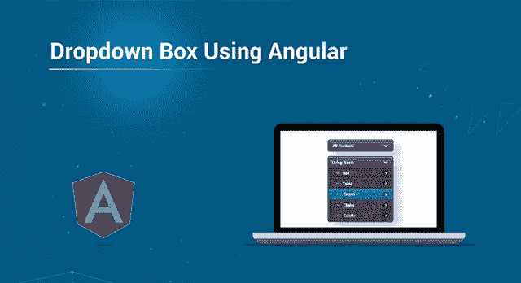
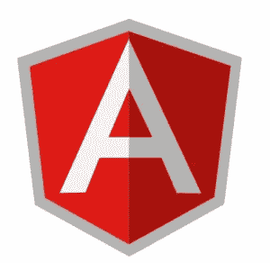
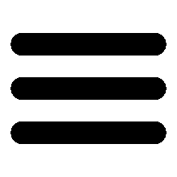

# 如何使用 Angular 创建下拉框？

> 原文：<https://medium.com/edureka/angular-dropdown-a9d6c6073204?source=collection_archive---------0----------------------->



Create Dropdown using Angular — Edureka

学习和完善如何使用 Angular 完成某些日常任务可以很快提升你的职业生涯，尤其是如果你是 web 开发职业的新手。在这篇文章中，我们将讨论这样一个任务，一个开发人员必须做成千上万次:创建一个不起眼的下拉框。本博客将涵盖以下主题:

# 什么是有角？



好吧，如果你正在阅读一个关于如何使用 Angular 制作下拉框的博客，可以假设你已经对 Angular 有了一个大致的概念。对于那些不了解这个博客的人来说，Angular 是一个前端开发框架。它由科技巨头谷歌开发和维护。它提供了一种模块化的方式来开发单页 web 应用程序，如 Gmail、PayPal 和 Lego。使用 Angular 构建的应用程序实现了模型-视图-视图-模型方法。

# 什么是下拉框？



下拉框是一种显示选项数组的简洁方法，因为在用户激活下拉框之前，最初只显示一个选项。要在网页上添加一个下拉框，你可以使用一个*选择*元素或者一个*列表项*。select 元素中的第一个<选项>标签需要将 selected 选项设置为 selected 的值。这里有一小段代码向您展示我的意思。

```
<select name="demo" id="#">
<option selected="selected" value="one">Option 1</option>
<option value="two">Option 2</option>
<option value="three">Option 3</option>
</select>
```

当然，上面的代码需要特定的 javascript 来实现预期的行为，但是下拉菜单的基本框架是一样的。现在让我们看看如何在 Angular 中实现这一点。

# 使用角度的下拉框

老实说，在 angular 中演示所有可能实现下拉框的方法是相当令人畏惧的。每个开发人员的大脑都以自己独特的方式处理逻辑，在我的职业生涯中，我见过一些疯狂的下拉菜单。我将谦虚地向你们展示一个相当基本的下拉菜单方法。

## 方法 1:使用 ng 选项制作下拉列表

您可以使用 ng-options 指令从项目数组或列表中创建下拉菜单。

```
<div ng-app="demo" ng-controller="myCtrl">

<select ng-model="selectedName" ng-options="x for x in names">
</select>

</div>

<script>

var app = angular.module('demo', []);
app.controller('myCtrl', function($scope) {
$scope.names = ["Demavand", "Pradeep", "Ashutosh"];
});
</script>
```

## 方法 2:使用 ng-repeat 制作下拉列表

Angular 是一个通用的框架，显然有多种方法来创建一个基本的下拉菜单。ng-repeat 指令为数组中的每一项重复一段 HTML 代码，它可用于在下拉列表中创建选项，但 ng-options 指令是专门为用选项填充下拉列表而设计的，它有一个重要的优点，即用 ng-options 制作的下拉菜单允许选定的值是一个对象，而用 ng-repeat 制作的下拉菜单必须是一个字符串。

这个特殊的代码片段使用 ng-repeat 实现了相同的列表

```
<div ng-app="demo" ng-controller="myCtrl">

<select>
<option ng-repeat="name in names">{{name}}</option>
</select>

</div>

<script>
var app = angular.module('demo', []);
app.controller('myCtrl', function($scope) {
$scope.names = ["Demavand", "Pradeep", "Ashutosh"];
});
</script>
```

这就把我们带到了这篇相当短的博客“使用 angular 的下拉列表”的结尾。我希望现在你已经知道如何在自己的项目中实现下拉菜单了。如果你想查看更多关于人工智能、Python、道德黑客等市场最热门技术的文章，你可以参考 Edureka 的官方网站。

请留意本系列中的其他文章，它们将解释 Web 开发的各个方面。

> *1。* [*ReactJS 教程*](/edureka/reactjs-tutorial-aa087fd7fc90)
> 
> *2。* [*反应元件*](/edureka/react-components-65dc1d753af5)
> 
> *3。* [*React 路由器 v4 教程*](/edureka/react-router-2aab4e781736)
> 
> *4。* [*React Redux 教程*](/edureka/react-redux-tutorial-2b3d81cfd3f7)
> 
> *5。* [*角度教程*](/edureka/angular-tutorial-for-beginners-4738ce387b03)
> 
> *6。* [*角度指令教程*](/edureka/angular-directive-tutorial-3b203de7948a)
> 
> *7。* [*用 ngAnimate 指令制作 AngularJS 应用程序的动画*](/edureka/animating-angularjs-apps-with-nganimate-directive-510500755b76)
> 
> *8。* [*PHP 教程*](/edureka/php-tutorial-beginners-guide-to-php-f78a189de6f)
> 
> *9。* [*JQuery 教程*](/edureka/jquery-tutorial-for-beginners-679021d74ab4)
> 
> *10。* [*NodeJS 教程*](/edureka/node-js-tutorial-800e03bc596b)
> 
> *11。* [*十大 JavaScript 框架*](/edureka/top-10-javascript-frameworks-3179f1b5bd41)
> 
> *12。* [*使用 Node.js 和 MySQL*](/edureka/node-js-mysql-tutorial-cef7452f2762) 构建 CRUD 应用程序
> 
> *13。* [*使用节点构建 CRUD 应用程序。JS 和 MongoDB*](/edureka/node-js-mongodb-tutorial-fa80b60fb20c)
> 
> *14。* [*用 Node.js 构建 REST API*](/edureka/rest-api-with-node-js-b245e345f7a5)
> 
> 15。 [*最佳 3 种方式制作 Node.js 请求*](/edureka/node-js-requests-6b94862307a2)
> 
> 16。[*HTML vs HTML 5*](/edureka/html-vs-html5-83302f95652e)
> 
> *17。* [*什么是 REST API？*](/edureka/what-is-rest-api-d26ea9000ee6)
> 
> *18。* [*扑 vs 反应原生*](/edureka/flutter-vs-react-native-58133fbf9f33)
> 
> 19。 [*如何对 Node.js App 进行 Dockerize？*](/edureka/node-js-docker-tutorial-72e7542d69d8)

*原载于 2019 年 9 月 5 日*[*https://www.edureka.co*](https://www.edureka.co/blog/angular-dropdown/)*。*