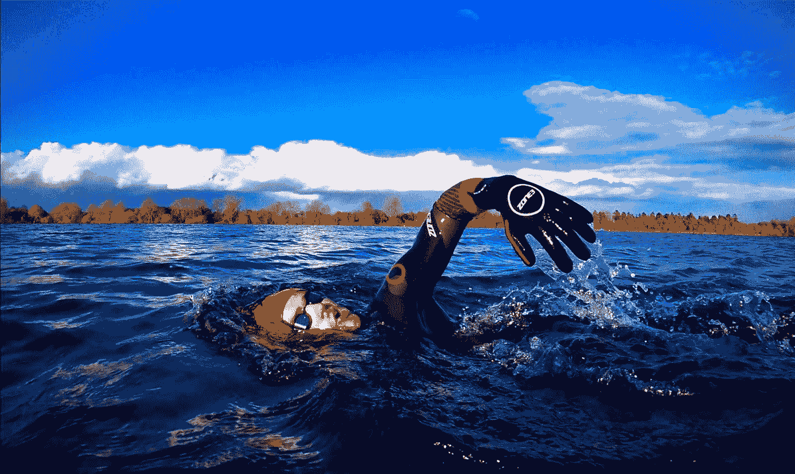

# 棱角分明的 GDE·托德格言鼓励开发者关爱他们的身心

> 原文：<https://medium.com/google-developer-experts/angular-gde-todd-motto-encourages-developers-to-care-for-their-bodies-and-minds-d6a2a1a64416?source=collection_archive---------3----------------------->

*在心理健康宣传月期间，GDEs 关于心理健康的两次采访中的第二次*

*作者凯蒂·金德·沃格尔*

*凯文·埃尔南德斯审核*

棱角分明的 GDE 希望看到人们更自由地谈论心理健康——在科技和生活的其他领域。

“每个人内心都在挣扎，”他说。“我认为谈论它是一件好事。我们的大脑高度复杂，需要维护和良好的燃料。”

托德说，他一生中的大部分时间都在默默地与抑郁和焦虑做斗争，所以对他来说，坦诚面对变得越来越重要。他说忽视感受通常会让事情变得更糟。

“问题是，你可以在生活中认为有这种感觉是正常的，你认为其他人也有这样的糟糕日子，但事情可能会慢慢变得更糟，而你没有意识到，”他说。“我花了很长时间才意识到自己有心理健康问题——有些问题来自我的过去，我用不健康的生活方式来应对这些问题。我在火上浇油，却没有意识到。这就是为什么提高意识对我来说很重要。”

他认为心理健康是一种平衡行为，并认为每天照顾好自己的身体和心灵非常重要。他建议仔细选择你的工作项目和职责，如果可能的话，避免承担太多，并注意你的内在想法。

“重要的是与你的身体和你的思想感觉保持一致，”他说。“我们都会感到压力，但有时我们只是坐在自动驾驶仪上，忽视它。这是时候保护你的心理健康了。关注你的压力水平，因为，至少对我来说，这在我剩下的心理健康中发挥了巨大的作用。”

托德通过仔细管理他的工作量、远离键盘学习新的东西、一天中从工作中抽出时间来应对压力。

“为了应对这种情况，我不会让自己不知所措，我会定期休息，即使只是花 1-2 分钟走进厨房拿水，”他说。“也许我会走进花园，研究一会儿我感兴趣的个人话题。”

他还结合了日常锻炼，如跑步、游泳和举重训练，他说这有助于他的注意力、睡眠和情绪。

“我已经跑步和游泳很多年了，游泳让你有时间远离现实，”他说。“当你身体变得更强壮时，你会释放出新层次的精神力量。这是我的保证。”

托德版本的身体和精神挑战可能是爬山和在湖里游泳，但你的版本可能是在街区周围散步，拿起一种新的乐器，或学习如何做一顿新的饭菜。不管是什么，托德觉得为这些挑战腾出时间很重要，这样才能达到他提到的平衡。他提醒其他开发人员尽可能保持工作、生活、身体和心灵的平衡。

“我的目标是有规律的休息，不要把自己压垮，”他说。“很容易感到压力，工作/生活平衡不好。休息一下，通过这样做来保持你的低压力水平。你太值得了！”

*在 Twitter 上了解更多关于托德的信息* [*@* 托德莫托](https://twitter.com/toddmotto)