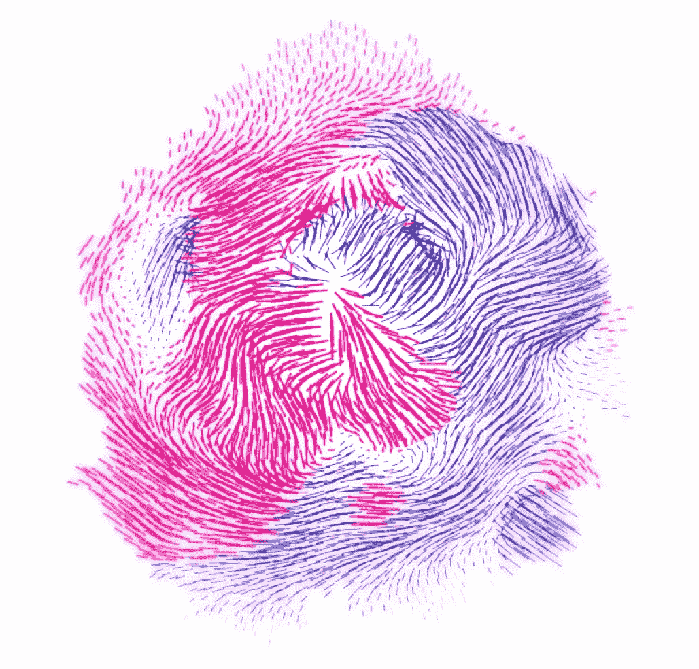

# 角度—反应式延伸(RxJS)简介

> 原文：<https://medium.com/google-developer-experts/angular-introduction-to-reactive-extensions-rxjs-a86a7430a61f?source=collection_archive---------0----------------------->

如何在 AngularJS 中使用可观察序列

[Pt — A code experiment on point, form, and space](http://williamngan.github.io/pt/demo/index.html?name=vector.field).

JavaScript 的 eactive Extensions(RxJS)是一个反应式流库，它允许你使用*异步数据流*。RxJS 既可以在浏览器中使用，也可以使用 Node.js 在服务器端使用。

在这篇文章中，我们将介绍 RxJS 的基本概念，以及如何在 AngularJS 中使用它们。

在推特上关注我的最新消息 [@gerardsans](https://twitter.com/intent/user?screen_name=gerardsans) 。

# 异步数据流到底是什么？

让我们把每个单词分开，放到上下文中。

*   ***异步*** ，在 JavaScript 中的意思是我们可以调用一个函数并注册一个*回调*以便在结果可用时得到通知，这样我们就可以继续执行并避免网页无响应。这用于 ajax 调用、DOM 事件、承诺、WebWorkers 和 WebSockets。
*   ***数据*** ，JavaScript 数据类型形式的原始信息为:数字、字符串、对象(数组、集合、映射)。
*   ***Streams*** ，一段时间内可用的数据序列。举个例子，与数组相反，你不需要所有的信息都存在就可以开始使用它们。

异步数据流并不新鲜。它们在 Unix 系统中就已经存在，并且有不同的风格和名称:streams (Node.js)、pipes (Unix)或 async pipes (Angular 2)。

# 可观察序列

在 RxJS 中，你使用可观察序列或者简称为可观察序列来表示*异步数据流*。Observables 非常灵活，可以使用推或拉模式。

*   当使用 ***推送模式****时，我们**订阅**源数据流，并在新数据可用(发出)时立即做出反应。*
*   *当使用 ***拉模式****时，我们使用相同的操作，但同步进行。使用数组、生成器或可迭代对象时会发生这种情况。**

> **🐒可观察序列允许我们使用**推**和**拉**模式**

## **基本示例**

**让我们从角度控制器中的一个简单的可观测序列开始。看它在这个[扑通](http://embed.plnkr.co/ZRxNQfB0DEuUNNlhlScU/preview)跑。**

**在这个例子中，我们使用了一个 ***可观察的*** (rx。可观察到的)，后面是一连串的**操作符**，以调用 **subscribe** 结束。**

**第一个操作员等待 1 秒钟，并从 0 ( [间隔](https://github.com/Reactive-Extensions/RxJS/blob/master/doc/api/core/operators/interval.md)，延迟设置为毫秒)开始发出数值(无限期)。第二个操作员负责前三个项目([负责](https://github.com/Reactive-Extensions/RxJS/blob/master/doc/api/core/operators/take.md))。第三个操作符，一个助手方法，让我们使用当前作用域为每个值设置*计数器*([safe apply](https://github.com/Reactive-Extensions/rx.angular.js/blob/master/src/safeApply.js)使用$scope)。$仅在必要时适用)。最后，对 [subscribe](https://github.com/Reactive-Extensions/RxJS/blob/master/doc/api/core/operators/subscribe.md) 的调用触发了执行。**

**我们也可以用一个 ASCII [大理石图](http://rxmarbles.com/)来描述它:**

**从上图中可以看出，每个操作符都创建了一个新的流，我们也可以单独引用它。**

> **🐒可观测量编程有两个独立的阶段:设置和执行。**

# **可观测量和算子**

**RxJS 结合了**观察值**和**操作符**，因此我们可以订阅流并使用可组合操作对变化做出反应。让我们更详细地介绍这些概念。**

## **可观察的人/观察者**

**可观察对象的名字来源于[观察者](http://addyosmani.com/resources/essentialjsdesignpatterns/book/#observerpatternjavascript)设计模式。 ***可观察*** 发送通知，而 ***观察者*** 接收通知。让我们创建一个简单的观察器。**

**当调用 ***subscribe*** 时，或者通过在 Next 上传递*、在 Error* 上传递*和在 Completed* 回调上传递*可以传递您的观察者。这些是他们的行为:***

*   ***onNext* ，为可观测序列中的每个元素调用。**
*   ***onError* ，出错时只调用一次。**
*   ***onCompleted* ，流结束时只调用一次。**

**如果我们想停止收听更改，我们可以通过获取引用和清理$destroy 来*。***

## ***经营者***

***我们已经看过一些了。这些是主要的类别:创建、转换、合并、函数、数学、时间、异常、杂项、选择和原语。你可以在这里探索它们[。](https://github.com/Reactive-Extensions/RxJS/blob/master/doc/gettingstarted/categories.md)***

***最常见的一个列表:[合并](https://github.com/Reactive-Extensions/RxJS/blob/master/doc/api/core/operators/merge.md) [@](http://rxmarbles.com/#merge) 、[串联](https://github.com/Reactive-Extensions/RxJS/blob/master/doc/api/core/operators/concat.md)@、[延期](https://github.com/Reactive-Extensions/RxJS/blob/master/doc/api/core/operators/defer.md)、[做](https://github.com/Reactive-Extensions/RxJS/blob/master/doc/api/core/operators/do.md)、[映射](https://github.com/Reactive-Extensions/RxJS/blob/master/doc/api/core/operators/select.md) [@](http://rxmarbles.com/#map) 、 [flatMapLatest](https://github.com/Reactive-Extensions/RxJS/blob/master/doc/api/core/operators/flatmaplatest.md) 、 [fromPromise](https://github.com/Reactive-Extensions/RxJS/blob/master/doc/api/core/operators/frompromise.md) 、 [fromEvent](https://github.com/Reactive-Extensions/RxJS/blob/master/doc/api/core/operators/fromevent.md) 、[take unt](https://github.com/Reactive-Extensions/RxJS/blob/f8f795636119143f51fc249d719bdbde1875970c/doc/api/core/operators/takeuntil.md)[@](http://rxmarbles.com/#takeUntil)、、***

***我们已经看到了可观测量和算符是多么强大的组合。让我们看看如何在 Angular 中使用它们。***

# ***带角度的集成***

***RxJS 与 Angular 配合得很好，但是您可以使用 RxJS 和 AngularJS 互操作性的专用库 [rx.angular.js](https://github.com/Reactive-Extensions/rx.angular.js) ，而不是编写自己的助手函数来桥接这两者。***

***让我们看一个集成的例子:范围、承诺和 DOM 事件。***

## ***与范围的集成***

***使用[***observe scope***](https://github.com/Reactive-Extensions/rx.angular.js/tree/ed5446861863b8048d54889d8bfd8f1f80214a47/docs#observeonscopescope-watchexpression-objectequality)**w*e 可以取一个 *$watch* 表达式，将其转化为可观察的*。*让我们用一个使用搜索框查询维基百科文章的例子。****

**该示例将对 *$scope.search* 进行更改，并在用户键入时发出如下对象**

**我们使用的第一个操作符是 [throttle](https://github.com/Reactive-Extensions/RxJS/blob/5a37fa289eb88f14d020dd88b7a72cc1f2a75da8/doc/api/core/operators/throttle.md) ，它延迟请求，这样我们就不会在用户输入时让服务器过载。然后我们使用[映射](https://github.com/Reactive-Extensions/RxJS/blob/master/doc/api/core/operators/select.md)只取*新值*或者空字符串(如果*未定义*)。我们不想使用相同的术语重复查询，所以我们使用了 [distinctUntilChanged](https://github.com/Reactive-Extensions/RxJS/blob/a2633f3323b2104a3714cdb4e068b29bb9c76d32/doc/api/core/operators/distinctuntilchanged.md) 。之后，我们使用了 [flatMapLatest](https://github.com/Reactive-Extensions/RxJS/blob/master/doc/api/core/operators/flatmaplatest.md) ，所以我们只取最新的结果，忽略无序和未完成的 ajax 调用。最后我们把结果放进了示波器。试着用这个[敲击器](http://embed.plnkr.co/P8dELQZ6HlglomXSvOcj/preview)移除一些操作器。**

## **承诺**

**承诺对于一次性异步操作非常有帮助。如果你需要一个快速概览，你可以阅读这篇文章。**

** [## 棱角——承诺基础

### $http 的$q 服务

medium.com](/p/8ecee75d2ffe) 

从 2.2 版本开始，RxJS 集成了使用 [***Rx 的承诺。***](https://github.com/Reactive-Extensions/RxJS/blob/master/doc/api/core/operators/frompromise.md) 。请参见下面的示例:

该函数返回一个可观察值，该值将在承诺的结果可用时发出。与 [flatMapLatest](https://github.com/Reactive-Extensions/RxJS/blob/master/doc/api/core/operators/flatmaplatest.md) 一起使用会产生一个只包含最新值而忽略其余值的可观察值。你可以在这里找到一个很好的图解。

## DOM-事件

RxJS 的另一个常见用例是 DOM 事件。让我们使用 RxJS 和 Angular 构建一个简单的空闲用户特性。为了使用 DOM 事件，我们将使用 *Rx。DOM*([RxJS](https://github.com/Reactive-Extensions/RxJS-DOM)的 HTML DOM 绑定)到 *rx.angular* 。

> Rx。DOM 必须单独包含，但包括事件绑定、Ajax 请求、Web 套接字、Web Workers、服务器发送的事件甚至地理位置。

在上面的代码中，我们检测到用户空闲了 5 秒钟。为了做到这一点，我们合并了来自击键、鼠标(点击、移动、滚动)和轻击(对于移动用户)的事件。

然后，我们将所有事件缓冲 5 秒钟( [bufferWithTime](https://github.com/Reactive-Extensions/RxJS/blob/f8f795636119143f51fc249d719bdbde1875970c/doc/api/core/operators/bufferwithtime.md) 毫秒)，并检查结果序列何时为空，这样我们就可以假设用户处于空闲状态( [filter](https://github.com/Reactive-Extensions/RxJS/blob/master/doc/api/core/operators/where.md) )。subscribe 内部的逻辑是一个简单的对话框，要求用户继续工作或退出。你可以在这个 [Plunker](http://embed.plnkr.co/x7ytJd4G6O1WX8t9lfXm/preview) 中找到一个使用指令的工作示例。

# 反应式编程

我们刚刚开始触及表面，反应式编程是一种范式，异步数据流几乎可以在任何地方使用。一切都是溪流。跟我重复！

希望你有足够的信息继续自己探索 RxJS。感谢阅读！有什么问题吗？在 [@gerardsans](https://twitter.com/intent/user?screen_name=gerardsans) 上 Ping 我

 [## 安古拉宗社区

### 欢迎来到我们的社区。我们的激情是有棱角的。加入我们吧！🚀](http://www.meetup.com/AngularZone/) 

# 更多资源

*   [你错过的反应式编程入门](https://gist.github.com/staltz/868e7e9bc2a7b8c1f754)，作者**安德烈·斯塔尔茨**@安德烈·斯塔尔茨
*   [RxJS 在线书籍](http://xgrommx.github.io/rx-book/index.html)，作者丹尼斯·斯托扬诺夫 [@xgrommx](https://twitter.com/xgrommx)
*   [AngularJS 绑定为 RxJS](https://github.com/Reactive-Extensions/rx.angular.js) ，作者**Matthew Podwysocki**[@ mattpodwysocki](https://twitter.com/mattpodwysocki)[GitHub](https://github.com/mattpodwysocki)
*   [牛逼的 JavaScript 数组方法](http://jilles.me/awesome-javascript-array-methods/)，由**Jilles Soeters**[@ Jilles](https://twitter.com/jilles)

**