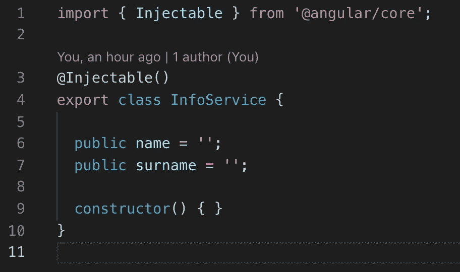

# 使用角度模块组织项目

> 原文：<https://medium.com/quick-code/angular-module-5c265c7950a9?source=collection_archive---------0----------------------->

## 角度指南

## angular module——是内聚代码块的容器。它可以包含组件、服务提供者、管道等等。

在某个时候，我们的项目变得非常大。我们需要保持我们的项目有序，为此，我们必须将我们的项目分成小部分，这意味着我们需要创建层次结构和创建模块。

Module hierarchy

每个项目至少有一个模块，它把“根模块”称为“AppModule”。

AppModule

如果我们想创建一个模块，我们必须在上面写上关键字“NgModule”。

每个模块都包含这些属性:

*   `declarations`:属于这个模块的组件、指令和管道。
*   `exports`:应该在其他模块的组件模板中可见和可用的声明子集。
*   `imports`:该模块声明的组件模板需要其导出类的其他模块。
*   `providers`:该模块贡献给全球服务集合的服务的创建者；在应用程序的所有部分都可以访问它们。
*   `bootstrap`:主应用视图，称为根组件，托管所有其他应用视图。只有根模块应该设置 bootstrap 属性。

在“导入”属性中，我们使用“BrowserModule”，这个模块与浏览器一起工作，我们需要他在我们的“根模块”中。

让我们创建一个包含三个模块的小项目。在第一个模块中，我们将显示有关用户的信息(姓名)，在第二个模块中，我们将能够编辑有关用户的信息，第三个将是一个切换器，它将使出现或绝望组件，我们可以看到有关用户的信息。

FirstModule

在“declarations”属性中，我们添加了“ShowInfoComponent ”,因为我们在这里声明了他，我们还将他添加到“exports”属性中，因为我们想让他对其他组件可见。
在 imports 中，我们添加了“CommonModule ”,这个模块包含了很多其他服务，有助于在我们需要的浏览器中渲染 Angular 应用程序。
在“providers”属性中，我们使用“InfoService ”,该服务包含有关用户的信息，我们将在其他组件中编辑这些信息。

InfoService

“第二模块”将与“第一模块”非常相似。在“imports”属性中，我们添加了“FormsModule ”,因为我们在 HTML 文件中使用了“ngModel”。

SecondModule

第三个模块更有趣。该模块在“import”属性中包含“FirstModule ”,因为我们使用了“app-showinfo”标记，我们在该模块中声明了该标记，并使它对其他组件可见。

ThirdModule

最后但同样重要的是，我们必须更新我们的“应用模块”。我们需要在“imports”属性中添加“ThirdModule”和“SecondModule ”,因为在“AppComponent”中，我们将使用“app-switcher”和“app-editinfo”标记，它们是在这些模块中声明的。

Updated AppModule

此外，我们的文件夹层次结构看起来非常有组织。

Folder hierarchy

这是我们如何在你的项目中使用角度模块的一个小例子。所以 Angular Module 是一个类，它包含了其他类的定义，这些类相互关联，使我们的项目更加有组织。

如果你需要仔细看看项目[，这里有一个链接](https://github.com/8Tesla8/singleton-service-angular)。

*原载于 2019 年 5 月 11 日*[*【http://tomorrowmeannever.wordpress.com*](https://tomorrowmeannever.wordpress.com/2019/05/11/angular-module/)*。*