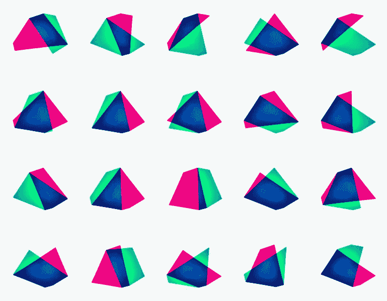

# angular—新的命名准则

> 原文：<https://medium.com/google-developer-experts/angular-new-naming-guidelines-eacbebd09363?source=collection_archive---------2----------------------->

关于在线命名角度内容的最新建议

[Brussels — The hybrid city (edited)](https://www.behance.net/gallery/13320385/Brussels-The-Hybrid-City)

在这篇文章中，我想提高一些关于最新的角内容命名指南的意识。上周，Angular 团队发布了适用于 Angular 品牌的新指南，并作为 Angular 社区内容创作者的扩展:在线教程、博客帖子、视频等。

这将影响 Angular 团队如何参考 Angular 1.x 和 Angular 2+版本的项目和对第三方的建议。

您可以在下面的原始公告中阅读更多详细信息。

 [## 棱角分明的品牌指南

### 去年 9 月，我们发布了几项重大公告。我们发布了 Angular 的 2.0.0 版本，我们…

angularjs.blogspot.co.uk](http://angularjs.blogspot.co.uk/2017/01/branding-guidelines-for-angular-and.html) 

在 [@gerardsans](https://twitter.com/intent/user?screen_name=gerardsans) 找到我的最新观点。

# 新的角度命名指南

让我们分别回顾一下每个选项，并给出截至今天的使用建议。

## 被推荐的

*   **AngularJS for content 1 . x 发布**。
*   **角度为 2+内容释放**。

## 不推荐

*   **Angular 1 for content for 1.x 发布**。
*   **角度 2 为 2+内容发布**。

Angular 团队提供了一些关于这些和其他指导方针的例子。检查[压具](https://angular.io/presskit.html)。

# 角状材料

遵循这些指南，角形材料将分别使用**角形材料**和**角形材料**。

 [## 角状材料

### 从零冲刺到 App。使用可在 web、移动设备和桌面上工作的全面、现代的 UI 组件立即投入运行

材料.角度. io](https://material.angular.io/)  [## 棱角材料

### 对于使用 AngularJS 的开发者来说，Angular Material 既是一个 UI 组件框架，也是 Google 的 Material 设计规范的参考实现。

material.angularjs.org](https://material.angularjs.org/latest/) 

# 新角度内容

对于任何新内容，遵循上面的命名准则是正确的。为了在搜索结果中获得更好的排名，我个人的建议是以某种方式包含主要版本。例如，当 Angular (v4)可用时，将主要版本添加到您的内容将会排名更好，也便于更具体的搜索。

# 总结

我希望我给这个话题带来了一些启发，让更多的人意识到这一点，这样我们就可以更快地完成命名角度的转变。

仅此而已！觉得我错过了什么吗？通过 [@gerardsans](https://twitter.com/intent/user?screen_name=gerardsans) 或 gerard.sans_at_gmail.com 联系我，感谢阅读！

 [## 安古拉宗社区

### 欢迎来到我们的社区。我们的激情是有棱角的。加入我们吧！🚀](http://www.meetup.com/AngularZone/) 