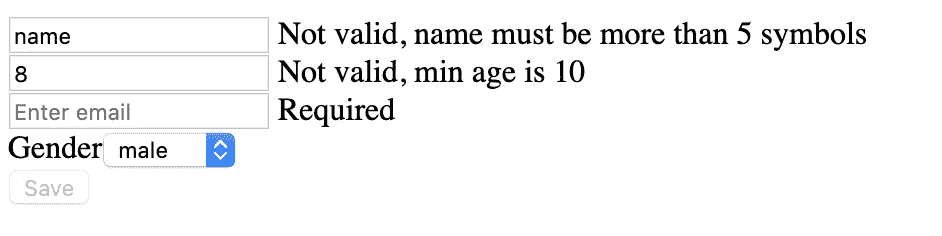

# 具有角反应形式的更好的 UX 更好的编码

> 原文：<https://medium.com/quick-code/angular-reactive-forms-e2b8626db2b8?source=collection_archive---------0----------------------->

## 角度指南

## 反应形式

我们都出于不同的原因填写表格。很难想象我们没有形式的生活。你想在这个网站上注册填表格，你想参加音乐会填表格。

Angular 有一些非常方便的工具，我们可以在创建表单时使用。

让我们创建一个简单的注册表单，有两个输入和一个提交按钮。

Simple form

在第 5 行，我们定义了表单的名称(userlogin)和提交动作处理程序(onClickSubmit)。“onClickSubmit”是一个在组件中定义的方法，它采用一个表单值。在这种方法中，我们可以验证传递的数据，如果无效，则显示错误。此外，每个输入都有一个属性' ngModel '，这是非常重要的，没有它我们的形式将无法正常工作。

必须在“AppModule”的“imports”部分声明 FormsModule。

FormsModule on line 17

我们不想在服务器上发送空数据，我们必须检查它们。

Method ‘onClickSubmit’

验证输入中的数据不是一个好的解决方案。与其这样做，不如让我们看看在“反应式模块”中可以使用什么。在这个模型中，我们将找到一些方便的工具。

首先，我们需要在“AppModule”的“import”部分添加此模块。

ReactiveFormsModule on line 18

之后，我们需要创建另一个表单。

Another form

每个字段都有自己的 formControlName。该表单中的所有字段都必须填写，而不是检查每个属性，如果表单无效，让我们禁用提交按钮。

有时我们需要在几种情况下检查数据。在 Angular 'FormControl '的构造函数中，我们可以传递一个验证器数组。

Validators are set up

如果用户在输入中填入了不正确的数据，我们必须说出来。

Label with messages

每个输入都有一个标签，如果用户输入的数据不正确，标签就会显示出来。form group“userInfo”有一个控件数组。属性' touched '告诉我们，当用户与输入交互时，如果我们在' if '条件下不使用该属性，用户将在执行某项操作之前看到此消息。属性“无效”告诉我们数据何时无效。

Result

如果你需要仔细查看项目[，这里有](https://github.com/8Tesla8/tree-view-angular)[链接](https://github.com/8Tesla8/tree-view-angular)。

*原载于 2019 年 6 月 22 日*[*http://tomorrowmeannever.wordpress.com*](https://tomorrowmeannever.wordpress.com/2019/06/22/angular-reactive-forms/)*。*