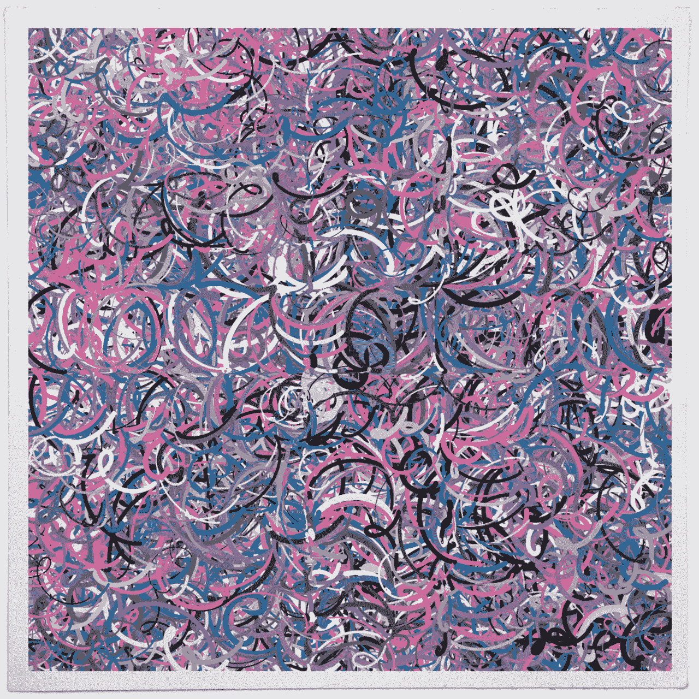
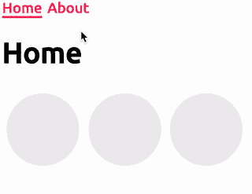
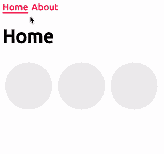
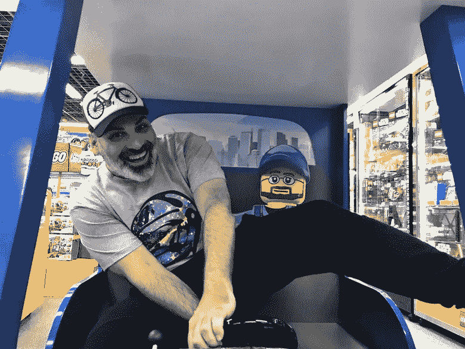
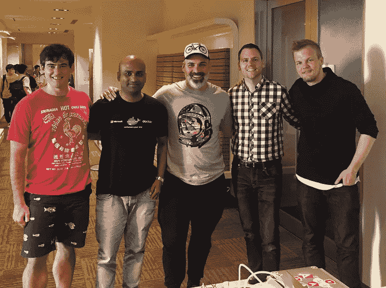
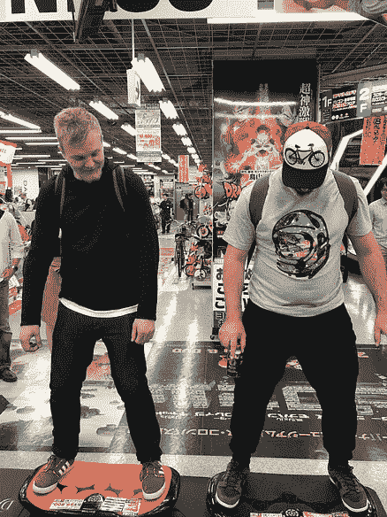
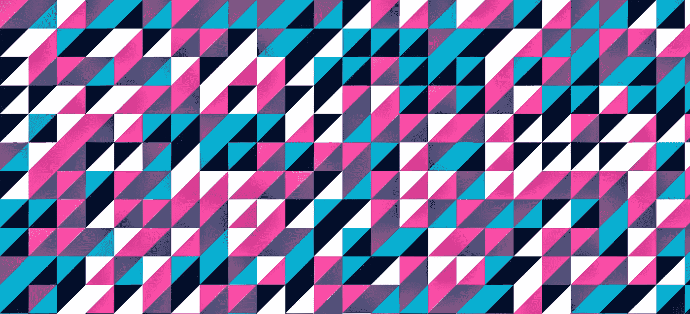

# 角度-使用动画增强路由器过渡

> 原文：<https://medium.com/google-developer-experts/angular-supercharge-your-router-transitions-using-new-animation-features-v4-3-3eb341ede6c8?source=collection_archive---------0----------------------->

如何使用 Angular 中的新动画功能制作应用路由器过渡动画



[thedotisblack](https://twitter.com/DavidMrugala)

几个月前，我与你分享了一个实验技术来制作**路由器转换**的动画。从那以后，很少有版本引入新的特性。今天，我们可以用更少的代码更优雅地实现同样的结果。让我们看看如何使用它们来创建前所未有的过渡！

使用以下链接运行演示:

[基本](https://stackblitz.com/edit/angular-motion-v6-a?file=app%2Frouter.animations.ts) | [变异](https://stackblitz.com/edit/angular-motion-v6-b?file=app/router.animations.ts) | [错开](https://stackblitz.com/edit/angular-motion-v6-c?file=app/router.animations.ts) | [最终](https://stackblitz.com/edit/angular-motion-v6-final?file=app%2Fhome.component.ts)

在 [@gerardsans](https://twitter.com/intent/user?screen_name=gerardsans) 找到我的最新观点。

# 演示应用程序

为了解释这种新方法，我们将使用一个只有两部分的简单应用程序:Home 和 About。我们将实现一个很酷的**路由器过渡**，将内容向左滑动，并使用**交错**，如下图所示。


Awesome Router transitions

# 动画设置

从 **Angular v4** 动画开始，它们存在于一个单独的包中，所以如果你不需要它们，你可以让你的应用程序变小。

首先，你需要给你的项目添加以下依赖:`@angular/animations`和`@angular/platform-browser/animations`。接下来，将`BrowserAnimationsModule`包含到您的根模块中(第 3 行和第 6 行)。

> 如果需要使用[原生不支持网页动画 API](http://caniuse.com/#feat=web-animation) 的浏览器:IE/Edge、Safari 等；您必须包括[网络动画聚合填充](https://github.com/web-animations/web-animations-js)。

正如我们已经看到的，我们的演示应用程序将由一个顶部导航和主要内容组成。顶部导航将在各部分之间共享(第 4-7 行)。我们使用`router-outlet` 元素告诉路由器，当与路由匹配时，我们希望在哪里呈现组件(第 9 行)。

我们使用**静态路线**来创建不同的**导航链接**(第 5-6 行)。为了设计当前部分的样式，我们使用了`routerLinkActive`指令。例如，当我们导航到 **Home** 时，它会添加`active`类并相应地改变渲染。

```
<a href="#/home" **class="active"**>Home</a>
```

# 添加路由器转换

让我们更改默认设置，引入**路由器转换**。首先，我们需要将动画触发器`routerTransition`添加到组件元数据中(第 3 行)。然后，我们可以将`@routerTransition`绑定到**主**元素中，这样稍后，我们可以对路由器实例化的内部**路由组件**进行样式化(第 5 行)。

> 只要是 router-outlet 的父级，就可以使用 div 或任何其他元素来代替 main。

我们使用`getState`传递出口引用(第 6 行)来设置正确的状态。该函数将返回路线定义中设置的`state`属性。我们将在下一节看到这一点。这种配置将允许我们控制为每条路线执行哪个转换。

> 注意:我们可以通过使用`#o=”outlet”`来获得插座参考。由于在[路由器-出口定义](https://github.com/angular/angular/blob/4.3.1/packages/router/src/directives/router_outlet.ts#L39)中使用了**出口**，这是可能的。这种组合让我们可以快速访问底层的**route outlet**类。

# 设置路线

在 Angular 中，路由器会按照设置期间使用的相同顺序，尝试将路由定义与当前 url 进行匹配。

主路由(第 3–4 行)告诉路由器，当导航与它们各自的路径匹配时，实例化 **Home** 和 **About** 组件。注意`data`属性将每个**状态**设置为相应的路线。这些状态必须与我们的`routerTransition`触发器中定义的转换相匹配。

我们还使用了两个**特殊路线**用于常见行为。带有**空路径**的路线(第 2 行)覆盖了**默认路线**，该路线将为空，除非我们导航到特定的 url。在这种情况下，我们指示使用归途进行重定向。**否则路由**(第 5 行)，它将捕捉任何打字错误或未定义的路由，显示用户友好的 404 页面。

对于这个演示，由于 Plunker，我们使用了**散列位置策略**(第 9 行)。如果我们可以访问后端，我们也可以使用**路径定位策略**。这需要将未定义的路由重定向到**index.html**以避免来自服务器的 404 错误。

# 角度动画

下面简单介绍一下角度动画。Angular 基于 [Web Animations API](https://w3c.github.io/web-animations/) ，我们使用**动画触发器**来定义一系列**状态**和状态之间的**转换**。我们使用**样式**来帮助我们使用 **CSS 属性**构建想要的效果。

动画背后的**主要原理**是，一旦我们使用样式设置了**初始状态**和**最终状态**，中间状态就会被计算出来。


Who else to explain animations better than the party parrot!? 😃

我们可以用秒或毫秒来设置动画的持续时间。例如:1 秒，1.2 秒，200 毫秒。有时我们可能还想控制**计时功能**，它设置计算中间步长**补间**的速度。默认定时为`ease`；其他常见的值有`linear`或`ease-in-out`。你可以用这个由 [Lea Verou](https://twitter.com/leaverou) 创造的[工具](http://cubic-bezier.com/)玩一些其他的选项。

由于 **Angular v4.2+** 我们也可以使用**序列**和**组**一个接一个或并行运行动画；并且**查询**以访问子元素，而**交错**以创建良好链接的编排。

这些事件将触发动画:

*   将元素附着到视图或从视图中分离元素
*   改变绑定到触发器的**状态**。例:`[@routerTransition]=”home”`。

在**路由器转换**的上下文中，请注意，作为导航的一部分，组件被移除并添加到视图中。

# 动画定义

首先让我们看看如何使用**角度动画**将内容向左滑动。



Basic Router transition

最初，我们将触发器定义为`routerTransition`(第 3 行)。在这个实现中，我们使用了一个覆盖所有可能状态的通用转换(第 4-17 行)。这是对使用两个独立转换的重构:`‘* => home’`和`‘* => about’`。

> 我们可以在我们的转换中使用两个特殊的状态`void`和`*`(星号)，它们代表:一个还没有附加到视图的元素和任何可能的状态。

我们为通用转换定义了几个项目，它们将按照用作第二个参数的数组中的定义顺序执行(第 4 行)。

第一个(第 6-7 行)使用新的**查询**命令来选择新的路由组件和离开的路由组件；**查询**期望 CSS 选择器作为第一个参数，包括一些特殊的关键字，如`:enter`、`:leave`、**、**和`*`。

在第一个查询中，`:enter` 和`:leave` 将匹配**被附加到视图或从视图中移除的路线组件**。注意我们如何使用多个选择器并用逗号分隔它们(第 6 行)。一旦我们有了这些**路线组件**，我们就设置它们的样式来实现滑动效果(第 6 行)。通过使用`{ position: fixed }`，组件将被放置在视窗中，并在页面中滑动。

接下来，我们有一个**组**，它将使内部动画并行运行。

假设我们正从**家**导航到**关于**。第一个查询将匹配正在添加的组件(`:enter`)，也就是关于组件的**。我们首先设置一个初始样式，将组件放在最右边(第 10 行)。然后，我们设置动画，用一个缓动功能和持续时间将它滑动到最终位置(第 11 行)。结果将是关于组件**的**从右向左滑动。对于第二个查询，我们使用了类似的方法，使用(`:leave`)匹配同样向左滑动的 **Home 组件**。**

> CSS 提示:为了更好的表现，我们使用**变换**而不是**上**、**下**、**左**、**右**。

请注意，**路由器转换**的实现不同于动画中的用例，在动画中，我们将触发器绑定到想要制作动画的元素。这意味着我们不能使用状态来设置**路由组件**的样式，因为那样会将样式应用到父元素(我们示例中的主元素)而不是**路由组件**。

> 在路由器初始化期间，一些查询返回空结果，为了避免抛出错误，我们在所有查询中设置了可选的参数。

# 添加交错

一旦我们有了基本的设置工作，我们可以很容易地添加新的效果结合**查询**和**交错**。



```
export const routerTransition = trigger('routerTransition', [
  transition('* <=> *', [
    /* order */
    /* 1 */ query(':enter, :leave', ...),
    /* 2 */ query('.block', style({ **opacity: 0** })),
    /* 3 */ **group**([  // block executes in parallel
      query(':enter', [...]),
      query(':leave', [...]),
    ]),
    /* 4 */ query(':enter .block', **stagger**(**400**, [
      style({ transform: 'translateY(100px)' }),
      animate('1s ease-in-out', 
        style({ transform: 'translateY(0px)', **opacity: 1** })),
    ])),
  ])
])
```

最后，我们结合**变换**和**不透明度**来垂直向上滑动一些元素并淡入它们。通过使用**交错**，我们给每个动画引入了一个小的延迟(以毫秒计),创造了一个漂亮的幕帘效果。最后要注意的是，我们必须引入一个新的查询来用(`opacity: 0`)初始化`.block`元素，这样当组件滑入时它们就不会显示出来。

# 最后一步

最后，我添加了一些代码来扭转离开 **Home 组件**时的交错，还添加了一些**三次贝塞尔函数**来获得额外的闪光。见下文


Final Solution!

# 特别提及

这篇文章中展示的实现与马蒂亚斯·涅梅尔在这篇博客文章和他在日本的幻灯片中所解释的是一样的。

[](http://slides.yearofmoo.com/ng-japan-2017-slides/) [## 角度动画

### 从“@angular/core”导入{ Component }；从“@angular/animations”导入{style，animate，transition，trigger }；…

slides.yearofmoo.com](http://slides.yearofmoo.com/ng-japan-2017-slides/) 

Pictures from last ngJapan

仅此而已！觉得我错过了什么吗？请通过 [@gerardsans](https://twitter.com/intent/user?screen_name=gerardsans) 或 gerard.sans_at_gmail.com 联系我。感谢阅读！

[](http://www.meetup.com/AngularZone/) [## 安古拉宗社区

### 欢迎来到我们的社区。我们的激情是有棱角的。加入我们吧！🚀](http://www.meetup.com/AngularZone/) [](https://twitter.com/intent/user?screen_name=gerardsans)