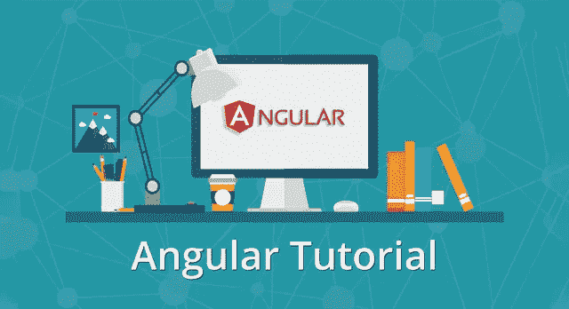
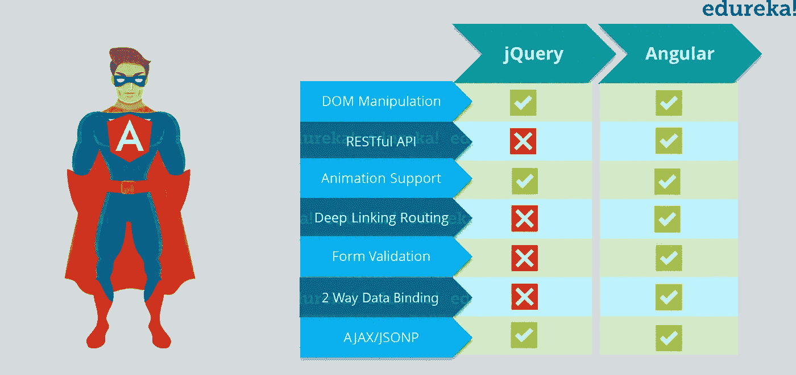
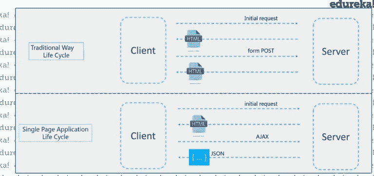
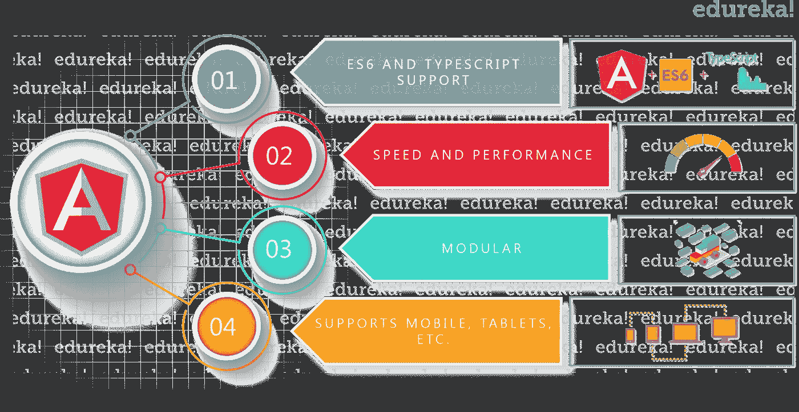
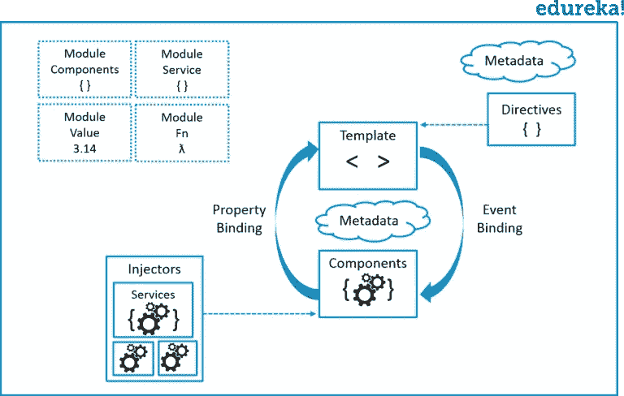
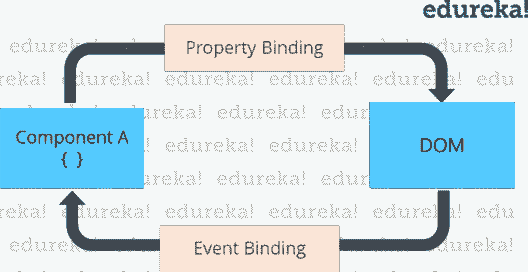
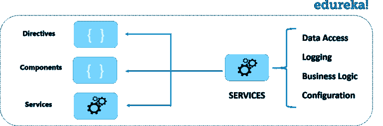
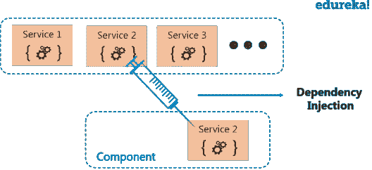

# Angular 4 综合指南

> 原文：<https://medium.com/edureka/angular-tutorial-for-beginners-4738ce387b03?source=collection_archive---------0----------------------->



Angular Tutorial — Edureka

在阅读这篇有角度的教程文章之前，我想提醒您一点。你一定经历过许多反应灵敏、动态的网络和移动应用程序。它不会重新加载整个页面，而是只重新加载所需的部分。例如 *Gmail* ，你可能已经注意到，当你点击一封电子邮件时，它只会在正文部分重新加载该邮件，而不会检索页面的其他部分，如侧边和导航栏。这类应用程序是 SPA(单页应用程序),是使用 Angular 开发的。一些最受欢迎的例子是网飞，贝宝，自由职业者等。

在本文中，我们将讨论 Angular 的演变，然后继续，我们将了解 Angular 的构建模块。我们将讨论 Angular，而不是 Angular 2 或 Angular 4，因为从 Angular 2 开始，Angular 社区已经决定将 Angular 的任何版本都称为*。在这篇有角度的教程文章中，我们将涵盖:*

*   *角度的演变*
*   *AngularJS 和 Angular 的区别*
*   *角度特征*
*   *棱角分明的建筑材料*
*   *模块*
*   *成分*
*   *模板*
*   *[计]元数据*
*   *数据绑定*
*   *指令*
*   *服务*
*   *依赖注入*

*让我们向前看，并试图了解角的演变。*

# *角度的演变*

*Angular 是一个基于 JavaScript 的开源框架，用于构建客户端 web 应用程序。所以，让我们先来了解一下 Javascript。JavaScript 运行在 web 的客户端，可用于设计或编程网页在事件发生时的行为。通常，JavaScript 用于界面交互、幻灯片和其他交互组件。JavaScript 发展很快，也已经用于服务器端编程(如 Node.js)、游戏开发等。*

*JavaScript 处理动态内容，这是 web 开发的一个重要方面。动态内容是指不断变化的内容，它适应特定的用户。例如，JavaScript 可用于通过检查正在访问网站的设备来确定是否呈现网站的移动版本。*

*这鼓励了 web 开发人员开始创建他们自己的定制 JavaScript 库，以减少代码行的数量并轻松实现复杂的功能。jQuery 是一个快速、小巧、功能丰富的 JavaScript 库，它通过一个易于使用的 API 使 HTML 文档遍历和操作、事件处理、动画和 Ajax 变得更加简单。jQuery 成为最受欢迎的一个，因为它易于使用并且非常强大。*

*由于 jQuery 没有真正的结构，开发人员可以完全自由地构建他们认为合适的项目。然而，缺乏结构也意味着更容易陷入“意大利面条式代码”的陷阱，这可能会在没有明确设计方向或代码可维护性的大型项目中导致混乱。对于这些情况，像 Angular 这样的框架会有很大的帮助。*

**

*Angular 是一个客户端 JavaScript 框架，专门用于帮助开发人员根据 web 开发的最佳实践构建 SPAs(单页应用程序)。通过为构建 spa 提供结构化的环境，产生“意大利面条式代码”的风险大大降低了。所以，你一定想知道什么是 SPA？*

****单页应用*** (或 ***SPA*** )是通过网络浏览器访问的应用，像其他网站一样，但提供更动态的交互，类似于本地移动和桌面应用。普通网站和 SPA 最显著的区别是减少了页面刷新次数。SPAs 大量使用 AJAX——这是一种与后端服务器通信的方式，无需刷新整个页面就可以将数据加载到我们的应用程序中。因此，呈现页面的过程大部分发生在客户端。*

**

*例如，如果你浏览 Gmail，你会注意到当从收件箱打开邮件时，只会获取电子邮件并显示在电子邮件列表中。其余的组件，如侧边栏，导航栏等。不会重新加载。它只刷新所需部分的 DOM(文档对象模型)。所以，这减少了网站的开销。*

*现在我们知道了什么是 Javascript & JQuery，以及 angular 是如何出现的。在本文中，我们将浏览 angular 的特性，并理解如何使用 Angular。*

# *角度教程*

*Angular 是一个基于打字稿的开源前端 web 应用程序平台，由 Google 的 Angular 团队和一个由个人和公司组成的社区领导。Angular 是由构建 AngularJS 的同一个团队完全重写的。但是我告诉你，Angular 和 AngularJS 是完全不同的。让我们理解角形和棱形的区别。*

# *有角的和有角的区别*

*   *Angular 应用程序的架构不同于 AngularJS。Angular 的主要构建块是模块、组件、模板、元数据、数据绑定、指令、服务和依赖注入。我们一会儿将会看到它。*
*   *Angular 完全改写了 AngularJS。*
*   *Angular 没有“范围”或控制器的概念，相反，它使用组件的层次结构作为其主要的架构概念。*
*   *Angular 的表达式语法更简单，侧重于“[ ]”用于属性绑定，而“()”用于事件绑定*
*   ***移动开发** —首先解决移动性能问题，桌面开发就会容易得多。因此，Angular 首先处理移动开发。*
*   ***模块化** —角度遵循模块化。相似的功能一起保存在相同的模块中。这给 Angular 一个更轻&更快的内核。*

*Angular 建议使用微软的 TypeScript 语言，它引入了以下特性:*

*   *基于类的面向对象编程*
*   *静态打字*

*TypeScript 是 ECMAScript 6 (ES6)的超集，并向后兼容 ECMAScript 5。Angular 还包括 ES6 的优势:*

*   *迭代器*
*   *For/Of 循环*
*   *反射*
*   *改进的依赖注入——绑定使得命名依赖成为可能*
*   *动力载荷*
*   *异步模板编译*
*   *更简单的路由*
*   *用组件和指令替换控制器和$ scope 组件是带有模板的指令*
*   *使用 RxJS 支持反应式编程*

*在这篇 Angular 教程中，我们先来了解 Angular 的特性。*

# *角度特征*

**

## ***十字平台***

*   ***渐进式网络应用***

*它使用现代网络平台功能来提供类似应用程序的体验。它提供了高性能、离线和零步骤安装。因此，使用 Angular 非常简单。*

*   ***原生***

*您可以使用 Ionic Framework、NativeScript 和 React Native 的策略构建原生移动应用。*

*   ***桌面***

*使用你为 web plus 学习的相同的角度方法，创建跨 Mac、Windows 和 Linux 的桌面安装应用程序。*

## ***速度和性能***

*   ***代码生成***

*Angular 将您的模板转换成针对 JavaScript 虚拟机高度优化的代码，为您提供手写代码的所有优势和框架的生产力。*

*   ***通用***

*您可以使用 Angular 的任何技术来为 Node.js 等应用程序提供服务。NET、PHP 等服务器。*

*   ***代码拆分***

*Angular 应用程序通过新的组件路由器快速加载，该组件路由器提供自动代码分割，因此用户只需加载渲染他们请求的视图所需的代码。*

## ***生产力***

*   ***模板***

*使用简单而强大的模板语法快速创建 UI 视图。*

*   ***角度 CLI***

*命令行工具:您可以轻松快速地开始构建组件、添加组件、测试组件，然后使用 Angular CLI 立即部署它们。*

*   ***IDEs***

*在流行的编辑器和 ide(如微软的 VS Code)中获得智能代码完成、即时错误和其他反馈。*

## ***完整的开发故事***

*   ***测试***

*有了 Karma for unit tests，您可以在运行中识别您的错误，量角器使您的场景测试运行得更快、更稳定。*

*继续我们角度教程最重要的部分，让我们讨论角度的构建模块。*

# *棱角分明的建筑材料*

*Angular 的主要构件有:*

*   *模块*
*   *成分*
*   *模板*
*   *[计]元数据*
*   *数据绑定*
*   *指令*
*   *服务*
*   *依赖注入*

**

*接下来，在我们的 Angular 教程中，让我们详细地谈论一下它们中的每一个。我们先来了解一下，什么是模块？*

## *模块*

*Angular 应用是模块化的，为了保持模块化，我们有*个 Angular 模块*或者你可以说*个 NgModules* 。每个 Angular app 包含至少一个 Angular 模块，即根模块。一般命名为 *AppModule* 。根模块可以是小型应用程序中唯一的模块。而大多数应用程序都有多个模块。你可以说，模块是一个内聚的代码块，具有一组相关的功能，这些功能具有特定的应用领域或工作流。任何角度模块都是带有@NgModule decorator 的类。*

****decorator****是修改 JavaScript 类的函数。Decorators 主要用于将元数据附加到类上，这样它就知道这些类的配置以及它们应该如何工作。 *NgModule* 是一个 decorator 函数，它采用元数据对象，其属性描述模块。这些属性是:**

*   *****声明:*** 视图及其相关的类属于该模块。有三类 Angular 可以包含视图:组件、指令和管道。我们一会儿会谈到它们。**
*   *****导出:*** 其他模块的组件应该可以访问的类。**
*   *****导入:*** 模块，该模块的组件需要该模块的类。**
*   *****提供者:*** 服务存在于一个模块中，将在其他模块或组件中使用。一旦服务被包含在提供者中，它在应用程序的所有部分都是可访问的**
*   *****bootstrap:****根组件*，它是应用程序的主视图。这个根模块只有这个属性，它指示要引导的组件。**

**让我们看看根模块(即***src/app/app . module . ts***)是什么样子的:**

```
**import { NgModule } from '[@angular/core](http://twitter.com/angular/core)';
import { BrowserModule } from '[@angular/platform-browser](http://twitter.com/angular/platform-browser)';

[@NgModule](http://twitter.com/NgModule)({
imports:[ BrowserModule ],
providers: [ BookList ],
declarations: [ AppComponent ],
exports: [],
bootstrap: [ AppComponent ]
})

export class AppModule { }**
```

**一个根模块通常不会*导出*它的类，因为根模块是一个导入其他模块&组件来使用它们的模块。我们在一个 *main.ts* 文件中引导 *AppModule* ，在这里我们指定引导模块，并且在引导模块内部包含引导组件。**

```
**import { enableProdMode } from '[@angular/core](http://twitter.com/angular/core)';
import { platformBrowserDynamic } from '[@angular/platform-browser-dynamic](http://twitter.com/angular/platform-browser-dynamic)';
import { AppModule } from './app/app.module';
import { environment } from './environments/environment';

if (environment.production) {
enableProdMode();
}

platformBrowserDynamic().bootstrapModule(AppModule);**
```

## **角度库**

**Angular 为我们提供了一组 JavaScript 模块(库模块),它们提供了各种功能。每个 Angular 库都有 *@angular* 前缀，像 *@angular/core、@angular/compiler、@angular/compiler-cli、@angular/http、@angular/router* 。您可以使用 **npm** 包管理器安装它们，并使用 JavaScript import 语句导入它们的一部分。**

```
**import { Component } from '@angular/core';**
```

**在上面的例子中，Angular 的组件装饰器是从@angular/core 库中导入的。**

**现在继续学习 Angular 教程，让我们了解 Angular 的下一个重要组成部分，即组件。**

## **成分**

**一个*组件*控制屏幕上一个或多个被称为*视图*的部分。例如，如果您正在构建一个电影列表应用程序，您可以拥有像 App 组件(*引导组件)*、movie list 组件、电影描述组件等组件。**

**在组件内部，您定义了组件的应用程序逻辑，即它如何支持视图——在类内部。该类通过属性和方法的 API 与视图进行交互。**

**每个应用程序都有一个在主模块中引导的主组件，即 AppComponent。**

```
**import { Component } from '[@angular/core](http://twitter.com/angular/core)';

[@Component](http://twitter.com/Component)({
selector:'app-root',
templateUrl:'./app.component.html',
styleUrls: ['./app.component.css']
})

export class AppComponent{
title = 'app works!';
}**
```

**所以，在看了自举组件之后。现在让我们来看看另一个组件，即电影组件，以便让您对该组件有更多的了解。**

```
**import { Component, OnInit } from '[@angular/core](http://twitter.com/angular/core)';

[@Component](http://twitter.com/Component)({
selector: 'app-movies',
templateUrl: './movies.component.html',
styleUrls: ['./movies.component.css']
})

export class MoviesComponent implements OnInit {
  movies: any[];
  ngOnInit() {
    getMovies()({
    this.movies = movies;
    })
  }
}**
```

**这里，首先，我们使用 import 关键字导入组件中所需的组件和依赖项。然后，我们使用@Component decorator 附加组件的元数据。第一个属性是选择器，它针对关键字并转储所选标记中的数据。您可以使用两种方式附加视图:或者您可以附加模板属性并在此处指定模板，或者您可以使用 templateUrl 并提供包含模板的文件的路径。稍后我们将详细讨论模板。第三个属性是 styleUrls，它给出了 CSS 样式表的路径。**

**然后在元数据之后，我们指定驻留在类中的组件的逻辑。我们指定构造函数，并在其中指定变量和方法，这需要在创建类时进行初始化。然后我们还有 **ngOnInit** 方法，当一个组件被实例化时调用它。**

**转到角度教程的下一个构建模块，即模板。**

## **模板**

**您将组件的视图与其伙伴**模板**关联起来。模板只不过是 HTML 标签的一种形式，告诉 Angular 如何呈现组件。模板看起来像普通的 HTML，除了一些不同之处。这是我们上面讨论的电影组件的模板:**

```
**<app-navbar></app-navbar>

<div class ="container">
<flash-messages></flash-messages>
<router-outlet></router-outlet>
</div>**
```

**这里我们有像<app-navbar>这样的自定义标签。</app-navbar>**

## **[计]元数据**

**元数据告诉 Angular 如何处理一个类。为了告诉 Angular that MovieList 组件是一个组件，**元数据**被附加到该类。在 TypeScript 中，通过使用一个**装饰器**来附加元数据。在下面的代码中，您可以看到附加到电影组件的元数据:**

```
**import { Component, OnInit } from '[@angular/core](http://twitter.com/angular/core)';

[@Component](http://twitter.com/Component)({
selector: 'app-movies',
templateUrl: './movies.component.html',
styleUrls: ['./movies.component.css']
})**
```

**下面是@Component decorator，它将它下面的类标识为组件类。@Component decorator 接受 Angular 创建和呈现组件及其视图所需的配置对象。**

**@Component decorator 最重要的配置是:**

*   ***选择器*:选择器告诉 Angular 在找到< app-movies >标签*的地方创建并插入这个组件的一个实例。*例如，如果一个应用的 HTML 包含<app-movies></app-movies>，那么 Angular 会在这些标签之间插入一个 MovieListComponent 视图的实例。**
*   ***templateUrl* :包含该组件的 HTML 模板的路径。**
*   ***提供者*:组件所需服务的**依赖注入提供者**的数组。这是告诉 Angular 组件的构造函数需要一个 *MovieService* 来获取要显示的电影列表的一种方式。**

**@Component 中的元数据告诉 Angular 从哪里获取您为组件指定的主要构建块。*模板、元数据和组件共同描述了一个视图。架构的要点是你必须在你的代码中添加元数据，这样 Angular 就知道该做什么。***

## **数据绑定**

**如果您没有使用框架，您必须将数据值推入 HTML 控件，并将用户响应转换为一些动作和值更新。编写这样的推/拉逻辑是乏味的、容易出错的，读起来是一场噩梦。角度支持**数据绑定**，一种将模板的各个部分与组件的各个部分协调起来的机制。你应该在模板 HTML 中添加绑定标记来告诉 Angular 如何连接两边。**

****

**每种形式都有一个方向——到 DOM，从 DOM，或者两个方向都有。**

```
**<li> {{movie.name}}</li>

<movie-detail [movie]="selectedMovie"></movie-detail>

<li (click)="selectMovie(Movie)"></li>**
```

*   **{{movie.name}} *插值*显示< li >元素内组件的 name 属性值。**
*   **[movie] *属性绑定*将 selectedMovie 的值从父 MovieListComponent 传递到子 MovieDetailComponent 的 movie 属性。**
*   **(click) *事件绑定*在用户点击电影名称时调用组件的 selectMovie 方法。**

****双向数据绑定**是一个重要的部分，因为它使用 ngModel 指令将属性和事件绑定结合在一个符号中。以下是 MovieDetailComponent 模板中的一个示例:**

```
**<input [(ngModel)]="movie.name">**
```

**在双向绑定中，与属性绑定一样，数据属性值从组件流向输入框。用户的更改也会流回组件，将属性重置为最新值，就像事件绑定一样。Angular 在每个 JavaScript 事件周期处理一次所有数据绑定，从应用程序组件树的根到所有子组件。**

**数据绑定在模板及其组件之间的通信中起着重要的作用。数据绑定对于父组件和子组件之间的通信也很重要。**

**在本角度教程中，我们将进一步讨论下一个构建模块，即指令。**

## **指令**

**角度模板是*动态*。当 Angular 呈现它们时，它根据 directives 给出的指令转换 DOM。指令是带有@Directive decorator 的类。一个组件是一个带有模板的*指令*；@Component decorator 实际上是一个用面向模板的特性扩展的@Directive decorator。**

**虽然**一个组件在技术上是一个指令**，但是组件对于 angle 应用来说是如此独特和重要，以至于这个架构概述将组件从指令中分离出来。**

**存在两种*其他*类指令: ***结构*** 和 ***属性*** 指令。**

**指令往往像属性一样出现在元素标记中，有时按名称出现，但更多情况下作为赋值或绑定的目标。**

****结构化**指令通过添加、删除和替换 DOM 中的元素来改变布局。**

**该示例模板使用了两个内置的结构指令:**

```
**<li *ngFor="let movie of movies"></li> 
<movie-detail *ngIf="selectedMovie"></movie-detail>**
```

*   ***ngFor 告诉 Angular 在电影中为每部电影检索一个**

*   ***仅当选定的电影存在时，ngIf 才包括 MovieDetail 组件。**

****属性**指令改变现有元素的外观或行为。在模板中，它们看起来像普通的 HTML 属性。ngModel 指令实现双向数据绑定，是属性指令的一个示例。ngModel 通过设置现有元素的 display value 属性并响应 change 事件来修改现有元素的行为。**

```
**<input [(ngModel)]="movie.name">**
```

**Angular 还有一些指令，它们或者改变布局结构(例如 ngSwitch)，或者修改 DOM 元素和组件的某些方面(例如 ngStyle 和 ngClass)。**

**您也可以编写自己的指令，即*自定义指令*。**

## **服务**

***服务*是一个宽泛的范畴，包含您的应用程序所需的任何价值、功能或特性。服务通常是一个定义明确的类。任何东西都可以是服务。例子包括:**

*   **日志服务**
*   **数据服务**
*   **消息总线**
*   **税收计算器**
*   **应用程序配置**

****

**Angular 没有服务的定义。没有服务基类，也没有注册服务的地方。然而服务是任何角度应用的基础。组件是服务的消费者。**

**这里有一个服务类的例子，我们使用 Google 的 Firebase 作为数据库，并导入电影列表:**

```
**import { Injectable } from '[@angular/core](http://twitter.com/angular/core)';
import { AngularFire, FirebaseListObservable, FirebaseObjectObservable } from 'angularfire2';
import { Movie } from '../interfaces/movie'

[@Injectable](http://twitter.com/Injectable)()

export class FirebaseService {
movies: FirebaseListObservable<any[]>;
movie: FirebaseObjectObservable<any>;
titles: FirebaseListObservable<any[]>;
term: string = 'Incep';

constructor(privateaf: AngularFire) { }

getMovies()
{
    this.movies = this.af.database.list('/movies') asFirebaseListObservable<Movie[]>;
    returnthis.movies;
}

getMovieDetails(id)
{
    this.movie = this.af.database.object('/movies/'+id) asFirebaseObjectObservable<Movie>;
    return this.movie;
}

searchMovies()
{
    this.movies = this.af.database.list('/movies',{
    query: {
        orderByChild:'title',
        startAt:this.term,
        endAt:this.term + "\uf8ff",
        value:'once'
}
} ) as FirebaseListObservable<Movie[]>;
return this.movies;
}
}**
```

**服务无处不在。组件类不从服务器获取数据，不验证用户输入，也不直接记录到控制台。他们将此类任务委托给服务。**

**组件的工作是实现用户体验，仅此而已。它在视图(由模板呈现)和应用程序逻辑之间起中介作用。一个好的组件提供了数据绑定的属性和方法。Angular 确实帮助你*遵循*这些原则，通过*依赖注入*将你的应用程序逻辑分解到服务中，并使这些服务对组件可用。**

**所以，现在让我们理解本文中的依赖注入。**

## **依赖注入**

***依赖注入*是一种为一个类的新实例提供它所需要的完全依赖的方法。大多数依赖项都是服务。Angular 使用依赖注入为新组件提供它们需要的服务。Angular 可以通过查看组件的构造函数参数的类型来判断组件需要哪些服务。**

**当 Angular 创建一个组件时，它首先向一个**注入器**请求组件所需的服务。**

****

**注入器维护一个它先前创建的服务实例的容器。如果所请求的服务实例不在容器中，那么在将服务返回给 Angular 之前，注入器会创建一个实例并将其添加到容器中。当所有请求的服务都被解析并返回后，Angular 可以调用组件的构造函数，并将这些服务作为参数。这就是*依赖注入*。**

**在下面的例子中，你可以看到，我们向注入器注册了 Firebase 服务的**提供者**。提供者是可以创建或返回服务的东西，通常是服务类本身。您可以在模块或组件中注册提供程序。**

**一般来说，将提供者添加到根模块中，这样服务的同一个实例在任何地方都可用，如下面的代码所示。**

```
**[@NgModule](http://twitter.com/NgModule)({
declarations: [
AppComponent,
HomeComponent,
MoviesComponent,
NavbarComponent,
MovieDetailsComponent,
AboutComponent,
BoldTextDirective,
MovieSearchComponent,
],

imports: [
BrowserModule,
FormsModule,
HttpModule,
RouterModule.forRoot(routes),
AngularFireModule.initializeApp(firebaseConfig,firebaseAuthConfig),
FlashMessagesModule
],

providers: [FirebaseService],
bootstrap: [AppComponent]
})

export class AppModule { }**
```

**或者，您可以在@Component decorator 的 providers 属性中注册组件级别的服务:**

```
**import { Component } from '[@angular/core](http://twitter.com/angular/core)';
import { FirebaseService } from './services/firebase.service';

[@Component](http://twitter.com/Component)({
selector:'app-root',
templateUrl:'./app.component.html',
styleUrls: ['./app.component.css'],
providers: [FirebaseService]
})
export class AppComponent {
title = 'app works!';
}**
```

**在组件级别注册意味着您可以通过该组件的每个新实例获得一个新的服务实例。**

**总结依赖注入，你可以说:**

*   **依赖注入被连接到 Angular 框架中，并在任何地方使用。**
*   ***喷油器*是主要机构。**
*   **注入器维护它创建的服务实例的*容器*。**
*   **注入器可以从*提供者*创建一个新的服务实例。**
*   ***提供者*是创建服务的诀窍。**
*   **向注射器注册*供应商*。**

**这就把我们带到了“角度教程”文章的结尾。如果你想查看更多关于人工智能、Python、道德黑客等市场最热门技术的文章，那么你可以参考 [Edureka 的官方网站。](https://www.edureka.co/blog/?utm_source=medium&utm_medium=content-link&utm_campaign=angular-tutorial)**

**请留意本系列中的其他文章，它们将解释 Web 开发的各个方面。**

> **1. [ReactJS 教程](/edureka/reactjs-tutorial-aa087fd7fc90)**
> 
> **2.[反应成分](/edureka/react-components-65dc1d753af5)**
> 
> **3. [React 路由器 v4 教程](/edureka/react-router-2aab4e781736)**
> 
> **4. [React Redux 教程](/edureka/react-redux-tutorial-2b3d81cfd3f7)**
> 
> **5.[角度指令教程](/edureka/angular-directive-tutorial-3b203de7948a)**
> 
> **6.[使用 ngAnimate 指令制作 AngularJS 应用程序动画](/edureka/animating-angularjs-apps-with-nganimate-directive-510500755b76)**
> 
> **7. [NodeJS 教程](/edureka/node-js-tutorial-800e03bc596b)**
> 
> **8. [PHP 教程](/edureka/php-tutorial-beginners-guide-to-php-f78a189de6f)**
> 
> **9. [JQuery 教程](/edureka/jquery-tutorial-for-beginners-679021d74ab4)**
> 
> **10.[十大 JavaScript 框架](/edureka/top-10-javascript-frameworks-3179f1b5bd41)**
> 
> **11.[使用 Node.js 和 MySQL 构建 CRUD 应用程序](/edureka/node-js-mysql-tutorial-cef7452f2762)**
> 
> **12.[使用节点构建 CRUD 应用程序。JS 和 MongoDB](/edureka/node-js-mongodb-tutorial-fa80b60fb20c)**
> 
> **13.[用 Node.js 构建 REST API](/edureka/rest-api-with-node-js-b245e345f7a5)**
> 
> **14.[提出 Node.js 请求的 3 种最佳方式](/edureka/node-js-requests-6b94862307a2)**
> 
> **15. [HTML vs HTML5](/edureka/html-vs-html5-83302f95652e)**
> 
> **16.[什么是 REST API？](/edureka/what-is-rest-api-d26ea9000ee6)**
> 
> **17.[颤振 vs 反应原生](/edureka/flutter-vs-react-native-58133fbf9f33)**
> 
> **18.[如何对 Node.js App 进行 Dockerize？](/edureka/node-js-docker-tutorial-72e7542d69d8)**
> 
> **19.[如何构建一个 JavaScript 计算器？](/edureka/javascript-calculator-47778c7596f3)**

***原载于 2017 年 5 月 30 日*[*www.edureka.co*](https://www.edureka.co/blog/angular-tutorial/)*。***