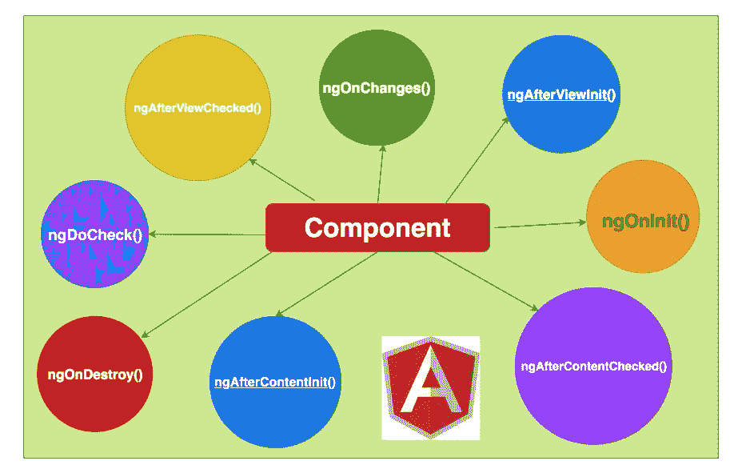

# 角度-通过示例项目了解角度生命周期挂钩

> 原文：<https://medium.com/bb-tutorials-and-thoughts/angular-understanding-angular-lifecycle-hooks-with-a-sample-project-375a61882478?source=collection_archive---------0----------------------->

## 理解组件生命周期挂钩对于任何成功的 Angular 项目都是非常重要的。

每个组件/指令都经历一个生命周期，随着时间推移，Angular 会创建、更新和销毁它们。让我们讨论一下这些是什么，为什么以及什么时候我们应该在一个示例项目中使用它们。

**Component lifecycle hooks**