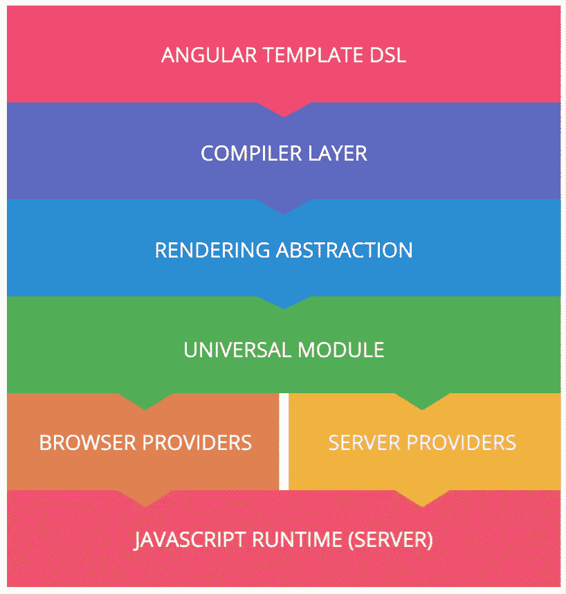
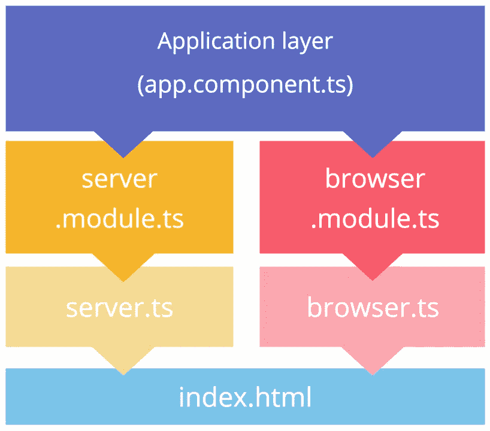
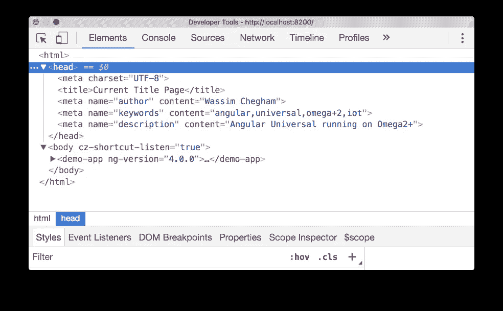

# 对我们其他人来说是有角度的宇宙

> 原文：<https://medium.com/google-developer-experts/angular-universal-for-the-rest-of-us-922ca8bac84?source=collection_archive---------2----------------------->


> 本文已更新，以匹配 Angular v4 中引入的 Angular Universal 的重新设计。

你好，网络开发者，

让我猜猜:你已经在你的 Web 项目上工作了几个月，这很可能是一个 Web 应用程序，更确切地说，是一个“单页应用程序”。但是现在是时候将你的应用程序发布给数百万用户和搜索引擎了。没错。为了让你的应用程序成功，它必须被搜索引擎索引。所以现在你开始怀疑:*该死！我需要添加搜索引擎优化支持！*

在你的旅程中，你开始意识到这不是一件容易的事情。因为我们都知道为 SPA 的服务器端渲染支持建立一个完整的管道有多难。但是，嘿，你是一个开发者，你喜欢挑战，对不对？

几天后(或几周后？)的尝试和错误，您设法添加了 SEO 支持。恭喜你！

然而，您的用户开始抱怨应用程序的启动时间。老实说，6 或 10 秒显示第一页并不是理想的体验。对吗？我们人类没有耐心。当我访问一个网站时，我需要它几乎立即向我展示我来找的东西；我可以等 3 秒，但绝对不能等 10 秒！生命太短暂了，不能等着用旋转器盯着一张空白的纸看 10 秒钟。

所以现在你还有一个问题要解决，而且这不是一个容易的问题。此外，你的其他用户——网络爬虫——报告说你的应用程序不是“社交媒体友好的”。这意味着，当用户在社交媒体上分享你的应用程序的链接时，你的应用程序生成的预览有点“破碎”:它显示一个空白的预览，或者在最好的情况下，只显示页面的一些部分。这是一个预期的结果，因为在一天结束时，社交媒体后端会生成一个截图，显示当它请求您的应用程序时所呈现的内容。

所以现在你有两个问题要解决。你还是喜欢挑战，对吧？然而，你的项目经理通常会告诉你，时间就是金钱，这些问题必须在昨天解决。？

如果我告诉你你可以避免这种问题呢？这些正是 Angular Universal 帮助您解决的任务。如果你用的是 Angular，当然。

耶！没错。由于官方的通用模块，Angular 拥有对服务器端渲染的原生支持。

让我们看看通用，看看它是如何工作的。但最重要的是，如何通用可以帮助你船搜索引擎优化-即时渲染-社会媒体友好的角度应用。

# **什么是普世？**

[官方网站](http://universal.angular.io)声明 Universal 是:*用于 Angular 应用的服务器端渲染*。然而，这是我如何定义角度宇宙的:

> *万能无头网*有角。

运行 Angular 不再需要浏览器容器，也就是 WebView。由于它不依赖于 DOM，Angular 可以在任何有 JavaScript 运行时的地方运行。

> 我可耻地从保罗·金兰那里借用了“无头网络”这个术语。我强烈推荐阅读[的博客文章](https://paul.kinlan.me/the-headless-web/)，他在文章中给出了他对未来网络的展望。

# **大局**

在使用 Universal 之前，我们先来看看整体架构。



Angular Universal High Level Architecture

这张图展示了 Universal 在浏览器之外运行典型的 Angular Web 应用程序的能力。显然，我们需要一个 JavaScript 运行时，这就是为什么我们默认支持 Node.js(由 V8 引擎驱动)。然而，一些努力已经开始支持其他服务器端技术，如 PHP、Java、Python、Go …我很高兴地说，Universal 已经在。感谢史蒂夫的工作。

既然您的应用程序可以在浏览器之外进行解释——让我们以服务器为例——请求您的 SPA 的客户端将收到一个静态的完整呈现的请求路由/URL 页面。这个页面包含了所有相关的资源，例如图片、样式表、字体…甚至是来自你的 Angular 服务的数据。

事实上，在呈现页面之前，Universal 负责处理和获取所有需要的数据——这通常是通过 Angular 的 Http 服务获取的。Universal 能够重新连接一些默认的 Angular 提供程序，这样它们就可以在目标平台上工作。还有更多。当客户端收到呈现的页面时，它也会收到原始的 Angular 应用程序——我们只帮助您的应用程序几乎立即加载。一旦加载完毕，Angular 就会处理剩下的事情。

但是当有角度的 bootstraps 覆盖在呈现的页面上会发生什么呢？我们不会有什么国家问题吗？或者用户可能在看到呈现的页面后就想使用您的应用程序，这有意义吗？你将如何处理状态？Universal 本身如何处理状态？

我们会保护你…

事实上，Universal 附带了 Preboot.js 库，其唯一的作用是确保两种状态同步。

Preboot.js 在引擎盖下做的是简单而智能地记录 Angular bootstraps 之前发生的事件；并在 Angular 完成加载后播放它们。很简单，不是吗？

# 渲染器

由于 Angular 的渲染抽象，通用成为可能。事实上，当您编写应用程序代码时，Angular 的编译器会将该逻辑解析到 AST 中——我们在这里实际上是在简化事情。然后，这个 AST 被 Angular 的呈现层使用，它使用一个与 DOM 无关的抽象呈现器。Angular 允许您使用不同的渲染器。默认情况下，Angular 提供了 DOMRenderer，因此您的应用程序可以在浏览器中呈现，这可能是 95%的用例。

这就是环球公司的用武之地。Universal 为所有主流技术和构建工具提供了一堆*预呈现器*。

# 依赖注入和提供者

Angular 的另一个亮点是其 DI 系统。Angular 实际上是实现这种设计模式的唯一前端框架，这种设计模式允许轻松完成如此多的伟大任务(参见 [IOC](https://en.wikipedia.org/wiki/Inversion_of_control) )。由于 DI，你可以在运行时交换两个不同的实现，这在测试中经常使用。

在 Universal 中，我们利用这个 DI 系统，为您提供许多特定于目标平台的服务。对于 Node，我们提供了一个定制的 **ServerModule** ，它实现了 Node 的特定于服务器的 API，比如请求，而不是浏览器的 XHR。Universal 还附带了一个特定于 Node 的自定义渲染器，当然，我们为您提供了一堆*预渲染器——我们称之为*——例如针对您的 Node 后端技术的 Express 渲染器或 Webpack 渲染器。对于其他非 JavaScript 技术，比如。NetCore 或 Java，你也应该期待其他的*预呈现器*。

# 你好世界

好消息是，通用应用程序与经典的角度应用程序没有什么不同。通常你的应用程序逻辑保持不变。当然，如果你严格遵循 Angular 的[指南和最佳实践](https://angular.io/styleguide)，这将是真的。我建议您遵循的最重要的最佳实践之一是:


> 只要有可能，请在直接接触 DOM 之前三思。每次想要与浏览器的 DOM 交互时，请确保使用角度渲染器或渲染抽象。

你需要提供的唯一额外的东西是第二个引导配置。目标平台或后端的配置，例如节点。网络…

以下是 Universal 推荐的引导结构:



Angular Universal Application Structure

让我们解释一下每个文件的作用…

**应用组件**

这个组件和所有其他的 Angular API/特性，如组件模板、指令、服务、管道等保持不变。没什么特别的:

```
import { Component } from '@angular/core';@Component({
  selector: 'app-root',
  templateUrl: './app.component.html',
  styleUrls: ['./app.component.css']
})
export class AppComponent {
  title = 'app works!';
}
```

**browser.module.ts**

在本模块中，您应该将所有特定内容放在浏览器环境中:

```
import { NgModule } from '@angular/core';
**import { BrowserModule } from '@angular/platform-browser';**
import { AppComponent } from './index';@NgModule({
  bootstrap: [ AppComponent ],
  declarations: [ AppComponent ],
  imports: [
    **BrowserModule.withServerTransition({appId: 'some-app-id'}),**
    ...
  ]
})
export class AppBrowserModule {}
```

请注意，您需要使用 [**和**](https://angular.io/docs/js/latest/api/platform-browser/index/BrowserModule-class.html#!#withServerTransition-anchor) 方法初始化**浏览器模块**。这将确保基于浏览器的应用程序将从服务器呈现的应用程序过渡。

**server.module.ts**

本模块专门针对您的服务器环境。 [**ServerModule**](https://angular.io/docs/js/latest/api/platform-server/index/ServerModule-class.html) 从**@ angular/platform-server**包中提供了一组提供者。

```
import { NgModule } from '@angular/core';
**import { ServerModule } from '@angular/platform-server';
import { AppComponent, AppBrowserModule } from './browser.module';**@NgModule({
  bootstrap: [ AppComponent ],
  declarations: [ AppComponent ],
  imports: [
    **ServerModule,
    AppBrowserModule,
**    ...
  ]
})
export class AppServerModule {}
```

> 在 AppServerModule 中，您应该导入 **ServerModule** 和 **AppBrowserModule** ，以便它们共享同一个 **appId，**AppBrowserModule 使用的转换 Id。

**client.ts**

这个文件负责在客户端引导您的应用程序。这里没有什么新的，只是通常的引导过程(在 [AOT 模式](https://slides.com/wassimchegham/demystifying-ahead-of-time-compilation-in-angular-2-aot-jit)):

```
import { platformBrowser } from '@angular/platform-browser';
import { AppModuleNgFactory } from './ngfactory/src/app.ngfactory';
import { enableProdMode } from '@angular/core';enableProdMode();platformBrowser().bootstrapModuleFactory(AppModuleNgFactory);
```

**server.ts**

这个文件实际上是针对您的服务器/后端环境的。这里，我们的目标是 Node.js，更准确地说是 Express 框架，负责处理所有客户端请求和呈现过程。为此，我们使用并注册了 **ngExpressEngine** (见下一段)，它代表了 Express 的角度通用渲染引擎:

```
**import { 
  platformServer, 
  renderModuleFactory
} from '@angular/platform-server';**
**import { 
  AppServerModuleNgFactory
} from './ngfactory/src/app.server.ngfactory';**import { enableProdMode } from '@angular/core';
import { AppServerModule } from './server.module';import * as express from 'express';
**import {ngExpressEngine} from './express-engine';**

enableProdMode();

const app = express();

**app.engine('html', ngExpressEngine({
  baseUrl: 'http://localhost:4200',
  bootstrap: [AppServerModuleNgFactory]
}));**

app.set('view engine', 'html');
app.set('views', 'src')

app.get('/', (req, res) => {
  res.render('index', {req});
});

app.listen(8200,() => {
  console.log('listening...')
});
```

为 Express 实现一个简单的渲染器应该是一件容易的事情:

```
const fs = require('fs');
const path = require('path');
**import {renderModuleFactory} from '@angular/platform-server';**

export function ngExpressEngine(setupOptions){
  return function(filePath, options, callback){ **renderModuleFactory(setupOptions.bootstrap[0], {
      document: fs.readFileSync(filePath).toString(),
      url: options.req.url
    })**
    .then(string => {
      callback(null, string);
    }); }
}
```

这里唯一重要的部分是 **renderModuleFactory** 方法。这个方法基本上是将 Angular 应用程序引导到从文档解析的虚拟 DOM 树中，并将结果 DOM 状态序列化为字符串，然后传递给 Express engine API。

当然，您可以为这个呈现器添加一些缓存机制，以避免每次请求时都从磁盘读取。这里有一个*幼稚*的例子:

```
const fs = require('fs');
const path = require('path');
import {renderModuleFactory} from '@angular/platform-server';**const cache = new Map();**export function ngExpressEngine(setupOptions){
  return function(filePath, options, callback){ **if (!cache.has(filePath)){
      const content  = fs.readFileSync(filePath).toString();
      cache.set(filePath, content);
    }** renderModuleFactory(setupOptions.bootstrap[0], {
      document: **cache.get(filePath)**,
      url: options.req.url
    })
    .then(string => {
      callback(null, string);
    }); }
}
```

因为您完全控制了服务器呈现的内容，所以您可以轻松地添加任何您想要的 SEO 支持。我们可以想象使用**@ angular/platform-browser**提供的 **Meta** 和 **Title** :

```
import { Component } from '@angular/core';
**import { Meta, Title } from "@angular/platform-browser";**@Component({
  selector: 'home-view',
  template: `<h3>Home View</h3>`
})export class HomeView {
  constructor(**seo: Meta, title: Title**) {
    **title.setTitle('Current Title Page');**
    **seo.addTags([
      {name: 'author', content: 'Wassim Chegham'},
      {name: 'keywords', content: 'angular,universal,iot,omega2+'},
      {
        name: 'description', 
        content: 'Angular Universal running on Omega2+'
      }
    ]);**
  }
}
```



Meta and Title built-in services in action

你还可以添加任何其他的[社交媒体标签](https://moz.com/blog/meta-data-templates-123)甚至[开放图标签](http://ogp.me/)。

当然，该信息可以来自任何数据源，例如 API，并存储在模型中，例如:

```
// SEO model
export class SEO {
    public title: string = '';
    public canonical: string = '';
    public robots: string = '';
    public description: string = '';
    public keywords: string = '';
}
```

所以现在，你可能想知道:*哦！好家伙，那是许多样板文件！嗯，我们会帮你的。让我们来谈谈工具…*

# 工具作业

Angular Universal CLI 支持目前是 Angular CLI 的一个分支[这里是](https://github.com/devCrossNet/angular-cli)，但有望很快集成到常规 CLI 中..但在那之前，你可以通过使用官方的 [Angular Universal Starter](https://github.com/angular/universal-starter) ，快速轻松地开始使用 Angular Universal，它是由我的好友 [PatrickJs](/@gdi2290) 创建的。如果你是. Net 开发者，请查看我的兄弟 Mark Pieszak 的另一个入门教程。

# 就是这样

亲爱的 Web 开发人员，您现在已经有了开始使用 Angular Universal 的所有必要信息，并使您的下一个 Angular 应用程序更具性能和 SEO 友好，等等…

不要忘了给杰夫·惠普利和帕特里克·琼斯以及所有环球项目的贡献者 T21 一个大大的欢呼，感谢他们制作了角形环球摇滚！

> 编辑:别误会，Universal 不仅仅是服务器端渲染或者 SEO。当您需要在浏览器之外运行应用程序时，它为您提供了更多的功能。我们将在另一篇博文中讨论这个问题。

*关注*[*@ manekinekko*](https://twitter.com/manekinekko)*了解更多关于 web 平台的信息。*