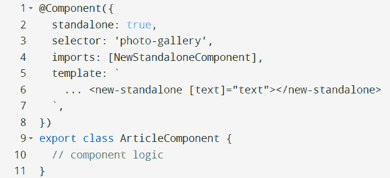
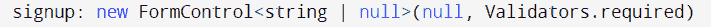
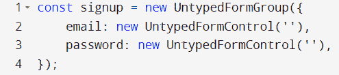
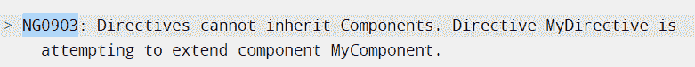
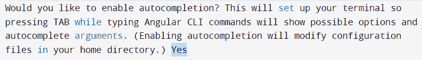
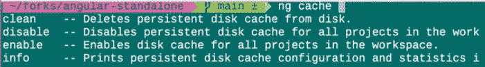
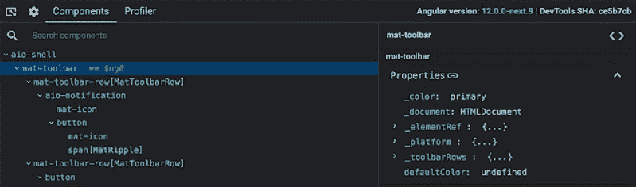

# Angular v14:功能和迁移指南提示

> 原文：<https://medium.com/globant/angular-v14-features-and-migration-guide-tips-e96b8803cd9a?source=collection_archive---------0----------------------->

Angular 的最新版本在这里。Angular v14 于 2012 年 6 月 2 日发布，带来了独立组件、严格类型表单、Angular CLI 自动完成、简化的页面标题可访问性以及其他更新和功能。Google 开发的基于 TypeScript 的开源框架也致力于更好的错误处理，引入了增强的模板诊断，使其对开发人员更加友好。考虑到“update.angular.io”上提供的迁移指南，可以通过在相关项目中运行“ng upgrade”来获得 Angular 的最新更新。

**主要特性&Angular v14 的更新:**

*   **独立组件:** Angular 是围绕作为重用单元的模块构建的。现在，在当前版本中，开发者预览版引入了独立的组件。它将允许开发人员导入要直接使用的组件、指令和管道，这在早期他们各自的模块之外是不可能的。

*   **类型化的反应式表单:**这次升级确保了表单控件、组和数组内部的值在整个 API 表面上是类型安全的。表单控件、表单组等。现在采用泛型类型来表示它所保存的值的类型。

从现在开始，将项目的早期版本更新到版本 14 将会修改表单类的语法，如下所示:

FormControl → UntypedFormControl

*   **健壮错误代码:**还增加了更优化的运行时和语法错误代码，用于调试开发中的故障。引入了可在“tsconfig.json”中配置的扩展诊断，可在其中指定是否将诊断视为警告、错误或抑制。

*   **Angular CLI 自动完成:**为了帮助开发人员并防止输入错误，Angular CLI 中引入了新的“ng 完成”功能，可选择提前输入自动完成。使用 angular-14 应用程序时，将首次询问选择:

*   **Ng 缓存:'** ng 缓存'提供了一种从命令行控制和打印缓存信息的方法。用户可以启用、禁用或从磁盘中删除，并打印工作区中项目的统计数据和信息。

*   **Angular DevTools 离线:**Angular dev tools 调试扩展是在 Angular-12 版本中引入的。现在已经启用了脱机支持。

*   **TypeScript 4.7:**Angular v 14 现在引入了对 TypeScript 4.7 的支持，以及对 4.6.0 之前版本的不推荐支持。
*   **简化的页面标题可访问性:**在当前版本中，添加标题已经通过 Angular 路由器中的“route.title”属性进行了简化，不需要任何额外的导入。

**角度迁移指南提示| v13 至 v14**

在终端中运行“ng update @ angular/core @ 14 @ Angular/CLI @ 14 ”,使其达到 Angular 的版本 14。

TypeScript 4.6 和相关更改的后续。

确保使用 Node 14.15.0 或更高版本。

现在，表单模型需要一个泛型类型参数。对于逐步迁移，可以选择不使用表单模型类的无类型版本。

**概要:**

通过上面的例子，我们看到了如何适应我们的角度版本与 14。我希望这个“简单”的指南能帮助你选择适合你的项目需求的最新特性。如果迁移成功，请在评论中告诉我！

**进一步解读:**

详细的迁移指南位于:update.angular.io

相关 angular 文章:blog.angular.io

打字稿更新:devblogs.microsoft.com/typescript