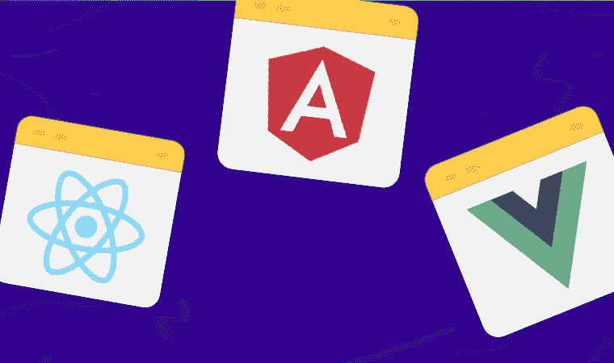
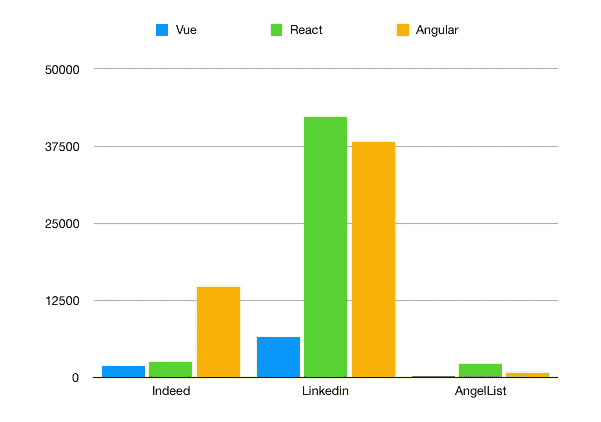
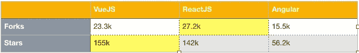
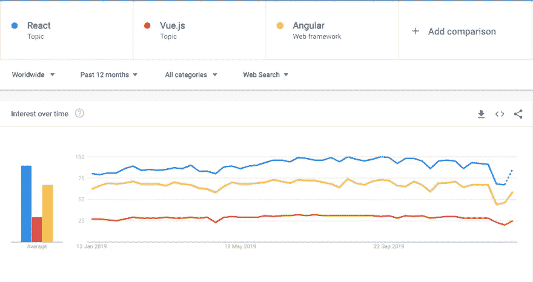
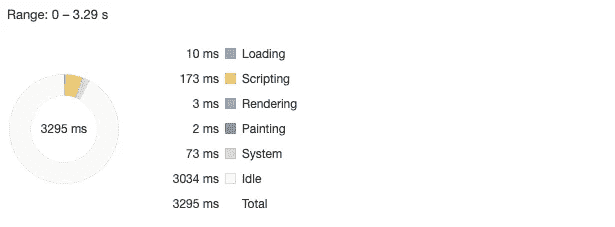
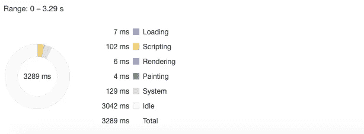
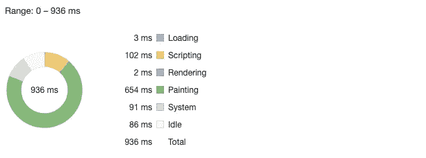

# Angular，Vue.js 或者 react . js——了解一下 2020 年你应该选择哪个前端框架？

> 原文：<https://medium.com/duomly-blockchain-online-courses/angular-vue-js-or-react-js-find-out-which-front-end-framework-you-should-choose-in-2020-1a110fdf3def?source=collection_archive---------3----------------------->

[Duomly — Programming Online Courses](https://www.duomly.com)

本文最初发表于[https://www.blog.duomly.com/react-vs-angular-vs-vue/](https://www.blog.duomly.com/react-vs-angular-vs-vue/)

几年以来，不同前端框架的流行程度显著提高。这就是为什么在那些日子里，如果不使用前端开发，我们中的许多人可能无法想象前端开发。当开始一个新的项目时，我们必须决定选择哪一个框架来使开发变得快速和容易，并且有一个好的最终结果。

自从谷歌开发者发布 Angular，脸书程序员创建 React.js，开发者就开始讨论哪一个更好。当前端社区分成 Angular 和 React 支持者时，新的严重玩家出现在市场上。2018 年，Vue.js 成为其哥哥们的一个重要竞争对手。

如您所见，为一个项目或学习选择一个前端框架比看起来要复杂得多。在这篇文章中，我想在不同的层面比较这三个框架，比如市场上的工作数量、绩效、学习曲线、受欢迎程度等。我希望这能帮助你做出选择，或者让你相信它们每一个都值得关注。

开始吧！

## 1.简要概述

首先，我想描述一下关于这三个框架的一些必要信息，以便让您对我们将要比较的内容有一个简要的概述。

**Angular** 最初是由谷歌开发者在 2010 年发布的，这个框架的第一个版本被称为 AngularJS，这使得它成为这个列表中最古老的框架。2016 年 9 月，谷歌的 Angular 团队发布了另一个基于 AngularJS 的框架，但这个框架是用 Typescript 构建的，它被称为 Angular。Angular 最后发布的版本是 8，于 2019 年 11 月推出。

**React.js** 由脸书开发者于 2013 年创建，很快就赢得了程序员的芳心。React 是一个基于组件的 UI 库，用于构建用户界面。目前的版本是 16.x，我们正在等待宣布的 17.x 版本。脸书在他们的产品如脸书或 Instagram 中大量使用 React.js。

Vue.js8 于 2014 年发布，是该榜单上最年轻的框架。尽管如此，该框架的受欢迎程度是巨大的，支持者群体仍在增长。这个框架是由尤雨溪建立的，它没有得到任何大公司的支持，但它是由捐款赞助的。

## 2.流行

现在，您对每个框架的历史有了一点了解。是时候查一下人气怎么样了。我想从两个不同的角度来看这一点，一个是市场上的工作机会数量，另一个是开发商的兴趣。

**工作机会数量**

我在美国的四个工作论坛上收集了关于所选框架的工作机会的数据。让我们来看看结果:

Number of jobs with a selected front-end framework

你可以看到 React.js 和 Angular 是美国就业市场上最受欢迎的框架。如果你目前正面临选择框架，你想学习找工作，这两个可能是一个伟大的解决方案。

**开发商的兴趣**

在这一点上，我想仔细看看三个描述的框架在开发人员中的流行程度。

我想从 Github 的统计数据开始，这里的情况与招聘信息栏上的略有不同。我看了一下每个框架的叉和星的数量，这里的赢家是 VueJS 和 ReactJS。

The popularity of front-end frameworks on Github

另一个我要检查框架受欢迎程度的地方是 Google Trends。它会向我们展示哪个框架在谷歌搜索中被搜索的次数最多。

The most searched front-end frameworks according to Google Trends

它向我们展示了 React.js 是今年谷歌搜索中最受欢迎的框架，这意味着该技术的受欢迎程度仍在增长。第二个是 Angular，根据谷歌搜索，最后一个是 VueJS，但我们必须考虑到 VueJS 是最年轻的框架，它做得很好。

## 3.表演

现在，我想更多地关注框架的技术方面。这就是为什么在这里我要看看 VueJS，React.js，Angular 的表现。

为了检查框架的加载时间和捆绑大小，我决定使用 VueJS、Angular 和 React 创建三个相同的非常简单的应用程序，运行它们，看看结果如何。请记住，应用程序被视为没有任何额外的关心性能。此外，值得记住的是 Angular 提供了所有准备好的开发工具，如 routing 等，而 Vue.js 和 React.js 需要一堆额外的库。

让我们来看看捆绑包的大小:

Front-end frameworks bundle sizes

从上表中，我们可以看到 React.js 的包大小最小，Vue。JS 的大小是它的两倍，最大的捆绑包来自 Angular。

下面你可以看到 Chrome DevTools performance 的屏幕，这里我们可以看到加载时间。在这种情况下，Vue.js 的加载时间最好，大约为 936ms。Angular 和 React 的结果相似，约为 3300 毫秒。

Angular — Performance from Chrome Dev Tools

React — Performance from Chrome Dev Tools

Vue — Performance from Chrome Dev Tools

## 4.学习曲线

学习任何框架的难易程度都是非常个人化的事情，有些人会觉得技术 A 更容易；其他人会认为非常困难。在这种情况下，我将分享我在这个问题上的经验和想法。

在我看来，如果你从掌握 Javascript 和理解它的概念开始适当地学习前端，这三者应该同样容易学习。Angular 可能会引起一些更多的问题，因为知道 Typescript 来编写 Angular apps 是很好的(尽管这不是必需的)。

根据我找到的资料，初学者把 React.js 和 VueJS 看做一个框架，学习曲线更加平滑。但是，这又是一件非常个人化的事情。

## 5.已知项目

作为本文的最后一点，我想提及一些使用这些框架创建的著名项目，向您展示使用任何技术都有可能构建大型项目。

**React.js**

*   脸谱网
*   照片墙
*   网飞

**棱角分明**

*   福布斯（美国出版及媒体集团）
*   桑坦德银行
*   宝马价格计算器

**武威 js**

*   FontAwesome
*   9GAG
*   阿里巴巴

## 结论

在本文中，我比较了三个最流行的前端框架，VueJS、React.js 和 Angular。

我从每个框架的简要概述开始；后来，我根据市场上工作机会的数量比较了受欢迎程度。这一部分告诉你，如果你想找到一个有用的框架来学习，并获得一份优秀的工作，最好的解决方案将是 React.js，而根据 Google 搜索和 Github 统计的搜索次数来检查框架的受欢迎程度，React.js 和 VueJS 都有强大的支持者社区。

通过在每个框架上运行三个相同的应用程序来比较性能，我们发现 React.js 具有最小的包大小，但 Vue.js 应用程序的加载时间是最好的。

考虑到您可以在本文中读到的所有信息，现在选择最适合您的目的的框架应该更容易了。

希望你会发现这篇文章对 2020 有用。此外，如果你做了任何比较或有任何实验显示任何前端框架的优点或缺点，请在评论中与我们分享。

感谢您的阅读，
来自 Duomly 的安娜

[Duomly — Programming Online Courses](https://www.duomly.com)