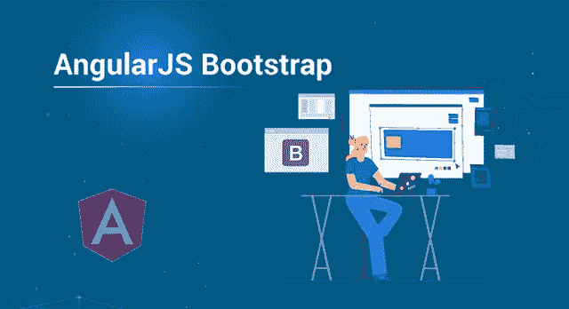

# 什么是 AngularJS Bootstrap，如何实际使用？

> 原文：<https://medium.com/edureka/angularjs-bootstrap-18402208bce1?source=collection_archive---------1----------------------->



AngularJS Bootstrap — Edureka

这篇 AngularJS Bootstrap 文章将通过一个实际的演示向您介绍 AngularJS 中的引导概念。本文将涉及以下几点:

*   角度自举
*   示例 1
*   示例 2

让我们开始吧！！

# **Angular.bootstrap()**

核心 ng 模型中有一个功能组件，称为 angular.bootstrap()函数。它用于手动启动角度应用。

***语法:***

angular.bootstrap(元素，[模块]，[配置])

***参数:***

*   **元素**–DOM 元素是一个元素，被认为是角度应用的根。
*   **模块**–要加载的模块数组称为模块。它是可选指定的。
*   **配置**–用于配置选项的对象称为配置。这也是可选的。

继续角度自举示例

***举例:***

```
<html>
<head>
<title>ANGULAR BOOTSTRAP EXAMPLE</title>
<script src=
"<a href="[https://ajax.googleapis.com/ajax/libs/angularjs/1.5.6/angular.min.js](https://ajax.googleapis.com/ajax/libs/angularjs/1.5.6/angular.min.js)">[https://ajax.googleapis.com/ajax/libs/angularjs/1.5.6/angular.min.js](https://ajax.googleapis.com/ajax/libs/angularjs/1.5.6/angular.min.js)</a>">
</script>
<style>
.id 
{
font-size: 1.5em;
color:blue;
}
</style>
</head>
<body ng-app="app" style="text-align:Center">
<h1 style="color:blue">Bootstrap</h1>
<h2>angular.bootstrap()</h2>
<div ng-controller="Bootstrap">
<span class="id">{{name}}</span>
is easy to use.
</div>
<script>
var app = angular.module("app", []);
app.controller('Bootstrap', ['$scope', function ($scope) {
$scope.name = "Bootstrap";
}]);
angular.bootstrap(document, ['app']);
</script>
</body>
```

**输出:**


继续角度自举示例

***例 2:***

```
</div>
<html>
<head>
<title>angular.bootstrap()</title>
<script src=
"<a href="[https://ajax.googleapis.com/ajax/libs/angularjs/1.5.6/angular.min.js](https://ajax.googleapis.com/ajax/libs/angularjs/1.5.6/angular.min.js)">[https://ajax.googleapis.com/ajax/libs/angularjs/1.5.6/angular.min.js](https://ajax.googleapis.com/ajax/libs/angularjs/1.5.6/angular.min.js)</a>">
</script>
</head>
<body ng-app="app" style="text-align:Center">
<h1 style="color:blue">Bootstrap</h1>
<h2>angular.bootstrap()</h2>
<div ng-controller="Bootstrap">
<div class="col-md-3 well" ng-init="count=0">
Rock:
<input type="radio" ng-model="Music" value="Rock"
ng-change="layout(Music)" />
Metal:
<input type="radio" ng-model="Music" value="Metal"
ng-change="layout(Music)" />
<pre><b>You selected:</b> {{result}} </pre>
</div>
</div>
<script>
var app = angular.module("app", []);
app.controller('Bootstrap', ['$scope', function ($scope) {
$scope.layout = function (Music) {
$scope.result = Music;
}
}]);
angular.bootstrap(document, ['app']);
</script>
</body>
</html>
```

**输出:**

选择单选按钮后，将显示以下输出:


angular.bootstrap()函数提供了对应用程序初始化的主要控制。

这就把我们带到了这篇关于 AngularJS Bootstrap 的文章的结尾。如果你想查看更多关于人工智能、Python、道德黑客等市场最热门技术的文章，你可以参考 Edureka 的官方网站。

请留意本系列中的其他文章，它们将解释 Web 开发的各个方面。

> *1。* [*ReactJS 教程*](/edureka/reactjs-tutorial-aa087fd7fc90)
> 
> *2。* [*反应元件*](/edureka/react-components-65dc1d753af5)
> 
> *3。* [*反应路由器 v4 教程*](/edureka/react-router-2aab4e781736)
> 
> *4。* [*React Redux 教程*](/edureka/react-redux-tutorial-2b3d81cfd3f7)
> 
> *5。* [*角度教程*](/edureka/angular-tutorial-for-beginners-4738ce387b03)
> 
> *6。* [*角度指令教程*](/edureka/angular-directive-tutorial-3b203de7948a)
> 
> *7。* [*用 ngAnimate 指令制作 AngularJS 应用程序动画*](/edureka/animating-angularjs-apps-with-nganimate-directive-510500755b76)
> 
> *8。* [*PHP 教程*](/edureka/php-tutorial-beginners-guide-to-php-f78a189de6f)
> 
> *9。* [*JQuery 教程*](/edureka/jquery-tutorial-for-beginners-679021d74ab4)
> 
> *10。* [*NodeJS 教程*](/edureka/node-js-tutorial-800e03bc596b)
> 
> 11。 [*十大 JavaScript 框架*](/edureka/top-10-javascript-frameworks-3179f1b5bd41)
> 
> *12。* [*使用 Node.js 和 MySQL*](/edureka/node-js-mysql-tutorial-cef7452f2762) 构建 CRUD 应用程序
> 
> *13。* [*使用节点构建 CRUD 应用程序。JS 和 MongoDB* 和](/edureka/node-js-mongodb-tutorial-fa80b60fb20c)
> 
> *14。* [*用 Node.js 构建 REST API*](/edureka/rest-api-with-node-js-b245e345f7a5)
> 
> *15。* [*最佳 3 种方式让 Node.js 请求*](/edureka/node-js-requests-6b94862307a2)
> 
> *16。*[*HTML vs HTML 5*](/edureka/html-vs-html5-83302f95652e)
> 
> *17。* [*什么是 REST API？*](/edureka/what-is-rest-api-d26ea9000ee6)
> 
> *18。* [*颤振 vs 反应原生*](/edureka/flutter-vs-react-native-58133fbf9f33)
> 
> *19。* [*如何对 Node.js App 进行 Dockerize？*](/edureka/node-js-docker-tutorial-72e7542d69d8)

*原载于 2019 年 9 月 13 日*[*www.edureka.co*](https://www.edureka.co/blog/angularjs-bootstrap/)*。*