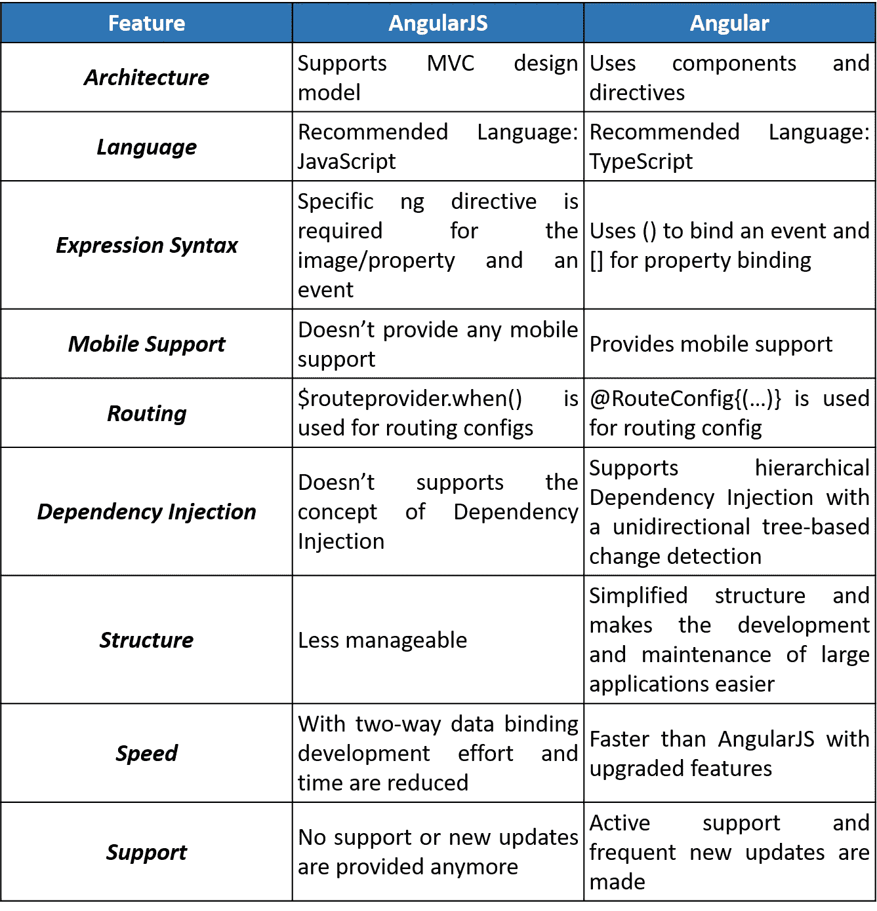
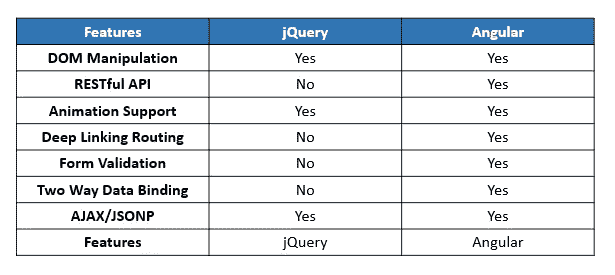
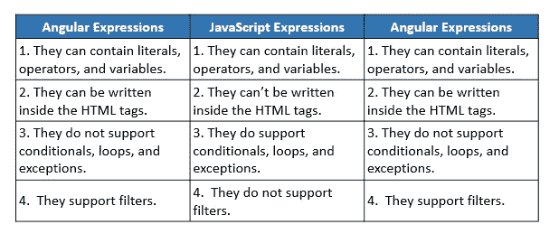
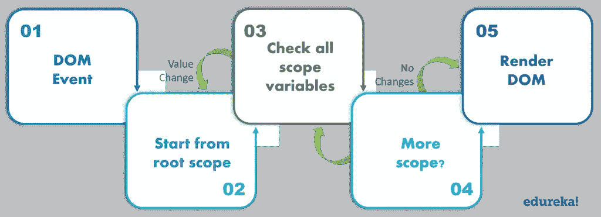
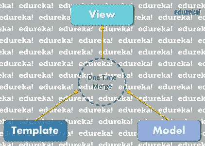
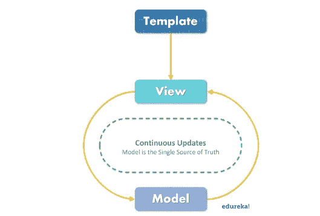
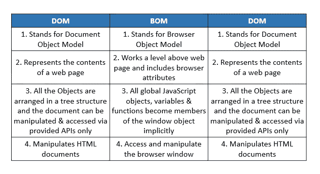
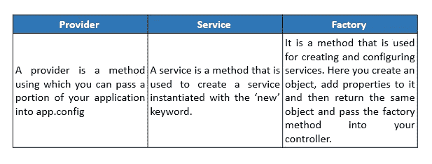

# 2021 年你必须准备的有角度的面试问题

> 原文：<https://medium.com/edureka/angularjs-interview-questions-2020-eb9d235aeee4?source=collection_archive---------1----------------------->


在这篇关于角度面试问题的文章中，我将列出一些最重要的角度面试问题和答案，它们会让你在 2020 年的面试过程中脱颖而出。Angular 继续在 Javascript 框架领域占据主导地位，并证明了自己是寻求职业快速发展的 web 开发人员的一项值得投资的投资。毫无疑问，Angular 以其创建包含三个关键要素的单页面 web 应用程序的能力而闻名——速度、灵活性和强大的社区支持。 **Angular 被誉为前端开发者的瑞士军刀！**

我们编制了一份顶级面试问题列表，分为 3 个部分，即:

*   有角度的面试问题——初学者水平
*   角度面试问题—中级水平
*   角度面试问题—高级水平

作为一名棱角分明的专业人士，知道正确的流行语，学习正确的技术，为常见的棱角分明的面试问题准备正确的答案是至关重要的。这里有一份权威的顶级面试问题清单，保证你轻松进入下一个阶段。

那么我们就从第一套基本角度面试问题开始吧。

# 初学者水平-角度面试问题

## 1.区分有角的和有角的。



## 2.什么是有角？

Angular 是一个开源的前端 web 框架。它是最流行的 JavaScript 框架之一，主要由 Google 维护。它为基于 web 的应用程序的简单开发提供了一个平台，并增强了前端开发人员管理跨平台应用程序的能力。它集成了强大的功能，如声明性模板、端到端工具、依赖注入和各种其他优化开发路径的最佳实践。

## 3.用 Angular 有什么好处？

下面列出了使用 Angular framework 的一些主要优势:

*   它支持双向数据绑定
*   它遵循 MVC 模式架构
*   它支持静态模板和角度模板
*   您可以添加自定义指令
*   它还支持 RESTfull 服务
*   支持验证
*   促进了客户端和服务器的通信
*   支持依赖注入
*   具有强大的功能，如事件处理程序、动画等。

## 4.棱角主要用来做什么？

Angular 通常用于 SPA 的开发，SPA 代表单页应用程序。 **Angular** 提供了一套现成的模块，简化了单页面应用程序的开发。不仅如此，凭借内置数据流、类型安全和模块化 CLI 等特性，Angular 被视为成熟的 web 框架。

## 5.什么是角度表达？

角度表达式是通常放在绑定中的代码片段，比如类似于 JavaScript 的{{ expression }}。这些表达式用于将应用程序数据绑定到 HTML

语法: **{{表达式}}**

## 6.Angular 中的模板是什么？

Angular 中的模板是用 HTML 编写的，其中包含特定于 Angular 的元素和属性。这些模板与来自模型和控制器的信息相结合，这些信息被进一步渲染以向用户提供动态视图。

## 7.在 Angular 中什么是字符串插值？

Angular 中的字符串插值是一种特殊的语法，它使用双花 **{{ }}** 括号中的模板表达式来显示组件数据。它也被称为**小胡子句法。**JavaScript 表达式包含在由 Angular 执行的花括号中，然后相关的输出被嵌入到 HTML 代码中。作为摘要循环的一部分，这些表达式通常像手表一样被更新和注册。

## 8.Angular 中的注释和装饰器有什么区别？

angular 中的注释是使用反射元数据库的类的“唯一”元数据集。它们用于创建一个“注释”数组。另一方面，decorators 是一种设计模式，用于分离类的修饰或修改，而不实际改变原始源代码。

## 9.你对 Angular 中控制器的理解是什么？

控制器是为 HTML UI 提供数据和逻辑的 JavaScript 函数。顾名思义，它们控制数据如何从服务器流向 HTML UI。

## 10.Angular 中的范围是什么？

Angular 中的范围是指应用程序模型的对象。它是表达式的执行上下文。范围被安排在一个模仿应用程序的 DOM 结构的层次结构中。作用域可以观察表达式和传播事件。

## 11.Angular 中的指令是什么？

Angular 指令的一个核心特性是属性，它允许你创建新的 HTML 语法，具体到你的应用程序。它们本质上是当 Angular 编译器在 DOM 中找到它们时执行的函数。角度指令分为 3 个部分:

1.  组件指令
2.  结构指令
3.  属性指令

## 12.什么是数据绑定？

在 Angular 中，数据绑定是最强大和最重要的特性之一，它允许您定义组件和 DOM(文档对象模型)之间的通信。它基本上简化了定义交互式应用程序的过程，而不必担心在视图或模板和组件之间推拉数据。在 Angular 中，有四种形式的数据绑定:

1.  字符串插值
2.  属性绑定
3.  事件绑定
4.  双向数据绑定

## 13.角度滤镜的用途是什么？

Angular 中的过滤器用于格式化表达式的值，以便将其显示给用户。这些过滤器可以添加到模板、指令、控制器或服务中。不仅如此，您还可以创建自己的自定义过滤器。使用它们，您可以很容易地以这样一种方式组织数据，即只有当数据满足某些条件时才显示。通过使用管道字符|，后跟一个过滤器，将过滤器添加到表达式中。

## 14.Angular 和 jQuery 有什么区别？



## 15.Angular 中的提供商是什么？

在 Angular 中，提供者是一个可配置的服务。它是对依赖注入系统的指令，提供关于获得依赖值的方法的信息。它是一个具有$get()方法的对象，调用该方法可以创建服务的新实例。提供者还可以包含其他方法，并使用$provide 来注册新的提供者。

# 中级-角度面试问题

## 16.Angular 支持嵌套控制器吗？

是的，Angular 确实支持嵌套控制器的概念。为了在视图中使用嵌套控制器，需要以分层的方式对其进行定义。

## 17.如何区分角度表达式和 JavaScript 表达式？



## 18.下面列出了使用核心角度功能在应用模块之间进行通信的方式。

以下是使用核心角度功能在应用模块之间进行通信的最常用方法:

*   使用事件
*   使用服务
*   通过在 **$rootScope** 上分配模型
*   直接在控制器[**$父级**、**$ $子级**、**$ $下一级**等之间。]
*   直接在控制器之间[ **ControllerAs** ，或其他形式的继承]

## 19.服务()和工厂()的区别是什么？

Angular 中的 service()是一个用于应用程序业务层的函数。它作为一个构造函数运行，在运行时使用“new”关键字调用一次。而 factory()是一个类似于 service()的函数，但功能更强大、更灵活。factory()是帮助创建对象的设计模式。

## 20.$scope 和 Angular 中的 scope 有什么区别？

*   Angular 中的$ **作用域**用于实现依赖注入(D.I)的概念，另一方面**作用域**用于直接链接。
*   $ **scope** 是由$ scopeProviderwhich 提供的服务，它可以被注入到控制器、指令或其他服务中，而 **Scope** 可以是任何东西，比如函数参数名等等。

## 21.解释作用域层次的概念？

Angular 中的$scope 对象被组织成一个层次结构，主要由视图使用。它包含一个根作用域，根作用域可以进一步包含称为子作用域的作用域。一个根作用域可以包含多个子作用域。这里每个视图都有自己的$scope，因此由它的视图控制器设置的变量对其他控制器来说是隐藏的。范围层次结构通常如下所示:

1.  Root $scope

*   控制器 1 的$范围
*   控制器 2 的$范围
*   ..
*   控制器“n”的$scope

## 22.什么是 AOT？

AOT 代表角度超前编译器。在构建过程中，它用于预编译应用程序组件及其模板。用 AOT 编译的 Angular 应用程序具有较小的启动时间。此外，这些应用程序的组件可以立即执行，不需要任何客户端编译。这些应用程序中的模板作为代码嵌入到它们的组件中。它减少了下载 Angular 编译器的需要，让您从繁琐的任务中解脱出来。AOT 编译器可以丢弃未使用的指令，这些指令可以使用树抖动工具进一步丢弃。

## 23.解释 jQLite。

jQlite 也称为 **jQuery lite** 是 jQuery 的子集，包含了它的所有特性。默认情况下，它打包在 Angular 中。这有助于 Angular 以跨浏览器兼容的方式操作 DOM。 **jQLite** 基本上只实现最常用的功能，因此占用空间很小。

## 24.用角度解释消化循环的过程？

Angular 中的摘要周期是一个监视监视列表的过程，用于跟踪监视变量的值的变化。在每个摘要周期中，Angular 会比较先前版本和新版本的范围模型值。通常，这个过程是隐式触发的，但是您也可以使用 **$apply()** 手动激活它。



## 25.有哪些角模？

所有 Angular 应用都是模块化的，遵循一个被称为 *NgModules* 的模块化系统。这些容器保存专门用于应用程序域、工作流或一些密切相关的功能集的内聚代码块。这些模块通常包含组件、服务提供者和其他代码文件，它们的范围由包含它们的 NgModule 定义。使用模块使代码变得更易维护、测试和阅读。此外，应用程序的所有依赖项通常只在模块中定义。

## 26.我们可以在哪些类型的组件上创建自定义指令？

Angular 支持为以下各项创建自定义指令:

*   **元素指令**—当遇到匹配元素时，指令激活。
*   **属性**—当遇到匹配属性时，指令激活。
*   **CSS** 当遇到匹配的 CSS 样式时，指令激活。
*   **注释**—当遇到匹配的注释时，指令激活

## 27.Angular 中有哪些不同类型的滤镜？

以下是 Angular 支持的各种滤镜:

*   **货币:**将数字格式化为货币格式。
*   **日期:**将日期格式化为指定的格式。
*   **filter:** 从数组中选择一个项目子集。
*   **json:** 将一个对象格式化为一个 json 字符串。
*   **limit:** 将一个数组/字符串限制为指定数量的元素/字符。
*   **小写:**将字符串格式化为小写。
*   **数字:**将数字格式化为字符串。
*   **orderBy:** 通过表达式对数组进行排序。
*   **大写:**将字符串格式化为大写。

## 28.Angular 中的依赖注入是什么？

依赖注入(DI)是一种软件设计模式，其中对象作为依赖项传递，而不是在组件内对它们进行硬编码。当您试图将对象创建的逻辑与其消费的逻辑分开时，依赖注入的概念就派上了用场。“config”操作使用 DI，当模块被加载以检索应用程序的元素时，必须预先配置 DI。有了这个特性，用户可以根据自己的需求改变依赖关系。

## 29.区分单向绑定和双向数据绑定。

在**单向**数据绑定中，每当数据模型改变时，视图或 UI 部分不会自动更新。您需要手动编写定制代码，以便在每次视图改变时更新它。



## 30.组件和指令的生命周期挂钩是什么？

一个角分量有一个离散的生命周期，包含从出生到死亡的不同阶段。为了更好地控制这些阶段，我们可以使用下面的方法:

*   **构造函数:**当通过调用类上的 new 创建一个组件或指令时，它被调用。
*   **ngOnChanges:** 每当组件的任何输入属性发生变化或更新时，都会调用它。
*   **ngOnInit:** 每次给定的组件初始化时都会调用它。这个钩子只在第一次 ngOnChanges 之后被调用一次。
*   **ngDoCheck:** 只要调用给定组件的变更检测器，就会调用它。这允许您为所提供的组件实现自己的更改检测算法。
*   **ngOnDestroy:** 它在组件被 Angular 破坏之前被调用。您可以使用这个钩子来取消订阅 observables 并分离事件处理程序，以避免任何类型的内存泄漏。

## 31.Angular 里的脏查你懂什么？

在 Angular 中，这个消化过程被称为**脏检查**。之所以这样称呼它，是因为它扫描了整个范围的变化。换句话说，它将所有新的范围模型值与以前的范围值进行比较。因为所有被监视的变量都包含在一个循环中，所以任何变量的任何更改/更新都会导致 DOM 中其余被监视变量的重新分配。一个被监视的变量在一个循环中(摘要循环)，任何变量的任何值的改变都迫使 DOM 中其他被监视变量的值被重新赋值

## 32.区分 DOM 和 BOM。



## **33。什么是角运动？**

转换编译是指将源代码从一种编程语言转换成另一种编程语言的过程。在 Angular 中，通常，这种转换是从 TypeScript 到 JavaScript 完成的。这是一个隐含的过程，发生在内部。

## 34.如何以角度表现动画？

为了在角度应用程序中执行动画，您需要包含一个称为 Animate Library 的特殊角度库，然后在应用程序中引用 ngAnimate 模块，或者将 ngAnimate 作为依赖项添加到应用程序模块中。

## 35.Angular 中的交叉包含是什么？

Angular 中的 transclusion 允许您将指令的原始子级转移到新模板中的特定位置。ng 指令指示使用 transclusion 的最近父指令的被 transcluded DOM 的插入点。像 **ng-transclude** 或 **ng-transclude-slot** 这样的属性指令主要用于跨线程。

## 36.Angular 中的事件是什么？

Angular 中的事件是特定的指令，有助于定制各种 DOM 事件的行为。下面列出了 Angular 支持的一些事件:

*   ng-click
*   ng-副本
*   ng 切割
*   ng-dblclick
*   ng-按键
*   ng-按键
*   ng-keyup
*   ng-鼠标按下
*   ng-鼠标输入
*   ng-mouseleave
*   ng-鼠标移动
*   ng-鼠标悬停
*   ng-mouseup
*   ng 模糊

## 37.列出一些测试角度应用的工具？

1.  因果报应
2.  角状模型
3.  摩卡
4.  浏览
5.  锡永

## 38.如何在 Angular 中创建一个服务？

在 Angular 中，服务是使用依赖注入连接在一起的可替换对象。通过在将要执行服务的模块中注册服务来创建服务。基本上有三种方法可以创建角度服务。在 Angular 中，基本上有三种创建服务的方式:

*   工厂
*   服务
*   供应者

## 39.什么是单例模式，在 Angular 中哪里可以找到它？

Angular 中的 Singleton 模式是一个很好的模式，它限制了一个类被多次使用。Angular 中的 Singleton 模式主要在依赖注入和服务中实现。因此，如果您使用' new Object()'而没有使它成为单例对象，那么将为同一个对象分配两个不同的内存位置。然而，如果对象被声明为单例对象，如果它已经存在于内存中，那么它将被重用。

## 40。你所理解的有角度的休息是什么？

REST 代表 **RE** 表象 **S** 状态 **T** 转移。REST 是一种处理 HTTP 请求的 API(应用程序编程接口)风格。在这种情况下，请求的 URL 指出了需要处理的数据。接下来，HTTP 方法会识别需要对请求的数据执行的特定操作。因此，遵循这种方法的 API 被称为 RESTful APIs。

## **41。Angular 中的自举是什么？**

Angular 中的自举无非就是初始化，或者启动 Angular app。Angular 支持自动和手动引导。

*   ***自动引导:*** 这是通过将 ng-app 指令添加到应用程序的根目录来完成的，如果您希望 angular 自动引导您的应用程序，通常在标签或标签上。当 Angular 找到 ng-app 指令时，它会加载与之关联的模块，然后编译 DOM。
*   ***手动引导:*** 手动引导为您提供了更多关于如何以及何时初始化 Angular 应用程序的控制。在 Angular 唤醒并编译页面之前，如果您想执行任何其他操作，这是非常有用的。

## 42.Angular 中链接和编译有什么区别？

*   编译函数用于模板 DOM 操作和收集所有的指令。
*   link 函数用于注册 DOM 监听器以及 DOM 操作，并在模板被克隆后执行。

## **43。** **你对角中常数的理解是什么？**

在 Angular 中，常量类似于用于定义全局数据的服务。常量是使用关键字“constant”声明的。它们是使用常量依赖创建的，可以在控制器或服务中的任何地方注入。

## 44.Angular 中的提供商、服务、工厂有什么区别？



## 45.什么是 Angular 全局 API？

Angular Global API 是全局 JavaScript 函数的组合，用于执行各种常见任务，例如:

*   比较对象
*   迭代对象
*   转换数据

有一些常见的角度全局 API 函数，如:

*   **棱角分明。lowercase:** 将一个字符串转换成小写字符串。
*   **棱角分明。大写:**将一个字符串转换成大写字符串。
*   **棱角分明。isString:** 如果当前引用是字符串，则返回 true。
*   **棱角分明。isNumber:** 如果当前引用是一个数字，则返回 true。

# 高级水平—角度面试问题

## 46.在 Angular 中，描述你将如何设置、获取和清除 cookies？

为了在 Angular 中使用 cookies，您需要包含一个名为 ngCookies angular-cookies.js 的模块。

**设置 cookie**—使用“上传”方法设置键值格式的 cookie。

```
cookie.set('nameOfCookie',"cookieValue");
```

**获取 cookie**—使用“get”方法检索 cookie。

```
cookie.get(‘nameOfCookie’);
```

**清除 Cookies** —使用“移除”方法移除 Cookies。

```
cookie.delete(‘nameOfCookie’);
```

## 47.如果您的数据模型是在“区域”之外更新的，请解释该过程，您将如何查看？

您可以使用以下任一方法更新视图:

1.  **application ref . prototype . tick()**:对完整的组件树进行变更检测。
2.  **ng zone . prototype . run():**它将对整个组件树执行变更检测。这里，引擎盖下的 run()会调用 tick 本身，然后参数会取 tick 之前的函数并执行它。
3.  **changeedetorref . prototype . detect changes():**将对当前组件及其子组件启动变更检测。

## 48.用 Angular 解释 ng-app 指令。

ng-app 指令用于定义角度应用，让我们在角度应用中使用自动引导。它代表角度应用的根元素，通常在或标签附近声明。在一个 HTML 文档中可以定义任意数量的 ng-app 指令，但是只有一个 Angular 应用程序可以被正式隐式引导。其余的应用程序必须手动引导。

**例子**

名:
<输入 type = " text " ng-model = " First Name ">
<br/>
姓:
<输入 type = " text " ng-model = " Last Name ">
<br>
全名:{ { First Name+" "+Last Name } }
</div>

## 49.从准备好的 TemplateRef 插入嵌入视图的流程是什么？

```
@Component({
    selector: 'app-root',
    template: `
        <ng-template #template let-name='fromContext'><div>{{name}}</ng-template>
    `
})
export class AppComponent implements AfterViewChecked {
    @ViewChild('template', { read: TemplateRef }) _template: TemplateRef<any>;
    constructor() { } ngAfterViewChecked() {
        this.vc.createEmbeddedView(this._template, {fromContext: 'John'});
    }
}
```

## 50.你如何在 angular 中通过点击一个按钮来隐藏一个 HTML 元素？

结合使用 ng-hide 指令和一个控制器，可以很容易地隐藏 HTML 元素，以便在单击按钮时隐藏 HTML 元素。

**视图**

```
<div ng-controller="MyController">
  <button ng-click="hide()">Hide element</button>
  <p ng-hide="isHide">Hello World!</p>
</div>
```

**控制器**

```
controller: function() {
this.isHide = false;
this.hide = function(){
this.isHide = true; }; }
```

所以这就把我们带到了角度面试问题这篇文章的结尾。你在这篇棱角分明的面试问题文章中学到的主题是招聘者在棱角分明的专业人士身上寻找的最受欢迎的技能。这几组有角度的面试问题一定会帮你在求职面试中获得高分。祝你面试顺利！如果你想查看更多关于人工智能、Python、道德黑客等市场最热门技术的文章，你可以参考 [Edureka 的官方网站。](https://www.edureka.co/blog/?utm_source=medium&utm_medium=content-link&utm_campaign=angularjs-interview-questions)

请留意本系列中的其他文章，它们将解释 Web 开发的各个方面。

> *1。* [*ReactJS 教程*](/edureka/reactjs-tutorial-aa087fd7fc90)
> 
> *2。* [*反应元件*](/edureka/react-components-65dc1d753af5)
> 
> *3。* [*React 路由器 v4 教程*](/edureka/react-router-2aab4e781736)
> 
> *4。* [*React Redux 教程*](/edureka/react-redux-tutorial-2b3d81cfd3f7)
> 
> *5。* [*角度教程*](/edureka/angular-tutorial-for-beginners-4738ce387b03)
> 
> *6。* [*角度指令教程*](/edureka/angular-directive-tutorial-3b203de7948a)
> 
> *7。* [*用 ngAnimate 指令制作 AngularJS 应用程序的动画*](/edureka/animating-angularjs-apps-with-nganimate-directive-510500755b76)
> 
> *8。* [*PHP 教程*](/edureka/php-tutorial-beginners-guide-to-php-f78a189de6f)
> 
> *9。* [*JQuery 教程*](/edureka/jquery-tutorial-for-beginners-679021d74ab4)
> 
> *10。* [*NodeJS 教程*](/edureka/node-js-tutorial-800e03bc596b)
> 
> *11。* [*十大 JavaScript 框架*](/edureka/top-10-javascript-frameworks-3179f1b5bd41)
> 
> *12。* [*使用 Node.js 和 MySQL*](/edureka/node-js-mysql-tutorial-cef7452f2762) 构建 CRUD 应用程序
> 
> *13。* [*使用节点构建 CRUD 应用程序。JS 和 MongoDB*](/edureka/node-js-mongodb-tutorial-fa80b60fb20c)
> 
> *14。* [*用 Node.js*](/edureka/rest-api-with-node-js-b245e345f7a5) 构建 REST API
> 
> 15。 [*制作 Node.js 请求的最佳 3 种方式*](/edureka/node-js-requests-6b94862307a2)
> 
> *16。*[*HTML vs HTML 5*](/edureka/html-vs-html5-83302f95652e)
> 
> *17。* [*什么是 REST API？*](/edureka/what-is-rest-api-d26ea9000ee6)
> 
> 18。 [*颤振 vs 反应原生*](/edureka/flutter-vs-react-native-58133fbf9f33)
> 
> 19。 [*如何对 Node.js App 进行 Dockerize？*](/edureka/node-js-docker-tutorial-72e7542d69d8)
> 
> 20。[](/edureka/angularjs-bootstrap-18402208bce1)

**原载于 2020 年 7 月 21 日 https://www.edureka.co*[](https://www.edureka.co/blog/interview-questions/top-angularjs-interview-questions-2016/)**。***