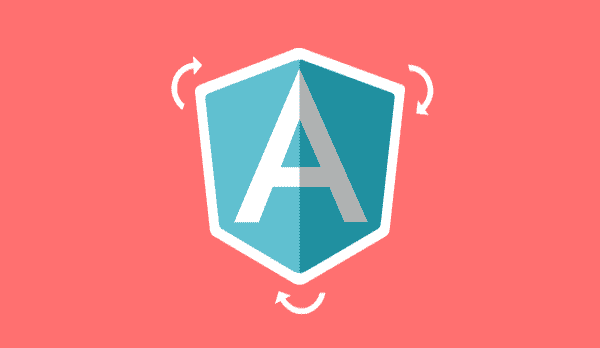
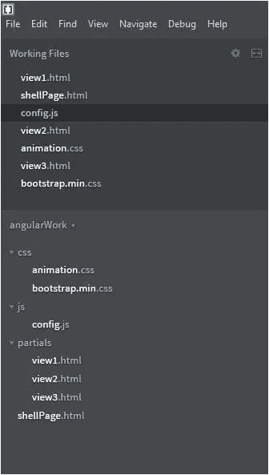
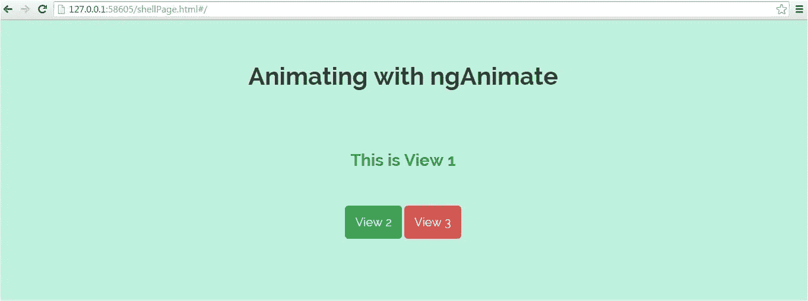

# 使用 ngAnimate 指令制作 AngularJS 应用程序动画

> 原文：<https://medium.com/edureka/animating-angularjs-apps-with-nganimate-directive-510500755b76?source=collection_archive---------1----------------------->



Animating AngularJS Apps — Edureka

AngularJS 是一个超级英雄的 JavaScript 框架，它使得创建单页应用程序(SPA)变得非常容易。除此之外，AngularJS 还附带了一些角度模块，可以用来创建令人惊叹的用户体验。在这篇文章中，我们将看到如何使用流行的 ngAnimate 来添加页面过渡/动画到角度视图。

ngAnimate 可以与各种指令一起使用，如 ngRepeat、ngView、ngInclude、ngIf、ngMessage 等。

在本帖中，我们将在 ngView 中使用动画

这里我们使用 Adobe 的括号 IDE，但是你可以自由使用其他的，例如，Sublime Text，JetBrains 的 WebStorm 等等。

注意:我们还将使用 Bootswatch Bootstrap API 来给我们的 HTML 页面一个漂亮的外观

# **项目结构:**

下面是在括号 IDE 中的项目结构



***这里是*** 项目中用到的各个文件的简短描述

**animation.css** —定义页面动画的主 css 文件

**bootstrap . min . CSS**—bootstratch bootstrap，用于为我们的<和>标签提供漂亮的外观

**config.js** —主 JavaScript 文件，我们在其中定义了角度模块以及路线和控制器

**shellPage.html**—这是外壳页面，其他视图将在其中动态加载

**view1.html、view2.html、view3.html**—这些是将被加载到 shellPage 中的部分视图

# **如何应用动画:**

ngAnimate 根据 CSS 类是进入还是离开视图，将它们应用于不同的角度指令

**。ng-enter** —这个 CSS 类在指令加载到页面时应用于指令

**。ng-leave** —这个 CSS 类在指令离开页面时应用

让我们一个一个地检查每个文件

## **shellPage.html**

shellPage 加载所需的资源，将 ng-app 应用于 body，并添加 ng-view 来动态注入视图。

```
< html>
< head>< !-- Main CSS style where we define our animations -->
    < link rel="stylesheet" href="css/animation.css">< !-- Bootswatch Bootstrap to give our pages (buttons) beautiful look -->
 < link rel="stylesheet" href="css/bootstrap.min.css">< !-- JS for angular, ngRoute and ngAnimate -->
 < script src="[https://code.angularjs.org/1.3.0/angular.js](https://code.angularjs.org/1.3.0/angular.js)">< /script>
 < script src="[https://ajax.googleapis.com/ajax/libs/angularjs/1.3.0/angular-route.js](https://ajax.googleapis.com/ajax/libs/angularjs/1.3.0/angular-route.js)">< /script>
 < script src="[https://ajax.googleapis.com/ajax/libs/angularjs/1.3.0/angular-animate.js](https://ajax.googleapis.com/ajax/libs/angularjs/1.3.0/angular-animate.js)">< /script>< !-- Main JS where we define our Angular Module along with routes and controllers -->
 < script src="js/config.js">< /script>< /head>< body ng-app="transitionApp">< div class="view {{ cssClass }}" ng-view>< /div>< div id="heading">
        < h1>Animating with ngAnimate< /h1>       
    < /div>< /body>< /html>
```

## **config.js**

在配置文件中，我们定义了角度模块以及路线和控制器。

模块转换 App 有两个依赖项:ngAnimate 和 ngRoute

```
var transitionApp = angular.module('transitionApp', ['ngAnimate', 'ngRoute']);transitionApp.config(function($routeProvider) {
    $routeProvider
     .when('/', {
      templateUrl: 'partials/view1.html',
            controller: 'view1Controller'
     })
     .when('/view2', {
      templateUrl: 'partials/view2.html',
            controller: 'view2Controller'
     })
     .when('/view3', {
      templateUrl: 'partials/view3.html',
            controller: 'view3Controller'
     });});transitionApp.controller('view1Controller', function($scope) {
    $scope.cssClass = 'view1';
});transitionApp.controller('view2Controller', function($scope) {
    $scope.cssClass = 'view2';
});transitionApp.controller('view3Controller', function($scope) {
    $scope.cssClass = 'view3';
});
```

我们已经定义了三个部分视图(视图 1、视图 2、视图 3 ),它们将根据 URL 注入到 shellpage 中。各个控制器设置 cssClass 属性，这是 CSS 类的名称，将应用于 ng-view。我们将在这些 CSS 类中定义我们的动画，这些 CSS 类将用不同的动画加载每个页面。

# **view1.html、view2.html、view3.html 的部分页面**

部分页面中没有什么，只有一些文本和到其他视图的链接

## **view1.html**

```
< h3>This is View 1< /h3>
< a href="#view2" class="btn btn-success btn-lg">View 2< /a>
< a href="#view3" class="btn btn-danger btn-lg">View 3< /a>
```

## **view2.html**

```
< h3>This is View 2< /h3>
< a href="#" class="btn btn-primary btn-lg">View 1< /a>
< a href="#view3" class="btn btn-danger btn-lg">View 3< /a>
```

## **view3.html**

```
< h3>This is View 3< /h3> 
< a href="#" class="btn btn-primary btn-lg">View 1< /a>
< a href="#view2" class="btn btn-success btn-lg">View 2< /a>
```

请记住，这三个 HTML 文件是部分页面，它们将根据我们在 config.js 文件中定义的 URL 注入到 shellPage.html 中

# **定义风格和动画:**

让我们通过对视图应用 CSS 来赋予它一些生命

```
.view        { 
 bottom:0; 
 padding-top:200px;
 position:absolute; 
 text-align:center;
 top:0;  
 width:100%; 
}.view a     { margin-top:50px; }
.view h1  { font-size:60px; }
#heading    { color:#333; position:absolute; text-align:center; top:50px; width:100%; }/* Background and text colors for partial view pages (view1, view2, view3) 
------------------------------------------------------------- */
.view1  { background:#bef2de; color:#00907c; }
.view2  { background:#D4D0EA; color:#55316f; }
.view3  { background:#FFCBA4; color:rgba(149, 95, 40, 0.91); }
```

为了在不同的视图之间进行清晰的转换，我们将设置 CSS z-index 属性

```
.view.ng-leave  { z-index:9999; }
.view.ng-enter  { z-index:8888; }
```

现在是时候定义我们的动画了

## **向左滑动动画**

```
/* slide out left */
[@keyframes](http://twitter.com/keyframes) slideOutLeft {
 to   { transform: translateX(-100%); }
}
@-moz-keyframes slideOutLeft { 
 to   { -moz-transform: translateX(-100%); }
}
@-webkit-keyframes slideOutLeft {
 to   { -webkit-transform: translateX(-100%); }
}
```

## **放大动画**

```
/* scale up */
[@keyframes](http://twitter.com/keyframes) scaleUp {
 from   { opacity: 0.3; transform: scale(0.8); }
}
@-moz-keyframes scaleUp {
 from   { opacity: 0.3; -moz-transform: scale(0.8); }
}
@-webkit-keyframes scaleUp {
 from   { opacity: 0.3; -webkit-transform: scale(0.8); }
}
```

## **从右侧滑入动画**

```
/* slide in from the right */
[@keyframes](http://twitter.com/keyframes) slideInRight {
 from  { transform:translateX(100%); }
 to   { transform: translateX(0); }
}
@-moz-keyframes slideInRight {
 from  { -moz-transform:translateX(100%); }
 to   { -moz-transform: translateX(0); }
}
@-webkit-keyframes slideInRight {
 from  { -webkit-transform:translateX(100%); }
 to   { -webkit-transform: translateX(0); }
}
```

## **从底部滑入动画**

```
/* slide in from the bottom */
[@keyframes](http://twitter.com/keyframes) slideInUp {
 from  { transform:translateY(100%); }
 to   { transform: translateY(0); }
}
@-moz-keyframes slideInUp {
 from  { -moz-transform:translateY(100%); }
 to   { -moz-transform: translateY(0); }
}
@-webkit-keyframes slideInUp {
 from  { -webkit-transform:translateY(100%); }
 to   { -webkit-transform: translateY(0); }
}
```

## **旋转和下落动画**

```
/* rotate and fall */
@-webkit-keyframes rotateFall {
 0% { -webkit-transform: rotateZ(0deg); }
 20% { -webkit-transform: rotateZ(10deg); -webkit-animation-timing-function: ease-out; }
 40% { -webkit-transform: rotateZ(17deg); }
 60% { -webkit-transform: rotateZ(16deg); }
 100% { -webkit-transform: translateY(100%) rotateZ(17deg); }
}
@-moz-keyframes rotateFall {
 0% { -moz-transform: rotateZ(0deg); }
 20% { -moz-transform: rotateZ(10deg); -moz-animation-timing-function: ease-out; }
 40% { -moz-transform: rotateZ(17deg); }
 60% { -moz-transform: rotateZ(16deg); }
 100% { -moz-transform: translateY(100%) rotateZ(17deg); }
}
[@keyframes](http://twitter.com/keyframes) rotateFall {
 0% { transform: rotateZ(0deg); }
 20% { transform: rotateZ(10deg); animation-timing-function: ease-out; }
 40% { transform: rotateZ(17deg); }
 60% { transform: rotateZ(16deg); }
 100% { transform: translateY(100%) rotateZ(17deg); }
}
```

## **旋转出报纸动画**

```
/* rotate out newspaper */
@-webkit-keyframes rotateOutNewspaper {
 to { -webkit-transform: translateZ(-3000px) rotateZ(360deg); opacity: 0; }
}
@-moz-keyframes rotateOutNewspaper {
 to { -moz-transform: translateZ(-3000px) rotateZ(360deg); opacity: 0; }
}
[@keyframes](http://twitter.com/keyframes) rotateOutNewspaper {
 to { transform: translateZ(-3000px) rotateZ(360deg); opacity: 0; }
}
```

# **应用动画:**

是时候应用我们之前定义的动画了

## **查看 1 动画**

```
/* View 1 animations for page leave and enter */
.view1.ng-leave         {
    -webkit-animation:slideOutLeft 0.5s both ease-in;
 -moz-animation:slideOutLeft 0.5s both ease-in;
 animation:slideOutLeft 0.5s both ease-in;}
.view1.ng-enter   {  
    -webkit-animation:scaleUp 0.5s both ease-in;
 -moz-animation:scaleUp 0.5s both ease-in;
 animation:scaleUp 0.5s both ease-in;    
}
```

## **查看 2 个动画**

```
/* View 2 animations for page leave and enter */
.view2.ng-leave        {
    -webkit-transform-origin: 0% 0%;
 -webkit-animation: rotateFall 1s both ease-in;
 -moz-transform-origin: 0% 0%;
 -moz-animation: rotateFall 1s both ease-in;
 transform-origin: 0% 0%;
 animation: rotateFall 1s both ease-in;}
.view2.ng-enter   {  
    -webkit-animation:slideInRight 0.5s both ease-in;
 -moz-animation:slideInRight 0.5s both ease-in;
 animation:slideInRight 0.5s both ease-in;    
}
```

## **观看 3 部动画**

```
/* View 3 animations for page leave and enter */
.view3.ng-leave      {
    -webkit-transform-origin: 50% 50%;
 -webkit-animation: rotateOutNewspaper .5s both ease-in;
 -moz-transform-origin: 50% 50%;
 -moz-animation: rotateOutNewspaper .5s both ease-in;
 transform-origin: 50% 50%;
 animation: rotateOutNewspaper .5s both ease-in;
}
.view3.ng-enter   { 
    -webkit-animation:slideInUp 0.5s both ease-in;
 -moz-animation:slideInUp 0.5s both ease-in;
 animation:slideInUp 0.5s both ease-in;  
}
```

我们完成了所有的更改。现在是运行应用程序的时候了

# **运行应用程序**

运行该应用程序时，您将看到以下页面:



点击链接，你会看到动画播放，在进入和离开部分网页。

还有各种其他的动画可以使用。此外，这里还有一系列可能的影响:[http://tympanus.net/Development/PageTransitions/](http://tympanus.net/Development/PageTransitions/)

我希望你喜欢上面这篇有 ngAnimate 文章的动画。如果你想查看更多关于人工智能、Python、道德黑客等市场最热门技术的文章，你可以参考 Edureka 的官方网站。

请留意本系列中的其他文章，它们将解释 Web 开发的各个方面。

> 1. [ReactJS 教程](/edureka/reactjs-tutorial-aa087fd7fc90)
> 
> 2.[反应成分](/edureka/react-components-65dc1d753af5)
> 
> 3. [React 路由器 v4 教程](/edureka/react-router-2aab4e781736)
> 
> 4. [React Redux 教程](/edureka/react-redux-tutorial-2b3d81cfd3f7)
> 
> 5.[角度教程](/edureka/angular-tutorial-for-beginners-4738ce387b03)
> 
> 6.[角度指令教程](/edureka/angular-directive-tutorial-3b203de7948a)
> 
> 7. [NodeJS 教程](/edureka/node-js-tutorial-800e03bc596b)
> 
> 8. [PHP 教程](/edureka/php-tutorial-beginners-guide-to-php-f78a189de6f)
> 
> 9. [JQuery 教程](/edureka/jquery-tutorial-for-beginners-679021d74ab4)
> 
> 10.[十大 JavaScript 框架](/edureka/top-10-javascript-frameworks-3179f1b5bd41)
> 
> 11.[使用 Node.js 和 MySQL 构建一个 CRUD 应用程序](/edureka/node-js-mysql-tutorial-cef7452f2762)
> 
> 12.[使用节点构建 CRUD 应用程序。JS 和 MongoDB](/edureka/node-js-mongodb-tutorial-fa80b60fb20c)
> 
> 13.[用 Node.js 构建 REST API](/edureka/rest-api-with-node-js-b245e345f7a5)
> 
> 14.[提出 Node.js 请求的 3 种最佳方式](/edureka/node-js-requests-6b94862307a2)
> 
> 15. [HTML vs HTML5](/edureka/html-vs-html5-83302f95652e)
> 
> 16.[什么是 REST API？](/edureka/what-is-rest-api-d26ea9000ee6)
> 
> 17.[颤振 vs 反应原生](/edureka/flutter-vs-react-native-58133fbf9f33)
> 
> 18.[如何对 Node.js App 进行 Dockerize？](/edureka/node-js-docker-tutorial-72e7542d69d8)
> 
> 19.[如何搭建一个 JavaScript 计算器？](/edureka/javascript-calculator-47778c7596f3)

*原载于 2015 年 6 月 22 日 www.edureka.co**的* [*。*](https://www.edureka.co/blog/animating-angular-apps-with-nganimate/)