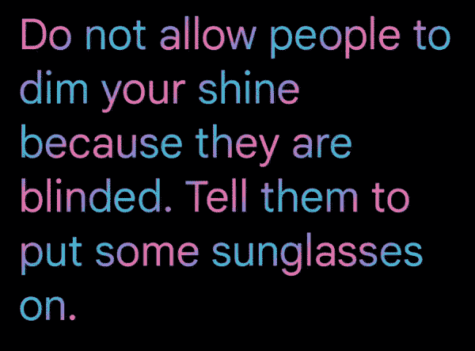
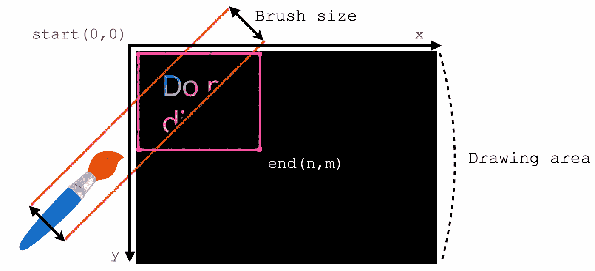
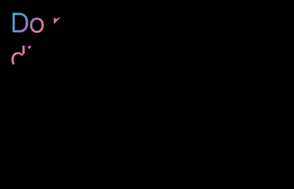
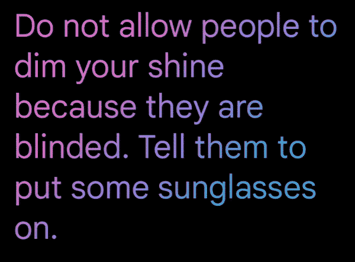
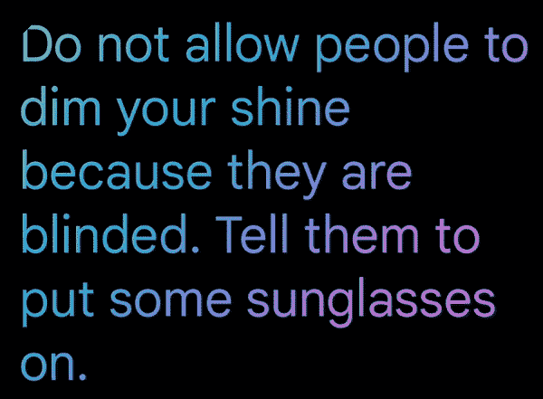
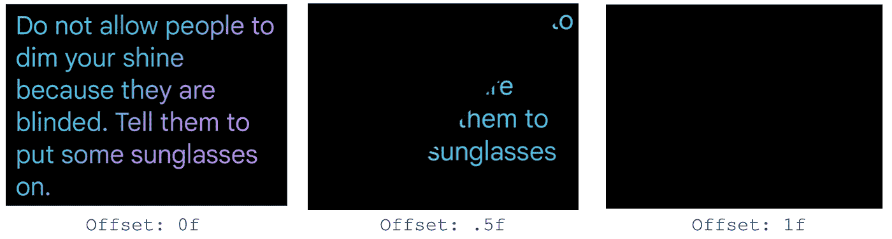
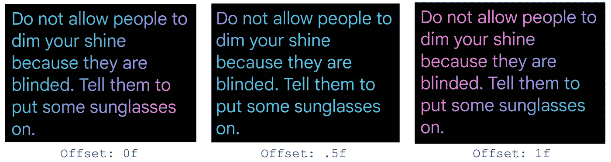

# 合成🖌️中的动画笔刷文本着色

> 原文：<https://medium.com/androiddevelopers/animating-brush-text-coloring-in-compose-%EF%B8%8F-26ae99d9b402?source=collection_archive---------0----------------------->

在 Compose 中给你的文本添加渐变后，现在是时候给它添加动画了！

这篇文章建立在使用`[Brush](https://developer.android.com/reference/kotlin/androidx/compose/ui/graphics/Brush)` API 的文本样式之上，并合成[动画](https://developer.android.com/jetpack/compose/animation)！确保你熟悉这些概念。在这篇博文[中，我们在这里](/androiddevelopers/brushing-up-on-compose-text-coloring-84d7d70dd8fa)讨论了使用`[Brush](https://developer.android.com/reference/kotlin/androidx/compose/ui/graphics/Brush)` API 的所有集成。

# 糖果棒闪光效果

我们想在文本中为渐变实现一个糖果棒效果。按照我们的设计，渐变中的颜色应该从文本的左上角连续移动到右下角:

*Candy cane animation with tileMode mirror*

我们可以使用`[linearGradient](https://developer.android.com/reference/kotlin/androidx/compose/ui/graphics/Brush#linearGradient(kotlin.Array,androidx.compose.ui.geometry.Offset,androidx.compose.ui.geometry.Offset,androidx.compose.ui.graphics.TileMode))`来创建渐变，沿着给定的`start`和`end`坐标放置颜色。

由于线性渐变的工作方式，坐标定义了线性画笔绘画的区域和角度。在我们的示例中，如果您按照下图所述定义一个区域，画笔描边将被对角裁剪，这很容易看出画笔大小是否小于绘图区域:

Linear gradient with `start` in (0,0) and `end` in (n,m) coordinates

因此，实现这个动画的一个想法是在绘图区域的一小部分制作`start`和`end`坐标的动画，然后重复这个序列。

我们可以定义一个无限过渡，并使用`[animateFloat](https://developer.android.com/reference/kotlin/androidx/compose/animation/core/package-summary#(androidx.compose.animation.core.InfiniteTransition).animateFloat(kotlin.Float,kotlin.Float,androidx.compose.animation.core.InfiniteRepeatableSpec))`将一个从 0f 到至少两倍于你的字体大小的像素值动画化。因为在这种情况下我们不知道绘制区域的大小，所以我们使用字体大小作为定位点，它直接关系到绘制文本的区域。

接下来，我们可以使用这个动画偏移，使渐变在画布的特定区域移动，然后在剩余的可用空间中重复这个序列。这是没有重复的第一步的样子:

我们可以创建线性渐变画笔，使用动画偏移配置绘图区域的`start`和`end`坐标，并将其应用于文本。我们从(0，0)坐标开始，然后向上移动，直到我们定义的偏移量。

为了重复序列和创造连续性的效果，我们可以使用`tileMode` `[mirror](https://developer.android.com/reference/kotlin/androidx/compose/ui/graphics/TileMode#Mirror())`。所以代码看起来像这样:

就是这样！您已经实现了糖果棒效果，适用于任何文本大小和密度的设备。

*Candy cane animation with tileMode mirror*

> 您可以通过调整偏移的`targetValue`和渐变的`offset`参数来创建其他类型的效果(例如更快的过渡或更粗的渐变)。

# 来回闪光效果

接下来，我们有一个新的动画，由一个来回摇摆的渐变组成。

在前面的例子中，我们使用了`currentFontSizePx`来估计动画的面积有多大，使用这个估计就足以达到我们想要的效果。但有时，我们可能想知道文本或绘图区域所占的确切大小。要访问这个大小(也是笔刷大小)，我们可以创建一个自定义笔刷，就像我们在[上一篇文章](/androiddevelopers/brushing-up-on-compose-text-coloring-84d7d70dd8fa)的 ***自定义笔刷*** 部分所做的那样。

我们可以开始考虑如何绘制渐变移动的第一遍，坐标是动画`offset`和绘图区域的宽度和高度的函数。

让我们定义一个无限过渡，动画范围从 0f 到 1f。我们可以配置`[RepeatMode.Reverse](https://developer.android.com/reference/kotlin/androidx/compose/animation/core/RepeatMode#Reverse)`，这样渐变可以画成向一个方向移动，然后反方向移动。

由于渐变模式，我们可以使用`[LinearGradientShader](https://developer.android.com/reference/kotlin/androidx/compose/ui/graphics/package-summary#LinearGradientShader(androidx.compose.ui.geometry.Offset,androidx.compose.ui.geometry.Offset,kotlin.collections.List,kotlin.collections.List,androidx.compose.ui.graphics.TileMode))`方法创建一个线性渐变画笔。和以前一样，从和到表示画笔将要绘制的坐标。

我们可以定义`widthOffset`和`heightOffset`变量，根据动画偏移量缩放宽度和高度。

然后我们可以使用`tileMode` `[mirror](https://developer.android.com/reference/kotlin/androidx/compose/ui/graphics/TileMode#Mirror())`来填充绘图空间与反梯度允许来回移动的效果。

*In between key frames without mirror effect*

*In between key frames with mirror effect*

最后，我们将新笔刷设置为`Text`。代码可能看起来像这样:

我们使用`[remember](https://developer.android.com/reference/kotlin/androidx/compose/runtime/package-summary#remember(kotlin.Function0))`函数来允许在`offset`改变时进行重组。这是必要的，因为由于`[AndroidTextPaint](https://cs.android.com/androidx/platform/frameworks/support/+/androidx-main:compose/ui/ui-text/src/androidMain/kotlin/androidx/compose/ui/text/platform/AndroidTextPaint.android.kt?q=AndroidTextPaint%20)`中的[内部](https://cs.android.com/androidx/platform/frameworks/support/+/androidx-main:compose/ui/ui-text/src/androidMain/kotlin/androidx/compose/ui/text/platform/AndroidTextPaint.android.kt;l=92)优化，如果笔刷或其直接参数没有改变，则不会安排重组。在这种情况下，笔刷保持不变，改变的是`LinearGradientShader`的参数。

你就完成了，你已经完成了✨.上方的设计

*Rocking animation with tileMode mirror*

# 概述

你已经学习了如何使用不同的`Brush`API 和一些技术来制作你的渐变颜色。

在您的应用中尝试一下，如果您遇到任何问题，请在[我们的问题跟踪器](https://issuetracker.google.com/issues/new?component=779818&template=1371638)上提交一个错误，让我们知道。

快乐作曲！👋

*本文由 Jetpack 撰写文本团队的*[*Halil zercan*](http://twitter.com/halilozercan)*合作撰写。感谢 DevRel 团队中的* [*丽贝卡·弗兰克斯*](https://twitter.com/riggaroo) *和* [*弗洛里纳·芒特内斯库*](https://twitter.com/FMuntenescu) *对他们的全面审查。*