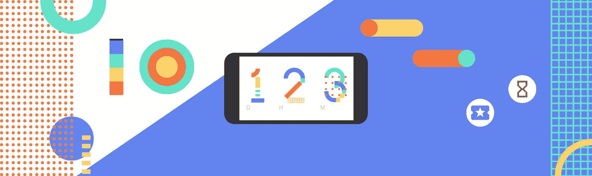
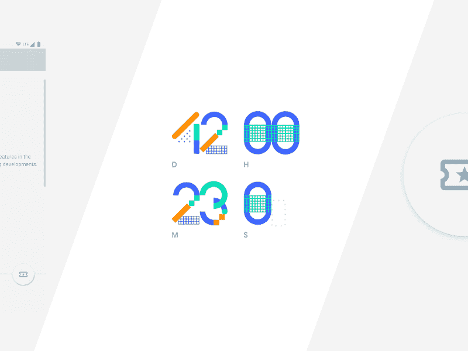
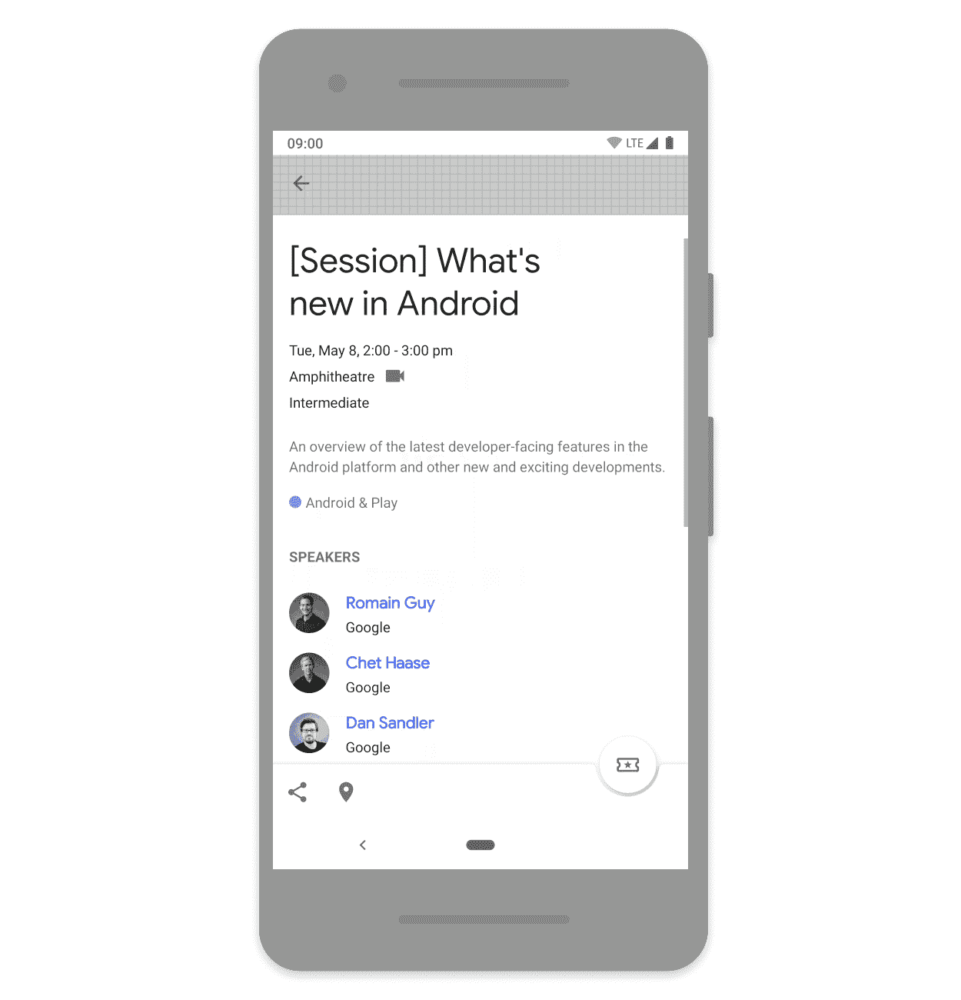
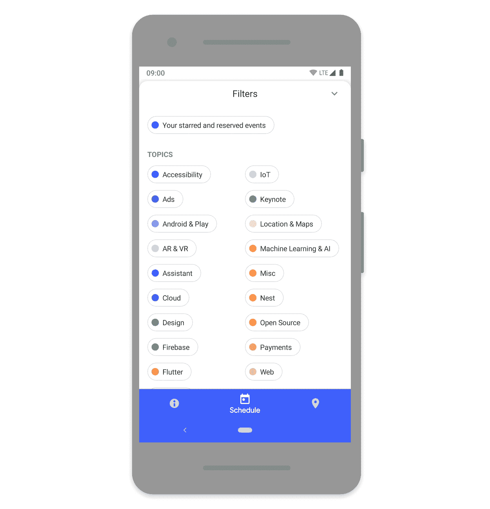
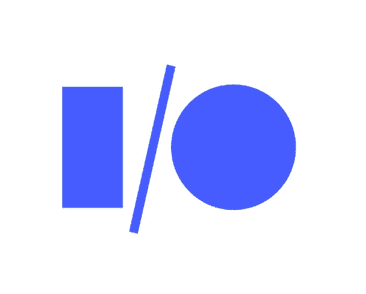

# 按计划制作动画

> 原文：<https://medium.com/androiddevelopers/animating-on-a-schedule-8a90d812ae4?source=collection_archive---------2----------------------->

Illustration by [Virginia Poltrack](https://twitter.com/VPoltrack)

## Google I/O 应用程序中的动画

我最近是一个伟大团队的成员，该团队致力于开发谷歌 I/O 2018 Android 应用程序。这是一个会议伴侣应用程序，允许与会者和远程人员找到会议，制定个性化的时间表，并在会场预订座位(如果你足够幸运的话！).我们在应用程序中构建了许多有趣的动画功能，我相信这些功能极大地增强了体验。这个应用的代码刚刚被[开源](https://github.com/google/iosched)，我想强调其中的几个实例和一些有趣的实现细节。

*Some animated elements in the I/O app*

通常，我们在应用程序中使用 3 种类型的动画:

1.  英雄动画——用于强化品牌效应，带来愉悦时刻
2.  屏幕过渡
3.  状态变化

我想详细介绍其中一些。

# 倒数计秒

该应用的部分作用是为会议营造兴奋感和期待感。因此，今年我们在登机屏幕和信息部分都加入了一个大型的会议开始倒计时动画。这也是将活动品牌嵌入应用程序的绝佳机会，带来了许多特色。

*The countdown to the conference start*

这个动画是由一个动作设计师设计的，以一系列 [Lottie](http://airbnb.io/lottie/) json 文件的形式发布:每一个 1 秒长的文件显示一个数字动画“进”然后“出”。Lottie 格式使得将文件放入`assets`变得很容易，甚至提供了像 [setMinAndMaxProgress](http://airbnb.io/lottie/android/android.html#play-animation-segments) 这样的便利方法，允许我们只播放一个动画的前半部分或后半部分(显示一个数字的动画进或出)。

有趣的部分实际上是将这些多个动画编排成整体倒计时。为了做到这一点，我们创建了一个定制的`[CountdownView](https://github.com/google/iosched/blob/master/mobile/src/main/java/com/google/samples/apps/iosched/widget/CountdownView.kt)`，它是一个相当复杂的`[ConstraintLayout](https://developer.android.com/reference/android/support/constraint/ConstraintLayout.html)`包含许多`LottieAnimationViews`。在这里，我们[创建了](https://github.com/google/iosched/blob/master/mobile/src/main/java/com/google/samples/apps/iosched/widget/CountdownView.kt#L103)一个 Kotlin [委托](https://kotlinlang.org/docs/reference/delegated-properties.html)来封装启动适当的动画。这允许我们简单地为每个代表分配一个应该显示的数字的`Int`，代表将设置并开始动画。我们扩展了`[ObservableProperty](https://kotlinlang.org/api/latest/jvm/stdlib/kotlin.properties/-observable-property/index.html)`委托，确保我们只在数字变化时运行动画。然后，我们的动画循环只是每秒发布一个 runnable(当附加视图时),它计算每个视图应该显示哪个数字并更新代理。

# 保留

该应用程序的一个关键动作是让与会者预订座位。因此，我们在会话详细信息屏幕上的 [FAB](https://material.io/develop/android/components/floating-action-button/) 中突出显示了该操作。我们认为，重要的是，一旦会话在后端成功完成，就只报告会话已被保留(不像启动会话这样不太重要的操作，我们乐观地立即更新 UI)。这可能需要一点时间来等待来自后端的响应，因此为了使这更具响应性，我们使用了动画图标来提供我们正在处理的反馈，并平稳地过渡到新状态。

*Feedback whilst reserving a seat at a session*

这是复杂的，因为该图标需要反映许多状态:会话可能是可预订的，他们可能已经预订了座位，如果会话已满，则可能有等待列表，或者他们可能在等待列表上，或者接近会话开始，预订被禁用。这导致了不同状态的许多排列来在它们之间产生动画效果。为了简化这些转换，我们决定总是经历一个“工作”状态；上面的动画沙漏。因此，每个转换实际上是一对:状态 1 →工作&工作→状态 2。这大大简化了事情。我们用[变形人](http://shapeshifter.design/)制作了每一个动画；参见`avd_state_to_state`文件[此处](https://github.com/google/iosched/tree/master/mobile/src/main/res/drawable)。

为了显示这一点，我们使用了一个自定义视图和一个`[AnimatedStateListDrawable](https://developer.android.com/reference/android/graphics/drawable/AnimatedStateListDrawable)` ( `ASLD`)。如果你以前没有使用过`ASLD`，它(顾名思义)是你可能*遇到过*的`[StateListDrawable](https://developer.android.com/reference/android/graphics/drawable/StateListDrawable)`的动画版本——允许你不仅为每个状态提供不同的 drawables，还可以在状态之间提供*转换*(以`[AnimatedVectorDrawable](https://developer.android.com/reference/android/graphics/drawable/AnimatedVectorDrawable.html)`或`[AnimationDrawable](https://developer.android.com/reference/android/graphics/drawable/AnimationDrawable.html)`的形式)。[这里是定义静态图像的 drawable](https://github.com/google/iosched/blob/master/mobile/src/main/res/drawable/asld_reservation.xml) 以及进入和退出预约图标工作状态的转换。

我们创建了一个[定制视图](https://github.com/google/iosched/blob/master/mobile/src/main/java/com/google/samples/apps/iosched/ui/reservation/StarReserveFab.kt)来支持我们自己的定制状态。视图提供了一些标准状态，如按下或选中。类似地，您可以[定义自己的](https://github.com/google/iosched/blob/master/mobile/src/main/res/values/attrs.xml#L19-L31)并让视图[将](https://github.com/google/iosched/blob/master/mobile/src/main/java/com/google/samples/apps/iosched/ui/reservation/StarReserveFab.kt#L82-L98)路由到它正在显示的任何`Drawable`。我们定义了自己的`state_reservable`、`state_reserved`等。然后我们创建了这些不同状态的 enum[,封装了视图状态和任何相关的属性，比如相关的内容描述。然后，我们的业务逻辑可以简单地在视图上设置这个枚举的适当值(通过数据绑定)，这将更新 drawable 的状态，通过`ASLD`开始动画。自定义状态和`AnimatedStateListDrawable`的结合是实现这一点的好方法，在声明层保留了大量的状态，产生了最少的视图代码。](https://github.com/google/iosched/blob/master/mobile/src/main/java/com/google/samples/apps/iosched/ui/reservation/ReservationViewState.kt)

# 扬声器转换

许多屏幕过渡与标准窗口动画配合得很好。我们偏离这一点的一个地方是[转换](https://github.com/google/iosched/blob/master/mobile/src/main/res/transition/speaker_shared_enter.xml)到扬声器细节屏幕。这在过渡的任何一侧显示扬声器图像，并且是共享元素过渡的完美候选。这有助于减轻屏幕之间的上下文变化。

*A shared element transition*

这是一个非常标准的共享元素转换，在一个`ImageView`上使用平台`[ChangeBounds](https://developer.android.com/reference/android/transition/ChangeBounds.html)`和`[ArcMotion](https://developer.android.com/reference/android/transition/ArcMotion.html)`类。

更有趣的是启动这个转换是如何适应我们用于导航的[事件模式](/google-developers/livedata-with-snackbar-navigation-and-other-events-the-singleliveevent-case-ac2622673150)的。本质上，这种模式将输入事件(比如在扬声器上录音)从导航事件中分离出来，让`ViewModel`负责如何响应输入。在这种情况下，这种解耦意味着`ViewModel` [暴露了`Event` s 的](https://github.com/google/iosched/blob/master/mobile/src/main/java/com/google/samples/apps/iosched/ui/sessiondetail/SessionDetailViewModel.kt#L147) a `LiveData`，它只知道要导航到的说话者的 ID。启动一个共享元素转换需要共享的`View`，在这一点上我们没有。我们通过[在视图绑定时将演讲者的 ID 作为标签存储](https://github.com/google/iosched/blob/master/mobile/src/main/java/com/google/samples/apps/iosched/ui/sessiondetail/SessionDetailAdapter.kt#L103)来解决这个问题，这样当我们需要导航到一个特定的演讲者详细信息屏幕时，视图就可以被[检索到](https://github.com/google/iosched/blob/master/mobile/src/main/java/com/google/samples/apps/iosched/ui/sessiondetail/SessionDetailFragment.kt#L195)。

# 过滤

会议应用的一个核心部分是将众多事件筛选出你感兴趣的事件。为了便于识别，每个主题都有一种相关的颜色，我们收到了一个很棒的定制“芯片”设计，可以在选择过滤器时使用:

*Animated filter chips*

我们从材料组件中查看了`[Chip](https://material.io/develop/android/components/chip/)`,但是选择实现我们自己的[自定义视图](https://github.com/google/iosched/blob/master/mobile/src/main/java/com/google/samples/apps/iosched/ui/schedule/filters/EventFilterView.kt),以便更好地控制“选中”状态之间的显示和动画。这是使用画布绘图和用于显示文本的`[StaticLayout](https://developer.android.com/reference/android/text/StaticLayout.html)`实现的。该视图有一个单独的`progress`属性[0–1]建模未选中–选中。为了切换状态，我们简单地激活这个值并使视图无效，渲染代码[基于此线性地插入](https://github.com/google/iosched/blob/master/mobile/src/main/java/com/google/samples/apps/iosched/util/Extensions.kt#L65)元素的位置和大小。

最初实现这个的时候，我让视图实现了`[Checkable](https://developer.android.com/reference/android/widget/Checkable.html)`接口，并在`setChecked`方法设置了一个新状态时开始动画。当我们在一个`RecyclerView`中显示多个过滤器时，如果一个被选择的过滤器滚出来，视图被反弹到一个未被选择的过滤器滚进来，这会对动画的运行产生不利的影响。哎呦。因此，我们添加了一个单独的方法来启动动画，使我们能够区分它是通过单击切换还是在将新数据绑定到视图时立即更新。

此外，当我们引入这个切换动画时，我们发现它是 janking，即丢帧。是我的动画代码有问题吗？这些过滤器显示在主会议日程屏幕前的`BottomSheet`中。当切换过滤器时，我们启动应用于时间表的过滤逻辑(并更新过滤器表标题中匹配事件的数量)。一些[系统](https://developer.android.com/studio/command-line/systrace)的探索之后，我们确定问题在于当过滤器被应用时，`RecyclerViews`显示时间表的`ViewPager`忠实地关闭并更新到新交付的数据。这导致许多观点被夸大和束缚。所有这些工作都超出了我们的框架预算…但是更新时间表不可见，因为它在过滤表后面。我们决定延迟执行实际的过滤，直到动画运行，为了更流畅的用户体验，我们牺牲了更多的实现复杂性。最初我使用`postDelayed`实现了这个，但是这导致了 UI 测试的问题。相反，我们切换了启动动画的方法，以接受 lambda 在结束时运行。这允许我们更好地尊重用户的动画设置，并正确地测试执行。

# 变得生动

总的来说，我觉得动画确实对应用的体验、个性、品牌和响应做出了贡献。希望这篇文章有助于解释为什么以及如何使用它们，并为您提供了它们的实现方法。

