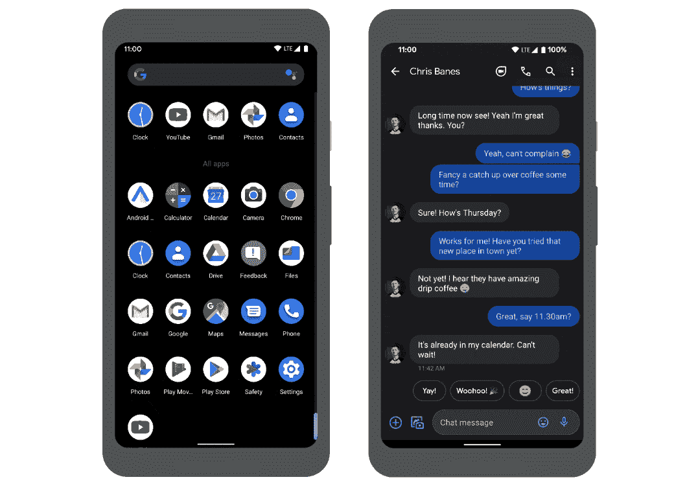
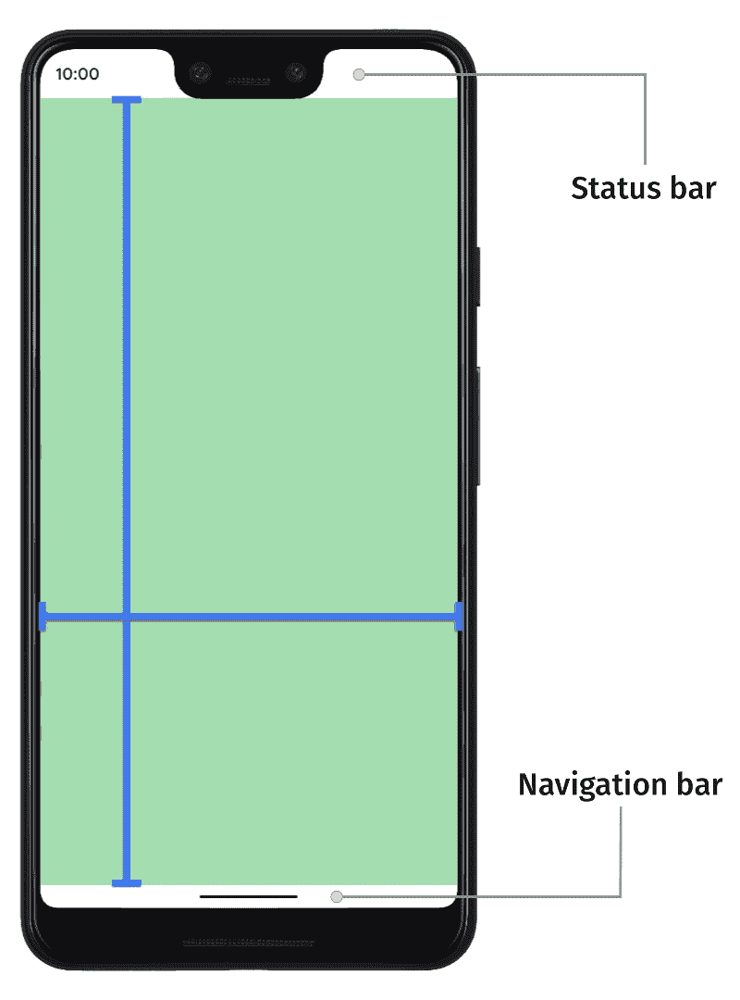
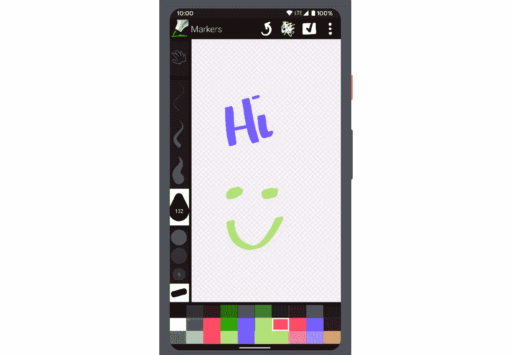
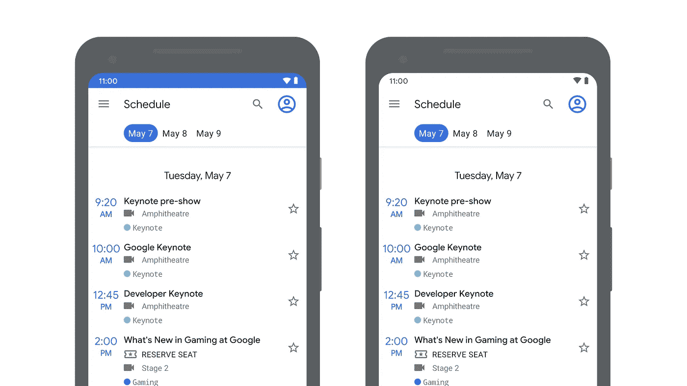

# 制作键盘动画(第 1 部分)

> 原文：<https://medium.com/androiddevelopers/animating-your-keyboard-fb776a8fb66d?source=collection_archive---------0----------------------->

Illustration by [Kiran Puri](https://twitter.com/_kiranpuri)

## 新的 WindowInsets APIs 用于检查键盘(IME)的可见性和大小

在 [Android 11](https://developer.android.com/android11) 中的新功能是应用程序能够在屏幕键盘打开和关闭之间创建无缝过渡，这一切都是由对 [Android 11](https://developer.android.com/android11) 中的`[WindowInsets](https://developer.android.com/reference/kotlin/android/view/WindowInsets)`API 的大量改进推动的。

下面是它在 Android 11 上运行的两个例子。它已被集成到[谷歌搜索](https://play.google.com/store/apps/details?id=com.google.android.googlequicksearchbox&hl=en_GB)应用程序，以及[消息](https://play.google.com/store/apps/details?id=com.google.android.apps.messaging)应用程序中:

Two examples of keyboard animations in Android 11: Google Search app (left), Messages (right)

因此，让我们看看如何将这种体验添加到您的应用程序中。有三个步骤:

1.  首先，我们需要边对边。
2.  第二步是应用程序开始对插入动画做出反应。
3.  第三步是应用程序控制和驱动插入动画，如果这对你的应用程序有意义的话。

这些步骤一个接一个，所以我们将在单独的博客文章中讨论每个步骤。在这篇**第一篇**文章中，我们将讨论边缘到边缘，以及 Android 11 中相关的 API 变化。

# 边缘对边缘

去年，我们引入了边缘到边缘的概念，作为应用程序充分利用 Android 10 中新的手势导航的一种方式:

 [## 手势导航:从边缘到边缘(一)

### Android Q 增加了一个新的系统导航模式，允许用户导航回主屏幕…

medium.com](/androiddevelopers/gesture-navigation-going-edge-to-edge-812f62e4e83e) 

作为一个快速的重新封顶，从边到边会导致你的应用在系统栏后面绘制，就像你在左边看到的。

引用我去年的话:

> *通过边缘到边缘，应用程序将被放置在系统栏的后面。这是为了让你的应用程序内容闪闪发光，为你的用户创造一个更加身临其境的体验。*

## **那么，边到边和键盘有什么关系呢？**

实际上，从边缘到边缘不仅仅是在状态栏和导航栏后面绘图。应用程序负责处理那些可能与应用程序重叠的系统用户界面。

两个明显的例子是我们前面提到的状态栏和导航栏。然后我们有了屏幕键盘，或者有时被称为 IME；这只是另一个需要注意的系统 UI。

# 应用如何走向边缘？

如果我们回顾一下去年的指南,“走向边缘”由 3 项任务组成:

1.  更改系统栏颜色
2.  请求全屏显示
3.  处理视觉冲突

我们将跳过第一个任务，因为自去年以来没有任何变化。Android 11 中更新了第 2 步和第 3 步的指导，并做了一些更改。让我们来看看。

## #2:要求全屏显示

第二步，应用程序需要使用带有一堆标志的`[systemUiVisibility](https://developer.android.com/reference/android/view/View.html#setSystemUiVisibility(int))` API，请求全屏显示:

如果您正在使用这个 API，并且已经将您的编译 SDK 版本更新到了 **30** ，您将会看到所有这些 API 现在都被否决了。

它们已经被 Window 上的一个名为`setDecorFitsSystemWindows()`的功能所取代:

如果应用程序想要处理任何系统窗口的调整(从而全屏显示)，你现在可以传入一个布尔值:`false`。

我们在`[WindowCompat](https://developer.android.com/reference/kotlin/androidx/core/view/WindowCompat)`中也有该功能的 Jetpack 版本，这是最近在 androidx.core `[v1.5.0-alpha02](https://developer.android.com/jetpack/androidx/releases/core#1.5.0-alpha02)`中发布的。

这是更新的第二步。

## #3:处理视觉冲突

现在让我们看看第三步:避免与系统 UI 重叠，这可以概括为使用窗口 insets 来知道将内容移动到哪里，以避免与系统 UI 冲突。在 Android 上，insets 由`[WindowInsets](https://developer.android.com/reference/kotlin/android/view/WindowInsets)`类表示，在 AndroidX 上由`[WindowInsetsCompat](https://developer.android.com/reference/kotlin/androidx/core/view/WindowInsetsCompat)`表示

如果我们在 API 30 更新之前看一下`[WindowInsets](https://developer.android.com/reference/kotlin/android/view/WindowInsets)`，最常用的插入类型是系统窗口插入。这些覆盖了状态栏和导航栏，以及打开时的键盘。

要使用`[WindowInsets](https://developer.android.com/reference/kotlin/android/view/WindowInsets)`，您通常会向视图添加一个`[OnApplyWindowInsetsListener](https://developer.android.com/reference/androidx/core/view/OnApplyWindowInsetsListener)`，并处理传递给它的任何 insets:

这里我们获取[系统窗口插入](https://developer.android.com/reference/kotlin/androidx/core/view/WindowInsetsCompat#getsystemwindowinsets)，然后更新视图的填充以匹配，这是一个非常常见的用例。

还有许多其他的插入类型，包括最近从 Android 10 添加的手势插入:

类似于`[systemUiVisibility](https://developer.android.com/reference/android/view/View.html#setSystemUiVisibility(int))` API，许多`[WindowInsets](https://developer.android.com/reference/kotlin/androidx/core/view/WindowInsetsCompat)`API 已经被弃用，取而代之的是查询不同类型插入的新函数:

*   `[getInsets(type: Int)](https://developer.android.com/reference/android/view/WindowInsets#getInsets(int)
    )`它将返回给定类型的可见 insets。
*   `[getInsetsIgnoringVisibility(type: Int)](https://developer.android.com/reference/android/view/WindowInsets#getInsetsIgnoringVisibility(int))`返回插图，不管它们是否可见。
*   `[isVisible(type: Int)](https://developer.android.com/reference/android/view/WindowInsets#isVisible(int))`如果给定的类型可见，则返回`true`。

我们刚刚在那里提到了很多“类型”。这些在`[WindowInsets.**Type**](https://developer.android.com/reference/kotlin/android/view/WindowInsets.Type)`类中被定义为函数，每个函数返回一个整数标志。您可以组合多种类型，使用按位`OR`来查询组合类型，我们马上就会看到。

所有这些 API 都已经被反向移植到 [AndroidX 核心](https://developer.android.com/jetpack/androidx/releases/core)中的`[WindowInsetsCompat](https://developer.android.com/reference/androidx/core/view/WindowInsetsCompat)`，所以你可以安全地将它们使用回 API 14(更多信息请参见[发布说明](https://developer.android.com/jetpack/androidx/releases/core#1.5.0-alpha02))。

因此，如果我们回到之前的示例，将其更新为新的 API，它们就变成了:

# 输入法类型⌨️

现在敏锐的眼睛👀可能一直在看这个类型列表，并且一直在看一个特别的类型: [**IME 类型**](https://developer.android.com/reference/android/view/WindowInsets.Type#ime()) 。

好了，我们终于可以回答这个 [StackOverflow 问题](https://stackoverflow.com/questions/2150078/how-to-check-visibility-of-software-keyboard-in-android)了，这个问题来自 10 多年前(流行的迟到)，关于如何检查键盘的可见性。🎉

 [## 如何在 Android 中检查软件键盘的可见性？

stackoverflow.com](https://stackoverflow.com/questions/2150078/how-to-check-visibility-of-software-keyboard-in-android) 

为了获得当前的键盘可见性，我们可以获取根窗口 insets，然后调用`[isVisible()](https://developer.android.com/reference/kotlin/android/view/WindowInsets#isvisible)`函数，传入 [IME](https://developer.android.com/reference/kotlin/android/view/WindowInsets.Type#ime()) 类型。

同样，如果我们想知道高度，我们也可以这样做:

如果我们需要监听键盘的变化，我们可以使用普通的`[OnApplyWindowInsetsListener](https://developer.android.com/reference/androidx/core/view/OnApplyWindowInsetsListener)`，并使用相同的功能:

# 隐藏/显示键盘

既然我们有一大堆回答 StackOverflow 的问题，那么这个 11 年前的关于如何合上键盘的问题怎么样？

 [## 如何关闭/隐藏安卓软键盘？

stackoverflow.com](https://stackoverflow.com/questions/1109022/how-do-you-close-hide-the-android-soft-keyboard-using-java) 

这里我们要介绍的是 Android 11 中的另一个新 API，叫做`[**WindowInsetsController**](https://developer.android.com/reference/android/view/WindowInsetsController)`。

应用程序可以从任何角度访问控制器，然后通过调用`[show()](https://developer.android.com/reference/android/view/WindowInsetsController#show(int))`或`[hide()](https://developer.android.com/reference/android/view/WindowInsetsController#hide(int))`，传入 IME 类型来显示或隐藏键盘:

但是隐藏和显示键盘并不是控制器能做的全部…

# WindowInsetsController

之前我们说过一些`View.SYSTEM_UI_*`标志在 Android 11 中已经被弃用，取而代之的是新的 API。还有许多其他的`View.SYSTEM_UI`标志可用，与改变系统 UI 外观或可见性有关，包括:

*   `View.SYSTEM_UI_FLAG_LAYOUT_HIDE_NAVIGATION`
*   `View.SYSTEM_UI_FLAG_LAYOUT_FULLSCREEN`
*   `View.SYSTEM_UI_FLAG_LAYOUT_STABLE`
*   `View.SYSTEM_UI_FLAG_LOW_PROFILE`
*   `View.SYSTEM_UI_FLAG_FULLSCREEN`
*   `View.SYSTEM_UI_FLAG_HIDE_NAVIGATION`
*   `View.SYSTEM_UI_FLAG_IMMERSIVE_STICKY`
*   `View.SYSTEM_UI_FLAG_IMMERSIVE`
*   `View.SYSTEM_UI_FLAG_VISIBLE`
*   `View.SYSTEM_UI_FLAG_LIGHT_STATUS_BAR`
*   `View.SYSTEM_UI_FLAG_LIGHT_NAVIGATION_BAR`

与其他类似，这些在 API 30 中也已被弃用，在`[WindowInsetsController](https://developer.android.com/reference/android/view/WindowInsetsController)`中被 API 取代。

我们不讨论所有这些标志的迁移，而是讨论一些常见的场景，看看如何更新它们:

## 沉浸式模式

在这里，您可以看到一个绘图应用程序，它隐藏了系统用户界面，以最大限度地增加绘图空间:

Markers app, demonstrating hiding the system UI

为了使用`[WindowInsetsController](https://developer.android.com/reference/android/view/WindowInsetsController)`实现它，我们像以前一样使用`[hide()](https://developer.android.com/reference/android/view/WindowInsetsController#hide(int))`和`[show()](https://developer.android.com/reference/android/view/WindowInsetsController#show(int))`函数，但是这次我们传入系统栏类型:

该应用还使用[沉浸式模式](https://developer.android.com/training/system-ui/immersive#immersive)，允许用户将隐藏的系统栏扫回。为了使用`[WindowInsetsController](https://developer.android.com/reference/android/view/WindowInsetsController)`实现这一点，我们将[隐藏和显示行为](https://developer.android.com/reference/android/view/WindowInsetsController#setSystemBarsBehavior(int))改为`[BEHAVIOR_SHOW_BARS_BY_SWIPE](https://developer.android.com/reference/android/view/WindowInsetsController#BEHAVIOR_SHOW_BARS_BY_SWIPE)`:

类似地，如果您使用的是粘性[沉浸式模式](https://developer.android.com/training/system-ui/immersive#sticky-immersive)，则使用`[BEHAVIOR_SHOW_TRANSIENT_BARS_BY_SWIPE](https://developer.android.com/reference/android/view/WindowInsetsController#BEHAVIOR_SHOW_TRANSIENT_BARS_BY_SWIPE)`来实现:

## 状态栏内容颜色

下一个场景是关于状态栏内容颜色的。这里您可以看到两个应用程序:

Two apps, on the left an using a dark status bar background, and on the right using a light background

在左边，应用程序有一个深色的状态栏背景，浅色的内容，如时间和图标。但是如果我们想要一个浅色的状态栏背景和深色的内容，比如右边，我们也可以使用`[WindowInsetsController](https://developer.android.com/reference/android/view/WindowInsetsController)`。

为此，我们可以使用`[setSystemBarsAppearance()](https://developer.android.com/reference/android/view/WindowInsetsController#setSystemBarsAppearance(int,%20int))`函数，传入`[APPEARANCE_LIGHT_STATUS_BARS](https://developer.android.com/reference/android/view/WindowInsetsController#APPEARANCE_LIGHT_STATUS_BARS)`值:

如果你想设置一个暗的状态栏，通过传入`0`来清除这个值。

> 注意:您可以通过设置`android:windowLightStatusBar` 属性在您的主题中实现这一点。如果您知道值不会改变，这可能更好。

类似地，`[APPEARANCE_LIGHT_NAVIGATION_BARS](https://developer.android.com/reference/android/view/WindowInsetsController#APPEARANCE_LIGHT_NAVIGATION_BARS)`标志也是可用的，它为导航栏提供了相同的功能。

## AndroidX 中的 WindowInsetsController？

不幸的是，这个 API 的 Jetpack 版本还不存在，但我们正在努力。敬请关注。

# 走向边缘:✔️

这是完成的第一步。在下一篇博文中，我们将研究第二步:应用程序对嵌入动画的反应。

 [## 制作键盘动画:对插入动画做出反应

### 对插入动画做出反应

对插图 animationsmedium.com 的反应](/androiddevelopers/animating-your-keyboard-reacting-to-inset-animations-839be3d4c31b)