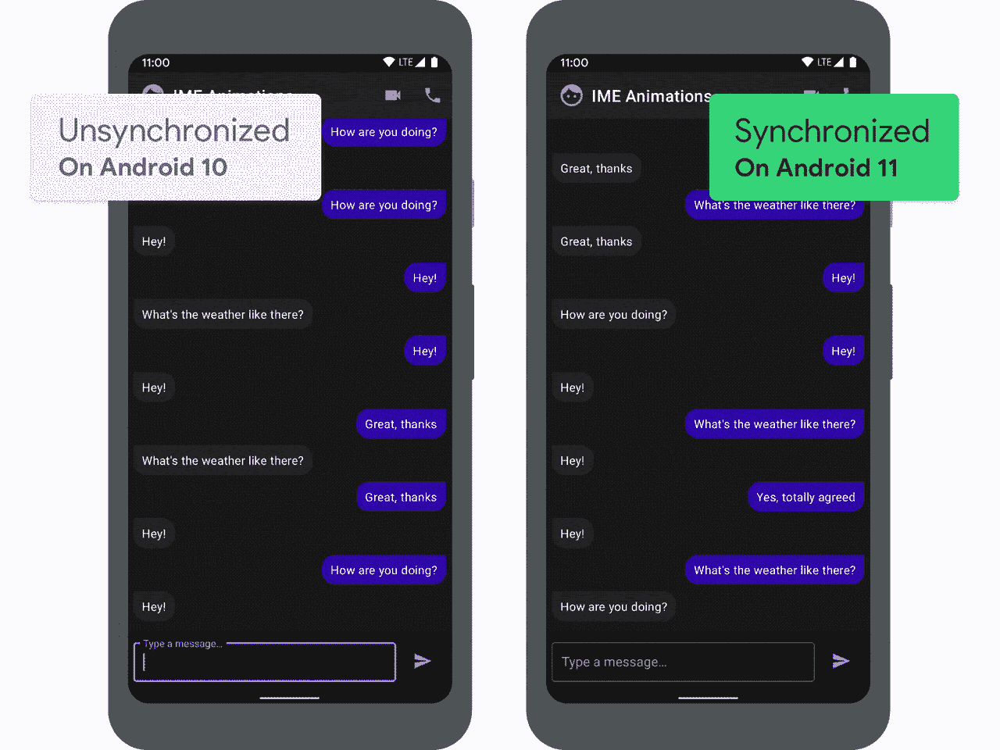
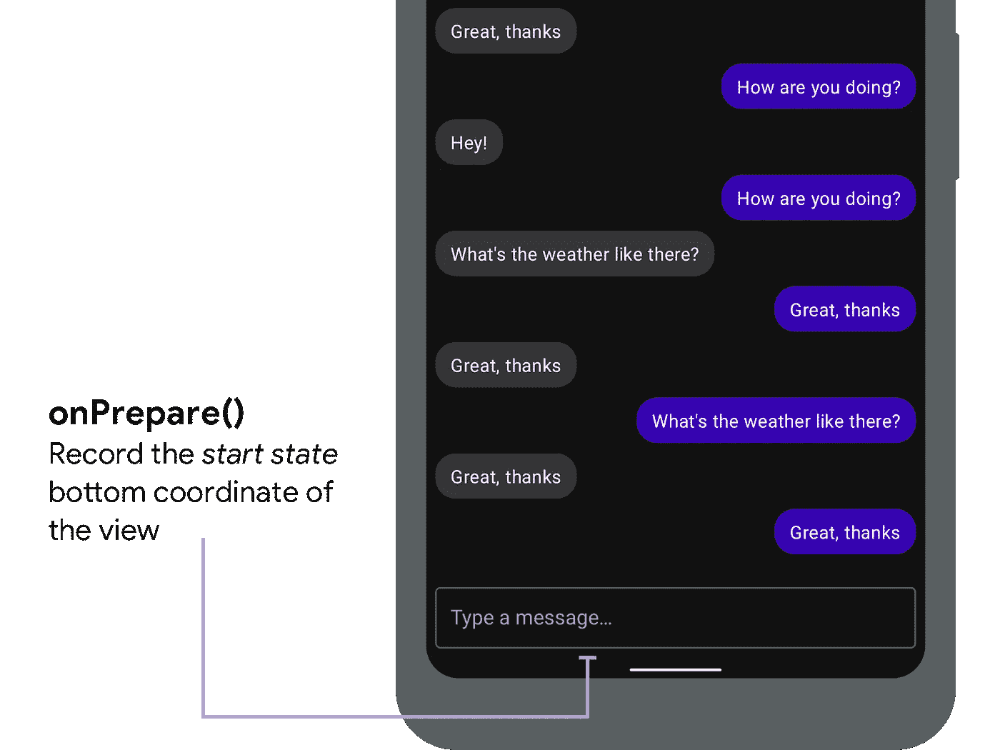
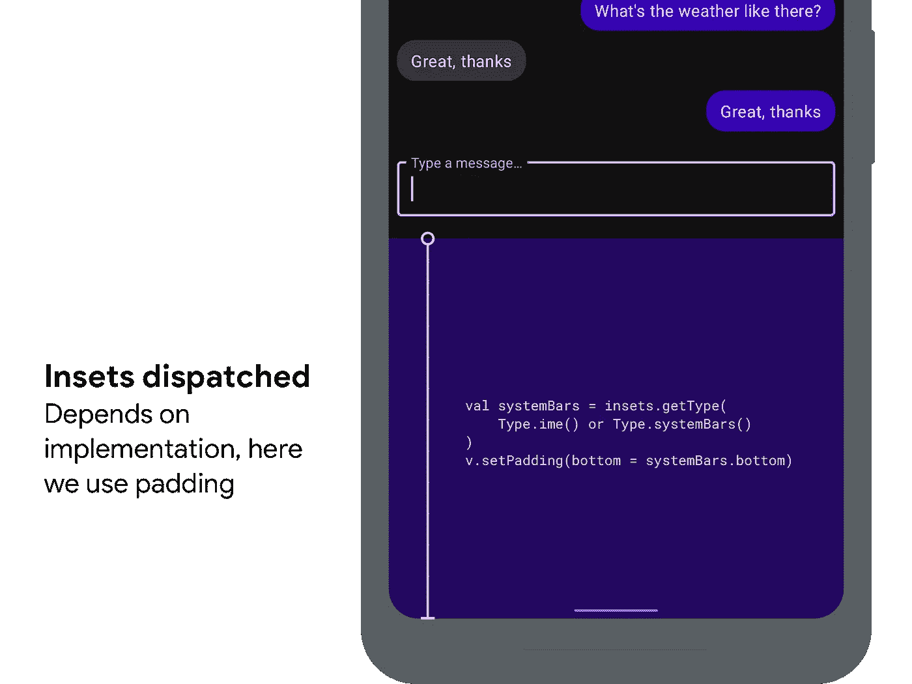
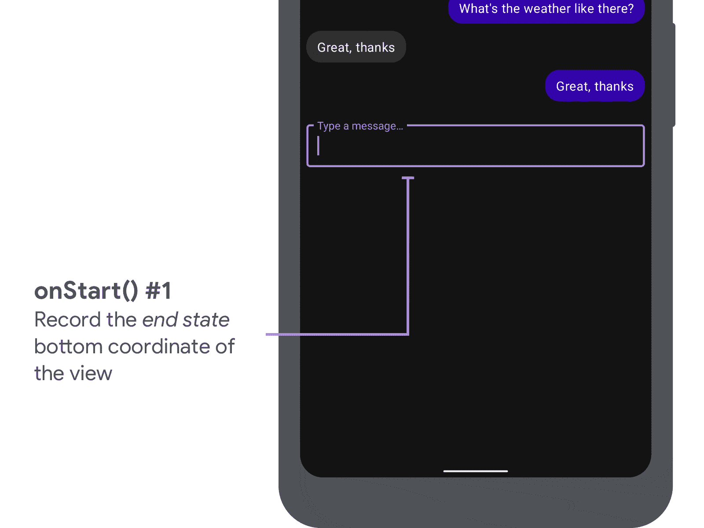
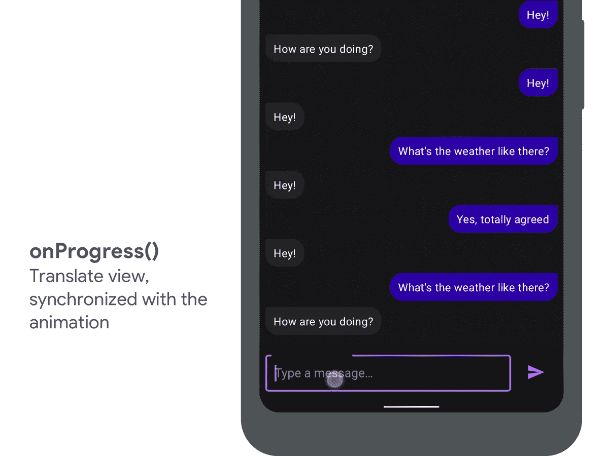

# 制作键盘动画(第 2 部分):对窗口插入动画做出反应

> 原文：<https://medium.com/androiddevelopers/animating-your-keyboard-reacting-to-inset-animations-839be3d4c31b?source=collection_archive---------1----------------------->

Illustration by [Kiran Puri](https://twitter.com/_kiranpuri)

## 使用 WindowInsetAnimation 创建无缝键盘动画

在上一篇博文中，我们介绍了与边缘到边缘相关的 API 的所有变化:

 [## 动画你的键盘

### 新的 WindowInsets APIs 用于检查键盘(IME)的可见性和大小

medium.com](/androiddevelopers/animating-your-keyboard-fb776a8fb66d) 

在这篇博文中，我们继续实际的键盘动画任务。为了演示什么是可能的，这里你可以看到一个相同的应用程序的例子，在左边的 Android 10 上运行，在右边的 [Android 11](http://developer.android.com/android11) (以 20%的速度):

在运行 Android 10 及更早版本的设备上，当用户点击文本输入来键入回复时，键盘会自动就位，但应用程序会在不同状态之间切换。这是你已经在你的设备上看到一段时间的行为，只是在 20%的速度下更容易看到。

在右边，你可以看到同样的场景运行在 [Android 11](https://developer.android.com/android11) 上。这一次，当用户点击文本输入时，应用程序用键盘的移动**，创造了一个更加无缝的体验。**

那么如何将这种体验加入到你的 app 中呢？这都是由一些新的 API 驱动的…

# 窗口动画

Android 11 中支持这一点的 API 是新的`[WindowInsetsAnimation](https://developer.android.com/reference/android/view/WindowInsetsAnimation)`类，它封装了一个包含插图的动画。应用程序可以通过`[WindowInsetsAnimation.Callback](https://developer.android.com/reference/android/view/WindowInsetsAnimation.Callback)`类监听动画事件，该类可以在视图上设置:

所以让我们来看看回调类，以及它提供的函数:

假设键盘当前是关闭的，用户刚刚点击了一个`EditText`。系统现在将开始显示键盘，由于我们有了一个`[WindowInsetsAnimation.Callback](https://developer.android.com/reference/android/view/WindowInsetsAnimation.Callback)`集合，我们将依次收到以下调用:

这就是回调在理论上的工作方式，现在让我们将它应用到一个场景中…

# 实现示例

我们将使用`[WindowInsetsAnimation.Callback](https://developer.android.com/reference/android/view/WindowInsetsAnimation.Callback)`来实现你在这篇博文开头看到的例子。所以让我们开始实现我们的回调:

## onPrepare()

首先我们将覆盖`[onPrepare()](https://developer.android.com/reference/android/view/WindowInsetsAnimation.Callback#onPrepare(android.view.WindowInsetsAnimation))`，并记录视图的**底部坐标**，在发生任何布局变化之前的*:*

## Insets 派遣

此时，结束状态的 insets 将被发送，我们的`[OnApplyWindowInsetsListener](https://developer.android.com/reference/androidx/core/view/OnApplyWindowInsetsListener)`被调用。我们的侦听器更新容器视图的填充，这导致内容被向上推。

用户永远看不到这一点，我们将在下面看到。

## onStart()

接下来是我们的`[onStart()](https://developer.android.com/reference/android/view/WindowInsetsAnimation.Callback#onStart(android.view.WindowInsetsAnimation,%20android.view.WindowInsetsAnimation.Bounds))`函数，它首先允许我们记录视图的**结束**位置。

我们还使用`translationY`将视图可视地向下移动到原始位置，因为我们不希望用户看到现在的结束状态。用户看不到闪烁，因为系统保证从上面的插入过程触发的任何布局都在与`onStart()`相同的帧中被调用。

## onProgress()

最后，我们覆盖了`[onProgress()](https://developer.android.com/reference/android/view/WindowInsetsAnimation.Callback#onProgress(android.view.WindowInsets,%20java.util.List%3Candroid.view.WindowInsetsAnimation%3E))`,它允许我们在键盘滑入时更新视图。

我们再次使用`translationY`，在开始和结束状态之间进行插值，以使视图与键盘同步移动。

# 键盘协同

这样，我们就实现了键盘和应用程序视图之间的同步。如果您想查看完整的实现，请查看[**windowinsetanimation**](https://github.com/android/user-interface-samples/tree/master/WindowInsetsAnimation)示例:

 [## Android/用户界面-示例

### 这个例子展示了如何对屏幕键盘(IME)改变可见性做出反应，以及如何控制 IME 的…

github.com](https://github.com/android/user-interface-samples/tree/master/WindowInsetsAnimation) 

如果你把它添加到你的应用中，请在 [Twitter](https://twitter.com/chrisbanes) 或下面的评论中告诉我们，以及你是如何找到它的！

在下一篇博文中，我们将探索你的应用程序如何**控制**键盘，允许像列表滚动这样的事情自动打开键盘。敬请期待！

## **视图剪辑**

如果你尝试在你自己的视图中实现这一点，你会发现我们在这篇博文中讨论的技术会导致视图在动画中被剪切。这是因为我们正在翻译视图，这些视图可能已经通过您的`[OnApplyWindowInsetsListener](https://developer.android.com/reference/androidx/core/view/OnApplyWindowInsetsListener)`的布局更改进行了调整。

我们将在以后的博客文章中探讨如何解决这一问题，但现在我建议浏览一下[**windowinsetanimation**](https://github.com/android/user-interface-samples/tree/master/WindowInsetsAnimation)示例，其中包含一种避免这一问题的技巧。