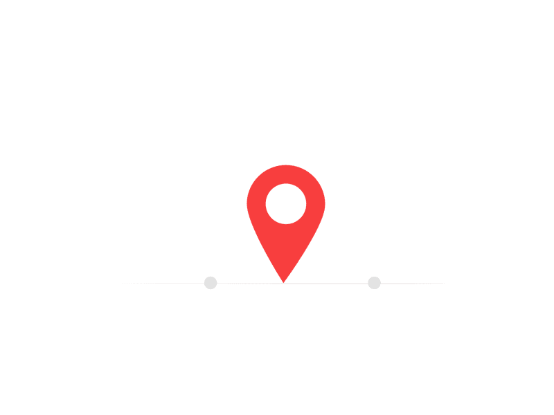
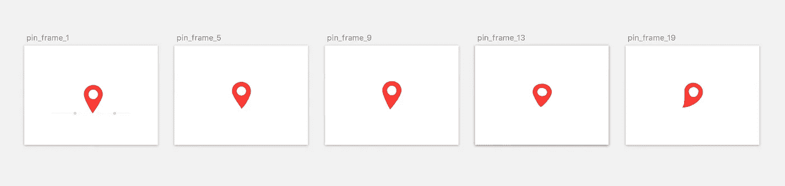
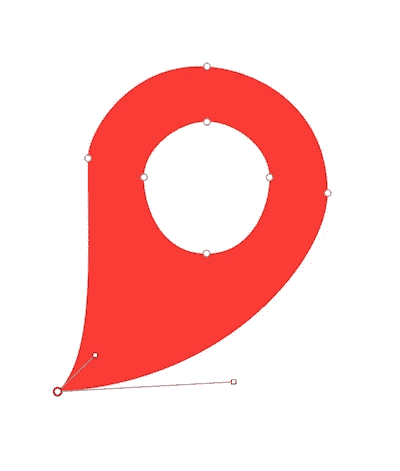
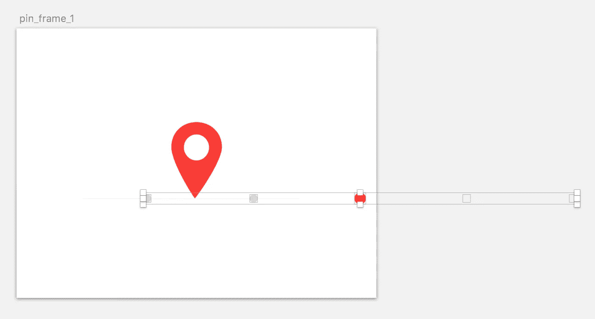

# 动画:跳转

> 原文：<https://medium.com/androiddevelopers/animation-jump-through-861f4f5b3de4?source=collection_archive---------1----------------------->

最近一个[求助](https://www.reddit.com/r/androiddev/comments/5emjwa/my_designer_asked_me_for_fancy_loading_animations/)引起了我的注意；询问如何在 Android 上实现一个奇特的“获取位置”动画:

— [http://drbl.in/2470871](http://drbl.in/2470871) by @lekarew

我立刻想到这是一个`[AnimatedVectorDrawable](https://developer.android.com/reference/android/graphics/drawable/AnimatedVectorDrawable.html)`(以下简称 AVD)的主要候选，因此着手演示一种[实现](https://gist.github.com/nickbutcher/97143b3240682e5c5851fe45b49fde93)这个的方法。有人问 ***我是怎么做到的*** 所以下面就来分解一下。

> 对于 AnimatedVectorDrawable 功能的介绍，我强烈推荐 [Alex Lockwood](https://medium.com/u/f61fb1c467cd?source=post_page-----861f4f5b3de4--------------------------------) 的[这篇文章](http://www.androiddesignpatterns.com/2016/11/introduction-to-icon-animation-techniques.html)

## 概述

从构图来看，这是由三种类型的动画组成的:

1.  针移动并改变形状使其跳动；AVD 通过动画显示路径的实际形状来支持这一点，称为路径变形。
2.  点向左移动，这将是一个简单的翻译。
3.  随着场景的进入/退出，圆点淡入/淡出。

## 描摹

不幸的是，我没有获得源作品，只有 dribbble 上的 GIF 希望你不会在你的动画中这样做！

我在 Photoshop 中打开 GIF，它提供了动画帧的时间轴视图。我通过这一步，并保存了帧的副本，其中引脚处于运动的极限，即即将改变方向或改变形状显著。这些“姿势”将是大头针在其间变形的形状。总共有 5 个主要的姿势。

我把这些都粘贴到 Sketch(我喜欢的矢量绘图工具)中，并在每个姿势中画出大头针。

The 5 shapes the pin ‘morphs’ between

一些工具可以自动跟踪光栅图像，并为您生成矢量路径。然而，知道我想要执行一个路径变形动画，意味着我需要“兼容的路径”；也就是说，每条路径需要具有相同数量和类型的点。因此，通过绘制一个简单形状的大头针(由 8 个点组成，每个点有 2 个控制点)并手动改变它以形成每个姿势，我可以肯定我们以后可以在形状之间制作动画。

然后，我将每一帧导出为单独的 SVG 文件。现在 SVG 是一个庞大的规范，而 Android 的`VectorDrawable`只支持它的一个子集。记住它们需要在受限的移动设备上解析和呈现也是有帮助的；因此，我总是试图简化我的 SVG。为此，我让它们通过 [SVGO](https://github.com/svg/svgo) (使用[SVG OMG](https://jakearchibald.github.io/svgomg/)by[Jake Archibald](https://medium.com/u/f87cd234b9d9?source=post_page-----861f4f5b3de4--------------------------------))将精度设置为小数点后 1 位。

## 四处跳跃

现在我们有了大头针的每个姿势的路径，是时候让它们移动了！为了做到这一点，我求助于棒极了的[图标动画师](http://j.mp/iconanimator)Roman Nurik。这是一个基于网络的 IDE，用于创建`AnimatedVectorDrawable` s。我放入第一个 SVG，然后点击大头针层旁边的秒表图标，并添加了一个新的`pathData`动画。这产生了一个检查面板，在这里我可以将销钉的路径从下一帧的*插入到`toValue`中。我又重复了 4 次来制作我们的动画(最后一步从最后一个姿势开始，回到最初的姿势)。*

对于计时值，我参考了原始 GIF，其中每帧持续 30 毫秒，所以如果姿势之间有 4 帧，使用 120 毫秒的持续时间等。我选择只使用标准的材质插值器，但实际上这可以从微调中受益。

## 障碍

对于移动的点，我们可以进行简单的平移。看源构图，每三个点就大一点，红一点；如何在一个漂亮的循环中实现这一点？虽然你可以用 3 个点来实现这个，并分别制作动画；我决定包括 5 个点，其中最右边的点超出了视口:

这样做可以让我们将整组点一起向左移动，一旦第四个点到达第一个点的初始位置，我们立即重置平移，将其跳回起点。整洁！

## 来来往往

我们希望点在进入时淡入，离开时淡出，这是一个简单的`fillAlpha`动画，我让你来看看它是如何实现的！

## 循环循环

现在要制作一个完整的循环动画，需要考虑一些事情。圆点动画的持续时间是大头针跳跃的三倍。我考虑过把它们分成两个独立的 avd 并分层…但是决定重复跳 3 次更简单！

我在 Icon Animator 中点击了神奇的导出按钮，这给了我 AVD 的定义，准备投入到我的项目中。然而，该工具仍处于“预览”阶段，所以我对其进行了一些调整，以清理输出，即删除任何冗余的属性，并将任何重复的值(如不同的引脚路径和一些颜色)分解到一个[资源文件](https://gist.github.com/nickbutcher/97143b3240682e5c5851fe45b49fde93#file-pins-xml-L18)中，以使它们更易于维护。

实际上，做完整的 AVD 循环比我想象的要复杂。显然动画上的`repeatMode`被忽略了😡(bug 已备案)。我[通过监听动画的结尾并重新开始来解决这个](https://gist.github.com/nickbutcher/97143b3240682e5c5851fe45b49fde93#file-mainactivity-java-L35)。不幸的是[回调](https://developer.android.com/reference/android/graphics/drawable/AnimatedVectorDrawable.html#registerAnimationCallback(android.graphics.drawable.Animatable2.AnimationCallback))只在 API23 中添加，但是你可以通过`postDelayed`等达到同样的效果。

## **制作动画**

你可以在这里找到[代码的要点](https://gist.github.com/nickbutcher/97143b3240682e5c5851fe45b49fde93)或者在图标动画中查看[完整的构图，然后玩一玩。](https://romannurik.github.io/AndroidIconAnimator/?example=https:%2F%2Fcdn.rawgit.com%2Fnickbutcher%2Fc25b44448dcec3b61d971ecab4f1e9c4%2Fraw%2F3f7872600fd48d9a74e8632cda429b798af23ace%2Fendless-pin-jump.iconanim)

希望这篇文章向你展示了`AnimatedVectorDrawable`非常强大，你可以相对容易地创建丰富的动画。我也希望分享我的工作流程有助于揭开这个过程的神秘面纱，也许能激发你创建自己的工作流程。如果有，请告诉我！