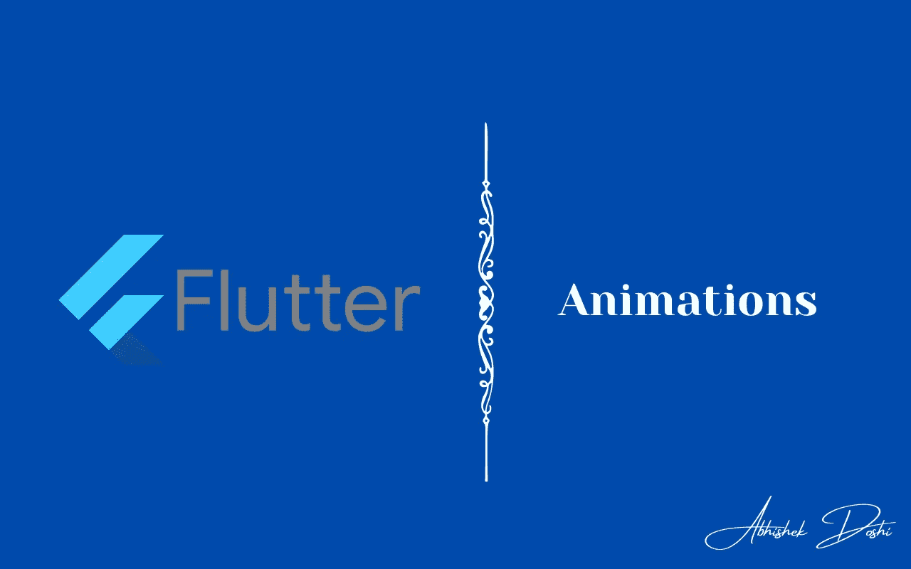

# 颤动中的动画💙

> 原文：<https://medium.com/google-developer-experts/animations-in-flutter-9761c23eb0f1?source=collection_archive---------3----------------------->

## 没有人喜欢无聊、看起来乏味的应用程序！是时候学习一些动画来让你的应用程序看起来更吸引人了！

将动画添加到你的应用程序可能有点困难，但同时也令人兴奋！在颤振中学习真的是一个很棒的概念！有许多方法可以将动画添加到您的 flutter 应用程序中。让我们看看🥳的这篇文章

Flutter SDK 提供了两种类型的动画:**隐式动画和显式动画。**

## 隐式动画

隐式动画是那些在 Flutter SDK 中已经可用的动画，你不需要做很多工作。它可以直接用于您的应用程序中！

## 明确的动画

这些是你可以使用`AnimationBuilder`、`AnimationController`等自行制作的动画。

## 先说魔术吧！

# 隐式动画

隐式动画包含许多我们可以制作动画的内置部件。以下是动画小部件列表:

*   [**AnimatedAlign**](https://api.flutter.dev/flutter/widgets/AnimatedAlign-class.html) ，是 [Align](https://api.flutter.dev/flutter/widgets/Align-class.html) 的隐式动画版本。
*   [**animated Container**](https://api.flutter.dev/flutter/widgets/AnimatedContainer-class.html)，是[容器](https://api.flutter.dev/flutter/widgets/Container-class.html)的隐式动画版本。
*   [**AnimatedDefaultTextStyle**](https://api.flutter.dev/flutter/widgets/AnimatedDefaultTextStyle-class.html)，是 [DefaultTextStyle](https://api.flutter.dev/flutter/widgets/DefaultTextStyle-class.html) 的隐式动画版本。
*   [**animated scale**](https://api.flutter.dev/flutter/widgets/AnimatedScale-class.html)，是 [Transform.scale](https://api.flutter.dev/flutter/widgets/Transform/Transform.scale.html) 的隐式动画版本。
*   [**animated rotation**](https://api.flutter.dev/flutter/widgets/AnimatedRotation-class.html)，是 [Transform.rotate](https://api.flutter.dev/flutter/widgets/Transform/Transform.rotate.html) 的隐式动画版本。
*   [**AnimatedSlide**](https://api.flutter.dev/flutter/widgets/AnimatedSlide-class.html) ，它隐式地动画显示小部件相对于其正常位置的位置。
*   [**animated capacity**](https://api.flutter.dev/flutter/widgets/AnimatedOpacity-class.html)，是[不透明度](https://api.flutter.dev/flutter/widgets/Opacity-class.html)的隐式动画版本。
*   [**animated Padding**](https://api.flutter.dev/flutter/widgets/AnimatedPadding-class.html)，是[填充](https://api.flutter.dev/flutter/widgets/Padding-class.html)的隐式动画版本。
*   [**animated physical model**](https://api.flutter.dev/flutter/widgets/AnimatedPhysicalModel-class.html)，是 [PhysicalModel](https://api.flutter.dev/flutter/widgets/PhysicalModel-class.html) 的隐式动画版本。
*   [**animated Positioned**](https://api.flutter.dev/flutter/widgets/AnimatedPositioned-class.html)，是 [Positioned](https://api.flutter.dev/flutter/widgets/Positioned-class.html) 的隐式动画版本。
*   [**animatedpositioneddirection**](https://api.flutter.dev/flutter/widgets/AnimatedPositionedDirectional-class.html)，是[positioned direction](https://api.flutter.dev/flutter/widgets/PositionedDirectional-class.html)的隐式动画版本。
*   [**动画主题**](https://api.flutter.dev/flutter/material/AnimatedTheme-class.html) ，是[主题](https://api.flutter.dev/flutter/material/Theme-class.html)的隐式动画版本。

*   [**动画大小**](https://api.flutter.dev/flutter/widgets/AnimatedSize-class.html) ，在给定的持续时间内自动转换其大小。
*   [**animated switch**](https://api.flutter.dev/flutter/widgets/AnimatedSwitcher-class.html)，从一个小工具渐变到另一个小工具。

例如，如果我们考虑`AnimatedContainer`，每当它被重新构建时，它就激活容器的属性。所以，让我们假设你想在用户点击时改变容器的高度。当这种情况发生时，如果你正在使用`AnimatedContainer`，容器的高度将会改变，但是会有简单的动画效果。

Code snippet from Flutter Docs

当用户点击容器时，上面的例子改变了容器的高度、宽度、颜色和对齐方式。

# 明确的动画

显式动画是那些你必须提高思维、开始工作并使用`[AnimationController](https://api.flutter.dev/flutter/animation/AnimationController-class.html)`创造自己的动画的动画。该类允许您执行以下任务:

*   播放动画[前进](https://api.flutter.dev/flutter/animation/AnimationController/forward.html)或在[后退](https://api.flutter.dev/flutter/animation/AnimationController/reverse.html)或[停止](https://api.flutter.dev/flutter/animation/AnimationController/stop.html)播放动画。
*   将动画设置为特定的[值](https://api.flutter.dev/flutter/animation/AnimationController/value.html)。
*   定义动画的[上限](https://api.flutter.dev/flutter/animation/AnimationController/upperBound.html)和[下限](https://api.flutter.dev/flutter/animation/AnimationController/lowerBound.html)值。
*   使用物理模拟创建一个[投掷](https://api.flutter.dev/flutter/animation/AnimationController/fling.html)动画效果。

默认情况下， [AnimationController](https://api.flutter.dev/flutter/animation/AnimationController-class.html) 在给定的持续时间内线性产生范围从 0.0 到 1.0 的值。每当运行您的应用程序的设备准备好显示新帧时，动画控制器都会生成一个新值(通常，该速率约为每秒 60 个值)。

要使用 AnimationController，你必须用`[TickerProviderStateMixin](https://api.flutter.dev/flutter/widgets/TickerProviderStateMixin-mixin.html)`扩展你的类。

因此，让我们假设您想要显示一个弹跳球效果，那么您可以初始化您的 animationController 并在`initState`中运行动画。

Code from Flutter docs

在上面的代码示例中，我们在 initState 中初始化控制器，然后调用控制器上可用的`repeat`方法。一旦值达到`upperBound`，就会重复动画。在容器内部，我们使用了`controller.value`来获取控制器的当前值，并将其用作裕度值。

# 希望你喜欢这篇文章！

疑惑？随意留言 [@AbhishekDoshi26](https://linktr.ee/abhishekdoshi26)

> 不要停止，直到你呼吸！💙
> -阿布舍克·多希