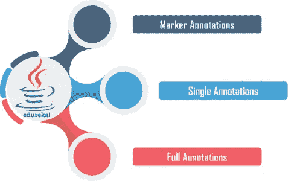
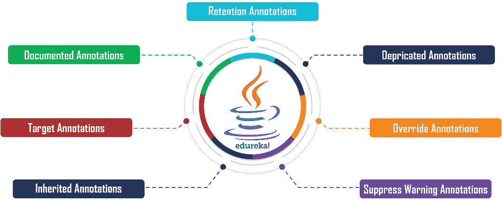
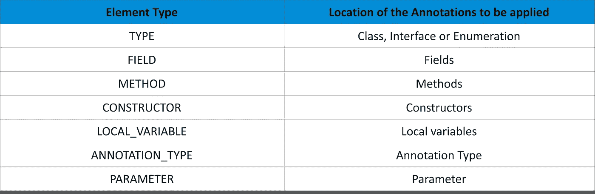

# Java 注释的完整介绍

> 原文：<https://medium.com/edureka/annotations-in-java-9847d531d2bb?source=collection_archive---------5----------------------->


Annotations in Java — Edureka

**Java 中的注释**是一种特殊的 Java 构造，用作源代码中使用的类元素的*装饰性语法元数据*，以提供特殊信息来指导 Java 解释器进行代码翻译。在本文中，我们将讨论以下概念。

*   Java 中的注释是什么？
*   为什么我们需要注释？
*   注释的类型
*   Java 中的内置注释
*   Java 中的自定义注释

# Java 中的注释是什么？

注释用于表示与源代码中使用的*类、接口、方法或字段*相关的语法元数据，以及 java 解释器和 JVM 使用的一些附加信息。在本文中，我们将讨论以下概念。

# 为什么我们需要注释？

## **编译器指令**

内置注释如 **@Override、@Deprecated、**和 **@SuppressWarnings** 为解释器提供了与代码执行相关的信息。例如， *@Override* 用于指示解释器注释的方法正在被覆盖。


## **构建时指令**

注释向解释器提供*构建时/编译时*指令，这些指令被软件构建工具用来生成代码 *Pom。XML* 文件等。


## **运行时指令**

注释可以在*运行时*定义，这样它们就可以在运行时访问，并向程序提供指令。


现在，让我们讨论它们的类型。

# 注释的类型

注释通常分为三种类型，如下所述:



## **标记标注**

标记注释是为了描述其存在的标记而声明的。它们不包含任何成员，这使它们保持为空。 *@Override 是标记注释*的一个例子。

```
package Types; 
@interface MarkerTypeAnnotation{}
```

## **单个标注**

名称本身表明单个注释被设计成在其中包含一个*单个成员*。简写方法用于将值指定给在单个注释中声明的成员。

```
package Types;
[@interface](http://twitter.com/interface) SingleTypeAnnotation{
int member() default 0;
}
```

## **完整注解**

完整或多个注释类似于单个注释，但它们可以包括*多个*成员/名称、值对。

```
package Types;
[@interface](http://twitter.com/interface) FullAnnotationType{  
     int member1() default 1;  
     String member2() default "";  
     String member3() default "abc";  
}
```

Java 也提供了一些内置的注释。

# Java 中的内置注释



## **保留注释**

保留注释旨在为*指示带有注释类型的特定注释将被保留多长时间*。以下是保留注释的示例

```
package Retention;

import java.lang.annotation.Retention;
import java.lang.annotation.RetentionPolicy;

[@Retention](http://twitter.com/Retention)(RetentionPolicy.RUNTIME)
public [@interface](http://twitter.com/interface) EdurekaAnnotation {
     String MethodName();
     String Description();
}

class RetentnionTest{
      [@EdurekaAnnotation](http://twitter.com/EdurekaAnnotation)(MethodName = "Retention Annotation test", Description = "testing annotations")
       public void TestMethod(){
       }
}
```

**弃用注释**

弃用的注释用于通知编译器特定的方法、类或字段*不重要*，并且它指示声明已经过时。

```
package Deprecated;

public class Deprecated {
     [@Deprecated](http://twitter.com/Deprecated)
      public void Display() {
            System.out.println("Deprecated Annotation test Method()");
      }

      public static void main(String args[]) {
            Deprecated Dep = new Deprecated();
            Dep.Display();
      }
}
```

## **覆盖注释**

它是一种标记类型的注释。Override 注释旨在确保超类方法被覆盖，而不是重载。用@Override 注释的方法应该重写超类中的方法，否则将引发编译时错误。

```
package Override;

class Parent {
      public void Display() {
             System.out.println("Parent Class Method exrecuting()");
      }
      public static void main(String args[]) {
      Parent P1 = new Child();
      P1.Display();
      }
}
class Child extends Parent {
     [@Override](http://twitter.com/Override)
      public void Display() {
            System.out.println("Child Class Method exrecuting()");
      }
}
```

## **压制警告标注**

抑制警告注释用于在程序执行期间*消除/抑制*解释器警告。隐藏警告批注可以应用于任何类型的声明。下面是这种注释的一个例子。

```
package SuppressWarning;

class DeprecatedTest {
    [@Deprecated](http://twitter.com/Deprecated)
     public void Display() {
          System.out.println("Deprecated test display()");
     }
}

public class SuppressWarning{
     [@SuppressWarnings](http://twitter.com/SuppressWarnings)({"checked", "deprecation"})
       public static void main(String args[]) {
       DeprecatedTest d1 = new DeprecatedTest();
       d1.Display();
       }
}
```

## **继承注释**

默认情况下，Java 中的注释不会被子类继承。因此，继承的注释标记了将被继承给子类的注释。以下是继承注释的一个示例

```
package Inherited;
       public [@interface](http://twitter.com/interface) MyAnnotation {
}package Inherited;
       public [@interface](http://twitter.com/interface) MyInheritedAnnotation {
}package Inherited;
[@MyAnnotation](http://twitter.com/MyAnnotation)
[@MyInheritedAnnotatio](http://twitter.com/MyInheritedAnnotatio)n
public class BaseClass {
}package Inherited;
public class SubClass extends BaseClass {
}package Inherited;
public class ExampleMain {
      public static void main(String[] args) {
            MyAnnotation myannotation = SubClass.class.getAnnotation(MyAnnotation.class);
            System.out.println(myannotation);
            MyInheritedAnnotation myannotation2 = SubClass.class.getAnnotation(MyInheritedAnnotation.class);
            System.out.println(myannotation2);
     }
}
```

## **目标标注**

目标标签用于指定所用注释的类型。注释库声明了许多常量来指定需要应用注释的元素的类型，如*类型、方法、字段*等。我们可以从**Java . lang . annotation .****element type**中访问目标标签



```
package Target;
public [@interface](http://twitter.com/interface) CustomAnnotation {
}
import java.lang.annotation.ElementType;
import java.lang.annotation.Target;
[@Target](http://twitter.com/Target)({ElementType.METHOD})
public [@interface](http://twitter.com/interface) MyCustomAnnotation {
}
public class target {
      [@CustomAnnotation](http://twitter.com/CustomAnnotation)
       public void myMethod(){
             System.out.println("Hello World");
       }
}
```

## **文档注释**

它是一种标记类型的注记，用于与记录注记的工具进行通信。默认情况下，注释不包含在 Javadoc 注释中。在代码中使用文档化的注释使 Javadoc 能够在结果文档中处理和包含注释类型的信息。

```
package Documented;
import java.lang.annotation.Documented;
[@Documented](http://twitter.com/Documented)
public [@interface](http://twitter.com/interface) DocumentAnnotation {
      class AddNumbers{
             public static void main(String args[]){
                   int x=10,y=20,z;
                   z = x + y;
                  System.out.println("Sum of the integers = " + z);
             }
       }
}
```

## Java 中的自定义注释

Java 定制注释是用户定义的注释，易于创建和使用。@Interface 元素用于声明一个注释。自定义注释的示例如下。

```
package Custom;

import java.lang.annotation.Documented;
import java.lang.annotation.Retention;
import java.lang.annotation.RetentionPolicy;

[@Documented](http://twitter.com/Documented)
[@Retention](http://twitter.com/Retention)(RetentionPolicy.RUNTIME)
@ interface TestAnnotation {
       String Developer() default "Edureka";
       String Expirydate();
}

public class Custom {
        [@TestAnnotation](http://twitter.com/TestAnnotation)(Developer="Rajesh", Expirydate="01-Aug-2026")
         void function1() {
                 System.out.println("Testing Annotation method 1");
          }

         [@TestAnnotation](http://twitter.com/TestAnnotation)(Developer="Anil", Expirydate="01-Oct-2025")
          void function2() {
                System.out.println("Test Annotation method 2");
          }
          public static void main(String args[]) {
                  System.out.println("Customized Annotations Example");
          }
}
```

就这样，我们来到了这篇文章的结尾。我希望您已经理解了 Java 中注释的基础知识，它的类型以及 Java 中可用的内置注释。

如果你想查看更多关于人工智能、DevOps、道德黑客等市场最热门技术的文章，你可以参考 Edureka 的官方网站。

请留意本系列中的其他文章，它们将解释 Java 的各个方面。

> 1.[面向对象编程](/edureka/object-oriented-programming-b29cfd50eca0)
> 
> 2.[Java 中的继承](/edureka/inheritance-in-java-f638d3ed559e)
> 
> 3.[Java 中的多态性](/edureka/polymorphism-in-java-9559e3641b9b)
> 
> 4.[Java 中的抽象](/edureka/java-abstraction-d2d790c09037)
> 
> 5. [Java 字符串](/edureka/java-string-68e5d0ca331f)
> 
> 6. [Java 数组](/edureka/java-array-tutorial-50299ef85e5)
> 
> 7. [Java 集合](/edureka/java-collections-6d50b013aef8)
> 
> 8. [Java 线程](/edureka/java-thread-bfb08e4eb691)
> 
> 9.[Java servlet 简介](/edureka/java-servlets-62f583d69c7e)
> 
> 10. [Servlet 和 JSP 教程](/edureka/servlet-and-jsp-tutorial-ef2e2ab9ee2a)
> 
> 11.[Java 中的异常处理](/edureka/java-exception-handling-7bd07435508c)
> 
> 12.[高级 Java 教程](/edureka/advanced-java-tutorial-f6ebac5175ec)
> 
> 13. [Java 面试问题](/edureka/java-interview-questions-1d59b9c53973)
> 
> 14. [Java 程序](/edureka/java-programs-1e3220df2e76)
> 
> 15.[科特林 vs Java](/edureka/kotlin-vs-java-4f8653f38c04)
> 
> 16.[依赖注入使用 Spring Boot](/edureka/what-is-dependency-injection-5006b53af782)
> 
> 17.[Java 中的可比](/edureka/comparable-in-java-e9cfa7be7ff7)
> 
> 18.[十大 Java 框架](/edureka/java-frameworks-5d52f3211f39)
> 
> 19. [Java 反射 API](/edureka/java-reflection-api-d38f3f5513fc)
> 
> 20.[Java 中的 30 大模式](/edureka/pattern-programs-in-java-f33186c711c8)
> 
> 21.[核心 Java 备忘单](/edureka/java-cheat-sheet-3ad4d174012c)
> 
> 22.[Java 中的套接字编程](/edureka/socket-programming-in-java-f09b82facd0)
> 
> 23. [Java OOP 备忘单](/edureka/java-oop-cheat-sheet-9c6ebb5e1175)
> 
> 24. [Java 教程](/edureka/java-tutorial-bbdd28a2acd7)
> 
> 25.[Java 中的图书管理系统项目](/edureka/library-management-system-project-in-java-b003acba7f17)
> 
> 26.[Java 中的树](/edureka/java-binary-tree-caede8dfada5)
> 
> 27.[Java 中的机器学习](/edureka/machine-learning-in-java-db872998f368)
> 
> 28.[Java 中的顶级数据结构&算法](/edureka/data-structures-algorithms-in-java-d27e915db1c5)
> 
> 29. [Java 开发者技能](/edureka/java-developer-skills-83983e3d3b92)
> 
> 30.[前 55 名 Servlet 面试问题](/edureka/servlet-interview-questions-266b8fbb4b2d)
> 
> 31. [](/edureka/java-exception-handling-7bd07435508c) [顶级 Java 项目](/edureka/java-projects-db51097281e3)
> 
> 32. [Java 字符串备忘单](/edureka/java-string-cheat-sheet-9a91a6b46540)
> 
> 33.[Java 中的嵌套类](/edureka/nested-classes-java-f1987805e7e3)
> 
> 34. [Java 集合面试问答](/edureka/java-collections-interview-questions-162c5d7ef078)
> 
> 35.[Java 中如何处理死锁？](/edureka/deadlock-in-java-5d1e4f0338d5)
> 
> 36.[你需要知道的 50 大 Java 集合面试问题](/edureka/java-collections-interview-questions-6d20f552773e)
> 
> 37.[Java 中的字符串池是什么概念？](/edureka/java-string-pool-5b5b3b327bdf)
> 
> 38.[C、C++和 Java 有什么区别？](/edureka/difference-between-c-cpp-and-java-625c4e91fb95)
> 
> 39.[Java 中的回文——如何检查一个数字或字符串？](/edureka/palindrome-in-java-5d116eb8755a)
> 
> 40.[你需要知道的顶级 MVC 面试问答](/edureka/mvc-interview-questions-cd568f6d7c2e)
> 
> 41.[Java 编程语言的十大应用](/edureka/applications-of-java-11e64f9588b0)
> 
> 42.[Java 中的死锁](/edureka/deadlock-in-java-5d1e4f0338d5)
> 
> 43.[Java 中的平方和平方根](/edureka/java-sqrt-method-59354a700571)
> 
> 44.[Java 中的类型转换](/edureka/type-casting-in-java-ac4cd7e0bbe1)
> 
> 45.[Java 中的运算符及其类型](/edureka/operators-in-java-fd05a7445c0a)
> 
> 46.[Java 中的析构函数](/edureka/destructor-in-java-21cc46ed48fc)
> 
> 47.[Java 中的二分搜索法](/edureka/binary-search-in-java-cf40e927a8d3)
> 
> 48.[Java 中的 MVC 架构](/edureka/mvc-architecture-in-java-a85952ae2684)
> 
> 49.[冬眠面试问答](/edureka/hibernate-interview-questions-78b45ec5cce8)

*原载于 2019 年 8 月 7 日*[*https://www.edureka.co*](https://www.edureka.co/blog/annotations-in-java/)*。*