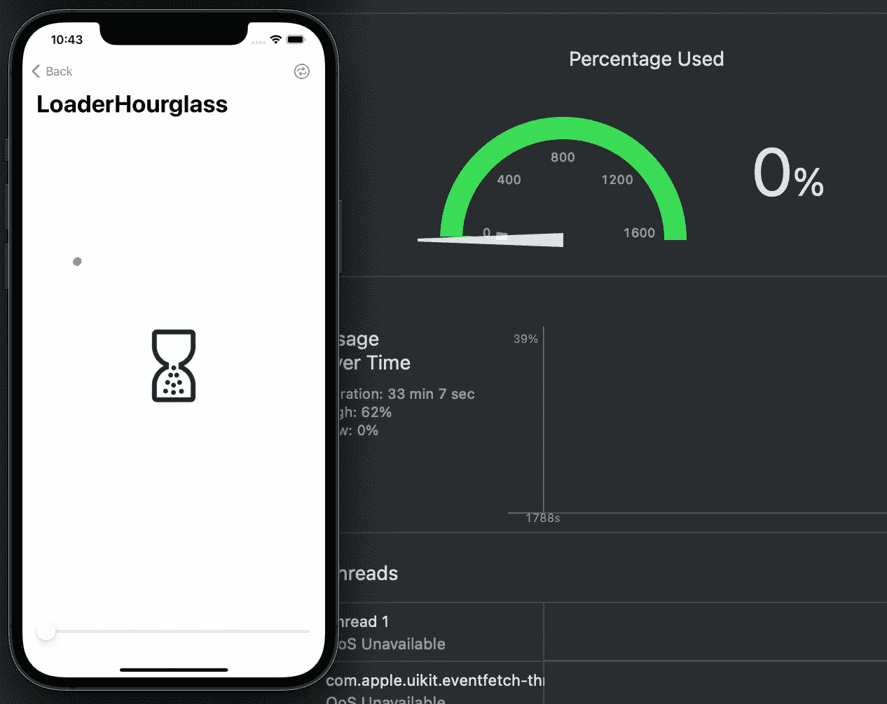

# 宣布 Lottie 4.0 for 版

> 原文：<https://medium.com/airbnb-engineering/announcing-lottie-4-0-for-ios-d4d226862a54?source=collection_archive---------0----------------------->

一个新的渲染引擎，由核心动画提供支持，显著提高了性能

**作者:** [卡尔·斯蒂芬斯](https://www.linkedin.com/in/calstephens/)

[**洛蒂**](https://airbnb.design/lottie/) 是 Airbnb 的[跨平台](https://airbnb.io/lottie/#/README)，[开源](https://github.com/airbnb/lottie-ios)库，用于渲染矢量运动图形。我们在 Airbnb 广泛使用 Lottie，它也为整个行业数以千计的其他应用程序提供动画。

Example Lottie animations included in Airbnb’s iOS app

今天我们发布 iOS 版的 [**洛蒂 4.0**](https://github.com/airbnb/lottie-ios/releases/tag/4.0.0) 。这个重要的新版本为所有洛蒂动画带来了**显著的性能提升**，它拥有一个由核心动画驱动的全新渲染引擎。

在大规模使用 Lottie 多年后，我们已经了解了它在真实使用案例中的许多性能特征。我们发现洛蒂动画在一些更复杂的屏幕上丢帧是相对常见的。为了理解为什么，我们首先要看看洛蒂以前是如何渲染动画的。

Lottie 以前的版本在应用程序的主线程上播放动画，有效地使用了一个[*CADisplayLink*](https://developer.apple.com/documentation/quartzcore/cadisplaylink?language=objc)。每帧一次，Lottie 将在主线程上执行代码，以推进动画的进度并重新呈现其内容。这意味着动画在播放时将消耗 5–20%以上的 CPU，留给应用程序其余部分的 CPU 周期更少:

*Playing an animation with Lottie 3.5.0, using the original main thread rendering engine*

这也意味着当主线程繁忙时，动画不会更新。这可能会导致动画丢帧或完全冻结，从而导致用户体验不佳:

*Lottie animations dropping frames when the main thread is overloaded*

这些问题是使用主线程绑定渲染架构的固有限制。

在 iOS 上，播放动画最高效的方式是使用[核心动画](https://developer.apple.com/documentation/quartzcore?language=objc)。该系统框架通过 GPU 硬件加速在进程外渲染动画。动画回放由一个称为“渲染服务器”的独立系统进程管理。这意味着核心动画驱动的动画不会影响应用程序进程本身的 CPU 利用率，即使其主线程被阻塞或繁忙，也可以继续运行。

在整个 2022 年，我们一直在为 Lottie 开发一个基于核心动画的新渲染引擎。对于动画 JSON 文件中的每个层，新引擎都会构建一个 *CALayer* 并应用 *CAAnimation* s 以及层的动画属性的关键帧。Lottie 将这些动画关键帧传递给核心动画，核心动画负责将它们实际渲染到屏幕上，并更新每一帧的动画。

这个新的引擎消除了播放洛蒂动画的 CPU 开销，并有效地保证了洛蒂动画将以 60 或 120 fps 的速度流畅地播放，而不管应用的 CPU 负载如何。

*Playing an animation with Lottie 4.0, using the new Core Animation rendering engine*

由于新引擎渲染的动画不会在应用程序的主线程上执行任何代码，因此应用程序现在有更多资源可用于其他功能。这在运行高 CPU 负载的任务时尤其有价值。例如，Airbnb 应用程序在第一次启动时会显示一个 Lottie 动画。我们在这里做了一个实验，发现切换到新的渲染引擎*减少了*我们应用的总启动时间，而*也提高了启动动画的帧率和 UX。*

我们[在今年早些时候首次在 Lottie 3.4.0 中引入了核心动画渲染引擎](https://github.com/airbnb/lottie-ios/discussions/1627)，隐藏在一个选择加入功能标志之后。六个多月来，我们一直在默认情况下为 Airbnb 应用程序中的所有 Lottie 动画使用新引擎，并一直在努力解决社区中早期采用者报告的问题。

从今天的 Lottie 4.0 版本开始，核心动画渲染引擎默认为所有使用 Lottie 的应用程序启用，应用程序开发人员无需额外工作或迁移。这是一个重要的里程碑，我们已经为此努力了很长时间，我们希望它有助于提高整个行业的动画质量和性能！

Lottie 4.0 for iOS 还包括社区成员贡献的几项重大增强功能:

*   支持 [dotLottie 动画文件](https://dotlottie.io/)，比标准 JSON 文件小得多
*   新的动画解码实现比之前基于*可编码*的实现快 2 倍

在我们之前发布的帖子中，您可以了解更多关于 Lottie 的信息，以及我们对开源的承诺:

*   [介绍洛蒂](https://airbnb.design/introducing-lottie/):我们新的开源动画工具的幕后
*   将洛蒂迅速带入未来 : 这是一个关于 Airbnb 如何用一种新语言改写流行的开源图书馆洛蒂的个人故事

有兴趣在 Airbnb 工作吗？查看这些开放的角色:

[软件工程师，愿望清单](https://careers.airbnb.com/positions/4693375/)

[员工软件工程师，嘉宾&主持人](https://careers.airbnb.com/positions/4665949/)

# 感谢

非常感谢 Eric Horacek 首先提出这个项目，并在过去的一年里审查了 100 多个拉请求。还要感谢《洛蒂》的原作者布兰登·威斯罗，以及这些年来给予帮助的许多其他贡献者。

*所有产品名称、标识和品牌均为其各自所有者的财产。本网站中使用的所有公司、产品和服务名称仅用于识别目的。使用这些名称、标志和品牌并不意味着认可。*