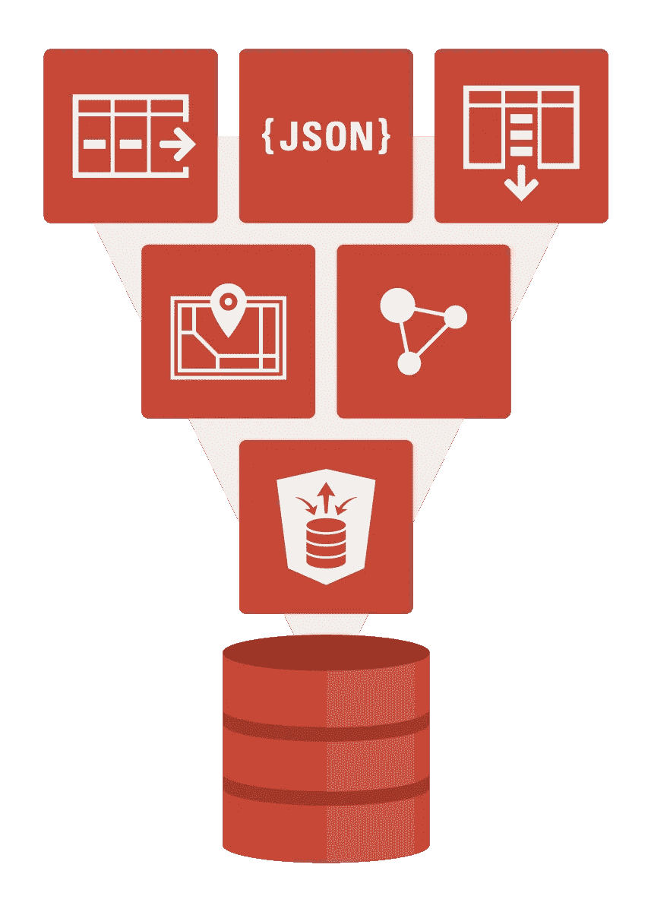
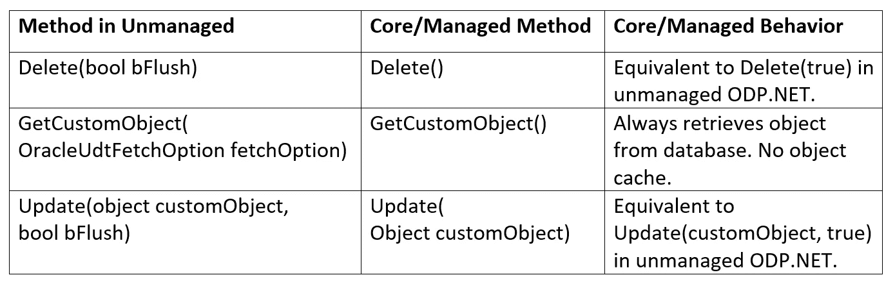
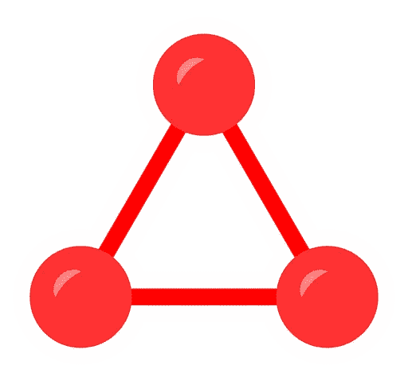

# 宣布推出 ODP.NET 21.3—托管 ODP.NET 和 ODP.NET 核心的用户定义类型

> 原文：<https://medium.com/oracledevs/announcing-odp-net-21-3-user-defined-types-for-managed-odp-net-and-odp-net-core-836fa81da3ba?source=collection_archive---------0----------------------->

我很高兴地宣布，第二个 ODP.NET 21c 版本 21.3，现在可以在 NuGet Gallery 上为[管理的 ODP.NET](https://www.nuget.org/packages/Oracle.ManagedDataAccess/21.3.0)和[ODP.NET 核心](https://www.nuget.org/packages/Oracle.ManagedDataAccess.Core/3.21.3)提供。非托管 ODP.NET 21.3。

这是第一个托管的 ODP.NET 21c 版本，为带来了许多新的 Oracle 数据库功能。NET 框架开发人员。这些新特性包括二进制 JSON 数据类型、客户端发起的连续查询通知、分片等等。如果你想了解更多，这些新的[ODP.NET 21c 的特性在之前的博客文章](/oracledevs/introducing-odp-net-21c-ef-core-5-json-and-more-ea0843e89dea)中有描述。在这篇博文中，我将重点介绍许多开发人员一直在寻求的主要的新用户定义类型(UDT)特性。udt 通常用在对象关系应用程序中。

# ODP。净 udt

Oracle 数据库 udt 允许开发人员更轻松地处理复杂的数据集。业务数据可以以更自然的形式存在。数据库和。NET 应用程序可以将实体作为一个单元来管理，这提高了生产率和效率。许多不同的 Oracle 数据库组件固有地使用 udt，如 Oracle Spatial 和 XML DB，以及客户为处理其业务数据实体而创建的无数自定义类型。

ODP。NET 支持两种 Oracle UDT 类型:

*   对象类型，如 Oracle 对象
*   集合类型，比如`VARRAY`类型和嵌套表类型。

此外，ODP.NET 支持对对象类型的引用(`REF`)。

历史上，非托管 ODP.NET 支持 udt。就像非托管的 ODP.NET 一样，托管的 ODP.NET 和 ODP.NET 核心应用将 Oracle 数据库 udt 表示为。NET 自定义类型。应用必须适用。NET 属性应用于自定义类和结构，以及它们的公共字段和属性。托管 ODP.NET 和 ODP.NET 核心也存在同样的流程。

我已经在 GitHub 上发布了几个[ODP.NET·UDT 代码示例](https://github.com/oracle/dotnet-db-samples/tree/master/samples/udt)来帮助托管的 ODP.NET 和 ODP.NET 核心开发者入门。这些示例涵盖了常见的使用场景:

*   `Object-UDT.cs`:映射、获取和操作一个 UDT 的. NET 定制对象
*   `Spatial-UDT.cs`:映射和提取 Oracle Spatial 类型作为定制类型
*   `VArray.cs`:将`VARRAY`作为自定义对象进行映射、提取和操作
*   `Nested-Table.cs`:映射、获取和操作具有继承层次结构(即父类型和子类型)的 udt 的嵌套表
*   `Ref.cs`:取被 REFs 引用的 udt
*   `Ref-Inheritance.cs`:从 OracleRef 对象获取自定义类型对象，通过 OracleRef 对象更新 udt，并从 OracleRef 对象获取具有继承层次结构
    的 udt 的适当
    实例类型

您会注意到，托管 ODP.NET 和 ODP.NET 核心只有一套示例代码。那是因为代码完全一样。这两个提供者共享相同的 UDT API 和配置选项。

与非托管的 ODP.NET 相比，托管的 ODP.NET 和 ODP.NET 核心在功能和 API 方面相当。这种近乎对等的优势使得将现有的无人管理的 ODP.NET·UDT 应用迁移到托管的 ODP.NET 或 ODP.NET 核心变得更加简单。对于许多应用程序来说，迁移只是搜索和替换几行代码。

# **ODP.NET 供应商之间的 UDT 差异**

托管 ODP.NET 和 ODP.NET 核心支持与非托管 ODP.NET 相同的大多数 UDT API 和功能。存在一些 API 和配置差异。让我详细介绍一下。

## 不支持 XML 配置文件

受管 ODP.NET 和 ODP.NET 核心不支持通过 XML 配置文件(如 app.config 或 web.config)进行 Oracle 自定义类型映射。对于这些提供程序，自定义类型映射通过使用`OracleCustomTypeMapping`属性进行。

## **OracleUdt FromCustomObject 和 ToCustomObject 方法变更**

非托管 ODP.NET 的`OracleUdt` `FromCustomObject`和`ToCustomObject`方法声明有:

*   FromCustomObject(Oracle connection con，**IntPtr po object**)
*   to custom object(Oracle connection con，**IntPtr po object**

对于托管 ODP.NET 和 ODP.NET 核心，声明分别为:

*   FromCustomObject(Oracle connection con，**object po object**
*   to custom object(Oracle connection con，**object po object**

第二个参数是对象而不是指针。

## OracleUdt 静态方法

`OracleUdt`静态方法、`GetValue`、`IsDBNull`、`SetValue`及其重载在非托管 ODP.NET 中都有一个指针(InPtr)参数。对于托管 ODP.NET 和 ODP.NET 核心，指针被替换为表示 UDT 的对象。在非托管 ODP.NET 中，静态方法有:

**GetValue**

*   GetValue(OracleConnection con， **IntPtr pUdt** ，字符串属性)
*   GetValue(OracleConnection con， **IntPtr pUdt** ，int attrIndex)
*   GetValue(OracleConnection con， **IntPtr pUdt** ，string attrName，out object statusArray)
*   GetValue(OracleConnection con， **IntPtr pUdt** ，int attrIndex，out object statusArray)

**IsDBNull**

*   IsDBNull(OracleConnection con， **IntPtr pUdt** ，字符串属性)
*   IsDBNull(OracleConnection con， **IntPtr pUdt** ，int attrIndex)

**设定值**

*   SetValue(OracleConnection con， **IntPtr pUdt** ，字符串属性，对象值)
*   SetValue(OracleConnection con， **IntPtr pUdt** ，int attrIndex，object value)
*   SetValue(OracleConnection con， **IntPtr pUdt** ，字符串属性，对象值，对象状态数组)
*   SetValue(OracleConnection con， **IntPtr pUdt** ，int attrIndex，object value，object statusArray)

托管 ODP.NET 和 ODP.NET 核心静态方法分别是:

**GetValue**

*   GetValue(OracleConnection con，**对象 udt** ，字符串属性)
*   GetValue(OracleConnection con， **object udt** ，int attrIndex)
*   GetValue(OracleConnection con，**对象 udt** ，字符串属性，输出对象状态数组)
*   GetValue(OracleConnection con，**对象 udt** ，int 属性索引，out 对象状态数组)

**IsDBNull**

*   IsDBNull(OracleConnection con，**对象 udt** ，字符串属性)
*   IsDBNull(OracleConnection con， **object udt** ，int attrIndex)

**设定值**

*   SetValue(OracleConnection con，**对象 udt** ，字符串属性，对象值)
*   SetValue(OracleConnection con，**对象 udt** ，int 属性索引，对象值)
*   SetValue(OracleConnection con，**对象 udt** ，字符串属性，对象值，对象状态数组)
*   SetValue(OracleConnection con，**对象 udt** ，int 属性索引，对象值，对象状态数组)

## **OracleConnection 类变更**

托管 ODP.NET 和 ODP.NET 核心不支持以下`OracleConnection`方法:

*   FlushCache()

## **OracleRef 类变更**

托管 ODP.NET 和 ODP.NET 核心不支持对象缓存和一些没有托管代码实现的附加功能。因此，托管和核心 ODP 中不支持以下非托管 ODP.NET`OracleRef`类成员。网络:

**构造函数**

*   OracleRef(OracleConnection conn，string udtTypeName，string objTableName)
*   OracleRef(OracleConnection conn，string hexStr)

**方法**

*   齐平()
*   GetCustomObject(OracleUdtFetchOption fetchOption，int depthLevel)
*   GetCustomObjectForUpdate(bool bWait)
*   GetCustomObjectForUpdate(bool bWait，int depthLevel)
*   锁定(布尔等待)

**属性**

*   HasChanges {get}
*   ObjectTableName {get}

以修改的方式支持以下`OracleRef`类成员:

# **从不受管理的 ODP.NET 迁移到受管理的 ODP.NET 或 ODP.NET 核心**

要将 UDT 应用从不受管理的 ODP.NET 迁移到受管理的 ODP.NET 或 ODP.NET 核心，需要进行以下更改:

**装配**

在您的中引用托管的 ODP.NET 或 ODP.NET 核心部件(即 Oracle.ManagedDataAccess.dll)。NET 项目。

**名称空间**

在源文件中使用`Oracle.ManagedDataAccess`名称空间，包括`Oracle.ManagedDataAccess.Client`和`Oracle.ManagedDataAccess.Types`。

**配置**

使用`OracleCustomTypeMapping`属性定义自定义类型映射。

**原料药**

使用托管的 ODP.NET 和 ODP.NET 核心等效 API，包括:

*   自定义类中的`OracleUdt` `FromCustomObject`和`ToCustomObject`方法
*   `OracleUdt`静态方法
*   `OracleRef` 类调用，包括构造函数、属性和方法

# **面向 Visual Studio 的 Oracle 开发人员工具**

Oracle Developer Tools(ODT)for Visual Studio 是一款流行的设计时工具。它是一个图形用户界面，用于执行常见的开发人员数据库管理任务和开发 Oracle。网络应用。目前，使用托管 ODP.NET 或 ODP.NET 核心，ODT 不支持 udt 或自定义类型代码生成。

然而，开发人员仍然可以迁移生成的非托管 ODP.NET 自定义代码，以使用托管 ODP.NET 或 ODP.NET 核心。

# **接下来的步骤和下一步是什么**

你可以在[托管 ODP.NET](https://www.nuget.org/packages/Oracle.ManagedDataAccess/21.3.0)和[ODP.NET 核心](https://www.nuget.org/packages/Oracle.ManagedDataAccess.Core/3.21.3)中尝试新的 UDT 支持来开发对象关系应用。新的托管 ODP.NET 21c 版本包括新的二进制 JSON 数据类型、客户端启动的连续查询通知、分片以及更多的数据库功能。网络应用。

展望未来，我们正致力于许多令人兴奋的事情，希望在不久的将来发布。在未来的版本中，ODT 将支持使用 udt 并通过托管 ODP.NET 生成自定义类型代码。ODP.NET 核心将增加更多的 Linux 发行认证。所有类型的 ODP.NET 提供程序都将增强对 Docker 的支持。甲骨文将证明。2021 年底 NET 6 和 EF Core 6。

敬请期待！