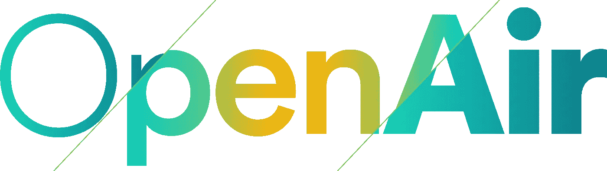

# 宣布 OpenAir 2016

> 原文：<https://medium.com/airbnb-engineering/announcing-openair-2016-93e57dc56e49?source=collection_archive---------2----------------------->

我们很高兴地宣布，Airbnb 将于 6 月 8 日上午 9:00-下午 5:00 在 CityView Metreon 举办我们的年度技术大会 [OpenAir](http://openair.byairbnb.com/) 。

[去年](http://airbnb.io/events/open-air/)我们专注于扩展人际关系，今年我们将扩展这一概念。OpenAir 2016 是关于个性化的。随着我们继续开发在现实世界和网络中投入使用的产品，我们需要考虑如何理解人们，他们想要什么，如何将他们联系起来，以及他们对社会的影响。

我们将讨论身份、匹配、信任和安全、机器学习、声誉等问题。

今年，我们将有一组非常强大的演讲者和小组来讨论这些主题，包括:

*   斯泰西·布朗-菲尔波特， [Taskrabbit](https://www.taskrabbit.com/) 的首席执行官，讨论工作的未来
*   思科公司的 Monique Morrow 分享了技术如何帮助实现性别中立
*   [首席执行官麦克斯·拉夫琴肯定](http://affirm.com)，分享不可阻挡的技术趋势
*   Joe Gebbia，Airbnb 的创始人，和斯坦福大学的研究人员一起讨论关于信任的研究
*   Fin 公司的萨姆·莱辛在讨论声誉的未来

与会者将有机会参加技术讲座、实践会议和发人深省的讨论，以帮助解决当今技术和社会中的一些最大挑战和项目。全天将有时间与当地工程师、设计师、数据科学家、学者交流，参加互动会议，参加闪电讲座，并会见演讲者。

注册费为 50 美元，所有收入，减去注册费，将捐赠给 [CODE2040](http://www.code2040.org/) 。CODE2040 是一个非营利组织，它创建了一些项目来增加黑人和拉丁美洲人在创新经济中的代表性。CODE2040 相信，如果未来的公司、项目和产品的创建中包括来自各种背景的人才，那么技术部门、有色人种社区和整个国家将会变得更加强大。

请在这里注册。