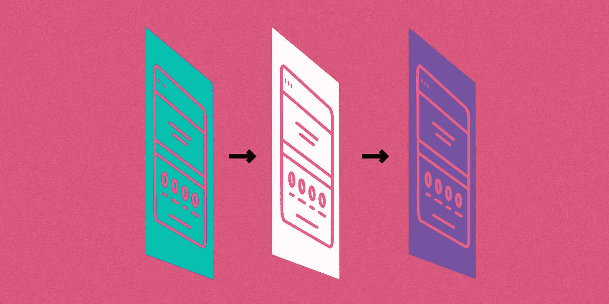

# 宣布 Square Connect v2 库存 API

> 原文：<https://medium.com/square-corner-blog/announcing-square-connect-v2-inventory-api-13acd4faad85?source=collection_archive---------5----------------------->

> 注意，我们已经行动了！如果您想继续了解 Square 的最新技术内容，请访问我们的新家[https://developer.squareup.com/blog](https://developer.squareup.com/blog)

我们非常高兴地宣布发布库存 API 来连接 v2。在此版本中，我们显著升级了清单 API 的功能。如果您还没有实现 Connect v1 清单 API，那么您来的正是时候。如果您是 v1 用户，请阅读即将推出的所有激动人心的新特性。

然而，我们不是唯一感到兴奋的人——让我们的一位合作伙伴告诉你:

> “O 我们的商家需要实时、准确的库存数据来有效运营业务并做出明智的决策。借助 Square 的 v2 Inventory API，我们不仅能够满足这一期望，还能提供以前不可能实现的新功能。”
> 
> — Nate Stewart，BigCommerce 战略合作伙伴计划总监

**这个版本有什么内容**

*   [批量更新库存](https://docs.connect.squareup.com/products/inventory/overview#batched-state-transitions)
*   [查看库存调整的历史记录](https://docs.connect.squareup.com/products/inventory/setup#optional-retrieve-the-history-of-inventory-changes-for-an)
*   [在状态](https://docs.connect.squareup.com/products/inventory/overview#special-inventorystate-values) ( `IN_STOCK`、`WASTE`、`SOLD`等)之间移动库存
*   [查看哪些应用程序进行了库存调整](https://docs.connect.squareup.com/products/inventory/setup#optional-retrieve-the-history-of-inventory-changes-for-an)
*   [设置调整事件发生的时间](https://docs.connect.squareup.com/products/inventory/overview#client-timestamp-versus-adjustment-request-order)
*   删除了库存调整的备注字段

**新功能:批量更新库存**

无需单独调整库存项目:您现在可以批量进行库存调整和检索，以节省 API 调用和时间。

**新功能:查看库存调整历史**

库存调整历史记录允许您显示服务中的历史记录，并使用物料差异分类帐来调节库存。在 Connect v1 的库存中，当您查找库存项目变化时，您只能得到一个计数，现在，您可以全面了解您、卖方或其他第三方可能进行的任何调整的历史记录。

**新功能:在状态间移动库存**

您现在可以通过预定义的状态(例如，`IN_STOCK`、`WASTE`等)移动项目变化的数量。).这使您可以跟踪对库存项目进行的准确调整。现在，您可以查看在特定时间段内有多少物品被损坏，或者有多少物品被接收的信息。

Square 的库存 API 支持给定数量的项目变化的以下库存状态:

*   `NONE`
*   `IN_STOCK`
*   `SOLD`
*   `RETURNED_BY_CUSTOMER`
*   `UNLINKED_RETURN`
*   `WASTE`

**新功能:查看哪些应用程序进行了库存调整**

现在，您可以查看特定应用程序进行了哪些调整。你可以通过与 Square 的仪表盘或其他应用程序中调整的内容进行比较，来判断谁在历史上调整了库存。您还可以查看某个销售调整链接到哪个账单。

**新功能:设置调整事件发生的时间**

通过添加一个`occurred_at`时间，您可以指定事件在过去 24 小时内发生的时间。您可以使用它来更好地同步 Square 中的库存和任何其他库存系统。

**已弃用:库存调整的备注字段**

我们删除了 memo 字段，现在这个特性更好地融入了新的“states”和“inventory history”特性。

**在 GitHub 上找到最新的 SDK 及其文档:**

PHP:[https://github.com/square/connect-php-sdk](https://github.com/square/connect-php-sdk)

C#/。网:【https://github.com/square/connect-csharp-sdk 

红宝石:[https://github.com/square/connect-ruby-sdk](https://github.com/square/connect-ruby-sdk)

蟒蛇:[https://github.com/square/connect-python-sdk](https://github.com/square/connect-python-sdk)

JavaScript(节点):[https://github.com/square/connect-javascript-sdk](https://github.com/square/connect-javascript-sdk)

爪哇:【https://github.com/square/connect-java-sdk 

想要更多吗？[注册](https://www.workwithsquare.com/developer-newsletter.html?channel=Online%20Social&sqmethod=Blog)我们每月的开发者简讯或者来 Square dev [Slack 频道](https://squ.re/slack)打招呼！