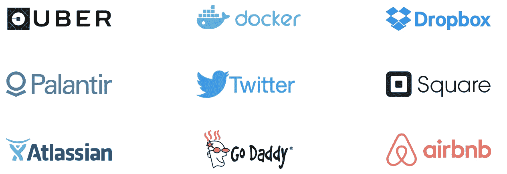

# 宣布供应商安全联盟

> 原文：<https://medium.com/square-corner-blog/announcing-the-vendor-security-alliance-cb247e3f12a2?source=collection_archive---------4----------------------->

> 注意，我们已经行动了！如果您想继续了解 Square 的最新技术内容，请访问我们的新家[https://developer.squareup.com/blog](https://developer.squareup.com/blog)

在 Square，我们保护数据就像我们的业务依赖于它一样，因为它确实如此。我们遵循行业领先的标准来管理我们的网络、保护我们的 web 和客户端应用程序，并在我们的整个组织中制定策略。

我们相信我们的外部合作伙伴应该遵循我们自己所坚持的标准。我们投入大量时间和资源审查供应商:审查他们的政策，提供反馈，并推动更严格和更强的标准。

The VSA’s founding members.

这就是为什么我们很高兴成为[供应商安全联盟](https://www.vendorsecurityalliance.org/)的创始成员，这是一个公司联盟，旨在简化和加强供应商的网络安全审查流程。我们正在与行业领导者合作，包括 [Atlassian](http://blogs.atlassian.com/2016/09/vendor-security-alliance/) 、[优步](https://newsroom.uber.com/more-secure-tomorrow/)、Airbnb、Docker、Dropbox、GoDaddy、Palantir 和 Twitter，以建立一个单一的组织来促进这些供应商的安全工作，并代表我们所有人这样做。随着我们联合起来推动一个更强大、更安全的生态系统，创建和实施更高的网络安全标准将使公司、客户和供应商受益。

来自每个 VSA 成员公司的专家将合作建立一个强大而全面的调查问卷，用于评估和鉴定潜在供应商的网络安全实践。该调查问卷还将有助于对各行业的当前实践进行基准测试，以及开发和传播标准化的、被广泛接受的网络安全标准。

第一份调查问卷将于 2016 年 10 月 1 日向公众提供。VSA 将每年制定一份新的调查问卷，以确保实践随着技术的进步而发展。

更高的网络安全标准使互联网对每个人来说都更安全。我们很高兴能成为这项重要工作的一部分。欲了解更多信息，请访问[https://www.vendorsecurityalliance.org/.](https://www.vendorsecurityalliance.org/.)