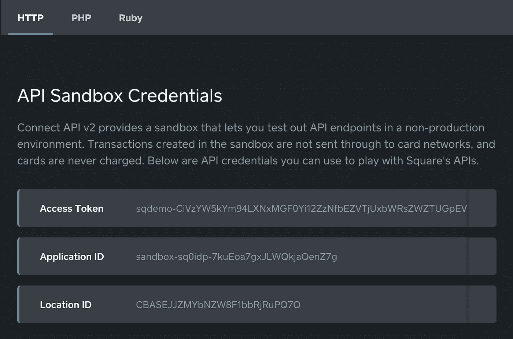

# 匿名沙盒

> 原文：<https://medium.com/square-corner-blog/anonymous-sandbox-789459c92380?source=collection_archive---------2----------------------->

您可能已经注意到，在我们的 API 参考的示例代码部分中有一个新的部分。向你的新匿名沙盒问好！

我们创建了所谓的匿名沙箱，以便于测试和探索我们的 API 的功能。您可以在我们的 [API 参考](https://docs.connect.squareup.com/api/connect/v2/)页面顶部找到您的凭证，它允许您在不登录或创建 Square 帐户的情况下与沙盒环境进行交互。我们使这些凭证持久化，所以您下次访问文档时应该能够使用完全相同的凭证。

## 尝试一下

您可以使用匿名沙盒凭证，就像您将生产和沙盒凭证用于 Square 应用程序一样。下载您喜欢的语言的[客户端库](https://docs.connect.squareup.com/articles/client-libraries/)来添加您的凭证，或者将它们粘贴到我们的[代码示例](https://docs.connect.squareup.com/articles/code-samples/)中。

这个沙箱非常适合尝试 API 请求，只是为了获得响应的感觉，或者进行一些 API 调用，看看您得到了什么，而不用担心在您的“真实”环境中破坏任何东西。

匿名沙箱仍然是新的，现在，你只能使用我们的 V2 API。我们正致力于将它进一步集成到我们的示例代码和文档中，以便开发人员可以尽快开始并运行他们的集成。

我们希望听到您对匿名沙盒的反馈，以及它如何为您测试我们的 API 功能。请在 [@SquareDev](https://twitter.com/SquareDev) 告诉我们您的想法。