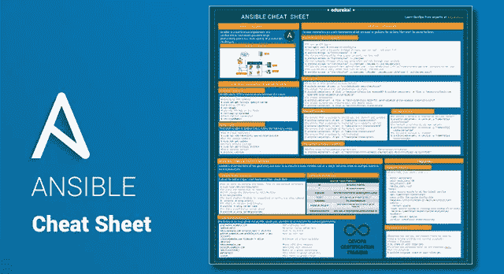
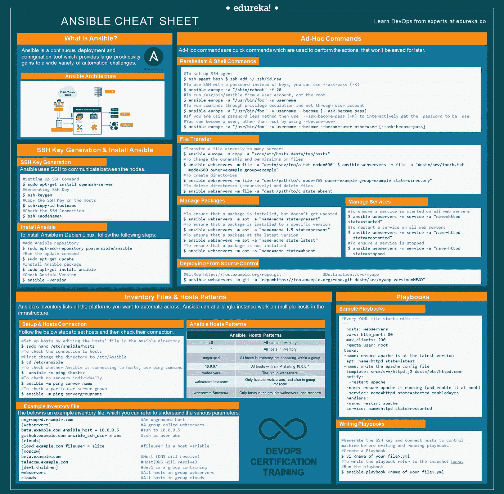
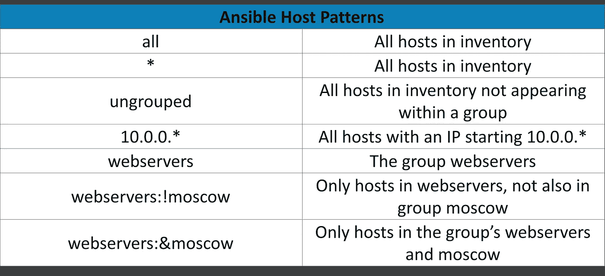

# 可翻译的备忘单 DevOps 快速入门指南

> 原文：<https://medium.com/edureka/ansible-cheat-sheet-guide-5fe615ad65c0?source=collection_archive---------2----------------------->



你是一个有抱负的 DevOps 工程师，期待学习所有的 DevOps 工具吗？好吧，如果你是，那么你应该考虑通过学习所有的顶级工具来掌握 DevOps。你的清单上必须有一个这样的工具是 Ansible。Ansible 是一款*开源 IT* *配置管理**部署* & *编排*工具，旨在为各种各样的自动化挑战提供巨大的生产力增益。Ansible 备忘单旨在让你开始使用 Ansible，并让你理解它的所有基本概念。

# 可翻译的备忘单


**Ansible** 是一个开源的持续部署、配置管理、&编排。该工具旨在为各种各样的自动化挑战提供巨大的生产力增益，并且功能强大到足以自动化复杂的多层 IT 应用程序环境。



# SSH 密钥生成

Ansible 使用 SSH 在节点之间进行通信。

要设置 SSH 连接，请遵循下面提到的步骤:

*   设置 SSH 命令
*   正在生成 SSH 密钥
*   在主机上复制 SSH 密钥
*   检查 SSH 连接

```
#Setting Up SSH Command
$ sudo apt-get install openssh-server

#Generating SSH Key 
$ ssh-keygen

#Copy the SSH Key on the Hosts
$ ssh-copy-id hostname

#Check the SSH Connection 
$ ssh <nodeName>
```

# 安装 Ansible

要在基于 Debian 的 Linux 上安装 Ansible，您可以遵循以下步骤:

*   在安装 Ansible 之前，将 Ansible 存储库添加到您的系统中
*   然后在安装之前运行 update 命令，以更新现有的软件包
*   之后安装 Ansible 包

```
#Add Ansible repository 
$ sudo apt-add-repository ppa:ansible/ansible

#Run the update command 
$ sudo apt-get update

#Install Ansible package 
$ sudo apt-get install ansible

#Check Ansible Version
$ ansible –version
```

# 清单文件和主机模式

Ansible 的清单文件列出了您想要自动化的所有平台。单个实例上的 Ansible 可以在基础结构中的多个主机上工作。也可以同时拥有多个库存文件。

*   主机清单文件可以包含单独或成组的主机名
*   可以通过在方括号中给出组名来创建主机组
*   然后，组成员可以列在下面，直到出现换行符

## 设置并检查主机连接

按照以下步骤设置主机，然后检查它们的连接。

```
#Set up hosts by editing the hosts' file in the Ansible directory
$ sudo nano /etc/ansible/hosts

#To check the connection to hosts
#Change your directory to /etc/Ansible 
$ cd /etc/ansible

#Ansible’s ping module allows you to check whether Ansible is connecting to hosts 
$  ansible –m ping <hosts>

#To check on servers individually  
$ ansible -m ping server name

#To check a particular server group 
$ ansible -m ping servergroupname
```

## 易变宿主模式

请参考下表以了解可行的主机模式，如行动手册中所述。



## 库存文件示例

下面是一个示例库存文件，您可以参考它来了解各种参数。

```
Default location for host file
$ /etc/ansible/hosts#To define location for inventory, in CLI
-i<path>#example host fileungrouped.example.com                        #Anungrouped host[webservers]                           #a group called webservers
beta.example.com ansible_host = 10.0.0.5      #ssh to 10.0.0.5
github.example.com ansible_ssh_user = abc     #ssh as user abc[clouds]
cloud.example.com fileuser = alice            #fileuser is a host variable[moscow]
beta.example.com                           #host (DNS will resolve)
telecom.example.com                        #host(DNS will resolve)[dev1:children]                          #dev1 is a group containing
webservers                            #all hosts in group webservers
clouds                                  #all hosts in group clouds in group clouds
```

# 临时命令

即席命令是用于执行操作的快速命令，不会保存下来供以后使用。

可以使用即席命令执行的一些任务如下:

*   并行性和 Shell 命令
*   文件传输
*   管理包
*   从源代码管理部署
*   管理服务

我将用一个基本的例子来解释所有这些任务。

**基本示例:**重新启动欧洲的所有 web 服务器，一次 20 台。

## 并行性和 Shell 命令

在这一节中，我将告诉您并行性和 shell 的命令。

```
#To set up SSH agent
$ ssh-agent bash
$ ssh-add ~/.ssh/id_rsa#To use SSH with a password instead of keys, you can use --ask-pass (-K)
$ ansible europe -a "/sbin/reboot" -f 20#To run /usr/bin/ansible from a user account, not the root
$ ansible europe -a "/usr/bin/foo" -u username#To run commands through privilege escalation and not through user account
$ ansible europe -a "/usr/bin/foo" -u username --become [--ask-become-pass]#If you are using password less method then use  --ask-become-pass (-K)
#to interactively get the  password to be  used#You can become a user, other than root by using --become-user
$ ansible europe -a "/usr/bin/foo" -u username --become --become-user otheruser [--ask-become-pass]
```

## 文件传输

Ansible 可以将文件安全地并行传输到多台机器上。

```
#Transfer a file directly to many servers
$ ansible europe -m copy -a "src=/etc/hosts dest=/tmp/hosts"#To change the ownership and permissions on files 
$ ansible webservers -m file -a "dest=/srv/foo/a.txt mode=600"
$ ansible webservers -m file -a "dest=/srv/foo/b.txt mode=600 owner=example group=example"#To create directories 
$ ansible webservers -m file -a "dest=/path/to/c mode=755 owner=example group=example state=directory"#To delete directories (recursively) and delete files
$ ansible webservers -m file -a "dest=/path/to/c state=absent"
```

## 管理包

本节包含管理软件包的命令。

```
#To ensure that a package is installed, but doesn’t get updated
$ ansible webservers -m apt -a "name=acme state=present"#To ensure that a package is installed to a specific version
$ ansible webservers -m apt -a "name=acme-1.5 state=present"#To ensure that a package at the latest version
$ ansible webservers -m apt -a "name=acme state=latest"#To ensure that a package is not installed
$ ansible webservers -m apt -a "name=acme state=absent"
```

## 从源代码管理部署

本节包含的命令告诉您如何直接从 git 部署 web 应用程序。

```
#GitRep:https://foo.example.org/repo.git
#Destination:/src/myapp
$ ansible webservers -m git -a "repo=https://foo.example.org/repo.git dest=/src/myapp version=HEAD"
```

## 管理服务

本节包含管理服务的命令。

```
#To ensure a service is started on all web servers
$ ansible webservers -m service -a "name=httpd state=started"

#To restart a service on all web servers
$ ansible webservers -m service -a "name=httpd state=restarted"

#To ensure a service is stopped
$ ansible webservers -m service -a "name=httpd state=stopped
```

# 剧本

Ansible 中的剧本是以 YAML 格式编写的。它是一种人类可读的数据序列化语言，通常用于配置文件。它还可以用于存储数据的许多应用中。

剧本有各种您需要提到的参数，比如主机和用户、变量、任务、处理程序、模块和返回值。

## 剧本样本

这是启动 Apache httpd 服务器程序的样例剧本。

```
#Every YAML file starts with ---
---
- hosts: webservers
  vars:
    http_port: 80
    max_clients: 200
  remote_user: root

  tasks:
  - name: ensure apache is at the latest version
    apt: name=httpd state=latest
  - name: write the apache config file
    template: src=/srv/httpd.j2 dest=/etc/httpd.conf
    notify:
    - restart apache
  - name: ensure apache is running (and enable it at boot)
    service: name=httpd state=started enabled=yes

  handlers:
    - name: restart apache
      service: name=httpd state=restarted
```

## 写剧本

按照以下步骤编写行动手册。为了便于理解，命令采用通用格式。

```
#SSH Key Generation
$ ssh key-gen

#Copy the  generated public SSH key on your hosts
**$** ssh-copy-id -i root@<IP address of your host>

# List the IP addresses of your hosts/nodes in your inventory 
$ vi /etc/ansible/hosts

#Ping to ensure a connection has been established
$ ansible -m ping <Name of the Host>

#You do not have to follow the above steps, if you already have host connected to the control machine.

#Create a Playbook
$ vi <name of your file>.yml

#To write the playbook refer to the snapshot [here.](https://www.edureka.co/blog/ansible-tutorial/#hands_on)

#Run the playbook
$ ansible-playbook <name of your file>.yml
```

## [下载 Ansible Cheat Sheet Edureka](http://bit.ly/2N46jCH)

如果你想查看更多关于人工智能、Python、道德黑客等市场最热门技术的文章，你可以参考 [Edureka 的官方网站。](https://www.edureka.co/blog/?utm_source=medium&utm_medium=content-link&utm_campaign=ansible-cheat-sheet-guide)

请留意本系列中的其他文章，它们将解释 DevOps 的各个方面。

> *1。* [*DevOps 教程*](/edureka/devops-tutorial-89363dac9d3f)
> 
> *2。* [*Git 教程*](/edureka/git-tutorial-da652b566ece)
> 
> *3。* [*詹金斯教程*](/edureka/jenkins-tutorial-68110a2b4bb3)
> 
> *4。* [*Docker 教程*](/edureka/docker-tutorial-9a6a6140d917)
> 
> *5。* [*Ansible 教程*](/edureka/ansible-tutorial-9a6794a49b23)
> 
> *6。* [*木偶教程*](/edureka/puppet-tutorial-848861e45cc2)
> 
> *7。* [*厨师教程*](/edureka/chef-tutorial-8205607f4564)
> 
> *8。* [*Nagios 教程*](/edureka/nagios-tutorial-e63e2a744cc8)
> 
> *9。* [*如何编排 DevOps 工具？*](/edureka/devops-tools-56e7d68994af)
> 
> *10。* [*连续交货*](/edureka/continuous-delivery-5ca2358aedd8)
> 
> *11。* [*持续集成*](/edureka/continuous-integration-615325cfeeac)
> 
> *12。* [*连续部署*](/edureka/continuous-deployment-b03df3e3c44c)
> 
> 13。 [*持续交付 vs 持续部署*](/edureka/continuous-delivery-vs-continuous-deployment-5375642865a)
> 
> *14。* [*CI CD 管道*](/edureka/ci-cd-pipeline-5508227b19ca)
> 
> *15。* [*码头工人撰写*](/edureka/docker-compose-containerizing-mean-stack-application-e4516a3c8c89)
> 
> 16。 [*码头工人群*](/edureka/docker-swarm-cluster-of-docker-engines-for-high-availability-40d9662a8df1)
> 
> 17。 [*Docker 联网*](/edureka/docker-networking-1a7d65e89013)
> 
> 18。[](/edureka/ansible-vault-secure-secrets-f5c322779c77)
> 
> **19。* [*可担任的角色*](/edureka/ansible-roles-78d48578aca1)*
> 
> **20。* [*适用于 AWS*](/edureka/ansible-for-aws-provision-ec2-instance-9308b49daed9)*
> 
> **21。* [*詹金斯管道*](/edureka/jenkins-pipeline-tutorial-continuous-delivery-75a86936bc92)*
> 
> **22。* [*顶级 Docker 命令*](/edureka/docker-commands-29f7551498a8)*
> 
> **23。*[*Git vs GitHub*](/edureka/git-vs-github-67c511d09d3e)*
> 
> **24。* [*顶级 Git 命令*](/edureka/git-commands-with-example-7c5a555d14c)*
> 
> **25。* [*DevOps 面试问题*](/edureka/devops-interview-questions-e91a4e6ecbf3)*
> 
> **26。* [*谁是 DevOps 工程师？*](/edureka/devops-engineer-role-481567822e06)*
> 
> **27。* [*DevOps 生命周期*](/edureka/devops-lifecycle-8412a213a654)*
> 
> **28。*[*Git ref log*](/edureka/git-reflog-dc05158c1217)*
> 
> **29。* [*可变配置*](/edureka/ansible-provisioning-setting-up-lamp-stack-d8549b38dc59)*
> 
> **三十。* [*组织正在寻找的顶尖 DevOps 技能*](/edureka/devops-skills-f6a7614ac1c7)*
> 
> *三十岁。 [*瀑布 vs 敏捷*](/edureka/waterfall-vs-agile-991b14509fe8)*
> 
> *31。 [*詹金斯小抄*](/edureka/jenkins-cheat-sheet-e0f7e25558a3)*
> 
> **32。* [*Maven 用于构建 Java 应用*](/edureka/maven-tutorial-2e87a4669faf)*
> 
> **33。* [*Ansible 面试问答*](/edureka/ansible-interview-questions-adf8750be54)*
> 
> *34。 [*50 码头工人面试问题*](/edureka/docker-interview-questions-da0010bedb75)*
> 
> **35。* [*敏捷方法论*](/edureka/what-is-agile-methodology-fe8ad9f0da2f)*
> 
> *36。 [*詹金斯面试问题*](/edureka/jenkins-interview-questions-7bb54bc8c679)*
> 
> **37。* [*Git 面试问题*](/edureka/git-interview-questions-32fb0f618565)*
> 
> **38。* [*Docker 架构*](/edureka/docker-architecture-be79628e076e)*
> 
> *39。 [*Linux 中使用的命令 DevOps*](/edureka/linux-commands-in-devops-73b5a2bcd007)*
> 
> **40。* [*詹金斯 vs 竹子*](/edureka/jenkins-vs-bamboo-782c6b775cd5)*
> 
> **41。* [*Nagios 教程*](/edureka/nagios-tutorial-e63e2a744cc8)*
> 
> **42。* [*Nagios 面试问题*](/edureka/nagios-interview-questions-f3719926cc67)*
> 
> **43。* [*DevOps 实时场景*](/edureka/jenkins-x-d87c0271af57)*
> 
> **44。* [*詹金斯和詹金斯 X 的区别*](/edureka/jenkins-vs-bamboo-782c6b775cd5)*
> 
> **45。*[*Docker for Windows*](/edureka/docker-for-windows-ed971362c1ec)*
> 
> **46。*[*Git vs Github*](http://git%20vs%20github/)*

**原载于*[*https://www.edureka.co*](https://www.edureka.co/blog/cheatsheets/ansible-cheat-sheet-guide/)*。**