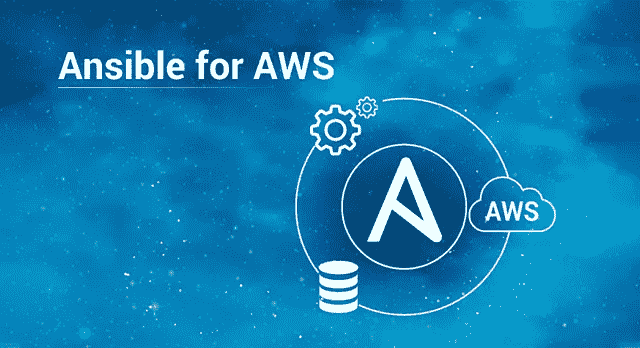
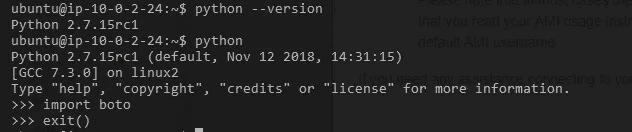
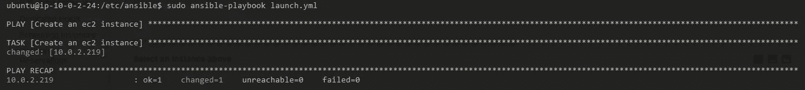
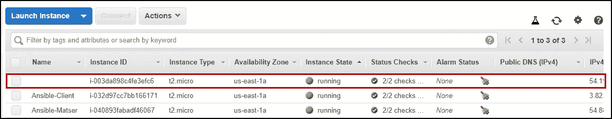

# 适用于 AWS —轻松管理您的云基础架构

> 原文：<https://medium.com/edureka/ansible-for-aws-provision-ec2-instance-9308b49daed9?source=collection_archive---------0----------------------->



Ansible for AWS — Edureka

公司已经投入了大量的时间和金钱来开发和安装软件以改善他们的运营。云计算的引入为他们的业务提供了在互联网上访问软件的服务，这被证明是更加高效和安全的。集成一个像 Ansible 这样的 IT 自动化工具就像是中了大奖，ansi ble 可以像 AWS 一样轻松地配置和管理您的云基础设施。这就是我们将在这篇 Ansible for AWS 文章中讨论的内容。

## **议程:**

*   为什么公司迁移到云？
*   易变特征
*   为什么对 AWS 使用 Ansible
*   演示:使用 Ansible 自动提供 EC2 实例

# 为什么公司迁移到云？

如前所述，计算可以让公司像通过互联网访问软件一样访问服务器。说清楚一点，云计算就像接入中央电网，而不是自己发电。云已经成为新的常态，最终节省了大量时间和金钱。让我们来看看公司迁移到云的几个优势。

## 1.灵活性:

业务增长从来不是一成不变的。基于云的服务适合不断增长和波动的业务需求。基于需求扩展和缩减部署的特性使其非常灵活。

## 2.灾难恢复:

每个企业都应该投资灾难恢复。每家《财富》公司最终都会在灾难恢复上投入大量资金。初创公司和低预算公司缺乏资金和所需的技能，并且无法具备适当的功能性灾难恢复特性。云为客户提供灾难恢复解决方案，以制定稳健且经济高效的计划。

## 3.自动软件更新:

正如你已经知道的，云是由互联网提供的服务，因此所有的服务器都不在你的范围内，或者说不是你头疼的问题。供应商会对它们进行维护，包括在需要时进行更新，以及定期进行安全检查。这再次节省了大量的时间和金钱。

## 4.降低成本:

从头开始建立一个数据中心可能会非常昂贵。运行和维护增加了费用。您需要合适的技术、合适的硬件、拥有合适知识和经验的合适员工，这在我看来是一项艰巨的任务。同样，不太乐观的是，有一百万种方式会出错。迁移到云给了你这个加分。

## 5.可扩展性:

规划意外增长的传统方法是购买和保留额外的服务器、存储和许可证。在你真正使用它们之前，可能需要几年时间。云平台允许您在需要时扩展这些资源。这种动态扩展非常适合不可预测的增长。

## 6.数据安全性:

大多数情况下，将数据保存在云上比存储在笔记本电脑或硬盘等物理设备上更好。这些物理设备很有可能被盗或损坏。云允许您远程删除数据或将其转移到另一台服务器，确保数据保持完整和安全。

## 7.增强协作:

利用云平台，团队可以随时随地访问、编辑和共享文档。他们能够一起工作，因此提高了效率。这也提供了实时和透明的更新。

# 易变特征

Ansible 有一些独特的功能，当这些功能与亚马逊网络服务合作时，会留下印记。让我们来看看这些令人难以置信的功能:

1.  Ansible 基于无代理架构，不同于 Chef 和 Puppet
2.  Ansible 通过 SSH 访问其主机，这使得服务器和主机之间的通信变得轻而易举
3.  不需要定制的安全基础设施
4.  配置行动手册和模块非常简单，因为它遵循 YAML 格式
5.  为客户提供了广泛的模块
6.  允许完整的配置管理、编排和部署功能
7.  一个安全的金库保护秘密

# 为什么要对 AWS 使用 Ansible？

既然我们已经了解了使用像 [AWS](https://www.edureka.co/blog/what-is-aws?utm_source=medium&utm_medium=content-link&utm_campaign=ansible-for-aws-provision-ec2-instance) 这样的云平台的好处和 Ansible 的独特功能，那么让我们来看看整合这两个传奇所创造的魔力。

## 1.云即一组服务

云不仅仅是其他人的数据中心上的一组服务器，还远远不止这些。一旦在其上部署了服务，您就会意识到这一点。有许多服务可以让您快速部署和扩展应用程序。Ansible automation 帮助您像管理一组服务一样管理 AWS 环境，而不是像管理一组服务器一样使用它们。

## 2.支持 AWS 的可转换模块

Ansible 用于定义、部署和管理各种各样的服务。大多数复杂的 AWS 环境都可以使用行动手册非常轻松地进行调配。最好的特性是，您创建一个服务器-主机连接，然后只在一个系统上运行剧本，并为多个其他系统提供一个根据需要进行扩展和缩减的选项。

Ansible 拥有数百个支持 AWS 的模块，其中包括:

*   自动缩放组
*   云的形成
*   云迹
*   云观察
*   DynamoDB
*   弹性缓存
*   弹性云计算(EC2)
*   身份访问管理器(IAM)
*   希腊字母的第 11 个
*   关系数据库服务
*   53 号公路
*   安全组
*   简单存储服务(S3)
*   虚拟专用云(VPC)
*   还有更多

## 3.动态库存

在开发环境中，主机随着不同的业务需求不断运转和关闭。在这种情况下，使用静态库存可能是不够的。这种情况需要使用动态库存。这使您可以根据清单脚本提供的组来映射主机，这与普通清单不同，普通清单迫使您手动映射主机，这非常繁琐。

## 4.安全自动化

假设你有一个 5 人的团队，每个人下面都有两个不完全熟练的下属。您不会想让他们完全访问整个部署过程。这时，您就会意识到限制授权的必要性。

Ansible Tower 提供了这一功能来限制授权。所以基本上，你选择了谁能做什么，这样更容易调和。此外，Ansible Tower 加密凭证和其他敏感数据，您只允许下属访问相关资源，同时限制他们访问不相关的资源。

# 演示:使用 Ansible 自动提供 EC2 实例

在这个演示部分，我将通过展示如何自动化 EC2 实例的启动和供应来演示 Ansible 如何支持 AWS。让我们开始吧。

## **第一步**:

在您的服务器节点上安装 Ansible，并在您的服务器和 AWS 上的客户机节点之间建立一个 SSH 连接。在本例中，我创建了两个 EC2 实例，一个安装了 Ansible 的服务器，另一个是客户端。

## **第二步:**

现在确保您已经安装了所有的需求。根据文档，这些要求如下:

使用以下命令安装 python:

```
$ sudo apt install python
```

使用以下命令安装 boto:

```
$ sudo apt install python-pip
$ pip install boto
```

Boto 是使用 Amazon Web 服务的 python 接口。您必须使用以下命令导入它:

```
$ python
$ import boto
$ exit()
```



## **第三步:**

您必须配置您的 AWS。使用以下命令进行相同的操作:

```
$ aws configure
```

并添加您的 AWS 访问密钥 id、密钥和默认区域(这是可选的)。

编写一个行动手册来启动和配置 EC2 实例。

```
$ sudo vi /etc/ansible/launch.yml
```

提及以下几行:

```
---

- name: Create an ec2 instance
  hosts: web
  gather_facts: false

  vars:
      region: us-east-1
      instance_type: t2.micro
      ami: ami-05ea7729e394412c8
      keypair: priyajdm

  tasks:

    - name: Create an ec2 instance
      ec2:
         aws_access_key: '********************'
         aws_secret_key: '****************************************'
         key_name: "{{ keypair }}"
         group: launch-wizard-26
         instance_type: "{{ instance_type }}"
         image: "{{ ami }}"
         wait: true
         region: "{{ region }}"
         count: 1
         vpc_subnet_id: subnet-02f498e16fd56c277
         assign_public_ip: yes
    register: ec2
```

在实际执行代码之前，了解代码的用途是一个很好的做法。为了更好地理解，让我来解释一下这个剧本。

**名称:**随便什么都可以。一个好的做法是保留一个给出它所执行任务的基本描述的名称。

**主机:**提到需要执行剧本的主机列表的名称。在我的情况下，它是*网络*。

**gather_facts:** 该参数告诉 Ansible 收集所有相关的事实、变量和其他数据，以供将来参考。在我们的例子中，我们将它设置为 false，因为我们不需要收集事实(IP addr。主机名等)。

**变量:**本节定义并初始化我们将在本行动手册中使用的所有变量。这里有四个变量:

*   **region** 定义了 EC2 实例需要出现的区域
*   **instance_type** 定义了我们要调用的实例的类型。在我们的例子中，我们使用 t2.micro
*   **ami** 定义了我们试图调用的实例的 ami


**ec2:** 这是 Ansible 提供的一个模块，用于启动或终止 ec2 实例。

这个模块有一些参数，我们将使用这些参数来指定我们试图启动的 EC2 实例的其他功能。

*   我们首先使用参数 **aws_access_key** 和 **aws-secret_key** 提到 AWS 访问密钥 id 和秘密密钥。
*   **key_name:** 传递定义这里使用的密钥对的变量
*   提及安全组的名称。这定义了我们试图提出的 EC2 实例的安全规则
*   **instance_type:** 传递定义我们在这里使用的实例类型的变量
*   **image:** 传递定义我们试图启动的图像的 AMI 的变量
*   它的布尔值为真或假。如果为 true，它会等待实例达到所需的状态，然后返回
*   **region:** 传递定义需要创建 EC2 实例的区域的变量。
*   此参数指定需要创建的实例数量。在这种情况下，我只提到了一个，但这取决于您的需求。
*   **vpc_subnet_id:** 传递您希望在其中创建实例的子网 id
*   **assign_public_ip:** 该参数有一个布尔值。如果是真的，就像我们的例子一样，那么在 VPC 内部调配时，将为实例分配一个公共 IP。

## **第五步:**

现在，您已经理解了行动手册中的每一行，让我们继续执行它。使用以下命令:

```
$ ansible-playbook /etc/ansible/launch.yml
```



一旦您执行了行动手册，您将看到一个实例被创建。



还有 TADA！您已经成功地自动化了 EC2 实例的供应。同样，您也可以编写剧本来停止 EC2 实例。

这就把我们带到了 Ansible For AWS 文章的结尾。如果你想查看更多关于人工智能、Python、道德黑客等市场最热门技术的文章，你可以参考 Edureka 的官方网站。

请留意本系列中的其他文章，它们将解释 DevOps 的各个方面。

> *1。* [*DevOps 教程*](/edureka/devops-tutorial-89363dac9d3f)
> 
> *2。* [*Git 教程*](/edureka/git-tutorial-da652b566ece)
> 
> *3。* [*詹金斯教程*](/edureka/jenkins-tutorial-68110a2b4bb3)
> 
> *4。* [*码头工人教程*](/edureka/docker-tutorial-9a6a6140d917)
> 
> *5。* [*Ansible 教程*](/edureka/ansible-tutorial-9a6794a49b23)
> 
> *6。* [*木偶教程*](/edureka/puppet-tutorial-848861e45cc2)
> 
> *7。* [*厨师教程*](/edureka/chef-tutorial-8205607f4564)
> 
> *8。* [*Nagios 教程*](/edureka/nagios-tutorial-e63e2a744cc8)
> 
> *9。* [*如何编排 DevOps 工具？*](/edureka/devops-tools-56e7d68994af)
> 
> *10。* [*连续交货*](/edureka/continuous-delivery-5ca2358aedd8)
> 
> *11。* [*持续集成*](/edureka/continuous-integration-615325cfeeac)
> 
> *12。* [*连续部署*](/edureka/continuous-deployment-b03df3e3c44c)
> 
> *13。* [*持续交付 vs 持续部署*](/edureka/continuous-delivery-vs-continuous-deployment-5375642865a)
> 
> *14。* [*CI CD 管道*](/edureka/ci-cd-pipeline-5508227b19ca)
> 
> *15。* [*Docker 作曲*](/edureka/docker-compose-containerizing-mean-stack-application-e4516a3c8c89)
> 
> *16。* [*码头工人群*](/edureka/docker-swarm-cluster-of-docker-engines-for-high-availability-40d9662a8df1)
> 
> *17。* [*码头工人联网*](/edureka/docker-networking-1a7d65e89013)
> 
> 18。[](/edureka/ansible-vault-secure-secrets-f5c322779c77)
> 
> **19。* [*可能的角色*](/edureka/ansible-roles-78d48578aca1)*
> 
> *20。 [*詹金斯*](/edureka/jenkins-pipeline-tutorial-continuous-delivery-75a86936bc92)*
> 
> *21。 [*顶级 Git 命令*](/edureka/git-commands-with-example-7c5a555d14c)*
> 
> **22。* [*顶级 Docker 命令*](/edureka/docker-commands-29f7551498a8)*
> 
> **23。*T38*Git vs GitHub**
> 
> **24。* [*DevOps 面试问题*](/edureka/devops-interview-questions-e91a4e6ecbf3)*
> 
> **25。* [*谁是 DevOps 工程师？*](/edureka/devops-engineer-role-481567822e06)*
> 
> **26。* [*DevOps 生命周期*](/edureka/devops-lifecycle-8412a213a654)*
> 
> **27。*[*Git ref log*](/edureka/git-reflog-dc05158c1217)*
> 
> **28。*[](/edureka/ansible-provisioning-setting-up-lamp-stack-d8549b38dc59)*
> 
> ***29。* [*组织正在寻找的顶尖 DevOps 技能*](/edureka/devops-skills-f6a7614ac1c7)**
> 
> ***30。* [*瀑布 vs 敏捷*](/edureka/waterfall-vs-agile-991b14509fe8)**
> 
> ***31。* [*Maven 用于构建 Java 应用*](/edureka/maven-tutorial-2e87a4669faf)**
> 
> ***32。* [*詹金斯小抄*](/edureka/jenkins-cheat-sheet-e0f7e25558a3)**
> 
> ***33。* [*Ansible 备忘单*](/edureka/ansible-cheat-sheet-guide-5fe615ad65c0)**
> 
> ***34。* [*Ansible 面试问答*](/edureka/ansible-interview-questions-adf8750be54)**
> 
> ***35。* [*50 码头工人面试问题*](/edureka/docker-interview-questions-da0010bedb75)**
> 
> **36。 [*敏捷方法论*](/edureka/what-is-agile-methodology-fe8ad9f0da2f)**
> 
> **37。 [*詹金斯面试问题*](/edureka/jenkins-interview-questions-7bb54bc8c679)**
> 
> ***38。* [*Git 面试问题*](/edureka/git-interview-questions-32fb0f618565)**
> 
> ***39。* [*码头工人建筑*](/edureka/docker-architecture-be79628e076e)**
> 
> **40。[*devo PS 中使用的 Linux 命令*](/edureka/linux-commands-in-devops-73b5a2bcd007)**
> 
> ***41。* [*詹金斯 vs 竹子*](/edureka/jenkins-vs-bamboo-782c6b775cd5)**
> 
> **42。 [*Nagios 面试问题*](/edureka/nagios-interview-questions-f3719926cc67)**
> 
> ***43。* [*DevOps 实时场景*](/edureka/jenkins-x-d87c0271af57)**
> 
> ***44。* [*詹金斯和詹金斯 X*](/edureka/jenkins-vs-bamboo-782c6b775cd5) 的区别**
> 
> ***45。*[*Windows Docker*](/edureka/docker-for-windows-ed971362c1ec)**
> 
> ***46。*[*Git vs Github*](http://git%20vs%20github/)**

***原载于 2019 年 4 月 8 日*[*https://www.edureka.co*](https://www.edureka.co/blog/ansible-for-aws-provision-ec2-instance)*。***