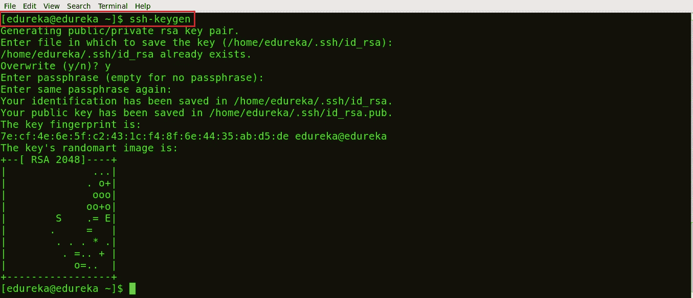
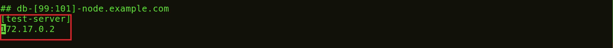
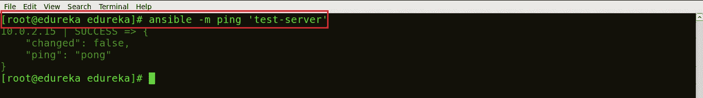
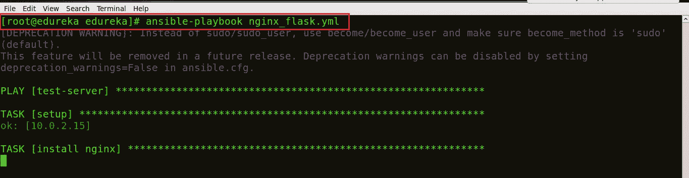
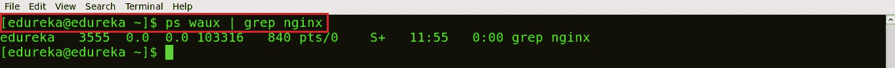
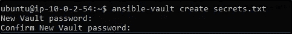
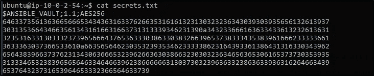

# 2019 年你必须准备的前 50 个可回答的面试问题和答案

> 原文：<https://medium.com/edureka/ansible-interview-questions-adf8750be54?source=collection_archive---------1----------------------->


Ansible Interview Questions — Edureka

自动化已经成为任何软件开发周期中最重要的部分。从自动化开发系统到配置生产环境，Ansible 让自动化和配置管理看起来像在公园散步。在这篇文章中，我收集了面试官最常问的问题。

如果你最近参加过任何基于 Ansible 的面试，请把这些面试问题贴在评论区，我们会在第一时间回答。如果你在面试中有任何问题，你也可以在下面评论。

在这篇文章中，我将讨论在你的采访中被问到的最容易回答的相关问题。因此，为了让您更好地理解，我将这篇文章分为以下三个部分:

*   可回答的基本面试问题
*   可回答的中级面试问题
*   可回答的技术面试问题

# 可回答的基本面试问题

这一类可回答的面试问题由你应该知道的问题组成。这些都是最基本的问题。面试官会从这些开始，最终增加难度。让我们来看看它们。

## Q1。什么是 CI/CD？

持续集成是一种软件开发实践，其中团队成员频繁地集成他们的工作，通常，每个人至少每天集成，导致每天多个集成。每个集成都由一个自动化构建(包括测试)来验证，以尽可能快地检测集成错误。许多团队发现这种方法可以显著减少集成问题，并允许团队更快地开发内聚的软件。

连续交付是一个过程，在这个过程中，您以一种可以在任何时候发布到生产的方式来构建软件。考虑下图:


让我解释一下上面的图表:

*   自动化构建脚本将检测像 Git 这样的源代码管理(SCM)中的变化。
*   一旦检测到变更，源代码将被部署到专用的构建服务器，以确保构建不会失败，并且所有测试类和集成测试都运行良好。
*   然后，在测试服务器(生产前服务器)上部署构建应用程序，以进行用户验收测试(UAT)。
*   最后，应用程序被手动部署到生产服务器上进行发布。

## Q2。什么是配置管理，它如何帮助组织？

配置管理是系统地处理更新和变更的实践，以便系统随着时间的推移保持其完整性。配置管理(CM)跟踪系统中需要的所有更新，并确保系统的当前设计和构建状态是最新的，并且运行正常。

配置管理可以帮助组织克服以下挑战:

*   当用户需求改变时，找出需要实现的改变。
*   由于自上次实施后需求发生变化，重做和更新实施。
*   因为最新版本有缺陷，所以恢复到组件的旧版本。
*   更换错误的组件，因为您无法准确确定哪个组件需要更换。

为了更好地理解这一点，请考虑纽约证券交易所的例子:

纽约证券交易所(NYSE)的软件出现故障，导致他们无法交易股票约 90 分钟。前一天晚上，该公司 20 个交易终端中的 8 个安装了新软件。不幸的是，该软件无法在 8 台终端上正常运行。

因此，通过使用 Ansible 和 Puppet 等配置管理工具，他们又回到了旧软件。如果他们没有实施 CM，他们会花更长的时间来解决问题，这将导致更大的损失。

## Q3。Ansible 是什么？是什么让它从其他配置管理工具中脱颖而出？

Ansible 是一款开源的 IT 配置管理、部署&编排工具。它旨在为各种自动化挑战提供巨大的生产力增益。

下面是使 Ansible 成为如此有效的配置管理和自动化工具的特性列表:

1.  简单:使用在 YAML 编写的简单语法，称为剧本。
2.  无代理:不需要在要自动化的客户端系统或主机上安装代理/软件或额外的防火墙端口。
3.  强大而灵活:Ansible 的功能允许您协调整个应用程序环境，而不管它部署在哪里。
4.  高效:Ansible 引入了模块作为软件的基本构件。因此，您甚至可以根据自己的需求进行定制。

## Q4。Ansible 是如何工作的？

与其他配置管理工具不同，Ansible 分为两种类型的服务器——控制机器和节点。控制机器是安装 Ansible 的地方，节点是由控制机器通过 SSH 管理的。控制计算机中有一个清单文件，其中保存了节点系统的位置。Ansible 通过在控制机器上运行剧本在节点系统上部署模块。Ansible 是无代理的，这意味着不需要第三方工具在一个节点和另一个节点之间建立连接。

## Q5。Ansible 和 Puppet 有什么不同？


## Q6。ansible 有哪些不同的组件？解释 Ansible 架构。

下图描述了 Ansible 架构:


Ansible 的主要组件是 Ansible 自动化引擎。该引擎直接与各种云服务、配置管理数据库(CMBD)和编写各种行动手册以执行 Ansible 自动化引擎的不同用户进行交互。

Ansible Automation 引擎由以下组件组成:

**清单:**这些是包含各自 IP 地址、服务器、数据库等的节点列表。这是需要管理的。

**API:**就像任何其他 API 一样，Ansible APIs 用于交换各种云服务，公共或私有服务。

**模块:**模块用于管理系统资源、包、库、文件等。Ansible 模块可用于自动化多种任务。Ansible 提供了大约 450 个模块，几乎自动化了您环境的每个部分。

**插件:**如果你想把 Ansible 任务作为一个作业来执行，可以使用 Ansible 插件。它们通过构建一个类似环境的作业来简化任务的执行，该环境基本上包含对应于某些特定功能的代码片段。Ansible 提供的插件有 100 多个。一个例子是动作插件，它作为模块的前端，可以在调用模块本身之前在控制器上执行任务。

**联网:** Ansible 也可以用来自动化不同的网络和服务。它可以通过创建一个剧本或一个可以轻松跨越不同网络硬件的角色来做到这一点。

**主机:**可用的主机/节点系统是正在自动化的机器(Linux、Windows 等)。

**行动手册:**行动手册是描述需要执行的任务的简单代码文件。剧本是用 YAML 格式写的。它们可用于自动化任务、声明配置等。

**CMDB:** 它是一个数据库，充当各种 It 安装的仓库。它保存关于各种 It 资产(也称为配置项(CI))的数据，并描述这些资产之间的关系。

**云:**它是一个托管在互联网上的远程服务器网络，用于存储、管理和处理数据，而不是本地服务器。

## Q7。什么是可行的服务器要求？

如果你是一个 windows 用户，那么你需要一个虚拟机来安装 Linux。它需要 Python 2.6 版本或更高版本。你满足了这些要求，你就可以走了！

## Q8。如何在 CentOS 系统上安装 Ansible？

这可以通过两个简单的步骤来完成:

**步骤 1:** 设置 EPEL 存储库

EPEL(Enterprise Linux 的额外软件包)是一个由 Fedora 团队提供的基于社区的开源免费存储库项目，它为 Linux 发行版提供高质量的附加软件包，包括 RHEL (Red Hat Enterprise Linux)、CentOS 和 Scientific Linux。

Ansible 包在默认的 yum 存储库中不可用，因此我们将使用下面的命令启用 EPEL 存储库:

`sudo rpm -ivh [http://dl.fedoraproject.org/pub/epel/6/i386/epel-release-6-8.noarch.rpm](http://dl.fedoraproject.org/pub/epel/6/i386/epel-release-6-8.noarch.rpm)`

这将下载安装 Ansible 所需的所有软件包。

第二步:安装 Ansible

既然已经添加了您的 EPEL 存储库，现在您需要做的就是使用下面的命令安装 Ansible:

`yum install ansible -y`

仅此而已！这是一个两步的过程，几乎不需要一分钟！

如果您希望检查系统上安装的 Ansible 版本，请使用以下命令:

`ansible -version`

## **Q9。用 Ansible 解释一些基本术语或概念。**

在 Ansible 上操作时经常使用的几个基本术语是:

**控制器机器:**控制器机器负责提供被管理的服务器。它是安装 Ansible 的机器。

**清单:**清单是一个初始化文件，它包含您所管理的不同服务器的详细信息。

**剧本:**是以 YAML 格式编写的代码文件。行动手册基本上包含了需要执行或自动化的任务。

**任务:**每个任务代表一个需要执行的程序，例如安装一个库。

**模块:**模块是一组可以执行的任务。Ansible 有 100 多个内置模块，但你也可以创建自定义模块。

**角色:**角色是一种预定义的方式，用于组织剧本和其他文件，以便于共享和重用部分供应。

**Play:** 一个从头到尾执行的任务或者一个剧本的执行，叫做 Play。

**事实:**事实是存储系统细节的全局变量，比如网络接口或操作系统。

**处理程序:**用于触发服务的状态，如重启或停止服务。

## Q10。解释基础设施即代码(IaC)背后的概念。

*基础设施即代码(IaC)是管理和操作数据服务器、存储系统、系统配置和网络基础设施的过程。*

在传统的配置管理实践中，每一分钟的配置更改都需要系统管理员和 IT 支持团队进行手动操作。但是有了 IaC，所有的配置细节都被管理并存储在一个标准化的文件系统中，其中系统自动管理基础设施的变化并处理系统配置。

因此，我们不需要大部分的手动工作，因为一切都是按照 IaC 方法管理和自动化的。Ansible 等工具可用于实现 IaC 方法。

## Q11。比较 Ansible 和 Chef。


## Q12。什么是 Ansible 星系？

Galaxy 是一个让 Ansible 用户分享他们的角色和模块的网站。Ansible Galaxy 命令行工具与 Ansible 打包在一起，它可以用于从 Galaxy 或直接从 Git 等源代码控制管理系统安装角色。它还可以用来建立新的角色，删除现有的角色，并在 Galaxy 网站上执行任务。

您可以使用以下命令从 Galaxy 网站下载角色:

`$ansible-galaxy install username.role_name`

## Q13。什么是即席命令？举个例子。

即席命令是用于执行特定任务的简单单行命令。您可以将即席命令视为编写行动手册的替代方法。临时命令的一个示例如下:

`ansible host -m netscaler -a "nsc_host=nsc.example.com user=apiuser password=apipass"`

上述即席命令访问 netscaler 模块以禁用服务器。

## Q14。Ansible 中有哪些变量？

Ansible 中的变量与任何编程语言中的变量非常相似。就像任何其他变量一样，Ansible 变量被赋予一个用于计算剧本的值。您也可以在变量周围使用条件。这里有一个例子:

```
- hosts: your hosts
vars:
port_Tomcat : 8080
```

这里，我们定义了一个名为 port_Tomcat 的变量，并为它分配了端口号 8080。这种变量可以用在 Ansible 剧本中。

## Q15。变量名和环境变量有什么区别？


## Q16。什么是可转换模块？解释不同的类型。

可变模块是执行特定任务的一小组程序。模块可用于自动化各种任务。Ansible 中的模块被认为是等幂的，换句话说，发出多个相同的请求与发出一个请求具有相同的效果。

Ansible 中有两种类型的模块:

1.  核心模块
2.  附加模块

## **核心模块**

这些都是 Ansible 核心团队维护的模块，并且将一直与 Ansible 一起发布。与“额外”回购中的请求相比，他们在所有请求中也会获得稍高的优先级。这些模块的源代码由 Ansible 托管在 Ansible-modules-core 中的 GitHub 上。

## **临时演员模块**

这些模块目前随 Ansible 一起提供，但将来可能会单独提供。它们也主要由 Ansible 社区维护。非核心模块仍然完全可用，但对问题和请求的响应率可能会稍低。

随着时间的推移，受欢迎的“额外”模块可能会提升为核心模块。这些模块的源代码由 Ansible 托管在 GitHub 上的 Ansible-modules-extras 中。

## Q17。什么是可完成的任务？

可执行的任务允许您将配置策略分解成更小的文件。这些代码块可用于自动化任何过程。例如，如果您希望安装软件包或更新软件，您可以遵循以下代码片段:

`Install <package_name>, update <software_name>`

## Q18。你能解释一下什么是翻译剧本吗？用一些例子解释。

Ansible 中的剧本是以 YAML 格式编写的。它是一种人类可读的数据序列化语言。它通常用于配置文件。它还可以用于存储数据的许多应用中。

对于 Ansible 来说，几乎每个 YAML 文件都是以列表开始的。列表中的每一项都是一个键/值对列表，通常称为“哈希”或“字典”。所以，我们需要知道如何在 YAML 写列表和字典。

列表的所有成员都是以“-”(破折号和空格)开始的相同缩进级别的行。更复杂的数据结构是可能的，例如字典列表或混合字典，其值是列表或两者的混合。

例如，如果您想要一本包含美国详细信息的剧本:

```
-USA
-continent: North America
-capital: Washington DC<a name="AnsibleIntermediateLevelInterviewQuestions"></a>
-population: 319 million
```

既然你已经知道了基本水平的问题，让我们来看看稍微高级一点的 Ansible 面试问题。

# 中级水平可回答的面试问题

一旦你回答了基本的概念性问题，面试官会增加难度。所以，让我们进入这篇回答面试问题文章的下一部分。本节讨论 docker 用户中非常常见的命令。

## Q19。你能写一个简单的剧本在主机上安装 Nginx 吗？

**步骤 1:** 生成一个公共 SSH 密钥，并使用 SSH 连接到您的主机。

遵循以下命令:

`$ ssh-keygen`



如上所示，生成了一个公共 SSH 密钥。

**步骤 2:** 接下来，在您的主机上复制公共 SSH 密钥。按照下面的命令来做:

`ssh-copy-id -i root@IP address of your host`


**步骤 3:** 在清单中列出主机/节点的 IP 地址。

遵循以下命令:

`vi /etc/ansible/hosts`



运行该命令后，vi 编辑器将打开，您可以在其中列出主机的 IP 地址。这是现在你的库存。

**步骤 4:** 要检查连接是否已经建立，让我们 ping:



上图显示控制机器和主机之间已经建立了连接。

**第 5 步:**创建剧本，在主机上安装 Nginx。要创建行动手册，您只需打开一个扩展名为 yml 的文件，如下所示:

`vi <Name of your file>.yml`


在一个可行的剧本中，任务被定义为一个字典列表，从上到下执行。

每个任务都被定义为一个字典，可以有几个键，比如“name”或“sudo ”,它们表示任务的名称以及它是否需要 sudo 特权。

设置了一个变量 server_port，它在 TCP 端口 8080 上监听传入的请求。

这里，第一个任务是获得安装 Nginx 所必需的包，然后安装它。在内部，Ansible 将检查该目录是否存在，如果不存在就创建它，否则它什么也不做。

下一个任务是配置 Nginx。在 Nginx 中，上下文包含配置细节。

这里，模板是一个可以在主机上部署的文件。然而，模板文件也包括一些参考变量，这些变量是从定义为可翻译剧本的一部分的变量或从主机收集的事实中提取的。包含配置细节的事实被从源目录中取出，并被复制到目标目录中。

这里的处理程序定义了只有在任务或状态改变时才执行的操作。在本行动手册中，我们定义了 notify: restart Nginx 处理程序，它将在文件和模板复制到主机后重启 Nginx。

现在，保存文件并退出。

**步骤 6:** 使用下面的命令运行剧本:

`ansible-playbook <name of your file>.yml`



**步骤 7:** 检查机器上是否安装了 Nginx。使用以下命令:

`ps waux | grep nginx`



在上图中，不同的进程 IDs 3555 和 103316 正在运行，这表明 Nginx 正在您的主机上运行。

## 问题 20。如何访问组中第一台主机的变量？

这可以通过执行以下命令来完成:

`{{ hostvars[groups['webservers'][0]]['ansible_eth0']['ipv4']['address'] }}`

在上面的命令中，我们基本上是在访问 webservers 组中第一台机器的主机名。如果你使用模板来做这件事，使用 Jinja2 '#set '或者你也可以使用 set_fact，如下所示:

```
- set_fact: headnode={{ groups[['webservers'][0]] }}
- debug: msg={{ hostvars[headnode].ansible_eth0.ipv4.address }}
```

## 问题 21。为什么使用' {{ }} '符号？如何插入变量或动态变量名？

一个基本规则是“总是使用{{}}，除非:”。条件语句总是通过 Jinja2 来解析表达式。因此，“when:failed_when:”和“changed_when:”始终是模板化的，我们应该避免添加{{}}。
在其他情况下，除了 when 子句，我们必须使用括号，否则，将很难区分未定义的变量和字符串。

## 问题 22。什么是可行的角色，它们与行动手册有何不同？

可变角色基本上是用于组织剧本的另一个抽象层次。它们为变量、任务、模板、文件和模块的独立和可重用集合提供了一个框架，这些集合可以自动加载到剧本中。剧本是角色的集合。每个角色都有特定的功能。

让我们通过一个例子来理解角色和剧本的区别。

假设您希望您的行动手册在 5 个不同的系统上执行 10 个不同的任务，您会使用一个行动手册吗？不，使用单一的剧本会使它变得混乱和容易出错。相反，您可以创建 10 个不同的角色，每个角色将执行一项任务。然后，你需要做的就是，在剧本中提到角色的名字来称呼他们。

## 问题 23。如何编写一个有多个任务的 Ansible 处理程序？

假设您想要创建一个处理程序，该处理程序仅在服务已经运行时才重新启动服务。

处理程序可以“监听”一般的主题，任务可以通知这些主题，如下所示。这个功能使得触发多个处理程序变得更加容易。它还将处理程序从它们的名称中分离出来，使得在剧本和角色之间共享处理程序变得更加容易:

```
- name: Check if restarted
shell: check_is_started.sh
register: result
listen: Restart processes</p>
<p style="text-align: justify;">- name: Restart conditionally step 2
service: name=service state=restarted
when: result
listen: Restart processes
```

## 问题 24。如何在剧本中保留秘密数据？

假设您有一个任务，在使用-v (verbose)模式时，您不想显示提供给它的输出或命令，可以使用以下任务来完成它:

```
- name: secret task
shell: /usr/bin/do_something --value={{ secret_value }}
no_log: True
```

这可用于保持详细的输出，但对希望看到输出的其他人隐藏敏感信息。

no_log 属性也可以应用于整个游戏:

```
- hosts: all 
no_log: True
```

## 问题 25。什么是可变拱顶，为什么使用它们？

Ansible Vault 是一个功能，可以让你保持所有的秘密安全。它可以加密整个文件，整个 YAML 剧本，甚至一些变量。它提供了一种工具，您不仅可以加密敏感数据，还可以将它们集成到您的行动手册中。

Vault 以文件级粒度实施，其中文件要么完全加密，要么完全不加密。它使用相同的密码来加密和解密文件，这使得使用 Ansible Vault 非常用户友好。

## 问题 26。如何使用 Ansible 创建加密文件？

要创建加密文件，请使用“ansible-vault create”命令并传递文件名。

`$ ansible-vault create filename.yaml`

系统会提示您创建一个密码，然后通过重新键入来确认。



一旦您的密码被确认，一个新的文件将被创建并打开一个编辑窗口。默认情况下，Ansible Vault 的编辑器是 vi。您可以添加数据，保存并退出。


这是您的加密文件:



## Q27。什么是安西布尔塔？

Ansible Tower 是一个更企业级的 Ansible。它是一个基于 web 的解决方案，通过非常简单的用户界面来管理您的组织，提供了一个包含所有主机的所有状态摘要的控制面板，允许快速部署，并监控所有配置。

该塔允许您共享 SSH 凭证而不暴露它们，记录所有作业，以图形方式管理库存，并与各种各样的云提供商同步它们。

## 问题 28。Ansible Tower 提供什么功能？

*   **Ansible Tower Dashboard**—ansi ble Tower Dashboard 显示您的 ansi ble 环境中正在发生的一切，如主机、库存状态、最近的作业活动等。
*   **实时作业更新** —由于 Ansible 可以实现整个基础设施的自动化，您可以看到实时作业更新，如每台机器成功或失败后的工作和任务。因此，通过这个，您可以看到您的自动化的状态，并且知道队列中的下一个是什么。
*   **多行动手册工作流** —该功能允许您链接任意数量的行动手册，无论使用不同的库存、使用不同的凭证或运行不同的用户。
*   **谁在何时运行了什么作业** —顾名思义，您可以很容易地知道谁在何时何地运行了什么作业，因为所有的自动化活动都安全地记录在 Ansible Tower 中。
*   **利用集群扩展容量** —随着集群增加冗余和容量，我们可以将多个 Ansible 塔式节点连接到一个 Ansible 塔式集群中，这使您可以在整个企业范围内扩展 Ansible 自动化。
*   **集成通知** —此功能允许您在整个组织中某项工作成功或失败时立即通知个人或团队，或者基于每个工作进行定制。
*   **调度 Ansible 作业** —可以根据需要在 Ansible Tower 中调度不同种类的作业，如剧本运行、云库存更新和源代码控制更新。
*   **管理&跟踪库存** — Ansible Tower 通过让您轻松地从公共云提供商(如 Amazon Web Services、Microsoft Azure 等)获取库存，帮助您管理整个基础架构。
*   **自助服务**—ansi ble Tower 的这一功能让您只需点击一下鼠标即可启动行动手册。它还可以让您从可用的安全凭证中进行选择，或者提示您输入变量并监控最终的部署。
*   **REST API & Tower CLI 工具**—Ansible Tower 中的每一项功能都可以通过 ansi ble Tower 的 REST API 获得，为系统管理基础设施提供了理想的 API。Ansible Tower 的 CLI 工具可用于从 Jenkins 等 CI 系统启动作业，或者在您需要与其他命令行工具集成时使用。
*   **远程命令执行** —通过 Ansible Tower 的远程命令执行，您可以运行简单的任务，如添加用户、重启任何出现故障的服务、在清单中的任何主机或主机组上重置密码。

以下部分将只涵盖基于技术的可回答的面试问题。这些问题大多基于 Ansible 的实际实现。

# 可回答的技术面试问题

## 问题 29。Ansible 是如何在连续交付管道中使用的？解释一下。

众所周知，在 DevOps 中，开发和运营工作是集成的。这种集成对于现代测试驱动的应用程序非常重要。因此，Ansible 通过为开发和运营提供稳定的环境来整合这一点，从而实现平稳的交付渠道。


当开发人员开始将基础设施视为其应用程序的一部分，即基础设施即代码(IaC)时，稳定性和性能就变得标准化了。作为代码的基础设施是通过机器可处理的定义文件来管理和供应计算基础设施及其配置的过程，而不是物理硬件配置或交互式配置工具的使用。这就是 Ansible automation 发挥重要作用并在同行中脱颖而出的地方。

在连续交付管道中，系统管理员与开发人员紧密合作，开发速度得到提高，更多的时间花在性能调优、试验和完成工作上，而花在解决问题上的时间减少了。

## Q30。如何使用 Ansible 创建 LAMP 堆栈并部署网页？

假设您试图在 30 个系统上部署一个网站，每个网站部署都需要一个基本的操作系统、网络服务器、数据库和 PHP。我们使用 ansible-playbook 一次在所有 30 个系统上安装这些先决条件。

对于这个特殊的问题陈述，您可以使用两个虚拟机，一个作为安装 Ansible 的服务器，另一个作为远程主机。此外，我已经创建了一个简单的静态网页，保存在一个文件夹索引中，其中有两个文件，index.html 和风格

在下面的代码中，我创建了一个 Ansible playbook 来安装 Apache、MySql 和 PHP:

```
---
# Setup LAMP Stack
-  hosts: host1
   tasks:

      -  name: Add ppa repository
         become: yes
         apt_repository: repo=ppa:ondrej/php

      -  name: Install lamp stack
         become: yes
         apt:
            pkg:
              - apache2   
              - mysql-server
              - php7.0
              - php7.0-mysql   
            state: present
            update cache: yes

      -  name: start apache server
          become: yes
          service: 
              name: apache2
               state: started
                enabled: yes

      -  name: start mysql service
          become: yes
          services:
             name: mysql
             state: started
             enabled: yes

      -  name:  create target directory
          file: path=/var/www/html state=directory mode=0755

      - name:  deploy index.html
         became: yes
          copy: 
              src: /etc/ansible/index/index.html
              dest: var/www/html/index/index.html
```

现在，有 6 个主要任务，每个任务执行一个特定的功能:

*   第一个任务是添加安装 MySQL 和 PHP 所需的存储库。
*   第二个任务安装 apache2、MySQL-server、PHP 和 PHP-MySQL。
*   第三和第四个任务启动 Apache 和 MySQL 服务。
*   第五个任务在主机上创建一个目标目录
*   最后，第六个任务执行 index.html 文件，它从服务器上获取文件，并将其复制到主机上。

要最终运行本行动手册，您可以使用以下命令:

`$ ansible-playbook lamp.yml -K`

## Q31。如何为任务设置路径或任何其他环境变量？

可以使用“environment”关键字设置环境变量。它既可以为一项任务设置，也可以为整个剧本设置。按照下面的代码片段查看如何操作:

```
environment: 
PATH: "{{ ansible_env.PATH }}:/thingy/bin" 
SOME: value
```

## Q32。如何为用户模块生成加密密码？

有几种方法可以做到这一点。最简单的方法是使用临时命令:

`ansible all -i localhost, -m debug -a "msg={{ 'mypassword' | password_hash('sha512', 'mysecretsalt') }}"`

另一种方法是使用 Linux 系统上可用的 mkpasswd 功能:

`mkpasswd --method=sha-512`

但是，如果您使用的是 macOS，那么您可以使用 Python 生成这些密码。为此，您必须首先安装 Passlib 密码哈希库:

`pip install passlib`

安装之后，可以通过以下方式生成 SHA512 密码值:

`python -c "from passlib.hash import sha512_crypt; import getpass; print(sha512_crypt.using(rounds=5000).hash(getpass.getpass()))"`

## Q33。如何在模板内对组中的主机列表进行循环？

一种简单的方法是遍历主机组中的主机列表，以便用服务器列表填充模板配置文件。这可以通过访问模板中的“$groups”字典来完成，如下所示:

```

{{ host }}

```

为了访问关于这些主机的事实，比如每个主机名的 IP 地址，您需要确保这些事实已经被填充。例如，确保您有一个与 db_servers 对话的播放器:

```
- hosts: db_servers
tasks:
- debug: msg="doesn't matter what you do, just that they were talked to previously."
```

现在，您可以在模板中使用这些事实，如下所示:

```
{
{{ hostvars[host]['ansible_eth0']['ipv4']['address'] }}

```

## Q34。如何显示为我的主机定义的所有库存变量？

为了检查您在清单中定义的清单变量，您可以执行以下命令:

`ansible -m debug -a "var=hostvars['hostname']" localhost`

这将列出所有库存变量。

## Q35。如何配置跳转主机来访问我不能直接访问的服务器？

第一步是在 ansible_ssh_common_args 库存变量中设置 ProxyCommand。当连接到相关主机时，此变量中定义的所有参数都会添加到 sftp/scp/ssh 命令行中。让我们看一个例子，考虑下面的库存组:

```
[gatewayed]
foo ansible_host=192.0.2.1
bar ansible_host=192.0.2.2
```

接下来，您可以创建包含以下内容的 group_vars/gatewayed.yml:

`ansible_ssh_common_args: '-o ProxyCommand="ssh -W %h:%p -q user@gateway.example.com"'`

Ansible 然后将这些参数附加到命令行，同时尝试连接到网关组中的任何主机。

## **Q36。如何处理需要不同用户帐户或端口登录的不同机器？**

最简单的方法是在库存文件中设置库存变量。

让我们考虑这些主机有不同的用户名和端口:

```
[webservers]
asdf.example.com ansible_port=5000 ansible_user=alice
jkl.example.com ansible_port=5001 ansible_user=blob
```

此外，如果您愿意，可以指定要使用的连接类型:

```
[testcluster]
localhost ansible_connection=local
/path/to/chroot1 ansible_connection=chroot
foo.example.com ansible_connection=paramiko
```

为了更清楚地说明这一点，最好将它们保存在组变量中，或者保存在 group_vars/ <group-name>文件中。</group-name>

## Q37。从变量中批量设置任务参数是否不安全？

要设置任务中的所有参数，可以使用字典类型的变量。尽管这通常对动态执行有好处，但它会引发安全风险。因此，当这种情况发生时，Ansible 会发出警告。例如，考虑下面的代码:

```
vars:
  usermod_args:
  name: testuser
  state: present
tasks:
- user: '{{ usermod_args }}
```

这个示例是安全的，但是创建类似的任务是有风险的，因为传递给 usermod_args 的参数和值可能会被受损目标机器上的主机事实中的恶意值覆盖。

## Q38。假设您使用 Ansible 来配置生产环境，并且您的剧本使用加密文件。加密文件会提示用户输入密码。但是既然 Ansible 是用于自动化的，那么这个过程可以自动化吗？

是的，Ansible 使用了一个名为密码文件的功能，所有加密文件的密码都可以保存在这里。因此，每次要求用户输入密码时，他只需调用密码文件。Ansible 会自动读取并输入密码。

`$ ansible-playbook launch.yml --vault-password-file ~/ .vault_pass.txt`

使用单独的脚本来指定密码也是可能的。您需要确保脚本文件是可执行的，并且密码被打印到标准输出中，这样它才能正常工作，不会出现令人讨厌的错误。

`$ ansible-playbook launch.yml --vault-password-file ~/ .vault_pass.py`

## Q39。你以前和 Ansible 合作过吗？请分享一下你的经历。

在这里要非常诚实。如果你以前用过 ansible，那就谈谈你的经历。谈论需要 ansible 的项目。你可以告诉面试官 Ansible 如何帮助你进行供应和配置管理。如果你以前没有用过 Ansible，那就说说你用过的相关工具。这些相关的工具可能是 Git、Jenkins、Puppet、Chef、Satltstack 等等。

非常诚实，因为他们知道你是否在撒谎。

## Q40。Ansible 是开源工具吗？

是的，Ansible 是开源的。这意味着你拿走模块并重写它们。Ansible 是一个开源的自动化引擎，可以让你自动化应用程序。

## Q41。如何在 Ansible 中连接其他设备？

一旦 Ansible 安装在控制机器上，就会创建一个清单文件。该清单文件指定了其他节点之间的连接。可以使用简单的 SSH 建立连接。要检查与不同设备的连接，您可以使用 ping 模块。

`ansible -m ping all`

上面的命令检查清单文件中指定的所有节点的连接。

## Q42。有可能在 Ansible 中构建我们的模块吗？

是的，我们可以在 Ansible 中创建自己的模块。这是一个开源工具，基本上在 python 上运行。您可以开始创建自己的模块。唯一的要求是非常擅长编程。

## Q43。事实在 Ansible 中是什么意思？

当任何关于系统的新变量被发现时，它被认为是剧本中的“事实”。事实主要用于实现条件执行。它还可以用于获取有关系统的特定信息。

您可以使用以下命令获取事实:

`$ ansible all- m setup`

因此，当您只想提取一部分信息时，您可以使用 setup 模块只过滤出需要的信息。

## Q44。Ansible 中的 ask_pass 模块是什么？

Ask_pass 是可翻译剧本中的控制模块。这控制了剧本执行时的密码提示。默认情况下，它总是设置为 True。如果您使用 SSH 密钥进行身份验证，那么您根本不需要更改这个设置。

## Q45。解释 Ansible 中的回调插件？

回调插件可以在响应事件时向 Ansible 添加新的行为。默认情况下，回调插件控制你运行命令行程序时看到的大部分输出。它还可以用于添加额外的输出，与其他工具集成等。

## Q46。Ansible 支持 AWS 吗？

Ansible 拥有数百个支持 AWS 的模块，其中包括:

*   自动缩放组
*   云的形成
*   云迹
*   云观察
*   DynamoDB
*   弹性缓存
*   弹性云计算(EC2)
*   身份访问管理器(IAM)
*   希腊字母的第 11 个
*   关系数据库服务
*   53 号公路
*   安全组
*   简单存储服务(S3)
*   虚拟专用云(VPC)

## Q47。Ansible 支持硬件供应吗？

是的，Ansible 可以供应硬件。许多公司仍然停留在硬件的大规模数据中心。有几个要求。在继续之前，您必须设置一些服务。其中包括 DHCP、PXE、TFTP、操作系统媒体、Web 服务器等。

## Q48。编写一个可行的剧本来自动启动 EC2 实例。

```
---
 - name: Create an ec2 instance
  hosts: web
  gather_facts: false

  vars:
      region: us-east-1
      instance_type: t2.micro
      ami: ami-05ea7729e394412c8
      keypair: priyajdm

  tasks:

    - name: Create an ec2 instance
      ec2:
         aws_access_key: '********************'
         aws_secret_key: '****************************************'
         key_name: "{{ keypair }}"
         group: launch-wizard-26
         instance_type: "{{ instance_type }}"
         image: "{{ ami }}"
         wait: true
         region: "{{ region }}"
         count: 1
         vpc_subnet_id: subnet-02f498e16fd56c277
         assign_public_ip: yes
    register: ec2
```

*   我们首先使用参数 **aws_access_key** 和**AWS _ secret _ key**提到 AWS 访问密钥 id 和秘密密钥。
*   **key_name:** 传递定义这里使用的密钥对的变量
*   提及安全组的名称。这定义了我们试图提出的 EC2 实例的安全规则
*   **instance_type:** 传递定义我们在这里使用的实例类型的变量
*   **image:** 传递定义我们试图启动的图像的 AMI 的变量。
*   它的布尔值为真或假。如果为 true，它会等待实例达到所需的状态，然后返回
*   **region:** 传递定义需要创建 EC2 实例的区域的变量。
*   此参数指定需要创建的实例数量。在这种情况下，我只提到了一个，但这取决于您的需求。
*   **vpc_subnet_id:** 传递您希望在其中创建实例的子网 id
*   **assign_public_ip:** 该参数有一个布尔值。如果是真的，就像我们的例子一样，那么在 VPC 内部调配时，将为实例分配一个公共 IP。

## Q49。你能把文件递归复制到目标主机上吗？如果是，如何实现？

是的，您可以使用复制模块将文件递归复制到目标主机上。它有一个递归参数，从一个目录中复制文件。还有一个模块叫做 synchronize，它是专门为此而设计的。

```
- synchronize:
    src: /first/absolute/path
    dest: /second/absolute/path
    delegate_to: "{{ inventory_hostname }}"
```

## Q50。编写行动手册，在复制之前在远程服务器上创建文件备份。

这很简单。您可以使用下面的行动手册:

```
- hosts: blocks
tasks:
- name: ansible copy file backup example
copy:
src: ~/helloworld.txt
dest: /tmp
backup: yes
```

这就把我们带到了文章的结尾。随着商业竞争的加剧，公司已经意识到适应和利用不断变化的市场的重要性。让他们留在游戏中的几件事是更快的系统扩展、更好的软件交付、适应新技术等等。这时，Ansible 开始介入，给这些公司提供支持，让他们继续竞争。如果你想查看更多关于人工智能、Python、道德黑客等市场最热门技术的文章，你可以参考 Edureka 的官方网站。

请留意本系列中的其他文章，它们将解释 DevOps 的各个方面。

> *1。* [*DevOps 教程*](/edureka/devops-tutorial-89363dac9d3f)
> 
> *2。* [*Git 教程*](/edureka/git-tutorial-da652b566ece)
> 
> *3。* [*詹金斯教程*](/edureka/jenkins-tutorial-68110a2b4bb3)
> 
> *4。* [*码头工人教程*](/edureka/docker-tutorial-9a6a6140d917)
> 
> *5。* [*Ansible 教程*](/edureka/ansible-tutorial-9a6794a49b23)
> 
> *6。* [*木偶教程*](/edureka/puppet-tutorial-848861e45cc2)
> 
> *7。* [*厨师教程*](/edureka/chef-tutorial-8205607f4564)
> 
> *8。* [*Nagios 教程*](/edureka/nagios-tutorial-e63e2a744cc8)
> 
> *9。* [*如何编排 DevOps 工具？*](/edureka/devops-tools-56e7d68994af)
> 
> *10。* [*连续交货*](/edureka/continuous-delivery-5ca2358aedd8)
> 
> *11。* [*持续集成*](/edureka/continuous-integration-615325cfeeac)
> 
> *12。* [*连续部署*](/edureka/continuous-deployment-b03df3e3c44c)
> 
> 13。 [*持续交付 vs 持续部署*](/edureka/continuous-delivery-vs-continuous-deployment-5375642865a)
> 
> 14。 [*CI CD 管道*](/edureka/ci-cd-pipeline-5508227b19ca)
> 
> *15。* [*Docker 撰写*](/edureka/docker-compose-containerizing-mean-stack-application-e4516a3c8c89)
> 
> *16。* [*码头工人群*](/edureka/docker-swarm-cluster-of-docker-engines-for-high-availability-40d9662a8df1)
> 
> 17。 [*Docker 联网*](/edureka/docker-networking-1a7d65e89013)
> 
> 18。[](/edureka/ansible-vault-secure-secrets-f5c322779c77)
> 
> *19。 [*可替代角色*](/edureka/ansible-roles-78d48578aca1)*
> 
> **20。* [*适用于 AWS*](/edureka/ansible-for-aws-provision-ec2-instance-9308b49daed9)*
> 
> **21。* [*詹金斯管道*](/edureka/jenkins-pipeline-tutorial-continuous-delivery-75a86936bc92)*
> 
> **22。* [*顶级 Docker 命令*](/edureka/docker-commands-29f7551498a8)*
> 
> **23。*[*Git vs GitHub*](/edureka/git-vs-github-67c511d09d3e)*
> 
> **24。* [*顶级 Git 命令*](/edureka/git-commands-with-example-7c5a555d14c)*
> 
> **25。* [*DevOps 面试问题*](/edureka/devops-interview-questions-e91a4e6ecbf3)*
> 
> **26。* [*谁是 DevOps 工程师？*](/edureka/devops-engineer-role-481567822e06)*
> 
> **27。* [*DevOps 生命周期*](/edureka/devops-lifecycle-8412a213a654)*
> 
> **28。*[*Git ref log*](/edureka/git-reflog-dc05158c1217)*
> 
> **29。*[](/edureka/ansible-provisioning-setting-up-lamp-stack-d8549b38dc59)*
> 
> ***三十。* [*组织寻找的顶尖 DevOps 技能*](/edureka/devops-skills-f6a7614ac1c7)**
> 
> ***三十。* [*瀑布 vs 敏捷*](/edureka/waterfall-vs-agile-991b14509fe8)**
> 
> **31。 [*詹金斯*](/edureka/jenkins-cheat-sheet-e0f7e25558a3)**
> 
> **32。[](/edureka/ansible-cheat-sheet-guide-5fe615ad65c0)**
> 
> ****33。* [*Maven 用于构建 Java 应用*](/edureka/maven-tutorial-2e87a4669faf)***
> 
> ***34。* [*50 码头工人面试问题*](/edureka/docker-interview-questions-da0010bedb75)**
> 
> **35。 [*敏捷方法论*](/edureka/what-is-agile-methodology-fe8ad9f0da2f)**
> 
> ***三十六。* [*詹金斯面试问题*](/edureka/jenkins-interview-questions-7bb54bc8c679)**
> 
> **37。 [*Git 面试问题*](/edureka/git-interview-questions-32fb0f618565)**
> 
> ***38。* [*Docker 架构*](/edureka/docker-architecture-be79628e076e)**
> 
> ***39。*[*devo PS 中使用的 Linux 命令*](/edureka/linux-commands-in-devops-73b5a2bcd007)**
> 
> **40。 [*詹金斯 vs 竹子*](/edureka/jenkins-vs-bamboo-782c6b775cd5)**
> 
> ***41。* [*Nagios 教程*](/edureka/nagios-tutorial-e63e2a744cc8)**
> 
> ***42。* [*Nagios 面试问题*](/edureka/nagios-interview-questions-f3719926cc67)**
> 
> ***43。* [*DevOps 实时场景*](/edureka/jenkins-x-d87c0271af57)**
> 
> ***44。* [*詹金斯和詹金斯 X 的区别*](/edureka/jenkins-vs-bamboo-782c6b775cd5)**
> 
> ***45。*[*Windows Docker*](/edureka/docker-for-windows-ed971362c1ec)**
> 
> ***46。*[*Git vs Github*](http://git%20vs%20github/)**

***原载于*[*https://www.edureka.co*](https://www.edureka.co/blog/interview-questions/ansible-interview-questions/)*。***