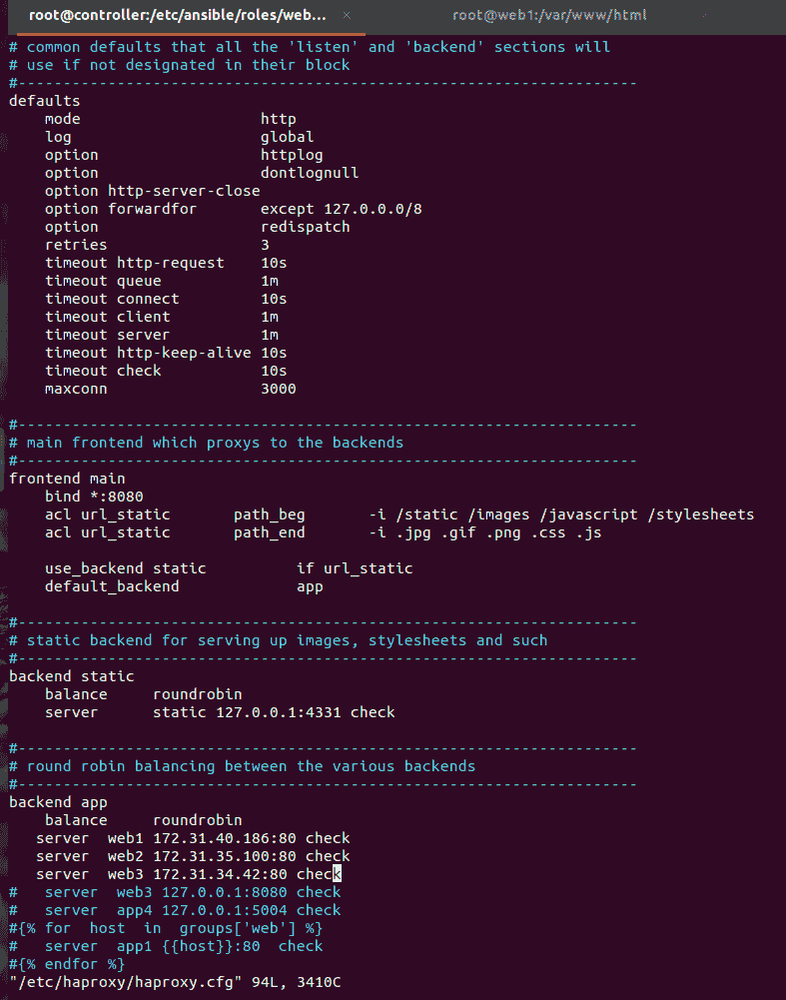

# 在 AWS 上创建 HAPROXY 负载平衡器的可行行动手册

> 原文：<https://medium.com/globant/ansible-playbook-for-creating-haproxy-load-balancer-on-aws-4e959ab60d36?source=collection_archive---------0----------------------->

在本文中，我们将配置一个名为“HAProxy”的反向代理，并在每次新的受管节点(使用 Apache web 服务器配置)加入 Ansible 清单时自动更新其配置文件。

# **简介**

HAProxy(高可用性代理)是**开源代理和负载均衡服务器软件**。它在网络层(TCP)和应用层(HTTP/S)提供高可用性，通过在多台服务器之间分配工作负载来提高速度和性能。HAProxy 运行在 Linux、FreeBSD 和 Solaris 操作系统上。


上面的架构图说明了我们在任务中将要执行的内容。

I)请求将被发送到用作负载平衡器的 HAProxy 服务器，并且进一步的请求可以通过循环算法被平均分配。

ii)如果假设 web1 关闭，那么负载平衡器将把流量路由到 web2 和 web3，即剩余的在线 web 服务器，因此将通过负载平衡器服务器响应客户端/用户。

# **先决条件:**

*   **需要具备 AWS 的基础知识。**以适当的权限访问 AWS 帐户。我们需要了解如何创建 EC2 实例，将安全组规则分配给负载均衡器，以便可以“在端口 8080”上访问它，并确保在创建实例时，所有实例都应该在同一个可用性区域中。
*   需要具备 *Ansible* 的基础知识。

# **实施:**

在这里，我创建了 5 个 EC2 实例，而您至少可以有 2 个后端服务器，以便负载平衡器能够在这两个服务器之间路由流量。这里我使用了 t2.micro 和 t3.micro 类型的 EC2 实例的组合。您可以选择任何实例类型 Ansible 控制器安装至少需要 t3.micro。

```
*1 Server for — — Ansible Node (Controller Node) — t3.micro
1 Server for — — LoadBalancer — t2.micro
3 Servers for — — Web Server — t2.micro*
```


**该实施将包括 16 个步骤:**

**步骤 1** 登录到控制器节点

*需要在控制器节点上安装 Ansible，遵循以下步骤:*

**如果你在 RedHat/CentOS 8 上:**

```
*1) yum install* [*https://dl.fedoraproject.org/pub/epel/epel-release-latest-8.noarch.rpm*](https://dl.fedoraproject.org/pub/epel/epel-release-latest-8.noarch.rpm) *-y
2) yum install ansible -y
3) ansible --version*
```

**第二步 *)*** 创建*用户*，我们可以按照以下步骤操作:

```
*sudo su -*
```

在所有实例/服务器上通过 useradd 命令创建用户

```
*useradd user*
```

**步骤 3** ) *现在*在所有实例 web1、web2、web3 和负载平衡器上的 sudoers 文件中添加“*用户*

```
*echo “user ALL=(ALL) NOPASSWD: ALL” > /etc/sudoers.d/user*
*exec bash*
```

确保 *SSH* 应该允许控制器节点、负载平衡器和 web 服务器之间的连接。为此，编辑文件“ */etc/ssh/sshd_config* ”，并更新所有实例(web 服务器、负载平衡器和控制器节点)的线下内容，并在更新线下内容后重新启动 *ssh* 服务。

```
*PasswordAuthentication yes*
```

以下是在控制器节点服务器上设置控制器节点、负载平衡器和 web 服务器之间的无密码连接时要逐一执行的命令，同时确保您必须以普通“用户”身份登录才能执行以下命令。

```
 *1) ssh-keygen
2) ssh-copy-id user@web1
3) ssh-copy-id user@web2
4) ssh-copy-id user@web3
5) ssh-copy-id user@loadbalancer*
```

**步骤 4)** 从*普通*“用户”运行 ansible 剧本，编辑 ansible 的以下配置文件。

```
*sudo vim /etc/ansible/ansible.cfg*
```

***取消注释下面的行***

```
*[defaults]
ask_pass = False
remote_user = user**[privilege_escalation]
become=True
become_method=sudo
become_user=root
become_ask_pass=False*
```

**步骤 5)** 通过/etc/ansible/hosts 文件在 ansible hosts 内部设置 *web 服务器* 和*负载均衡器* 如下图所示

cat /etc/ansible/hosts

这里[web]是组名，其中 web1、web2 和 web3 是节点。类似地，[loadserver]是 groupname，其中 loadbalancer 是一个节点。

**步骤 6)** 使用 *mkdir、* 创建一个角色文件夹 */etc/ansible/roles* 目录结构可以使用以下命令从 Ansible Galaxy 下载:

```
*sudo ansible-galaxy init webserver — -> creates role for web server
sudo ansible-galaxy init lbserver — -> creates role for load balancer*
```

**步骤 7** )使用 *mkdir* 命令创建一个名为 *projects* 的目录来管理 *hosts* 文件。

```
*sudo mkdir -p /etc/ansible/roles/projects*
```

*这是一幅完整的解释图。*


/etc/ansible/roles

**步骤 8)** 在一个 ansible 配置文件 *(ansible.cfg)中设置角色的路径。*只需取消下面一行的注释

```
*roles_path = /etc/ansible/roles*
```


**步骤 9)** 在名为“*项目”*的目录下开始编写行动手册。*在“项目”目录下创建***setup . yml*playbook，代码可以写如下*

*/etc/ansible/roles/projects/setup.yml*

***步骤 10)** 现在我们要配置 *lbserver 角色*。为此，我们必须在各自的文件夹中编写任务和处理程序。*

```
**cd /etc/ansible/roles/lbserver/handlers
sudo vim main.yml**
```

**/etc/ansible/roles/lbserver/handlers/main.yml**

***步骤 11)** 从中调用 *lbserver* 的角色，将目录更改为“ *tasks* 并编辑 *main.ym* l 文件，以定义 *haproxy* 包要安装在负载均衡服务器上的任务。因此，代码可以编写如下*

*/etc/ansible/roles/lbserver/tasks/main.yml*

***步骤 12)** 为了管理 web 服务器*，*我们要在 Web 服务器的 *tasks* 目录下写剧本 *(main.yml)* ，代码可以写如下*

*/etc/ansible/roles/webserver/tasks/main.yml*

*这里我们已经完成了 web 服务器的配置。您也可以使用处理程序来重启 apache 服务器。*

***步骤 13)** *为了配置&* *通过 Ansible 管理*HAProxy 负载均衡器，*我们*必须在*控制器*实例上安装 ha proxy 包。*

```
**sudo yum install haproxy -y  → it will install haproxy on controller node**
```

***步骤 14)** 编辑文件“/etc/haproxy/haproxy.cfg”和 c *hange* 绑定端口号，可以使用任意端口例如 **1234** 。*这里*我已经用了 **8080** 和**你还需要为所有端口号为 **80 的 web 服务器定义私有 ip。*****

**编辑了“/etc/haproxy/haproxy.cfg”配置文件，如下图**

**

**/etc/happroxy/haprroxy.cfg**

**

**/etc/haproxy/haproxy.cfg**

*这里主机名等于 web 服务器。主机名定义为 web1、web2 和 web3，如上面的屏幕截图所示。*

***步骤 15)** *复制*ha proxy 配置文件并粘贴到**/**etc/ansi ble/roles/lbserver/templates 中*

***步骤 16)** *最后* 我们准备好运行并执行我们的 ansible-playbook。将目录更改为/*etc/ansi ble/roles/projects。*从*这里*我们可以运行剧本。*

```
**ansible-playbook setup.yml**
```

**

*/etc/ansible/roles/projects/*

# ***测试我们的实现 *:****

*   *现在我们可以检查我们的负载平衡器是否在工作。以端口为 8080(绑定端口)的负载平衡器的公共 IP 为例，它显示我们连接到 web1 服务器。*

**

*Connected to web1*

*   **刷新* [*页面 http://loadbalancerIP:8080。*](http://loadbalancerIP:8080.) *你将连接到 Web2 服务器。**

**

*Connected to web2*

*   **再次刷新* [*的页面 http://loadbalancerIP:8080。*](http://loadbalancerIP:8080.) *你将连接到 Web3。**

**

*Connected to web3*

# ***概要 *:****

*   **安装在控制器节点上的 Ansible 软件。**
*   **定义了可行的剧本角色，用于管理和配置 lbserver(HAProxy)和 web 服务器。**
*   **运行* *项目目录下的主剧本(setup.yml)，将配置 web 服务器和负载均衡服务器。**
*   **负载平衡器*公共 IP *通过 HAProxy 软件点击* 3 个不同的*网络服务器。**

# ***GITHUB 链接:***

*[*https://github . com/Mustafa 2898/haproxyloadbalencer _ globant . git*](https://github.com/mustafa2898/HAPROXYLOADBALNCER_GLOBANT.git)*

***参考文献:***

*   *[*https://docs . ansi ble . com/ansi ble/latest/user _ guide/playbooks _ reuse _ roles . html*](https://docs.ansible.com/ansible/latest/user_guide/playbooks_reuse_roles.html)*
*   *[https://galaxy.ansible.com/docs/?extIdCarryOver=true&sc _ cid = 701 f 2000001 H7 yaaw](https://galaxy.ansible.com/docs/?extIdCarryOver=true&sc_cid=701f2000001OH7YAAW)*