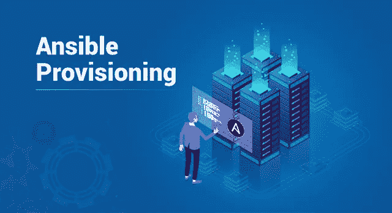
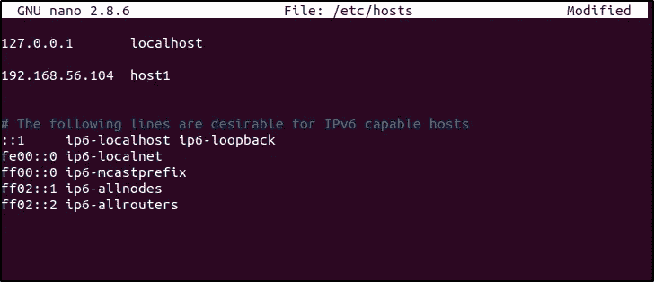
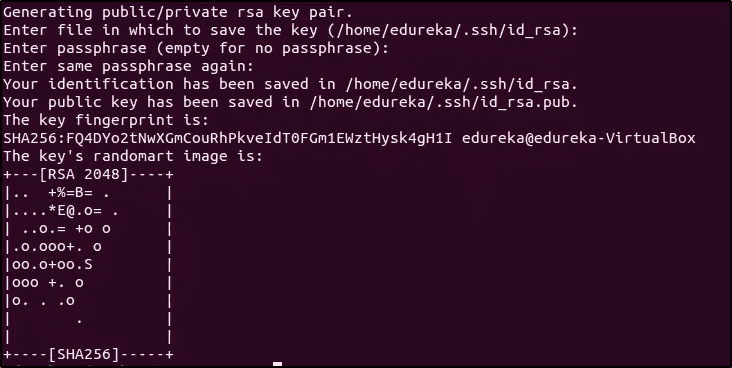
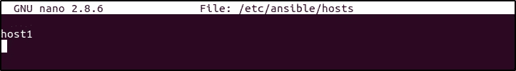
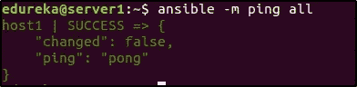
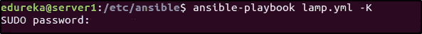

# 可行的供应-更智能、更轻松的供应方式

> 原文：<https://medium.com/edureka/ansible-provisioning-setting-up-lamp-stack-d8549b38dc59?source=collection_archive---------0----------------------->



Ansible Provisioning — Edureka

自动化应用程序的任何操作生命周期的第一步是自动化基础架构的供应。供应是一个设置配置、分配内存、磁盘空间等烦人的过程。，在实际使用它们之前。让我们看看 Ansible Provisioning 如何让这变得更简单、更快速。

大多数大规模部署都要求您在多个系统上拥有相同的环境设置。那么，你是怎么做到的呢？在一百个系统上手动执行相同的命令集？？Nahh..那太老派了。这是机器擅长的，而不是人类。如果我告诉你这个漫长而无聊的过程可以通过执行一个简单可行的剧本来完成呢？这就是我们要在本文中讨论的内容。

涵盖的主题有:

*   什么是可能的
*   Ansible 可以自动化什么？
*   对可行供应的需求
*   演示:如何设置环境以部署网站

# 什么是 Ansible？

DevOps 是一种高度重视自动化的文化。如果有工具可以自动化部署和测试过程，为什么没有工具来进行配置管理和供应呢？变得更聪明的方法有一百万种，使用 Ansible 是其中之一。它是使用最广泛的工具之一。

Ansible 使用基于 YAML 的剧本，甚至初学者也能理解。它使用无代理架构与其客户端通信，不需要在客户端机器上安装任何第三方工具，而是使用基于 SSH 的连接。Ansible 是一个自动化工具，让我们看看它能自动化什么。

# Ansible 可以自动化什么？

指定开发周期中的一个阶段，Ansible 将帮助您完成，无论是配置管理、供应、编排、持续交付、安全还是应用程序部署。Ansible 将开发周期工作流程整合到一个单一的无代理自动化平台中。

1.  **供应:**为应用程序/软件创建一个合适的环境是必要的。Ansible 提供了一种方法来自动化为应用程序的存在而创建的环境。
2.  **配置管理:**执行各种各样的配置任务，如启动/停止服务，更改系统、设备或应用程序的配置等。
3.  **应用部署:**使用 Ansible 自动定义部署，并使用 Ansible tower 管理部署。这使得从生产到部署的整个应用程序周期高效且易于管理。
4.  持续交付:创建和管理持续集成/持续交付管道可能会变得很麻烦。这就是 Ansible 介入并使开发人员的生活变得更容易的地方。
5.  **安全与合规:**与项目合作，总是设定界限，并与公司的安全政策相结合。将安全策略自动集成到部署中可以使遵守策略变得更加容易。
6.  **编排:**一个完整的项目是具有不同配置的许多不同实例的集合。Ansible 将这些不同的实例作为一个整体进行合并和管理。

# 对可行供应的需求

如前所述，自动化应用程序操作生命周期的第一步是准备好环境，即供应。大型部署要求多台主机具有完全相同的配置。在调配一台主机后，如果手动完成，您让接下来的 10 台主机具有完全相同的配置的可能性有多大？同样，你会花多少时间做同样的重复性工作？这就是 Ansible 为我们服务的地方。只需执行一个行动手册，您就可以调配数百台主机。魔法？哈哈！不，只是自动化的进化。

# **演示:创建灯堆栈并部署网页**

假设您试图在 30 个系统上部署一个网站，每个网站部署都需要一个基本的操作系统、网络服务器、数据库和 PHP。我们使用 ansible playbook 一次在所有 30 个系统上安装这些先决条件。

在这个 Ansible 供应演示中，我将向您展示如何使用 Ansible 供应网站托管环境。我们安装 LAMP (Linux、Apache、MySQL 和 PHP)栈，然后部署一个网站。

对于这个演示，我使用了一个装有 Ubuntu 版本 17.04 的 Linux 虚拟机器。我使用了两个虚拟机，一个作为我的安装 Ansible 的服务器，另一个作为我的远程主机。让我们从在服务器上设置 Ansible 开始。

我创建了一个简单的静态网页，保存在一个名为 **index** 的文件夹中，里面有两个文件，index.html 和 style.css

## index.html:

```
<html>
<head>
<title>Website using HTML and CSS</title>
<link href="style.css" rel="stylesheet" type="text/css">
</head>
<body>
<header>
<div class="top">
<ul class="nav-menu">
<li class="homebtn"> <a href="">Home</a></li>
<li> <a href="">About</a></li>
<li> <a href="">Breeds</a></li>
<li> <a href="">Adoption</a></li>
<li> <a href="">Contact</a></li>
</ul>
</div>
<div class="tagline">
<h1>Share your home with a cute dog!</h1>
<div class="adopt">
<a href="" class="bttn">Adopt Now</a>
</div>
</div>
</header>
</body>
</html>
```

## style.css

```
*
{
margin:0;
padding:0;
}header {
background-image: linear-gradient(rgba(0,0,0,0.5), rgba(0,0,0,0.5)),url('puppie.jpg');
height:100vh;
background-size:cover;
background-position:center;
}.nav-menu {
float: right;
list-style:none;
margin-top:30px;
}.nav-menu li {
display: inline-block;
}.nav-menu li a {
color:turquoise;
text-decoration: none;
padding:5px 20px;
font-family:"Verdana", "sans-serif";
font-size:20px;
}.homebtn a {
border: 1px solid grey;
background-color:white;
}.nav-menu li a:hover {
border:1px solid grey;
background-color: white;
}.tagline {
position: absolute;
width:1200px; 
margin-left:0;
margin-top:0;
}h1 {
color:white;
font-size:50px;
font-family:"Verdana", "sans-serif";
text-align:center;
margin-top:275px;
}.adopt {
margin-top:30px;
margin-left:540px;
}.bttn {
border: 1px solid white;
padding:10px 30px;
color:yellow;
font-family:"Verdana", "sans-serif";
font-size: 22px;
text-decoration:none;
}.adopt a:hover {
background-color: burlywood;
}
```

**步骤 1:** 执行以下命令来更新存储库，添加所需的存储库，并在您的机器上配置 PPA 以便进行 Ansible 安装:

```
$ sudo apt-get update
$ sudo apt-get install software-properties-common
$ sudo apt-add-repository ppa:ansible/ansible
```

按 enter 键接受 PPA 添加，然后在更新存储库后安装 Ansible。

```
$ sudo apt-get update
$ sudo apt-get install ansible
```

**步骤 2:** 转到服务器的/etc/hosts 文件，添加主机的主机名和 IP 地址。



**步骤 3:** 由于 Ansible 在使用 ssh 与其主机通信的无代理架构上工作，因此设置 SSH 密钥。基本上，我们有一台服务器和一台主机。我们用服务器控制主机，因此我们在服务器上创建一个公共 ssh-key，并将其复制到主机上。在服务器上执行以下命令:

```
$ ssh-keygen
```

系统会提示您输入保存密钥的文件名，还会提示您创建一个密码来访问生成的密钥，这是可选的。默认情况下，公钥保存在。ssh/id_rsa.pub 文件，私钥保存在。ssh/id_rsa。



现在，这个生成的密钥需要存在于您的主机中。可以通过两种方式将密钥复制到主机中，要么手动复制到主机中，要么使用 ssh-copy-id 命令。在本例中，我将使用 ssh-copy-id root@IP_of_host 命令来复制它。

```
$ ssh-copy-id root@192.168.56.104
```

**注意**——在执行这个命令之前，确保您能够 ssh 到您的主机。

**第四步:**配置可运行的主机。转到/etc/ansible/hosts 文件并添加主机名。这将根据您拥有的主机和服务器的数量而有所不同。这里也可以有多台服务器。



**第五步:**检查你的主人是否准备好了。执行这个命令应该会得到类似的输出。

```
$ ansible -m ping all
```



步骤 6: 现在我们的 Ansible 已经准备好了，让我们准备好部署网站的环境。我们将使用一个简单的脚本来安装 Apache、MySql 和 PHP。让我们来看看。

```
---
# Setup LAMP Stack
-  hosts: host1
   tasks:-  name: Add ppa repository
         become: yes
         apt_repository: repo=ppa:ondrej/php-  name: Install lamp stack
         become: yes
         apt:
            pkg:
              - apache2   
              - mysql-server
              - php7.0
              - php7.0-mysql   
            state: present
            update cache: yes-  name: start apache server
          become: yes
          service: 
              name: apache2
               state: started
                enabled: yes-  name: start mysql service
          become: yes
          services:
             name: mysql
             state: started
             enabled: yes-  name:  create target directory
          file: path=/var/www/html state=directory mode=0755- name:  deploy index.html
         became: yes
          copy: 
              src: /etc/ansible/index/index.html
              dest: var/www/html/index/index.html
```

如您所见，我们有 6 个任务，每个任务执行一个特定的功能。

*   第一个任务是添加安装 MySQL 和 PHP 所需的存储库。
*   第二个任务安装 apache2、MySQL-server、PHP 和 PHP-MySQL。
*   第三和第四个任务启动 Apache 和 MySQL 服务。
*   第五个任务在主机上创建一个目标目录
*   最后，第六个任务执行 index.html 文件，它从服务器上获取文件，并将其复制到主机上。

使用以下命令执行本行动手册:

```
$ ansible-playbook lamp.yml -K
```

剧本中的行**变成:yes** 表示它需要以 root 身份执行，因此当您执行命令时，它会提示输入 sudo 密码。



现在你可以进入主机，检查网站是否被托管。


现在，这是一个将部署在所有与服务器交互的主机上的网页(在我们的例子中，我们只有一台主机)，但即使对于 100 台远程主机来说，这也是可能的。

这就把我们带到了 Ansible Provisioning 文章的结尾。如果你想查看更多关于人工智能、Python、道德黑客等市场最热门技术的文章，那么你可以参考 [Edureka 的官方网站。](https://www.edureka.co/blog/?utm_source=medium&utm_medium=content-link&utm_campaign=ansible-provisioning-setting-up-lamp-stack)

请留意本系列中的其他文章，它们将解释 DevOps 的各个方面。

> *1。* [*DevOps 教程*](/edureka/devops-tutorial-89363dac9d3f)
> 
> *2。* [*饭桶教程*](/edureka/git-tutorial-da652b566ece)
> 
> *3。* [*詹金斯教程*](/edureka/jenkins-tutorial-68110a2b4bb3)
> 
> *4。* [*Docker 教程*](/edureka/docker-tutorial-9a6a6140d917)
> 
> *5。* [*Ansible 教程*](/edureka/ansible-tutorial-9a6794a49b23)
> 
> *6。* [*傀儡教程*](/edureka/puppet-tutorial-848861e45cc2)
> 
> *7。* [*厨师教程*](/edureka/chef-tutorial-8205607f4564)
> 
> *8。* [*Nagios 教程*](/edureka/nagios-tutorial-e63e2a744cc8)
> 
> *9。* [*如何编排 DevOps 工具？*](/edureka/devops-tools-56e7d68994af)
> 
> *10。* [*连续交货*](/edureka/continuous-delivery-5ca2358aedd8)
> 
> *11。* [*持续集成*](/edureka/continuous-integration-615325cfeeac)
> 
> *12。* [*连续部署*](/edureka/continuous-deployment-b03df3e3c44c)
> 
> *13。* [*持续交付 vs 持续部署*](/edureka/continuous-delivery-vs-continuous-deployment-5375642865a)
> 
> *14。* [*CI CD 管道*](/edureka/ci-cd-pipeline-5508227b19ca)
> 
> *15。* [*Docker 作曲*](/edureka/docker-compose-containerizing-mean-stack-application-e4516a3c8c89)
> 
> *16。* [*码头工人群*](/edureka/docker-swarm-cluster-of-docker-engines-for-high-availability-40d9662a8df1)
> 
> *17。* [*Docker 联网*](/edureka/docker-networking-1a7d65e89013)
> 
> *18。* [*天穹*](/edureka/ansible-vault-secure-secrets-f5c322779c77)
> 
> *19。* [*可变角色*](/edureka/ansible-roles-78d48578aca1)
> 
> *20。* [*适用于 AWS*](/edureka/ansible-for-aws-provision-ec2-instance-9308b49daed9)
> 
> *21。* [*詹金斯管道*](/edureka/jenkins-pipeline-tutorial-continuous-delivery-75a86936bc92)
> 
> 22。 [*顶级 Docker 命令*](/edureka/docker-commands-29f7551498a8)
> 
> *23。*[*Git vs GitHub*](/edureka/git-vs-github-67c511d09d3e)
> 
> *24。* [*顶级 Git 命令*](/edureka/git-commands-with-example-7c5a555d14c)
> 
> 25。 [*DevOps 面试问题*](/edureka/devops-interview-questions-e91a4e6ecbf3)
> 
> *二十六。* [*谁是 DevOps 工程师？*](/edureka/devops-engineer-role-481567822e06)
> 
> 27。 [*DevOps 生命周期*](/edureka/devops-lifecycle-8412a213a654)
> 
> *28。*[*Git Reflog*](/edureka/git-reflog-dc05158c1217)
> 
> *29。* [*组织正在寻找的顶尖 DevOps 技能*](/edureka/devops-skills-f6a7614ac1c7)
> 
> 30。 [*瀑布 vs 敏捷*](/edureka/waterfall-vs-agile-991b14509fe8)
> 
> *31。* [*Maven 用于构建 Java 应用*](/edureka/maven-tutorial-2e87a4669faf)
> 
> *32。* [*詹金斯小抄*](/edureka/jenkins-cheat-sheet-e0f7e25558a3)
> 
> *33。* [*Ansible 备忘单*](/edureka/ansible-cheat-sheet-guide-5fe615ad65c0)
> 
> *34。* [*Ansible 面试问答*](/edureka/ansible-interview-questions-adf8750be54)
> 
> *35。* [*50 码头工人面试问题*](/edureka/docker-interview-questions-da0010bedb75)
> 
> *36。* [*敏捷方法论*](/edureka/what-is-agile-methodology-fe8ad9f0da2f)
> 
> *37。* [*詹金斯面试问题*](/edureka/jenkins-interview-questions-7bb54bc8c679)
> 
> *38。* [*Git 面试问题*](/edureka/git-interview-questions-32fb0f618565)
> 
> *39。* [*Docker 架构*](/edureka/docker-architecture-be79628e076e)
> 
> 40。[*devo PS 中使用的 Linux 命令*](/edureka/linux-commands-in-devops-73b5a2bcd007)
> 
> 41。 [*詹金斯 vs 竹子*](/edureka/jenkins-vs-bamboo-782c6b775cd5)
> 
> *42。* [*Nagios 面试问题*](/edureka/nagios-interview-questions-f3719926cc67)
> 
> *43。* [*DevOps 实时场景*](/edureka/jenkins-x-d87c0271af57)
> 
> 44。 [*詹金斯和詹金斯 X*](/edureka/jenkins-vs-bamboo-782c6b775cd5) 的区别
> 
> *四十五。*[*Windows Docker*](/edureka/docker-for-windows-ed971362c1ec)
> 
> 46。T38*Git vs Github*

*原载于 2019 年 2 月 18 日 https://www.edureka.co*[](https://www.edureka.co/blog/ansible-provisioning-setting-up-lamp-stack)**。**