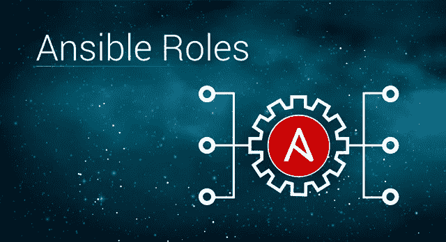
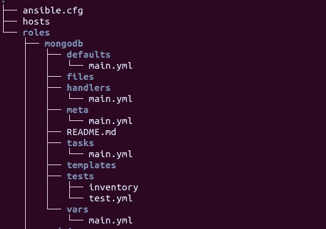
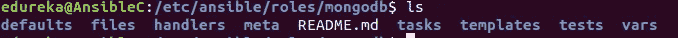
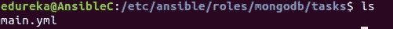
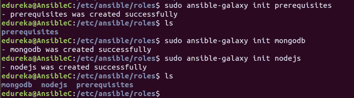
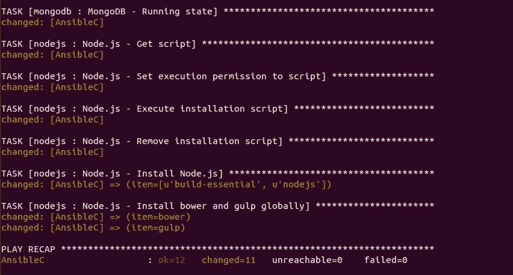

# 可变角色——解决你对剧本困惑的终极方法

> 原文：<https://medium.com/edureka/ansible-roles-78d48578aca1?source=collection_archive---------0----------------------->



Ansible Roles — Edureka

Ansible 允许我们自动化系统的配置管理，并根据需要添加任意数量的客户端。你想过这会变得多复杂吗？你有没有想过剧本会有多长，会有多混乱？Ansible 是如何让它看起来轻而易举的？它使用了可变角色的概念，这也是我们将在这篇博客中讨论的内容。

涵盖的主题:

*   可变角色介绍
*   可重复使用的角色
*   角色目录结构
*   演示:使用可变角色安装平均堆栈

# 可变角色介绍

角色是一个处理想法而不是事件的概念。它基本上是用于组织剧本的另一个抽象层次。它们为变量、任务、模板、文件和模块的独立和可重用集合提供了一个框架，这些集合可以自动加载到剧本中。剧本是角色的集合。每个角色都有特定的功能。

我举个例子来解释一下。假设您希望您的行动手册在 5 个不同的系统上执行 10 个不同的任务，您会使用一个行动手册吗？不，使用单一的剧本会使它变得混乱和容易出错。相反，您可以创建 10 个不同的角色，每个角色将执行一项任务。然后，你需要做的就是，在剧本中提到角色的名字来称呼他们。在这篇博客中，你将进一步了解如何使用角色。

# 可重复使用的角色

可互换的角色是相互独立的。一个角色的执行不依赖于其他角色，因此它们可以被重用。您甚至可以根据自己的需求修改和个性化这些角色。这减少了我们每次需要时重写整个代码段的任务，从而简化了我们的工作。

让我们回到前面的例子。您已经编写了 10 个角色，现在您需要将其中的 5 个用于另一组配置。你会把整个剧本重新写一遍吗？不，你只是在新剧本中重复使用这 5 个角色。如果需要的话，你也可以做一些修改，但最终还是会节省你很多时间。

假设您需要编写一个剧本来设置灯堆栈。你必须创建 4 个角色，分别用于创建 Linux、Apache、MongoDB 和 [PHP](https://www.edureka.co/blog/php-tutorial-for-beginners?utm_source=medium&utm_medium=content-link&utm_campaign=ansible-roles-setup-mean-stack) 。将来，如果你想要另外一个剧本来设置 LAMP stack 和 WordPress，你会再次为 LAMP stack 和 WordPress 创建新的角色吗？不要！你可以简单地重用旧的角色(用于 LAMP stack ),另外为 WordPress 创建一个新的角色。

# 角色目录结构

使用可转换的角色，期望文件处于特定的文件结构中。使用角色最令人困惑的部分是理解文件层次结构。Ansible 提供了一个名为 Ansible Galaxy 的功能，可以帮助你玩角色。我们已经知道我们的 Ansible 在 Ubuntu 上的位置(/etc/ansible)。有没有见过/etc/ansible 下有一个叫 roles 的目录？该目录的存在正是出于这个原因。您可以在这个目录中创建不同的角色。

该目录将如下所示:



您可以在/etc/ansible/roles 中使用 **ansible-galaxy** init 命令创建一个角色。

`$ sudo ansible-galaxy init <role-name>`


您将会看到还会创建其他角色目录。



这些目录是任务、处理程序、默认值、变量、文件、模板、元数据和一个 README.md 文件。

**任务** —包含由角色执行的任务的主要列表。它包含该特定角色的 main.yml 文件。

**处理程序** —包含该角色甚至该角色之外的任何地方可能使用的处理程序。

**默认值** —包含该角色将要使用的默认变量。

**Vars** —该目录由角色将要使用的其他变量组成。这些变量可以在您的剧本中定义，但是在本节中定义它们是一个好习惯。

**文件** —包含可由该角色部署的文件。它包含在配置角色时需要发送到主机的文件。

**元数据** —定义该角色的元数据。基本上，它包含建立角色依赖关系的文件。

每个**任务**目录必须由一个 **main.yml** 文件组成，该文件中写入了特定角色的实际代码。



现在，让我们通过安装 MEAN Stack 的演示来了解工作或角色。

# 演示:使用可变角色安装平均堆栈

我将通过执行一个剧本来演示如何使用可转换的角色来安装 MEAN Stack。我们将有三个角色:1)安装先决条件，2)安装 MongoDB，3)安装 NodeJS。我假设您已经在 Ubuntu 上安装了 Ansible 并建立了服务器-客户端连接。让我们开始扮演可互换的角色。

**步骤 1** —导航到/etc/ansible/roles 目录，并为先决条件、MongoDB 和 NodeJS 创建角色。

```
$ cd /etc/ansible/roles
$ sudo ansible-galaxy init prerequisites
$ sudo ansible-galaxy init mongodb
$ sudo ansible-galaxy init nodejs
```

现在，您应该在“角色”目录中看到三个角色。



**第二步** —为安装 Git 的先决条件编写 main.yml。

```
$ cd prerequisites/tasks/main.yml

---
- name: Install git
  apt:
     name: git
     state: present
     update_cache: yes
```

**第三步** —为 MongoDB 角色编写 main.yml

```
$ cd /mongodb/tasks/main.yml

---
- name: MongoDB - Import public key
  apt_key:
    keyserver: hkp://keyserver.ubuntu.com:80
    id: EA312927

- name: MongoDB - Add repository
  apt_repository:
    filename: '/etc/apt/sources.list.d/mongodb-org-3.2.list'
    repo: 'deb [http://repo.mongodb.org/apt/ubuntu](http://repo.mongodb.org/apt/ubuntu) xenial/mongodb-org/3.2 multiverse'
    state: present
    update_cache: yes

- name: MongoDB - Install MongoDB
  apt:
    name: mongodb-org
    state: present
    update_cache: yes

- name: MongoDB - Running state
  service:
    name: mongod
    state: started
```

**步骤 4** —为 nodejs 角色编写 main.yml

```
$ cd nodejs/tasks/main.yml

---
- name: Node.js - Get script
  get_url:
    url: "[http://deb.nodesource.com/setup_6.x](http://deb.nodesource.com/setup_6.x)"
    dest: "{{ var_node }}/nodejs.sh"

- name: Node.js - Set execution permission to script
  file:
    path: "{{ var_node }}/nodejs.sh"
    mode: "u+x"

- name: Node.js - Execute installation script
  shell: "{{ var_node }}/nodejs.sh"

- name: Node.js - Remove installation script
  file:
    path: "{{ var_node}}/nodejs.sh"
    state: absent

- name: Node.js - Install Node.js
  apt: name={{ item }} state=present update_cache=yes
  with_items:
    - build-essential
    - nodejs

- name: Node.js - Install bower and gulp globally
  npm: name={{ item }} state=present global=yes
  with_items:
    - bower
    - gulp
```

第五步——写下你的主要剧本

```
$ cd /etc/ansible/mean.yml

---

- hosts: nodes
  remote_user: ansible
  become: yes
  become_method: sudo
  vars:
    #variable needed during node installation
    var_node: /tmp
  roles:
      - prerequisites
      - mongodb
      - nodejs
```

现在我们已经定义了安装必备组件 MongoDB 和 NodeJs 的角色，让我们来部署它们。使用以下命令执行行动手册。

`$ sudo ansible-playbook /etc/ansible/mean.yml -K`



正如您所看到的，所有的任务都已经执行，并且它们的状态已经改变。这意味着行动手册的更改已经应用到您的服务器和主机。设置均值堆栈只是一个例子。您可以使用 Ansible 角色设置任何事情。

这就把我们带到了 Ansible Roles 博客的结尾。如果你想查看更多关于人工智能、Python、道德黑客等市场最热门技术的文章，那么你可以参考 [Edureka 的官方网站。](https://www.edureka.co/blog/?utm_source=medium&utm_medium=content-link&utm_campaign=ansible-roles-setup-mean-stack)

请留意本系列中的其他文章，它们将解释 DevOps 的各个方面。

> *1。* [*DevOps 教程*](/edureka/devops-tutorial-89363dac9d3f)
> 
> *2。* [*Git 教程*](/edureka/git-tutorial-da652b566ece)
> 
> *3。* [*詹金斯教程*](/edureka/jenkins-tutorial-68110a2b4bb3)
> 
> *4。* [*Docker 教程*](/edureka/docker-tutorial-9a6a6140d917)
> 
> *5。* [*Ansible 教程*](/edureka/ansible-tutorial-9a6794a49b23)
> 
> *6。* [*木偶教程*](/edureka/puppet-tutorial-848861e45cc2)
> 
> *7。* [*厨师教程*](/edureka/chef-tutorial-8205607f4564)
> 
> *8。* [*Nagios 教程*](/edureka/nagios-tutorial-e63e2a744cc8)
> 
> *9。* [*如何编排 DevOps 工具？*](/edureka/devops-tools-56e7d68994af)
> 
> *10。* [*连续交货*](/edureka/continuous-delivery-5ca2358aedd8)
> 
> *11。* [*持续集成*](/edureka/continuous-integration-615325cfeeac)
> 
> *12。* [*连续部署*](/edureka/continuous-deployment-b03df3e3c44c)
> 
> *13。* [*持续交付 vs 持续部署*](/edureka/continuous-delivery-vs-continuous-deployment-5375642865a)
> 
> *14。* [*CI CD 管道*](/edureka/ci-cd-pipeline-5508227b19ca)
> 
> 15。 [*Docker 撰写*](/edureka/docker-compose-containerizing-mean-stack-application-e4516a3c8c89)
> 
> *16。* [*码头工人群*](/edureka/docker-swarm-cluster-of-docker-engines-for-high-availability-40d9662a8df1)
> 
> *17。* [*码头工人联网*](/edureka/docker-networking-1a7d65e89013)
> 
> 18。 [*天穹*](/edureka/ansible-vault-secure-secrets-f5c322779c77)
> 
> 19。 [*适用于 AWS*](/edureka/ansible-for-aws-provision-ec2-instance-9308b49daed9)
> 
> 20。 [*詹金斯管道*](/edureka/jenkins-pipeline-tutorial-continuous-delivery-75a86936bc92)
> 
> *21。* [*顶级 Git 命令*](/edureka/git-commands-with-example-7c5a555d14c)
> 
> *22。* [*顶级 Docker 命令*](/edureka/docker-commands-29f7551498a8)
> 
> *23。*[*Git vs GitHub*](/edureka/git-vs-github-67c511d09d3e)
> 
> *24。* [*DevOps 面试问题*](/edureka/devops-interview-questions-e91a4e6ecbf3)
> 
> *25。* [*谁是 DevOps 工程师？*](/edureka/devops-engineer-role-481567822e06)
> 
> *26。* [*DevOps 生命周期*](/edureka/devops-lifecycle-8412a213a654)
> 
> *27。*[*Git Reflog*](/edureka/git-reflog-dc05158c1217)
> 
> *28。*[](/edureka/ansible-provisioning-setting-up-lamp-stack-d8549b38dc59)
> 
> **29。* [*组织正在寻找的顶尖 DevOps 技能*](/edureka/devops-skills-f6a7614ac1c7)*
> 
> **30。* [*瀑布 vs 敏捷*](/edureka/waterfall-vs-agile-991b14509fe8)*
> 
> **31。* [*Maven 用于构建 Java 应用*](/edureka/maven-tutorial-2e87a4669faf)*
> 
> **32。* [*詹金斯备忘单*](/edureka/jenkins-cheat-sheet-e0f7e25558a3)*
> 
> *33。[](/edureka/ansible-cheat-sheet-guide-5fe615ad65c0)*
> 
> **34。 [*Ansible 面试问答*](/edureka/ansible-interview-questions-adf8750be54)**
> 
> **35。 [*50 Docker 面试问题*](/edureka/docker-interview-questions-da0010bedb75)**
> 
> ***36。* [*敏捷方法论*](/edureka/what-is-agile-methodology-fe8ad9f0da2f)**
> 
> **37。 [*詹金斯面试问题*](/edureka/jenkins-interview-questions-7bb54bc8c679)**
> 
> **38。 [*Git 面试问题*](/edureka/git-interview-questions-32fb0f618565)**
> 
> **39。 [*Docker 架构*](/edureka/docker-architecture-be79628e076e)**
> 
> ***40。*[*devo PS 中使用的 Linux 命令*](/edureka/linux-commands-in-devops-73b5a2bcd007)**
> 
> ***41。* [*詹金斯 vs 竹子*](/edureka/jenkins-vs-bamboo-782c6b775cd5)**
> 
> ***42。* [*Nagios 面试问题*](/edureka/nagios-interview-questions-f3719926cc67)**
> 
> ***43。* [*DevOps 实时场景*](/edureka/jenkins-x-d87c0271af57)**
> 
> ***44。* [*詹金斯和詹金斯 X 的区别*](/edureka/jenkins-vs-bamboo-782c6b775cd5)**
> 
> ***45。*[*Docker for Windows*](/edureka/docker-for-windows-ed971362c1ec)**
> 
> ***46。*[*Git vs Github*](http://git%20vs%20github/)**

***原载于 2019 年 3 月 20 日*[*www.edureka.co*](https://www.edureka.co/blog/ansible-roles-setup-mean-stack)*。***