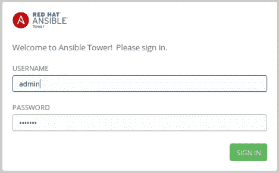

# 探索可行的塔，亲自动手

> 原文：<https://medium.com/edureka/ansible-tower-cb317ccd6779?source=collection_archive---------0----------------------->


今天的扩展行业旨在大幅提高生产率，但他们必须应对各种各样的自动化挑战，这些挑战可以通过 Ansible 等工具来克服。这篇关于 Ansible Tower 的博客将让你全面了解以下内容:

*   什么是易变的——塔？
*   安装 ansi ble-Tower 的先决条件
*   Ansible —塔架参数
*   安装步骤
*   亲自动手

好吧！！那么，让我们从什么是安塞布尔塔开始。

# 什么是安西布尔塔？

Ansible Tower 是一个更企业级的 Ansible。它是一个基于 web 的解决方案，通过非常简单的用户界面来管理您的组织，提供了一个包含所有主机的所有状态摘要的控制面板，允许快速部署，并监控所有配置。

该塔允许您共享 SSH 凭证而不暴露它们，记录所有作业，以图形方式管理库存，并与各种各样的云提供商同步它们。

# 安装 Ansible 塔的先决条件

以下操作系统支持 Ansible Tower:

*   64 位 Red Hat Enterprise Linux 6
*   Red Hat Enterprise Linux 7 64 位
*   CentOS 6 64 位
*   CentOS 7 64 位
*   LTS 64 位 Ubuntu 12.04
*   LTS 64 位 Ubuntu 14.04
*   Ubuntu 16.04 LTS 64 位
*   您应该拥有 Ansible 的最新稳定版本。
*   需要 64 位支持(内核和运行时)和 20 GB 硬盘。
*   至少需要 2 GB 内存(建议使用 4gb 以上的内存)。
*   2 GB RAM(最低，建议用于流动试用安装
*   建议使用 4 GB 内存/100 个分叉

对于 Amazon EC2:少于 100 台主机需要 m3.medium 或更大的实例大小，如果超过 100 台主机，则需要 m3.xlarge 或更大的实例大小。

对于 HA MongoDB 设置，您可以使用下面的公式粗略估计所需的空间量。

(NumberOfHostsIninventory)*(number of scans)*(AverageModuleFactSize)*(NumberOfModulesScanning)

# 可变塔参数

在博客的这一部分，您将深入了解该塔的以下参数:

*   塔式版本
*   塔式定价
*   塔式功能

# 塔式版本

Ansible 塔有 3 个不同的版本；自我支持版、标准版和高级版。每个版本都因其提供的功能而异。借助控制、安全和日志记录功能，您可以做从应用程序部署到多层编排的任何事情。


## 塔式定价

正如我之前提到的，该塔有 3 个版本，其中自我支持的一个是免费试用版。对于其他两个版本的定价，您可以参考下表:


## 塔式功能

以下是 Ansible Tower 的一些特性:


*   **多行动手册工作流—** 此功能允许您链接任意数量的行动手册，无论使用不同的库存、使用不同的凭证或运行不同的用户。
*   **利用集群扩展容量—** 随着集群增加冗余和容量，我们可以将多个 Ansible 塔式节点连接到一个 Ansible 塔式集群中，这使您可以在整个企业中扩展 Ansible 自动化。
*   **管理&跟踪库存—** Ansible Tower 通过让您轻松地从公共云提供商(如 Amazon Web Services、Microsoft Azure 等)获取库存，帮助您管理整个基础架构。
*   **REST API & Tower CLI 工具—**Ansible Tower 中的每一项功能都可以通过 ansi ble Tower 的 REST API 获得，为系统管理基础设施提供了理想的 API。Ansible Tower 的 CLI 工具可用于从 Jenkins 等 CI 系统启动作业，或者在您需要与其他命令行工具集成时使用。
*   **远程命令执行—** 通过 Ansible Tower 的远程命令执行，您可以运行简单的任务，如添加用户、重启任何出现故障的服务、在清单中的任何主机或主机组上重置密码。

好吧！！现在，你们已经了解了 Ansible Tower 的特性，让我们开始安装 Ansible Tower。

# 安装天线塔

在您安装 Ansible Tower 之前，您必须首先在您的操作系统上安装和配置 Ansible，然后还要安装 PostgreSQL。

所以，首先，让我们从安装和配置 Ansible 开始。我将使用 Ubuntu-16.04 版本作为我的操作系统。

## 在 Ubuntu 上安装和配置 Ansible

**步骤 1:** 作为根用户，使用下面的命令配置 Ansible PPA。

```
apt-get install software-properties-common
apt-add-repository ppa:ansible/ansible
```

**步骤 2:** 配置完成后，使用下面的命令安装 Ansible。

```
apt-get update
apt-get install ansible
```

安装完成后，安装 PostgreSQL。

## 安装 PostgreSQL

使用以下命令安装 PostgreSQL。

```
apt-get update
sudo apt-get install postgresql postgresql-contrib
```

## 下载 Ansible 塔

**步骤 1.1:** 完成 Ansible 安装后，注册下载 Ansible — Tower。

**步骤 1.2:** 您注册下载 Ansible Tower 后会收到一封邮件。打开你的邮件，然后点击下载按钮，进行下载。


**步骤 1.3:** 然后使用以下命令提取 Ansible Tower 安装工具。

```
tar xvzf ansible-tower-setup-latest.tar.gz
ansible-tower-setup-<tower_version>
```

其中，塔设备版本是您下载的塔设备的版本。

**第二步**:之后建立你的库存文件，你要在库存文件中提到必要的密码(admin_password，pg_password，rabbitmq_password)。


**步骤 3:** 现在，由于塔设置剧本脚本使用库存文件，它必须被调用为**。/setup.sh** 从解包塔式安装程序 tarball 的路径开始。

```
./setup.sh
```

**步骤 4:** 一旦您完成了塔式服务器的设置，请使用网络浏览器访问塔式服务器并查看塔式服务器登录屏幕，您必须在该屏幕中输入用户名和密码，才能访问塔式服务器仪表板。



# 亲自动手

在本次实践中，我将向您展示如何创建打印邮件的作业。

因此，请参考下图，了解我们将要遵循的步骤。


## 创建用户

要创建用户，进入**设置**选项，然后选择**用户**选项卡。进入用户选项卡后，点击**添加**选项添加新用户。提及所需的详细信息，然后点击**保存**。


## 创建库存

现在，创建一个库存，只需点击**库存**选项，然后转到**添加**选项。


点击添加选项后，提及所需的所有详细信息，如名称、描述、组织，然后点击**保存**。


## 创建主机

要创建主机，请转到**清单**选项卡，选择要添加主机的清单。然后选择**主机**选项卡并点击**添加**主机。这里，我想为上面创建的清单添加主机。一旦提到细节，点击**保存**。


## 创建凭据

创建主机后，通过进入**设置**选项创建凭证，然后选择**凭证**选项卡。之后，进入**添加**选项，提及详情。完成后，提及详细信息，点击**保存**。


## 设置项目

有两种方法可以访问一个简单的剧本，要么手动操作，要么从 Github 存储库中指定一个链接。

在这篇博客中，我将手动访问这个项目。

## 访问手动创建的行动手册

要访问手动创建的剧本，首先需要**创建剧本**，然后**设置项目**。

因此，请遵循以下步骤，开始创建行动手册。

以 root 用户的身份使用命令行控制台，并且**在塔式服务器文件系统上为您的项目创建一个目录**，在其中存储您为这个项目编写的脚本。


现在，通过在项目基路径目录下的塔式文件系统上创建一个新的项目目录，默认情况下位于**"/var/lib/awx/projects/"**。这里是新目录的演示。


现在，让我们开始建立一个项目。

要使用您的 web 浏览器设置一个项目，请通过单击塔仪表板顶部的**项目**链接创建新项目，然后单击**添加**按钮。


单击“添加”按钮后，您将被重定向到一个页面，在该页面上您必须填写详细信息，如项目的名称和描述。然后，将 SCM 类型设置为手动，对于剧本目录，选择与您创建的子目录相对应的值，然后单击**保存**。


所以，伙计们，这个博客到此结束！！

这是我关于 Nagios 面试问题的文章的结尾。如果你想查看更多关于人工智能、Python、道德黑客等市场最热门技术的文章，你可以参考 [Edureka 的官方网站。](https://www.edureka.co/blog/?utm_source=medium&utm_medium=content-link&utm_campaign=ansible-tower)

请留意本系列中的其他文章，它们将解释 DevOps 的各个方面。

> *1。* [*DevOps 教程*](/edureka/devops-tutorial-89363dac9d3f)
> 
> *2。* [*Git 教程*](/edureka/git-tutorial-da652b566ece)
> 
> *3。* [*詹金斯教程*](/edureka/jenkins-tutorial-68110a2b4bb3)
> 
> *4。* [*Docker 教程*](/edureka/docker-tutorial-9a6a6140d917)
> 
> *5。* [*Ansible 教程*](/edureka/ansible-tutorial-9a6794a49b23)
> 
> *6。* [*木偶教程*](/edureka/puppet-tutorial-848861e45cc2)
> 
> *7。* [*厨师教程*](/edureka/chef-tutorial-8205607f4564)
> 
> *8。* [*Nagios 教程*](/edureka/nagios-tutorial-e63e2a744cc8)
> 
> *9。* [*如何编排 DevOps 工具？*](/edureka/devops-tools-56e7d68994af)
> 
> *10。* [*连续交货*](/edureka/continuous-delivery-5ca2358aedd8)
> 
> *11。* [*持续集成*](/edureka/continuous-integration-615325cfeeac)
> 
> *12。* [*连续部署*](/edureka/continuous-deployment-b03df3e3c44c)
> 
> *13。* [*持续交付 vs 持续部署*](/edureka/continuous-delivery-vs-continuous-deployment-5375642865a)
> 
> *14。* [*CI CD 管道*](/edureka/ci-cd-pipeline-5508227b19ca)
> 
> 15。 [*码头工人撰写*](/edureka/docker-compose-containerizing-mean-stack-application-e4516a3c8c89)
> 
> 16。 [*码头工人群*](/edureka/docker-swarm-cluster-of-docker-engines-for-high-availability-40d9662a8df1)
> 
> *17。* [*Docker 联网*](/edureka/docker-networking-1a7d65e89013)
> 
> *18。* [*天穹*](/edureka/ansible-vault-secure-secrets-f5c322779c77)
> 
> 19。 [*可变角色*](/edureka/ansible-roles-78d48578aca1)
> 
> 20。 [*适用于 AWS*](/edureka/ansible-for-aws-provision-ec2-instance-9308b49daed9)
> 
> *21。* [*詹金斯管道*](/edureka/jenkins-pipeline-tutorial-continuous-delivery-75a86936bc92)
> 
> *22。* [*顶级 Docker 命令*](/edureka/docker-commands-29f7551498a8)
> 
> *23。*[*Git vs GitHub*](/edureka/git-vs-github-67c511d09d3e)
> 
> *24。* [*顶级 Git 命令*](/edureka/git-commands-with-example-7c5a555d14c)
> 
> *25。* [*DevOps 面试问题*](/edureka/devops-interview-questions-e91a4e6ecbf3)
> 
> *26。* [*谁是 DevOps 工程师？*](/edureka/devops-engineer-role-481567822e06)
> 
> *27。* [*DevOps 生命周期*](/edureka/devops-lifecycle-8412a213a654)
> 
> *28。*[*Git Reflog*](/edureka/git-reflog-dc05158c1217)
> 
> *29。*[](/edureka/ansible-provisioning-setting-up-lamp-stack-d8549b38dc59)
> 
> **三十。* [*组织正在寻找的顶尖 DevOps 技能*](/edureka/devops-skills-f6a7614ac1c7)*
> 
> **30。* [*瀑布 vs 敏捷*](/edureka/waterfall-vs-agile-991b14509fe8)*
> 
> **31。* [*詹金斯小抄*](/edureka/jenkins-cheat-sheet-e0f7e25558a3)*
> 
> **32。*[](/edureka/ansible-cheat-sheet-guide-5fe615ad65c0)*
> 
> **33。 [*Ansible 面试问答*](/edureka/ansible-interview-questions-adf8750be54)**
> 
> **34。 [*50 Docker 面试问题*](/edureka/docker-interview-questions-da0010bedb75)**
> 
> **35。 [*敏捷方法论*](/edureka/what-is-agile-methodology-fe8ad9f0da2f)**
> 
> ***36。* [*詹金斯面试问题*](/edureka/jenkins-interview-questions-7bb54bc8c679)**
> 
> **37。 [*Git 面试问题*](/edureka/git-interview-questions-32fb0f618565)**
> 
> **38。 [*Docker 架构*](/edureka/docker-architecture-be79628e076e)**
> 
> **39。[*devo PS 中使用的 Linux 命令*](/edureka/linux-commands-in-devops-73b5a2bcd007)**
> 
> ***40。* [*詹金斯 vs 竹子*](/edureka/jenkins-vs-bamboo-782c6b775cd5)**
> 
> ***41。* [*Nagios 教程*](/edureka/nagios-tutorial-e63e2a744cc8)**
> 
> ***42。* [*Nagios 面试问题*](/edureka/nagios-interview-questions-f3719926cc67)**
> 
> ***43。* [*DevOps 实时场景*](/edureka/jenkins-x-d87c0271af57)**
> 
> ***44。* [*詹金斯和詹金斯 X 的区别*](/edureka/jenkins-vs-bamboo-782c6b775cd5)**
> 
> ***45。*[*Docker for Windows*](/edureka/docker-for-windows-ed971362c1ec)**
> 
> ***46。*T80*Git vs Github***

***原载于 2018 年 9 月 19 日*[*https://www.edureka.co*](https://www.edureka.co/blog/ansible-tower/)*。***