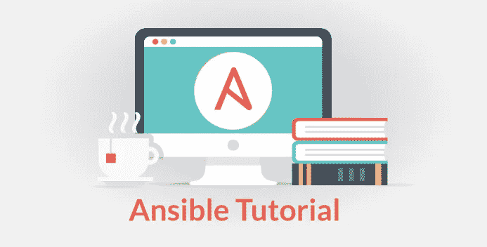
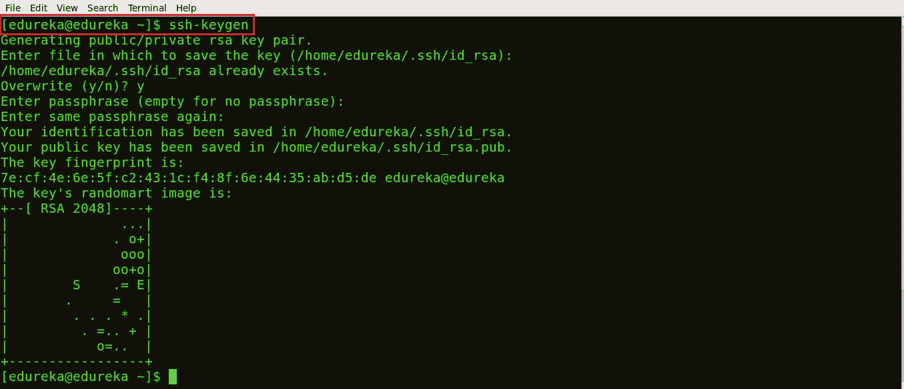
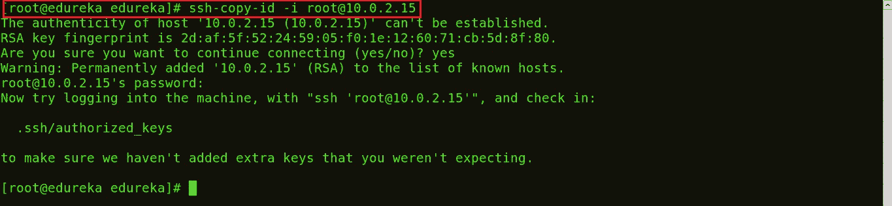
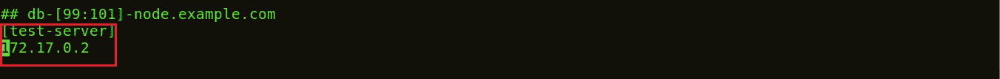
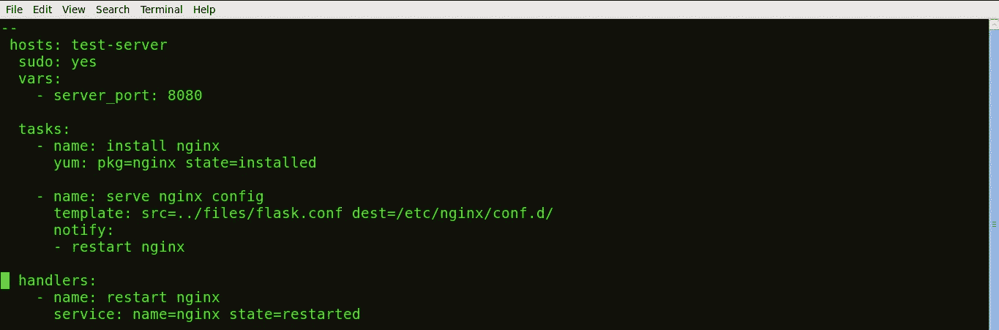
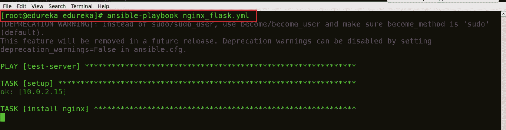
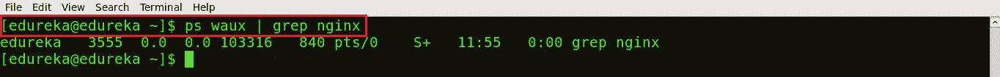

# Ansible 教程—学习如何动手编写行动手册

> 原文：<https://medium.com/edureka/ansible-tutorial-9a6794a49b23?source=collection_archive---------0----------------------->



Ansible Tutorial — Edureka

Ansible 是一个开源的 IT 配置管理、部署和编排工具。该工具旨在为各种自动化挑战提供巨大的生产力增益。在这篇关于 Ansible 教程的博客中，你将学到以下内容:

*   你将学会写剧本
*   您将了解 Ansible 中的不同模块
*   您将学习编写临时命令
*   Ansible 实践

为了更好的理解 Ansible，你可以看看这个视频。

# 编写可翻译的剧本

Ansible 中的剧本是以 YAML 格式编写的。它是一种人类可读的数据序列化语言。它通常用于配置文件。它还可以用于存储数据的许多应用中。

对于 Ansible 来说，几乎每个 YAML 文件都是以列表开始的。列表中的每一项都是一个键/值对列表，通常称为“哈希”或“字典”。所以，我们需要知道如何在 YAML 写列表和字典。

列表的所有成员都是以“-”(破折号和空格)开始的相同缩进级别的行。更复杂的数据结构是可能的，例如字典列表或混合字典，其值是列表或两者的混合。

例如，有关 edureka 省的列表:

```
departments: - marketing - sales - solutions - content writing - support - product
```

现在让我给你举一个字典的例子:

```
-USA -continent: North America -capital: Washington DC -population: 319 million
```

# 主机和用户:

对于行动手册中的每个行动，您可以选择将基础架构中的哪些机器作为目标，以及由哪个远程用户来完成任务。为了将主机包括在可分析的清单中，我们将使用主机的 IP 地址。

通常，主机是由冒号分隔的一个或多个组或主机模式的列表。远程用户只是用户帐户的名称。

# 变量:

Ansible 使用之前定义的变量，以便在剧本和角色中实现更大的灵活性。它们可用于遍历一组给定值，访问各种信息，如系统的主机名，以及用特定值替换模板中的某些字符串。

Ansible 已经为每个系统定义了丰富的变量。每当 Ansible 在一个系统上运行时，所有关于该系统的事实和信息都会被收集起来并设置为变量。

但是命名变量有一个*规则*。 ***变量名应该是字母、数字和下划线。变量应该总是以字母*** *开头。*例如 wamp_21，port5 是有效的变量名，而 01_port，_server 是无效的。

# 任务:

任务允许您将配置策略分解成更小的文件。该任务包括从其他文件中提取。Ansible 中的任务和它的英文意思差不多。

**例如:**安装<包名>，更新<软件名>等。

# 经手人:

处理程序就像 Ansible playbook 中的常规任务一样，但是只有当任务包含 notify 指令并指示它更改了某些内容时才会运行。例如，如果配置文件被改变，那么引用该配置文件的任务可以通知服务重启处理程序。

让我给你一个剧本的例子，它将启动 Apache httpd 服务器程序:

```
---
- hosts: webservers
  vars:
    http_port: 80
    max_clients: 200
  remote_user: root
  tasks:
  - name: ensure apache is at the latest version
    yum: name=httpd state=latest
  - name: write the apache config file
    template: src=/srv/httpd.j2 dest=/etc/httpd.conf
    notify:
    - restart apache
  - name: ensure apache is running (and enable it at boot)
    service: name=httpd state=started enabled=yes
  handlers:
    - name: restart apache
      service: name=httpd state=restarted
```

我希望这个例子能够让您理解我上面提到的剧本组件的所有描述。如果你仍然不清楚，不要担心，你所有的疑问都会在本博客的后面部分得到解答。

这都是关于剧本的。你将要写的剧本。但是 Ansible 也为您提供了大量的模块，您可以使用这些模块。

# 模块

Ansible 中的模是幂等的。从 RESTful 服务的角度来看，为了使操作(或服务调用)是等幂的，客户端可以重复进行相同的调用，同时产生相同的结果。换句话说，发出多个相同的请求与发出一个请求具有相同的效果。

Ansible 中有不同类型的模块

*   核心模块
*   附加模块

# 核心模块

这些都是 Ansible 核心团队维护的模块，并且将一直与 Ansible 一起发布。与“额外”回购中的请求相比，他们在所有请求中也会获得稍高的优先级。

这些模块的源代码由 Ansible 托管在 Ansible-modules-core 中的 GitHub 上。

# 附加模块

这些模块目前随 Ansible 一起提供，但将来可能会单独提供。它们也主要由 Ansible 社区维护。非核心模块仍然完全可用，但对于问题和拉取请求的响应率可能会稍低。

随着时间的推移，受欢迎的“额外”模块可能会提升为核心模块。

这些模块的源代码由 Ansible 托管在 GitHub 上的 Ansible-modules-extras 中。

例如:远程管理模块中的一个额外模块是 ipmi_power 模块，它是远程机器的电源管理器。它需要 python 2.6 或更高版本和 pyghmi 才能运行。

您可以通过编写一个类似下面这样的特别命令来使用这个模块:

```
ipmi_power : name ="test.domain.com" user="localhost" password="xyz" state="on"
```

# 返回值

Ansible 模块通常返回一个可以注册到变量中的数据结构，或者当 Ansible 程序输出时可以直接看到。每个模块可以有选择地记录自己唯一的返回值。

返回值的一些例子是:

*   changed:每当任务发生任何更改时，返回一个布尔值。
*   失败:如果任务失败，则返回一个布尔值
*   msg:它返回一个字符串，其中包含传递给用户的一般消息。

# 即席命令

即席命令是执行某些操作的简单的单行命令。使用 Ansible 命令运行模块是临时命令。

例如:

```
ansible host -m netscaler -a "nsc_host=nsc.example.com user=apiuser password=apipass"
```

上面的即席命令使用 netscaler 模块来禁用服务器。Ansible 提供了数百个模块，您可以从中引用和编写即席命令。

好了，理论解释的够多了，让我用实际行动来解释一下。

# 把手放在某物或者某人身上

我将编写一个剧本，在我的节点/主机上安装 Nginx。

我们开始吧:)

**步骤 1:** 使用 SSH 连接到您的主机。为此，您需要生成一个公共 SSH 密钥。

使用下面的命令:

**宋承宪-基根**



正如您在上面的快照中看到的，命令 **ssh-keygen** 生成了一个公共 ssh 密钥。

步骤 2: 您的下一个任务是在您的主机上复制公共 SSH 密钥。为此，请使用下面的命令:

**ssh-copy-id -i root@ <您的主机的 IP 地址>**



上面的快照显示了被拷贝到主机的 SSH 密钥。

**步骤 3:** 在清单中列出主机/节点的 IP 地址。

使用以下命令:

**vi /etc/ansible/hosts**



这将打开一个 vi 编辑器，您可以在其中列出主机的 IP 地址。这是现在你的库存。

**步骤 4:** 让我们 ping 一下，确保已经建立了连接。


上面的快照确认了您的控制机器和主机之间已经建立了连接。

**步骤 5:** 现在让我们写一个剧本，在主机上安装 Nginx。您可以在 vi 编辑器中编写您的剧本。为此，只需使用以下命令创建您的行动手册:

**vi <您的文件名>。yml**

下面的快照显示了我用 YAML 格式写的安装 Nginx 的剧本。



在 YAML，剧本的任务被定义为一系列字典，从上到下执行。如果我们有几台主机，那么在转移到下一台主机之前，每个任务都要在每台主机上尝试。每个任务都被定义为一个字典，可以有几个键，比如“name”或“sudo ”,它们表示任务的名称以及它是否需要 sudo 特权。

设置一个变量 ***server_port*** 监听 TCP 端口 **8080** 上的传入请求。

这里，第一个任务是获得安装 Nginx 所必需的包，然后安装它。在内部，Ansible 将检查目录是否存在，如果不存在就创建它，否则什么也不做。

下一个任务是配置 Nginx。在 Nginx 中，上下文包含配置细节。

这里，模板是一个可以在主机上部署的文件。然而，模板文件也包括一些参考变量，这些变量是从定义为可翻译剧本的一部分的变量或从主机收集的事实中提取的。包含配置细节的事实被从源目录中取出，并被复制到目标目录中。

这里的处理程序定义了只有在任务或状态改变时才执行的操作。在本行动手册中，我们定义了 notify: restart Nginx 处理程序，它将在文件和模板复制到主机后重启 Nginx。

现在，保存文件并退出。

**第 6 步:**现在让我们使用下面的命令运行这个行动手册:

**ansible-playbook <你的文件名>。yml**



我们可以在上面的截图中看到，我们的任务正在执行；正在安装 Nginx。

**第七步:**让我们检查一下我的主机上是否安装了 Nginx。使用下面的命令:

**ps waux | grep nginx**



您可以在上面的截图中看到，不同的进程 ids 3555 和 103316 正在运行，这确保了 Nginx 在您的主机上运行。

**恭喜你！**您已经使用 Ansible 行动手册在您的主机上成功部署了 Nginx。我希望你喜欢阅读这个 Ansible 教程博客。

如果你想查看更多关于人工智能、Python、道德黑客等市场最热门技术的文章，那么你可以参考 [Edureka 的官方网站。](https://www.edureka.co/blog/?utm_source=medium&utm_medium=content-link&utm_campaign=ansible-tutorial)

请留意本系列中的其他文章，它们将解释 DevOps 的各个方面。

> *1。* [*DevOps 教程*](/edureka/devops-tutorial-89363dac9d3f)
> 
> *2。* [*饭桶教程*](/edureka/git-tutorial-da652b566ece)
> 
> *3。* [*詹金斯教程*](/edureka/jenkins-tutorial-68110a2b4bb3)
> 
> *4。* [*Docker 教程*](/edureka/docker-tutorial-9a6a6140d917)
> 
> *5。* [*木偶教程*](/edureka/puppet-tutorial-848861e45cc2)
> 
> *6。* [*厨师教程*](/edureka/chef-tutorial-8205607f4564)
> 
> *7。* [*Nagios 教程*](/edureka/nagios-tutorial-e63e2a744cc8)
> 
> *8。* [*如何编排 DevOps 工具？*](/edureka/devops-tools-56e7d68994af)
> 
> *9。* [*连续交货*](/edureka/continuous-delivery-5ca2358aedd8)
> 
> *10。* [*持续集成*](/edureka/continuous-integration-615325cfeeac)
> 
> *11。* [*连续部署*](/edureka/continuous-deployment-b03df3e3c44c)
> 
> *12。* [*持续交付 vs 持续部署*](/edureka/continuous-delivery-vs-continuous-deployment-5375642865a)
> 
> 13。 [*CI CD 管道*](/edureka/ci-cd-pipeline-5508227b19ca)
> 
> 14。 [*Docker 撰写*](/edureka/docker-compose-containerizing-mean-stack-application-e4516a3c8c89)
> 
> *15。* [*码头工人群*](/edureka/docker-swarm-cluster-of-docker-engines-for-high-availability-40d9662a8df1)
> 
> *16。* [*码头工人联网*](/edureka/docker-networking-1a7d65e89013)
> 
> 17。 [*可变角色*](/edureka/ansible-roles-78d48578aca1)
> 
> 18。[](/edureka/ansible-vault-secure-secrets-f5c322779c77)
> 
> *19。 [*适用于 AWS*](/edureka/ansible-for-aws-provision-ec2-instance-9308b49daed9)*
> 
> **20。* [*詹金斯管道*](/edureka/jenkins-pipeline-tutorial-continuous-delivery-75a86936bc92)*
> 
> **21。* [*顶级 Git 命令*](/edureka/git-commands-with-example-7c5a555d14c)*
> 
> **22。* [*顶级 Docker 命令*](/edureka/docker-commands-29f7551498a8)*
> 
> **23。*[*Git vs GitHub*](/edureka/git-vs-github-67c511d09d3e)*
> 
> **24。* [*DevOps 面试问题*](/edureka/devops-interview-questions-e91a4e6ecbf3)*
> 
> **25。* [*谁是 DevOps 工程师？*](/edureka/devops-engineer-role-481567822e06)*
> 
> **26。* [*DevOps 生命周期*](/edureka/devops-lifecycle-8412a213a654)*
> 
> **27。*[*Git Reflog*](/edureka/git-reflog-dc05158c1217)*
> 
> **28。*[](/edureka/ansible-provisioning-setting-up-lamp-stack-d8549b38dc59)*
> 
> ***29。* [*组织寻找的顶尖 DevOps 技能*](/edureka/devops-skills-f6a7614ac1c7)**
> 
> ***三十。* [*瀑布 vs 敏捷*](/edureka/waterfall-vs-agile-991b14509fe8)**
> 
> ***31。* [*Maven 用于构建 Java 应用*](/edureka/maven-tutorial-2e87a4669faf)**
> 
> **32。 [*詹金斯*](/edureka/jenkins-cheat-sheet-e0f7e25558a3)**
> 
> **33。[](/edureka/ansible-cheat-sheet-guide-5fe615ad65c0)**
> 
> ***34。 [*可答面试问答*](/edureka/ansible-interview-questions-adf8750be54)***
> 
> ***35。* [*50 码头工人面试问题*](/edureka/docker-interview-questions-da0010bedb75)**
> 
> **36。 [*敏捷方法论*](/edureka/what-is-agile-methodology-fe8ad9f0da2f)**
> 
> **37。 [*詹金斯面试问题*](/edureka/jenkins-interview-questions-7bb54bc8c679)**
> 
> **38。 [*Git 面试问题*](/edureka/git-interview-questions-32fb0f618565)**
> 
> ***30。* [*Docker 架构*](/edureka/docker-architecture-be79628e076e)**
> 
> **40。[*devo PS 中使用的 Linux 命令*](/edureka/linux-commands-in-devops-73b5a2bcd007)**
> 
> **41。 [*詹金斯 vs 竹子*](/edureka/jenkins-vs-bamboo-782c6b775cd5)**
> 
> ***42。* [*Nagios 面试问题*](/edureka/nagios-interview-questions-f3719926cc67)**
> 
> ***43。* [*DevOps 实时场景*](/edureka/jenkins-x-d87c0271af57)**
> 
> ***44。* [*詹金斯和詹金斯 X 的区别*](/edureka/jenkins-vs-bamboo-782c6b775cd5)**
> 
> ***45。*[*Windows Docker*](/edureka/docker-for-windows-ed971362c1ec)**
> 
> ***46。*[*Git vs Github*](http://Git vs Github)**