# 一个安全的金库——学习如何保护你的秘密

> 原文：<https://medium.com/edureka/ansible-vault-secure-secrets-f5c322779c77?source=collection_archive---------0----------------------->

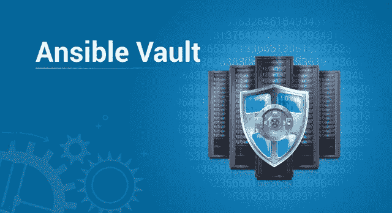

技术的使用率越高，对安全的可能威胁就越大。典型的 Ansible 设置需要你输入“秘密”。这些秘密可以是任何东西，密码、API 令牌、SSH 公钥或私钥、SSL 证书等等。我们如何保护这些秘密的安全？Ansible 提供了一个名为 Ansible Vault 的功能。

在本文中，我将演示如何使用 Ansible Vault，并探索一些保护数据安全的最佳实践。

本文涵盖的主题:

*   什么是可旋转拱顶？
*   为什么使用 Ansible Vault？
*   创建加密文件
*   编辑加密文件
*   查看加密文件
*   重设保管库密码密钥
*   加密未加密的文件
*   解密加密文件
*   加密特定变量
*   运行时解密加密文件
*   使用保管库 Id

# 什么是可旋转拱顶？

将基础设施作为代码可能会带来将您的敏感数据暴露给外界的威胁，从而导致不必要的安全问题。Ansible Vault 是一个功能，可以让你保持所有的秘密安全。它可以加密整个文件，整个 YAML 剧本，甚至一些变量。它提供了一种工具，您不仅可以加密敏感数据，还可以将它们集成到您的行动手册中。

Vault 以文件级粒度实施，其中文件要么完全加密，要么完全不加密。它使用相同的密码来加密和解密文件，这使得使用 Ansible Vault 非常用户友好。

# 为什么使用 Ansible Vault？

由于 Ansible 正被用于自动化，剧本很可能包含某些凭证、SSL 证书或其他敏感数据。将如此敏感的数据保存为纯文本不是一个好主意。一次错误的 GitHub 或笔记本电脑盗窃会给组织带来巨大的损失。这就是 Ansible vault 的用武之地。这是将基础设施作为代码的一种很好的方式，而不会损害安全性。

假设，我们有一个在 AWS 上提供 EC2 实例的剧本。您需要在行动手册中提供您的 AWS 访问密钥 id 和 AWS 密钥。出于显而易见的原因，您不会与他人共享这些密钥。你如何让他们不暴露？有两种方法—要么加密这两个变量并将其嵌入到行动手册中，要么加密整个行动手册。

这只是可以使用 ansible vault 的场景之一。我们既可以加密整个文件，也可以只加密一些可能包含敏感数据的变量，然后 Ansible 在运行时自动解密它们。现在我们可以安全地将这些值提交给 GitHub。

# 创建加密文件

要创建一个加密文件，使用 **ansible-vault create** 命令并传递文件名。

```
$ ansible-vault create filename.yaml
```

系统会提示您创建一个密码，然后通过重新键入来确认。

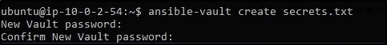

一旦您的密码被确认，一个新的文件将被创建并打开一个编辑窗口。默认情况下，Ansible Vault 的编辑器是 vi。您可以添加数据，保存并退出。

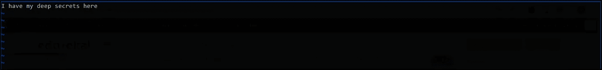

你的文件被加密了。

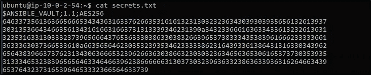

# 编辑加密文件

如果你想编辑一个加密文件，你可以使用 **ansible-vault edit** 命令编辑它。

```
$ ansible-vault edit secrets.txt
```

其中 secrets.txt 是已经创建的加密文件。

系统会提示您插入保管库密码。文件(解密版本)将在 vi 编辑器中打开，然后您可以进行所需的更改。

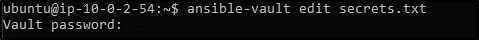

如果你检查输出，你会看到你的文本将被自动加密，当你保存并关闭。


# 查看加密文件

如果你只想查看一个加密的文件，你可以使用 **ansible-vault view** 命令。

```
$ ansible-vault view filename.yml
```

您将再次被提示输入密码。

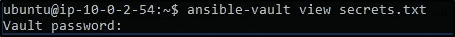

您会看到类似的输出。

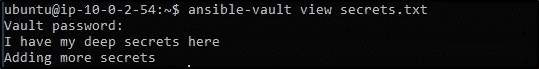

# 重设保管库密码密钥

当然，有时您会想要更改存储库密码。您可以使用 **ansible-vault rekey** 命令。

```
$ ansible-vault rekey secrets.txt
```

系统会提示您输入保管库的当前密码，然后输入新密码，最后确认新密码。

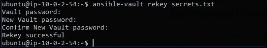

# 加密未加密的文件

假设您有一个想要加密的文件，您可以使用 **ansible-vault encrypt** 命令。

```
$ ansible-vault encrypt filename.txt
```

系统会提示您插入并确认密码，您的文件将被加密。

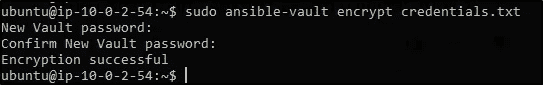

现在你看文件内容，它都是加密的。

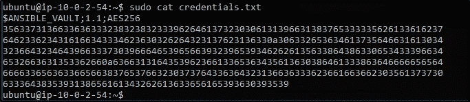

# 解密加密文件

如果你想解密一个加密的文件，你可以使用 **ansible-vault decrypt** 命令。

```
$ ansible-vault decrypt filename.txt
```

像往常一样，它会提示您插入并确认保险库密码。

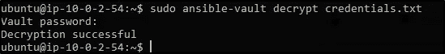

# 加密特定变量

使用 Ansible Vault 的最佳实践是仅加密敏感数据。在上面解释的示例中，开发团队不想与生产和试运行团队共享他们的密码，但是他们可能需要访问某些数据来执行他们自己的任务。在这种情况下，您应该只对您不想与他人共享的数据进行加密，让其余的数据保持原样。

Ansible Vault 允许您只加密特定的变量。为此，您可以使用**ansi ble-vault encrypt _ string**命令。

```
$ ansible-vault encrypt_string
```

系统会提示您插入并确认保管库密码。然后，您可以开始插入想要加密的字符串值。按 ctrl-d 结束输入。现在，您可以将这个加密值分配给剧本中的一个字符串。

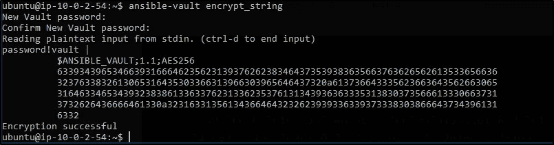

你也可以用一行代码实现同样的事情。

```
$ ansible-vault encrypt_string 'string' --name 'variable_name'
```

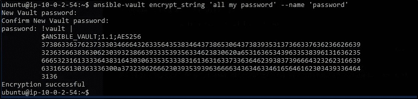

# 运行时解密加密文件

如果你想在运行时解密一个文件，你可以使用**–ask-vault-pass**标志。

```
$ ansible-playbook launch.yml --ask-vault-pass
```

这将解密用于执行 launch.yml 行动手册的所有加密文件。此外，这只有在所有文件都用相同的密码加密的情况下才有可能。

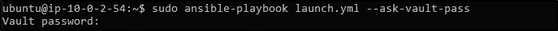

密码提示可能会很烦人。自动化的目的变得毫无意义。我们如何让它变得更好？Ansible 有一个名为“密码文件”的特性，它引用一个包含密码的文件。然后，您可以在运行时传递这个密码文件来实现自动化。

```
$ ansible-playbook launch.yml --vault-password-file ~/ .vault_pass.txt
```


使用单独的脚本来指定密码也是可能的。您需要确保脚本文件是可执行的，并且密码被打印到标准输出中，这样它才能正常工作，不会出现令人讨厌的错误。

```
$ ansible-playbook launch.yml --vault-password-file ~/ .vault_pass.py
```

# 使用保管库 Id

保管库 Id 是为特定保管库密码提供标识符的一种方式。Vault ID 有助于使用不同的密码加密不同的文件，以便在行动手册中引用。Ansible 的这个特性是随着 Ansible 2.4 的发布而出现的。在此版本之前，每次执行 ansible 剧本时只能使用一个保险库密码。

所以现在如果你想执行一个使用不同密码加密的多个文件的 Ansible 剧本，你可以使用 Vault Id。

```
$ ansible-playbook --vault-id vault-pass1 --vault-id vault-pass2 filename.yml
```

至此，我们结束了这个 Ansible Vault 博客。赶上技术并充分利用它们是令人惊奇的，但不是通过在安全性上妥协。这是将基础设施作为代码(IaC)的最佳方式之一。

如果你想查看更多关于人工智能、Python、道德黑客等市场最热门技术的文章，你可以参考 Edureka 的官方网站。请留意本系列中的其他文章，它们将解释 DevOps 的各个方面。

> *1。* [*DevOps 教程*](/edureka/devops-tutorial-89363dac9d3f)
> 
> *2。* [*Git 教程*](/edureka/git-tutorial-da652b566ece)
> 
> *3。* [*詹金斯教程*](/edureka/jenkins-tutorial-68110a2b4bb3)
> 
> *4。* [*码头工人教程*](/edureka/docker-tutorial-9a6a6140d917)
> 
> *5。* [*Ansible 教程*](/edureka/ansible-tutorial-9a6794a49b23)
> 
> *6。* [*木偶教程*](/edureka/puppet-tutorial-848861e45cc2)
> 
> *7。* [*厨师教程*](/edureka/chef-tutorial-8205607f4564)
> 
> *8。* [*Nagios 教程*](/edureka/nagios-tutorial-e63e2a744cc8)
> 
> *9。* [*如何编排 DevOps 工具？*](/edureka/devops-tools-56e7d68994af)
> 
> *10。* [*连续交货*](/edureka/continuous-delivery-5ca2358aedd8)
> 
> *11。* [*持续集成*](/edureka/continuous-integration-615325cfeeac)
> 
> *12。* [*连续部署*](/edureka/continuous-deployment-b03df3e3c44c)
> 
> 13。 [*持续交付 vs 持续部署*](/edureka/continuous-delivery-vs-continuous-deployment-5375642865a)
> 
> *14。* [*CI CD 管道*](/edureka/ci-cd-pipeline-5508227b19ca)
> 
> *15。* [*码头工人撰写*](/edureka/docker-compose-containerizing-mean-stack-application-e4516a3c8c89)
> 
> 16。 [*码头工人群*](/edureka/docker-swarm-cluster-of-docker-engines-for-high-availability-40d9662a8df1)
> 
> 17。 [*Docker 联网*](/edureka/docker-networking-1a7d65e89013)
> 
> 18。 [*可替代角色*](/edureka/ansible-roles-78d48578aca1)
> 
> *19。* [*适用于 AWS*](/edureka/ansible-for-aws-provision-ec2-instance-9308b49daed9)
> 
> *20。* [*詹金斯管道*](/edureka/jenkins-pipeline-tutorial-continuous-delivery-75a86936bc92)
> 
> *21。* [*顶级 Git 命令*](/edureka/git-commands-with-example-7c5a555d14c)
> 
> *22。* [*顶级 Docker 命令*](/edureka/docker-commands-29f7551498a8)
> 
> *23。*[*Git vs GitHub*](/edureka/git-vs-github-67c511d09d3e)
> 
> *24。* [*DevOps 面试问题*](/edureka/devops-interview-questions-e91a4e6ecbf3)
> 
> *25。* [*谁是 DevOps 工程师？*](/edureka/devops-engineer-role-481567822e06)
> 
> *26。* [*DevOps 生命周期*](/edureka/devops-lifecycle-8412a213a654)
> 
> *27。*[*Git ref log*](/edureka/git-reflog-dc05158c1217)
> 
> *28。*[](/edureka/ansible-provisioning-setting-up-lamp-stack-d8549b38dc59)
> 
> **29。* [*组织寻找的顶尖 DevOps 技能*](/edureka/devops-skills-f6a7614ac1c7)*
> 
> **三十。* [*瀑布 vs 敏捷*](/edureka/waterfall-vs-agile-991b14509fe8)*
> 
> *31。 [*Maven 用于构建 Java 应用*](/edureka/maven-tutorial-2e87a4669faf)*
> 
> *32。 [*詹金斯小抄*](/edureka/jenkins-cheat-sheet-e0f7e25558a3)*
> 
> **33。*[](/edureka/ansible-cheat-sheet-guide-5fe615ad65c0)*
> 
> ***34。* [*Ansible 面试问答*](/edureka/ansible-interview-questions-adf8750be54)**
> 
> **35。 [*50 码头工人面试问题*](/edureka/docker-interview-questions-da0010bedb75)**
> 
> ***三十六。* [*敏捷方法论*](/edureka/what-is-agile-methodology-fe8ad9f0da2f)**
> 
> **37。 [*詹金斯面试问题*](/edureka/jenkins-interview-questions-7bb54bc8c679)**
> 
> ***38。* [*Git 面试问题*](/edureka/git-interview-questions-32fb0f618565)**
> 
> ***39。* [*Docker 架构*](/edureka/docker-architecture-be79628e076e)**
> 
> **40。 [*Linux 中使用的命令 DevOps*](/edureka/linux-commands-in-devops-73b5a2bcd007)**
> 
> ***41。* [*詹金斯 vs 竹子*](/edureka/jenkins-vs-bamboo-782c6b775cd5)**
> 
> ***42。* [*Nagios 面试问题*](/edureka/nagios-interview-questions-f3719926cc67)**
> 
> ***43。* [*DevOps 实时场景*](/edureka/jenkins-x-d87c0271af57)**
> 
> ***44。* [*詹金斯和詹金斯 X 的区别*](/edureka/jenkins-vs-bamboo-782c6b775cd5)**
> 
> ***45。*[*Windows Docker*](/edureka/docker-for-windows-ed971362c1ec)**
> 
> ***46。*[*Git vs Github*](http://git%20vs%20github/)**

***原载于 2019 年 3 月 12 日*[*www.edureka.co*](https://www.edureka.co/blog/ansible-vault-secure-secrets)*。***