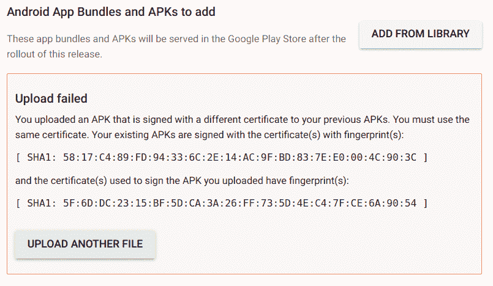
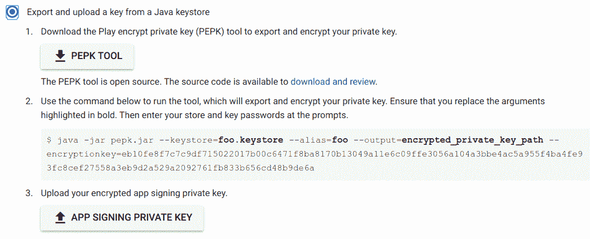

# Play 应用签名常见问题解答

> 原文：<https://medium.com/androiddevelopers/answers-to-common-questions-about-app-signing-by-google-play-b28fef836af0?source=collection_archive---------1----------------------->

Android 应用程序由开发者加密签名。这使得用户设备上的软件包管理器可以验证每个应用程序更新都来自同一个来源，并且没有被篡改。当您将 APK 上传到 Google Play 控制台时，Google Play 也会强制执行这种签名检查，因此即使有人拥有您的登录凭据，也不可能在无法访问您的私钥的情况下发送恶意更新。

从历史上看，开发人员负责生成他们自己的私钥，并在应用程序的整个生命周期中保持它们的安全。虽然这提供了很大的灵活性，但它也容易出错:生成弱密钥、意外地将您的私有密钥签入公共存储库或者甚至完全丢失它，这些只是即使是经验丰富的开发人员也经常发生的一些常见错误。

如今，开发人员有一个令人信服的替代方案来管理自己的密钥: *Play 应用程序签名*，其中**上传密钥**(用于将您的工件上传到 Google Play 的密钥)和**应用程序签名密钥**(用于对分发到设备的 apk 进行签名的密钥)可以分开，应用程序签名密钥安全地存储在谷歌的基础设施上。

尽管许多其他流行的平台以这种方式对待分发密钥，但对许多开发人员来说，这与以前的 Android 签名模式有所不同，一些开发人员可能会觉得他们放弃了对自己应用程序的太多控制。

这就是为什么，我想消除一些关于 Play 应用程序签名的常见误解，并就您可能遇到的特定场景提供指导。

这个建议是基于我们的开发者关系团队在会议、在线论坛和我们的一对一聊天中从开发者那里听到的问题。

让我们从切换到 Play App Signing 的最有说服力的理由开始:

## 1.我丢失了用于签署我上传到 Google Play 的发布工件的密钥。我有什么选择？

**没有 Play 应用签名**:没有应用签名密钥，
由于 Android 内置的安全保护，您或 Google 无法继续更新您的应用。您唯一的选择是
用新的包名创建一个新的商店列表，然后从头开始。

**使用 Play App 签名**:您可以[请求新的上传密钥](https://support.google.com/googleplay/android-developer/answer/7384423#reset)。Play 将能够继续使用应用程序签名密钥对您的应用程序更新进行签名，该密钥由 Google 安全存储。

如果我要说出一个采用应用程序签名的原因，那就是上面那个。但在我们进一步讨论应用程序签名可以帮助您修复的具体场景之前(还有更多！)，我们先暂停回答一个元问题:

## 2.谷歌为什么要让开发者转行玩 App 签约？

Google Play 的首要任务是为未来多年的数十亿用户和数百万开发者构建一个可信、安全、可靠的平台。

生态系统的可持续性和成功取决于此。大多数开发者无法达到谷歌所能提供的安全水平。

在新的应用程序模型中，Play 吸收发布构件并生成签名构件，其设计目的是最小化可能暴露签名密钥的表面。它不仅安全，而且更高效，更具前瞻性，对最终用户和开发人员都有好处。

例如，目前在 Play Store 上的许多应用程序仍然没有采用更安全的 [v2 签名方案](https://source.android.com/security/apksigning/v2)。一旦加入 Play 应用程序签名，应用程序将自动受益于新的保护和未来的增强功能，无需开发人员的工作。

最后，将发布格式(使用 Android 应用捆绑包)与服务格式(拆分 apk)分离开来，对开发者和用户都有好处:从提高安全性到优化、降低复杂性和碎片化。然而，为了做到这一点，Play 必须能够签署服务工件。

目前可用功能的一些例子是应用交付的自动大小优化，以及应用中模块的新[可定制交付](https://developer.android.com/guide/app-bundle/on-demand-delivery)选项。

更重要的是，它给了我们一种在未来发展和改进交付机制的方法，同时确保分布式工件的信任和安全。

即使我们继续改进我们的服务堆栈，**我们也不会在您不知情**和批准的情况下修改和分发您的应用程序代码，Play 执行的新优化可在开源`[bundletool](http://github.com/google/bundletool)`中供您检查。在本常见问题解答的后面，我将讨论一些元数据(不影响应用程序工作方式的元数据)的差异，您可能会在从 Play 下载的工件和本地生成的工件之间看到这些差异。

## 3.我的应用程序签名密钥是多年前生成的，我担心它的加密强度不再符合当今的标准，或者我认为我的应用程序签名密钥已经泄露。怎么做才能升级？

**没有 Play 应用签名**:如前所述，您不能简单地切换到新密钥，因为这将意味着您现有的用户将无法获得应用更新。你要么继续使用现有的密钥，冒着用户数据安全的风险，要么从头开始一个新的应用程序条目。

**使用 Play App Signing:** 如果您使用的是弱密钥或您的密钥被泄露，您可以[升级您的 App Signing 密钥以进行新安装](https://support.google.com/googleplay/android-developer/answer/7384423#upgrade)。

这是通过在现有用户更新应用程序时向他们提供用您的旧密钥签名的 apk 来实现的，而全新应用程序安装会获得用升级的安全密钥签名的 apk。

> 考虑立即启用应用签名，并尽快切换到使用**单独的上传密钥**，从而降低泄露应用签名密钥的可能性。
> 
> 当前升级到新密钥的过程不是即时的，如果应用签名密钥泄露，您的现有用户将面临风险，直到他们重新安装应用或移动到新设备。

请注意，当前的密钥升级过程没有利用 Android 9 (Pie)和更高版本中引入的密钥轮换功能。我们目前正在调查在这些操作系统版本上使用应用签名 v3 的设备对密钥轮换的支持，一旦准备就绪，我们将在单独的公告中通知开发人员社区。

## 4.我用来给我的艺术品签名的上传密钥被偷了。我有什么选择？

**没有 Play 应用程序签名**:没有单独的“上传密钥”的概念，所以如果你的发布签名密钥泄露，你可能会有大麻烦:有人可能会创建你的应用程序的恶意或未经授权的版本，这将是无法区分的(和可更新的！)从你原来的 apk。

当然，Google 帐户保护适用于 Google Play 控制台访问(我们建议开发者启用[两步验证](https://www.google.com/landing/2step/))，因此攻击者仍然需要找到一种方法来欺骗用户侧装这样一个修改过的 APK。然而，你的应用程序的安全性被削弱了。

参考问题 3。以上关于受损的应用程序签名密钥的内容，以了解可用的补救措施，包括针对新安装的密钥升级。

**使用 Play 应用程序签名** :如果您的上传密钥与您的应用程序签名密钥是分开的(我不能高度推荐)，并且上传密钥是泄露的那个，这意味着您的用户数据是安全的——上传密钥不足以让攻击者能够冒充使用应用程序签名密钥签名的 apk。只需[请求新的上传密钥](https://support.google.com/googleplay/android-developer/answer/7384423#reset)。

如果您在首次启用应用签名时继续使用您的应用签名密钥上传到游戏，并且该应用签名密钥泄露，则您的情况会更糟，但应用签名仍然可以解决问题。遵循关于如何[为新安装](https://support.google.com/googleplay/android-developer/answer/7384423#upgrade)升级您的密钥的建议。

## 5.我为我的应用程序启用了 Play 应用程序签名，但我改变了主意，想下载存储在 Google 基础架构上的应用程序签名密钥。

你或你的开发者帐户上的任何人都不可能下载并保存你的应用程序的私钥，该私钥存储在谷歌的安全基础设施上。这是为了确保保护您的应用签名密钥。

如果您预见到需要持续访问您的应用签名密钥的情况，您应该在启用应用签名时执行以下操作:

*   **不要**选择 Google Play 为您生成应用签名密钥的选项。**改为在您的机器上本地生成您的签名密钥**。
*   安全地将您的密钥传输到 Google Play，并且**不要**将其从您的机器中删除。
*   **保持密钥安全**，确保它不会泄露给第三方。
*   请确保定期创建和测试您的密钥备份，因为如果您丢失了它，您将无法从 Google 下载它。

文档中的[解释了这些步骤。寻找关于如何"*选择现有应用程序*"的说明，了解如何加密您的签名密钥，以便从 Android Studio 或命令行将其上传到 Google Play 控制台。](https://developer.android.com/studio/publish/app-signing#enroll_existing)

如果您完全确定不需要继续访问您的私人应用程序签名密钥，我们建议您让 Play 生成您的密钥(针对新应用程序)，或者在将您的副本传输到 Play 后将其删除，并切换到使用上传密钥。

上传密钥可以重置，万一泄露也不会危及用户的安全。

## 6.如何确保我的私钥在转移到 Google Play 时不会被拦截？

如果您正在为新应用程序启用应用程序签名，并在 Google Play 控制台中选择了生成新密钥的选项，则密钥永远不会被传输，而是直接在 Google 的安全服务器上生成，因此一切就绪。

如果您需要传输现有的签名密钥(对于新应用程序是可选的，对于现有应用程序是强制的)，您总是以加密的形式进行传输。无论您是从 Android Studio 还是从命令行导出密钥，您都将在传输密钥之前在您的机器上本地使用 Play 的加密私钥(PEPK)工具。

如果您需要了解所用加密的详细信息，PEPK 使用 P256 椭圆曲线非对称加密和 AES 对称加密。如果您需要进一步检查该工具并获得更多详细信息，我们让您有机会在 app signing 注册流程中下载 PEPK 工具及其源代码。

您可以自行检查或编译它，以便它可以在您自己的安全环境中运行，确保未加密的密钥永远不会暴露。

> O **只使用从 Google Play 控制台下载的 PEPK 版本，切勿从未经验证的第三方网站下载 PEPK 或其来源。**

## 7.在 Google 的基础设施上，静态密钥是如何受到保护的？我如何确定没有人在访问它？

当您使用 Play 应用程序签名时，您的密钥存储在 Google 用来存储自己密钥的同一基础架构上。

所有操作的密钥访问都受到严格的 ACL 和防篡改审计跟踪的控制。

所有使用开发者密钥生成和签名的工件都可以在 Google Play 控制台中查看/证明。

此外，为了防止密钥丢失，我们会非常频繁地备份主存储。这些备份是高度加密的，我们定期测试从这些备份中恢复。

如果你想了解谷歌的技术基础设施，请阅读[谷歌云安全白皮书](https://services.google.com/fh/files/misc/security_whitepapers_march2018.pdf)。

## 8.我需要一个公共证书来注册外部服务，但我没有访问我的密钥。我能怎么做呢？

如果您想要使用需要使用您的应用程序的公共证书哈希进行注册的服务或 API，您可以从 Google Play 控制台的“*应用程序签名*”部分查看或下载公共证书指纹:

请记住，在为您的应用程序的发布版本启用服务时，请始终使用这些指纹，而不是从您的上传密钥派生的指纹。

大多数服务允许您为应用程序启用多个证书，因此您可以继续使用本地构建的 apk 以及 Google Play 生成的 apk 进行测试。

## 9.除了用于签名的密钥之外，Google Play 分发给我的应用程序用户的构件与我在本地构建的构件有什么不同吗？

如前所述，在您不知情和未经您批准的情况下，Play 不会修改您的应用程序的功能。然而，它确实插入了极少量的元数据，有助于验证发行版的来源和完整性。这种元数据有两种形式:

*   对于所有上传到 Google Play 的应用，Play 一直在签名块后添加安全元数据，以启用授权 P2P 应用共享等功能。我们最初在 2017 年的一篇[博文中宣布了这一消息。](https://android-developers.googleblog.com/2017/12/improving-app-security-and-performance.html)
*   对于作为应用捆绑包上传的应用，我们将通过引入所谓的源标记来提高安全性。这个源元数据由`bundletool`插入到应用的清单中。当 APK 在 Play 的服务器上生成时，除了您的应用程序签名密钥之外，还会使用 Google 密钥进行签名。

这意味着在没有使 Google 签名失效的情况下，安全元数据不能被删除或篡改。这给出了一个高置信度的信号，即包含源标记的未修改的 apk 一定来自 Google Play。

您可以在本地使用开源的`[bundletool](https://github.com/google/bundletool)`从捆绑包中生成 apk，就像 Play 在服务器上做的一样。bundletool 添加的源 stamp 元数据不会被 Google 的 key 签名。当下一个 Android 版本更新 ApkSigner 时，其他源签名将是可能的。

## 10.我如何访问 Google Play 分发给我的应用程序用户的最终工件？

您有多种选择:

*   出于测试目的，您可以从 Google Play 控制台的**应用捆绑包浏览器**中使用**内部应用共享**链接来链接您应用的任何[历史版本](/androiddevelopers/developer-tools-on-play-store-85fb710ee33b#e4c2)。轻按设备上的链接将安装 Play Store 将在 prod 中为该设备安装的 apk。
*   你也可以从 Google Play 控制台的**应用捆绑浏览器**下载已签名的特定于设备的 apk。

## 11.如果我想使用 Play App Signing，如何将我的应用程序持续分发到其他商店？

通过多种方式和不同渠道分发应用程序是完全可能的。根据应用程序是新的还是现有的，您需要记住一些注意事项:

对于新的应用程序，您可以为每个分发渠道使用单独的签名密钥，并让 Google 为您生成 Google Play 使用的密钥。对于在 Play 上分发的应用程序来说，这是最安全的方式，因为密钥永远不会离开谷歌的服务器，并将有人截获密钥的可能性降至接近零。

或者，如果您不想管理多个密钥，但仍受益于 Play 应用签名的完全安全性，您将很快能够从应用捆绑包浏览器下载签名的通用 apk，并将其分发到其他商店。

对于现有的应用程序，如果你已经在不同的商店使用一个密钥，你可以继续这样做。在 Google Play 上启用应用程序签名时，会要求您上传现有密钥。

或者，随着时间的推移，您可以考虑本常见问题解答前面提到的密钥升级功能，以避免与其他分发渠道共享 Google Play 使用的密钥。

上面的建议有一个警告:请注意，如果你决定对不同的商店使用单独的签名密钥，你的用户将无法在不同的分发渠道之间交叉更新应用程序，例如当某人最初通过另一个商店安装了应用程序，然后试图通过 Play 更新它。他们需要卸载并再次安装该应用程序。

## 12.我正忙于开发新功能，所有这些听起来都很多。我必须改用 Android 应用捆绑包或使用像动态交付这样的高级功能吗？

不，你不必一次做所有的事情。

可以选择加入玩 App 签名，暂时继续发布 apk。当你准备好了，你就可以开始发布 Android 应用包了。

使用应用捆绑包发布对于支持它的构建系统来说很简单，并且自动为大多数应用带来大小缩减的好处。

随着时间的推移，您可以利用动态交付等高级功能。对于应用程序，您可以使用动态功能模块模块化您的应用程序，以缩短构建时间并利用可定制的交付。游戏可以使用动态资产交付，通过可定制的交付模式和智能定位选项，在安装时或安装后交付高质量的资产。

如果你想开始使用应用签名，但你的管理或安全团队需要解释应用签名的优势和注意事项，请随时将问题和答案转发给他们。欢迎在评论中添加问题，如果可能的话，我会尽我所能为你寻找答案！